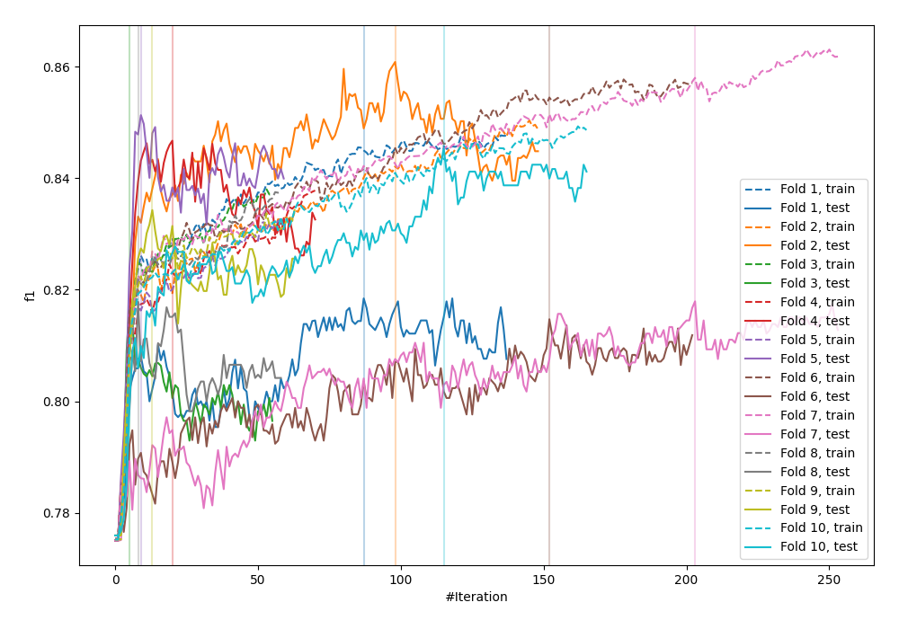
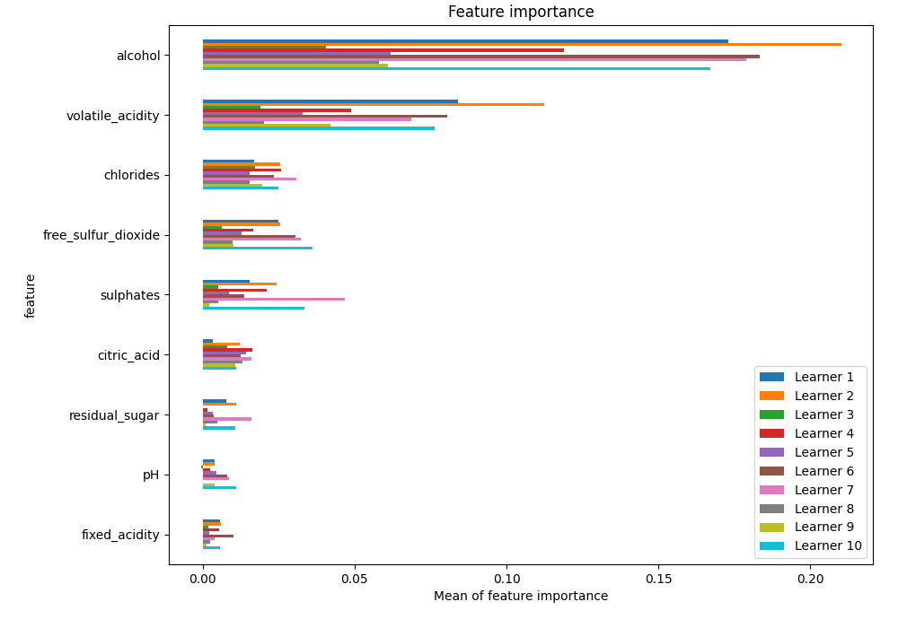
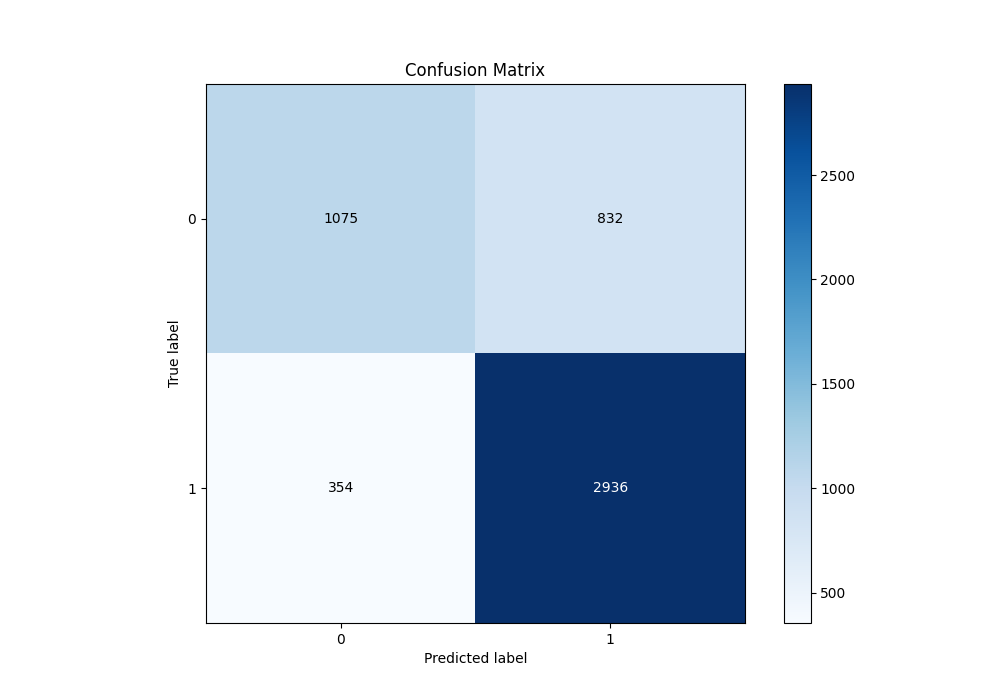
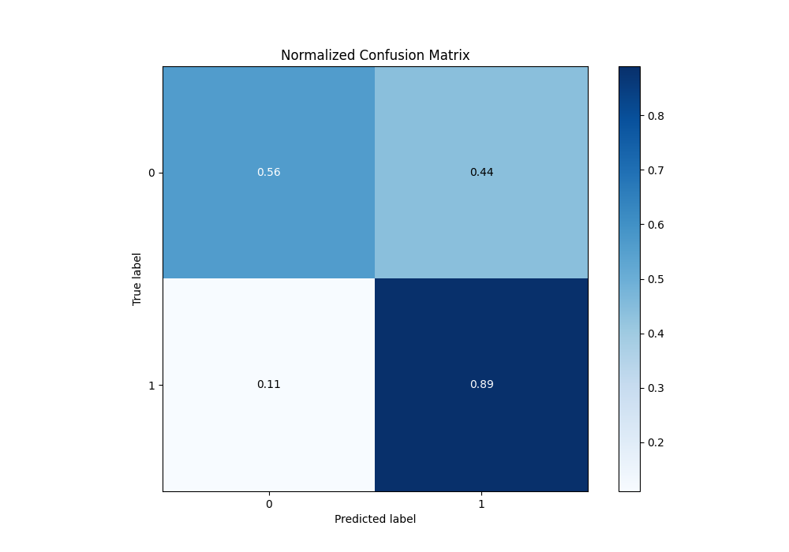
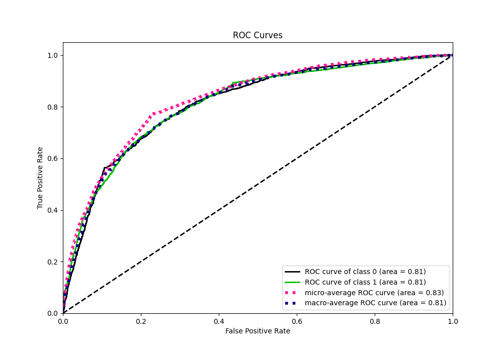
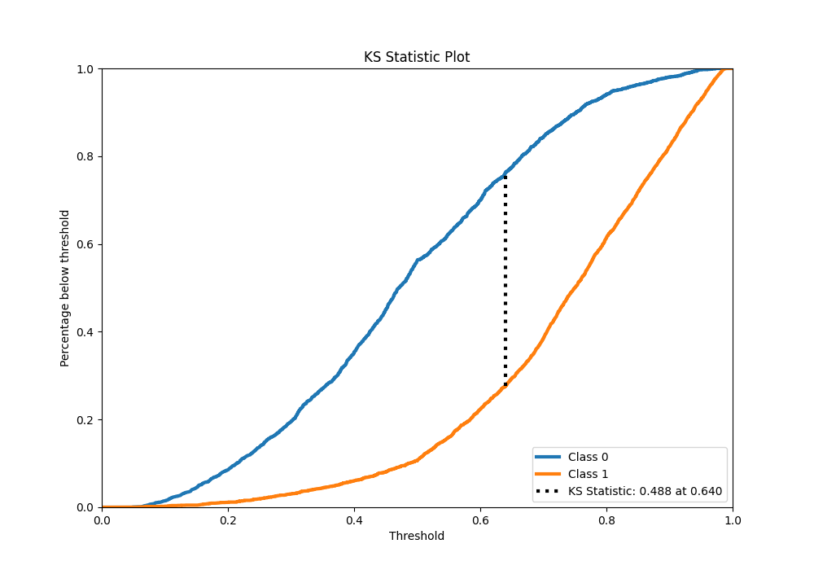
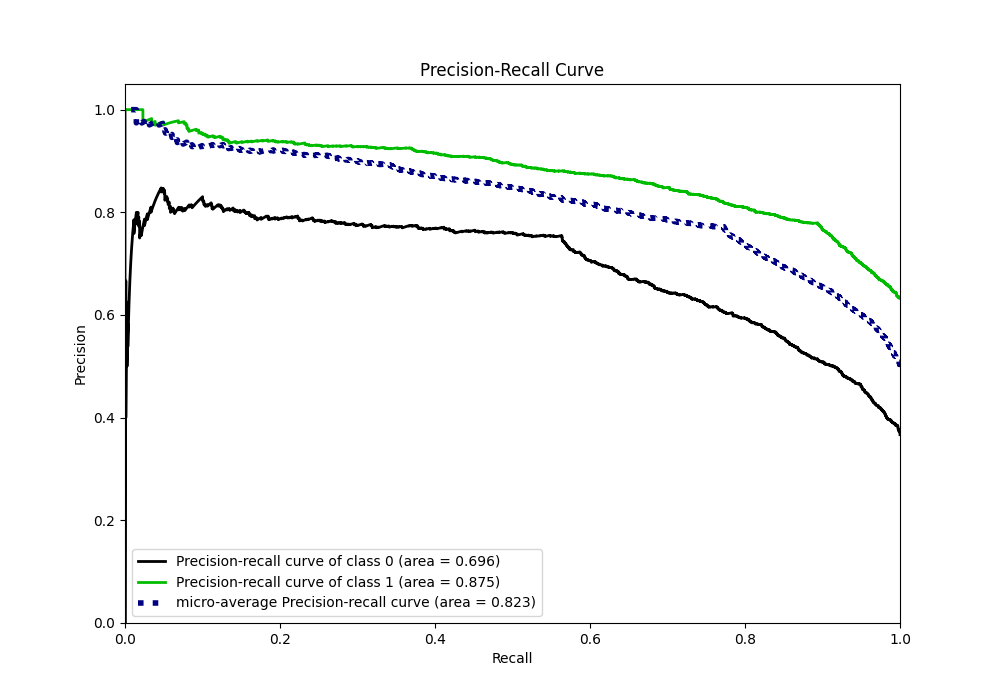
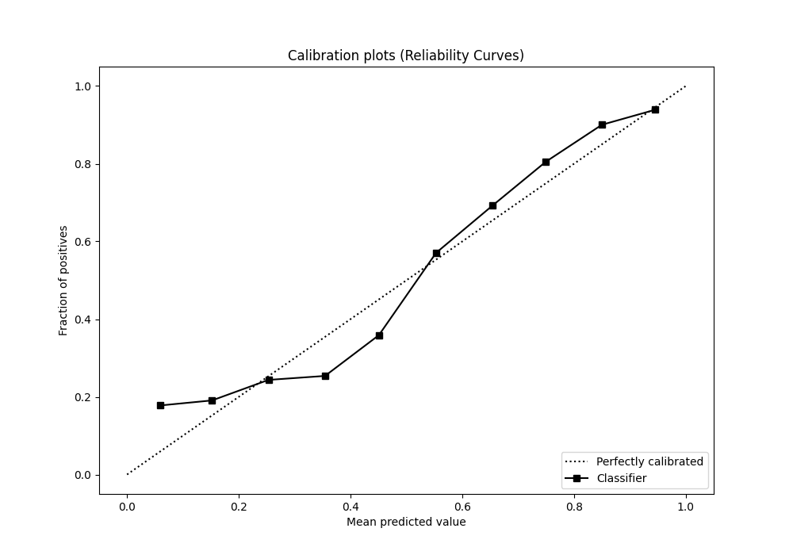
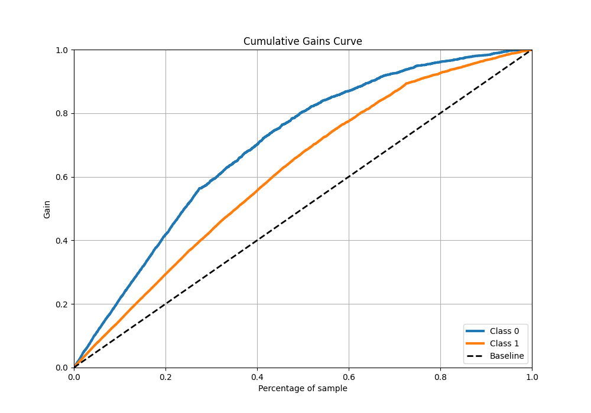
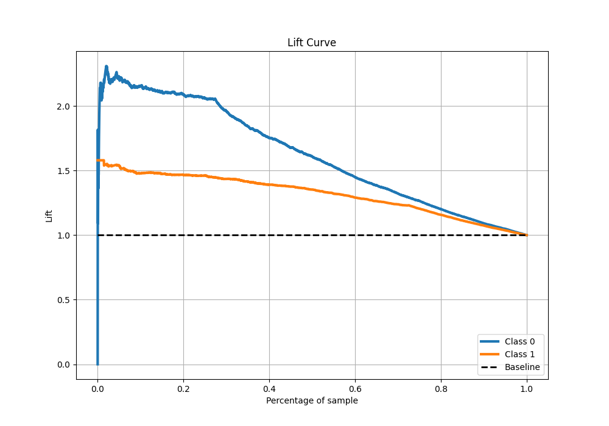

# Summary of 10_Xgboost

[<< Go back](../README.md)

## Extreme Gradient Boosting (Xgboost)
- **n_jobs**: -1
- **objective**: binary:logistic
- **eta**: 0.15
- **max_depth**: 8
- **min_child_weight**: 50
- **subsample**: 0.6
- **colsample_bytree**: 0.6
- **eval_metric**: f1
- **explain_level**: 1

## Validation
 - **validation_type**: kfold
 - **k_folds**: 10
 - **shuffle**: True
 - **stratify**: True
 - **random_seed**: 12

## Optimized metric
f1

## Training time

12.6 seconds

## Metric details
|           |    score |   threshold |
|:----------|---------:|------------:|
| logloss   | 0.512386 | nan         |
| auc       | 0.814413 | nan         |
| f1        | 0.831964 |   0.500763  |
| accuracy  | 0.771791 |   0.500763  |
| precision | 0.975904 |   0.948106  |
| recall    | 1        |   0.0429081 |
| mcc       | 0.492351 |   0.500763  |

## Metric details with threshold from accuracy metric
|           |    score |   threshold |
|:----------|---------:|------------:|
| logloss   | 0.512386 |  nan        |
| auc       | 0.814413 |  nan        |
| f1        | 0.831964 |    0.500763 |
| accuracy  | 0.771791 |    0.500763 |
| precision | 0.779193 |    0.500763 |
| recall    | 0.892401 |    0.500763 |
| mcc       | 0.492351 |    0.500763 |

## Confusion matrix (at threshold=0.500763)
|              |   Predicted as 0 |   Predicted as 1 |
|:-------------|-----------------:|-----------------:|
| Labeled as 0 |             1075 |              832 |
| Labeled as 1 |              354 |             2936 |

## Learning curves

## Permutation-based Importance

## Confusion Matrix

## Normalized Confusion Matrix

## ROC Curve

## Kolmogorov-Smirnov Statistic

## Precision-Recall Curve

## Calibration Curve

## Cumulative Gains Curve

## Lift Curve

[<< Go back](../README.md)
