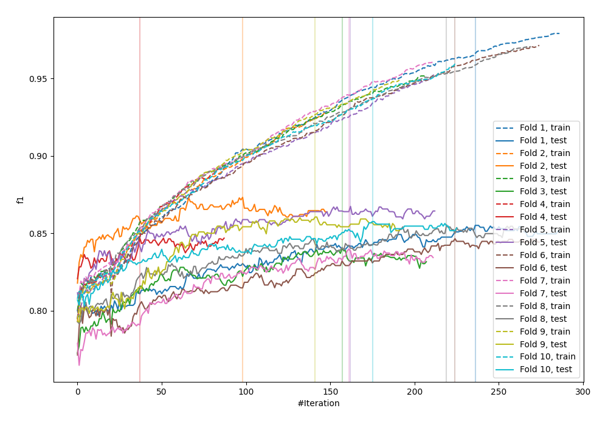
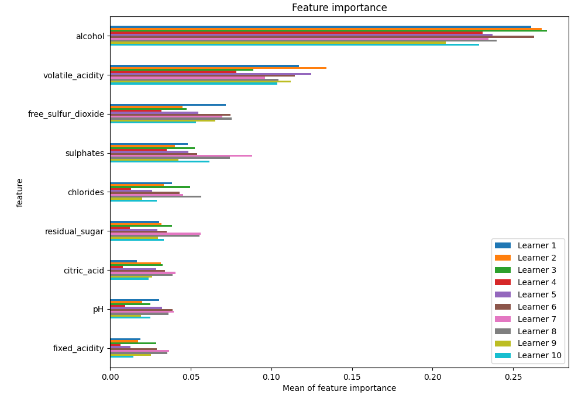
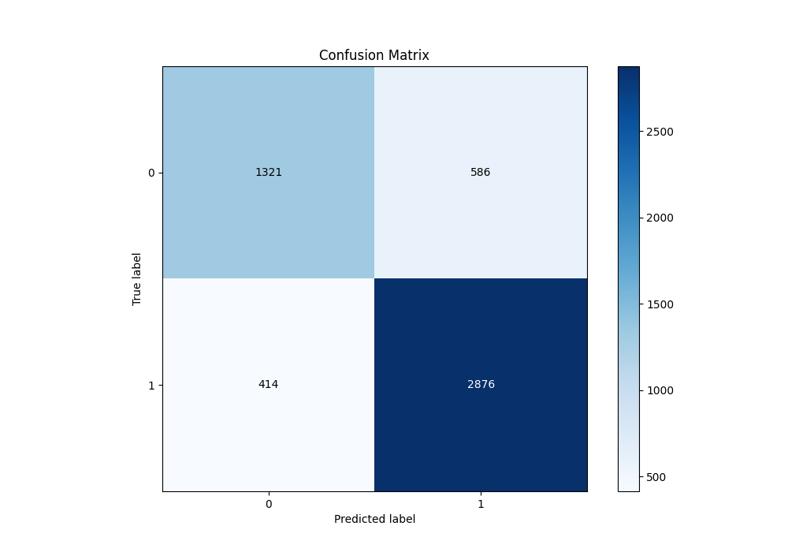
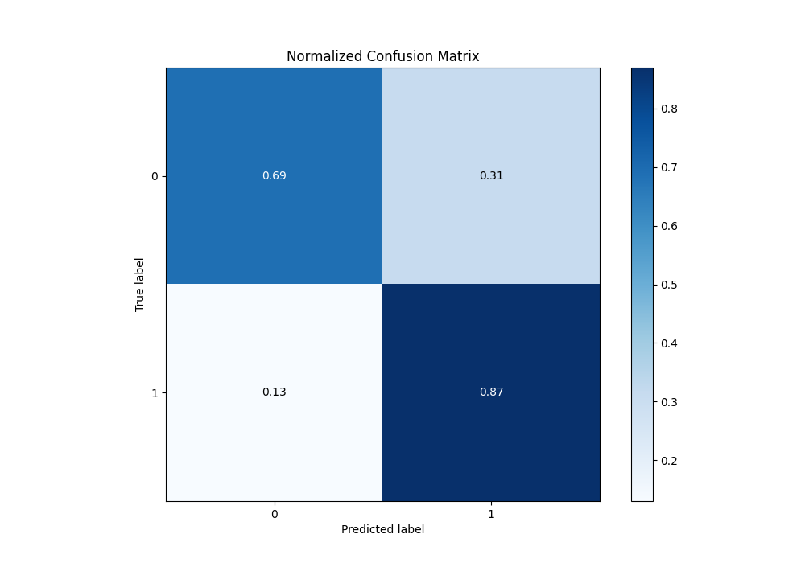
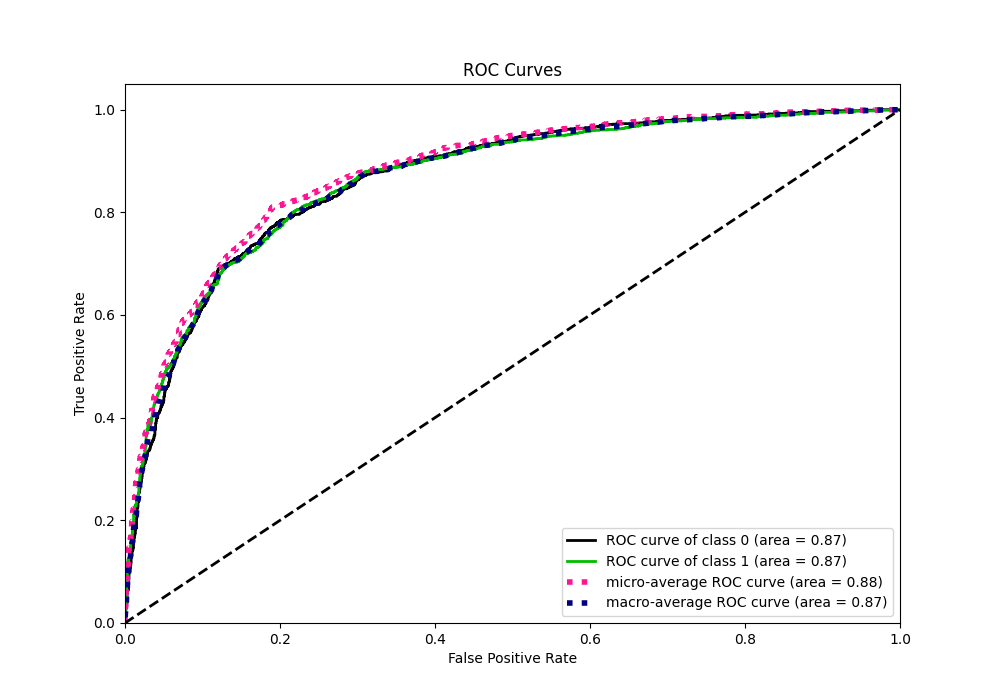
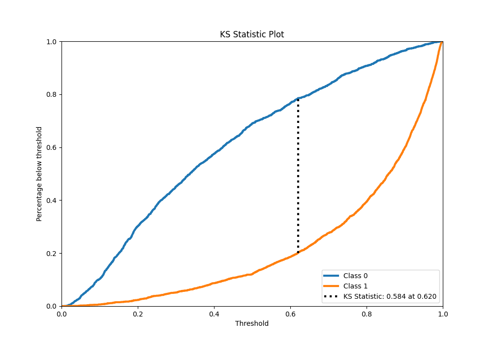
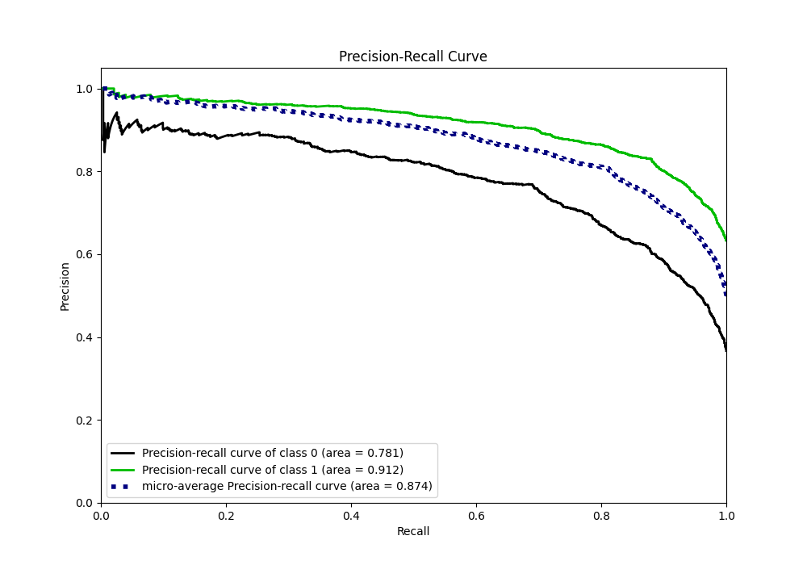
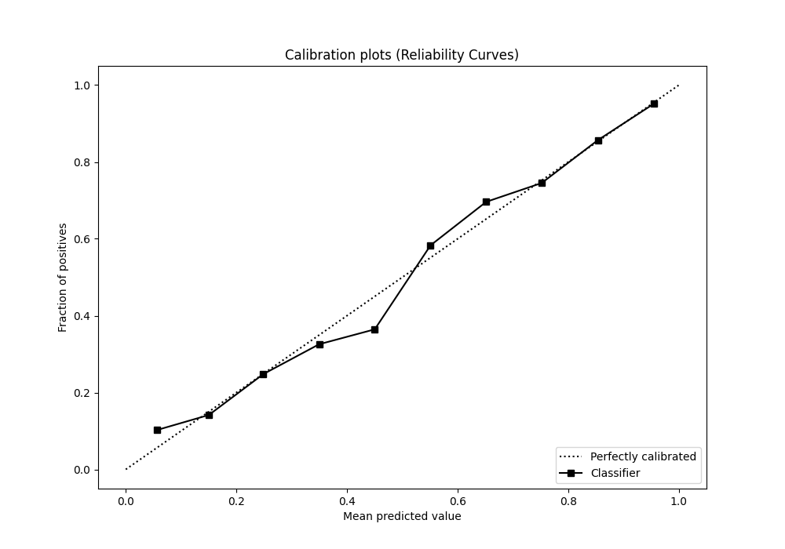
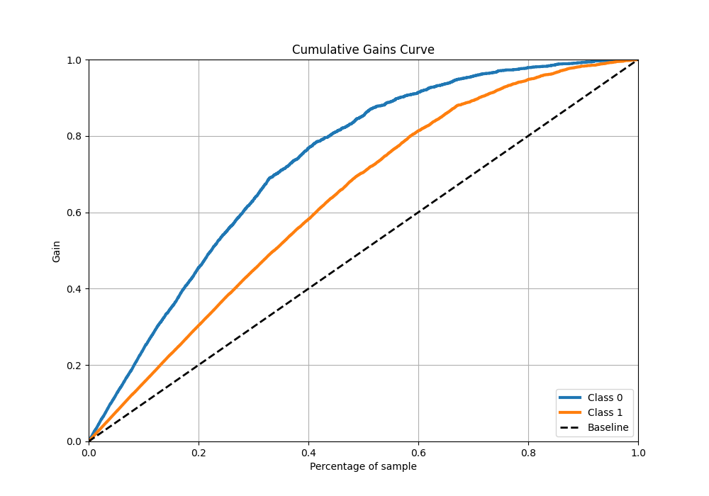
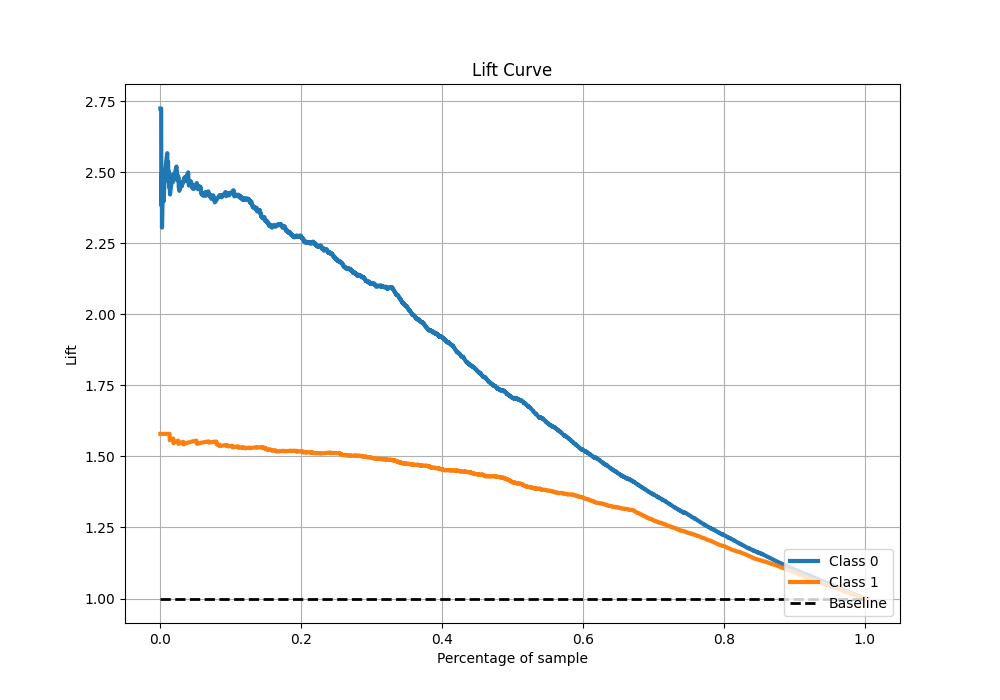

# Summary of 16_CatBoost

[<< Go back](../README.md)

## CatBoost
- **n_jobs**: -1
- **learning_rate**: 0.1
- **depth**: 8
- **rsm**: 1.0
- **loss_function**: Logloss
- **eval_metric**: F1
- **explain_level**: 1

## Validation
 - **validation_type**: kfold
 - **k_folds**: 10
 - **shuffle**: True
 - **stratify**: True
 - **random_seed**: 12

## Optimized metric
f1

## Training time

12.0 seconds

## Metric details
|           |    score |   threshold |
|:----------|---------:|------------:|
| logloss   | 0.439899 | nan         |
| auc       | 0.865547 | nan         |
| f1        | 0.852271 |   0.491158  |
| accuracy  | 0.807581 |   0.505379  |
| precision | 0.983936 |   0.984648  |
| recall    | 1        |   0.0102101 |
| mcc       | 0.579359 |   0.505379  |

## Metric details with threshold from accuracy metric
|           |    score |   threshold |
|:----------|---------:|------------:|
| logloss   | 0.439899 |  nan        |
| auc       | 0.865547 |  nan        |
| f1        | 0.851896 |    0.505379 |
| accuracy  | 0.807581 |    0.505379 |
| precision | 0.830734 |    0.505379 |
| recall    | 0.874164 |    0.505379 |
| mcc       | 0.579359 |    0.505379 |

## Confusion matrix (at threshold=0.505379)
|              |   Predicted as 0 |   Predicted as 1 |
|:-------------|-----------------:|-----------------:|
| Labeled as 0 |             1321 |              586 |
| Labeled as 1 |              414 |             2876 |

## Learning curves

## Permutation-based Importance

## Confusion Matrix

## Normalized Confusion Matrix

## ROC Curve

## Kolmogorov-Smirnov Statistic

## Precision-Recall Curve

## Calibration Curve

## Cumulative Gains Curve

## Lift Curve

[<< Go back](../README.md)
