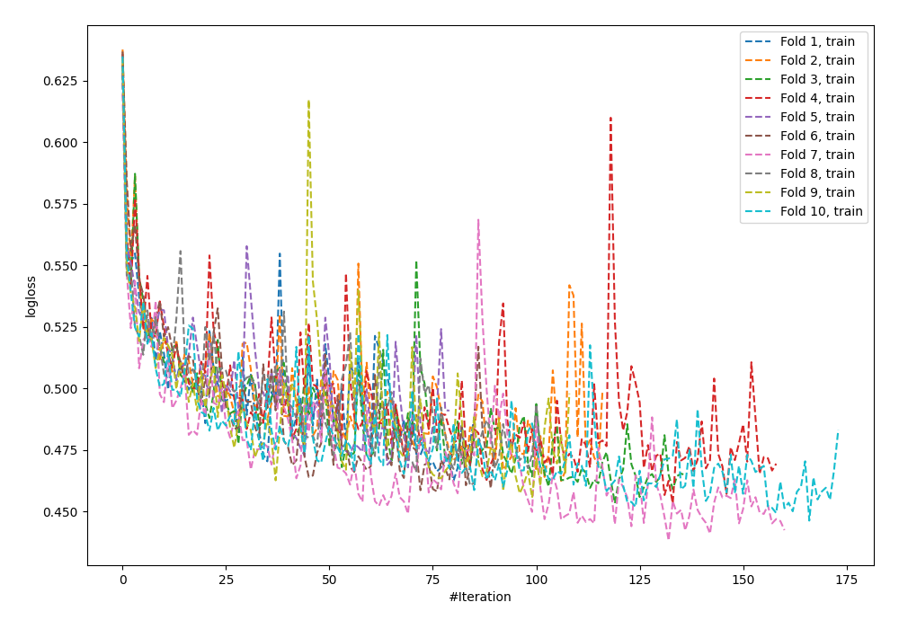
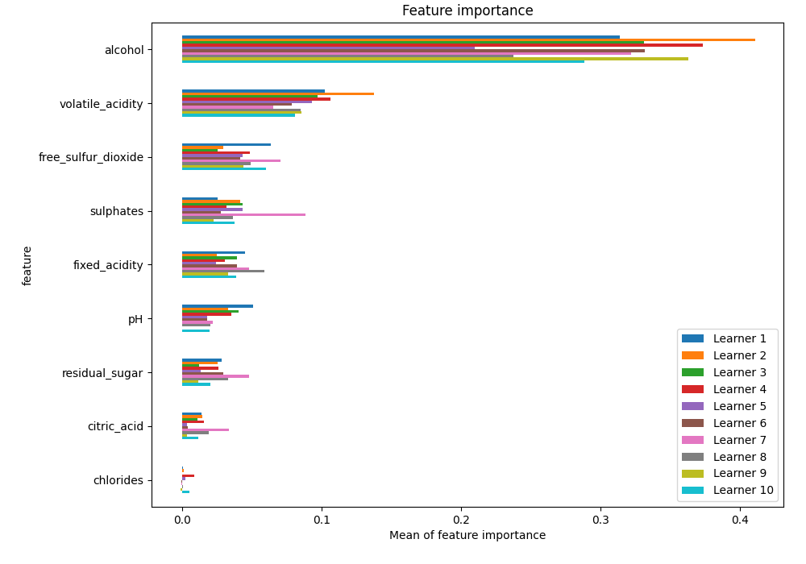
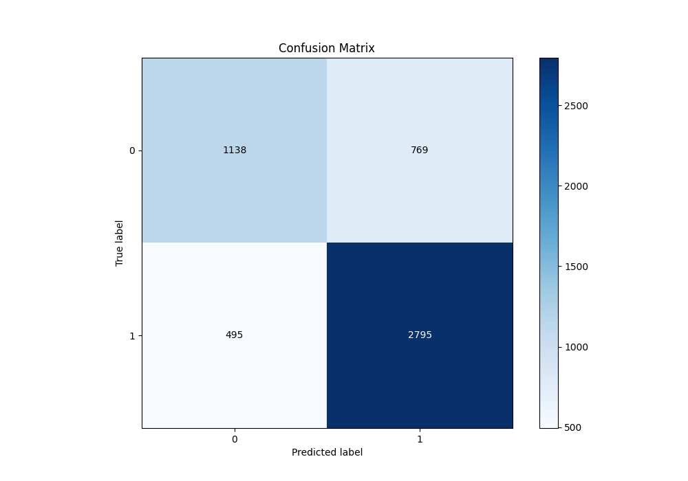
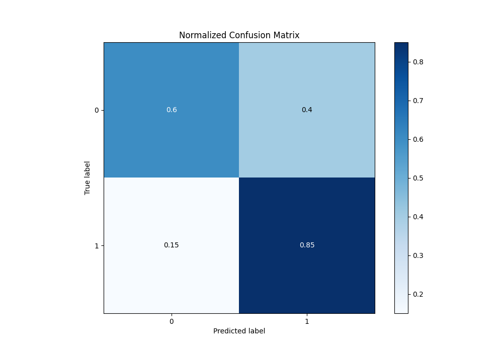
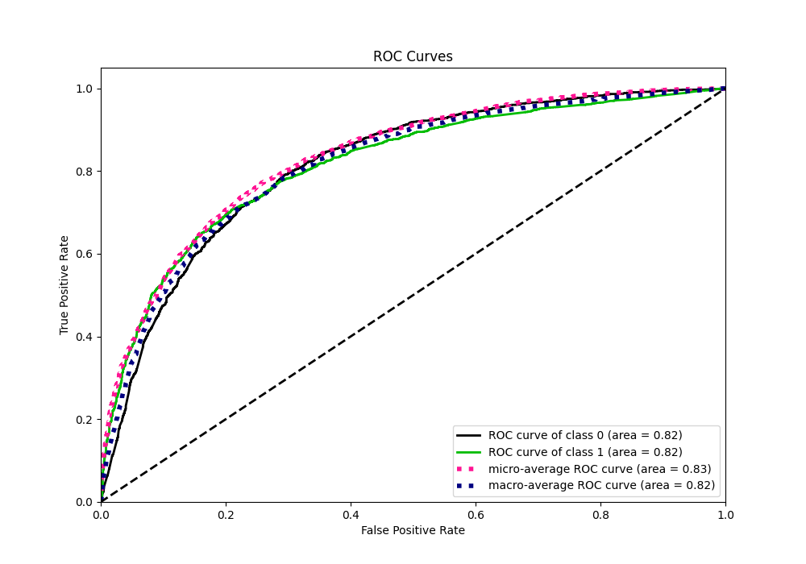
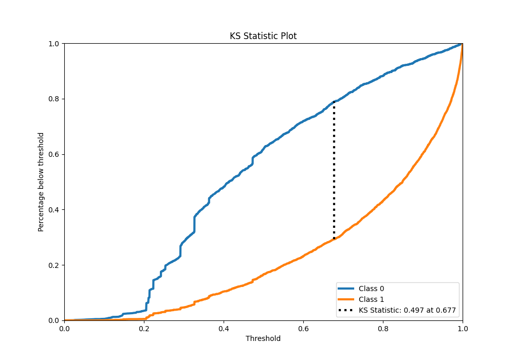
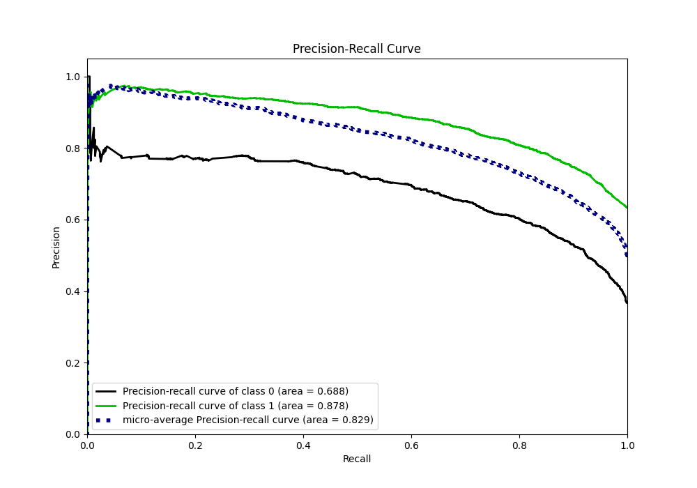
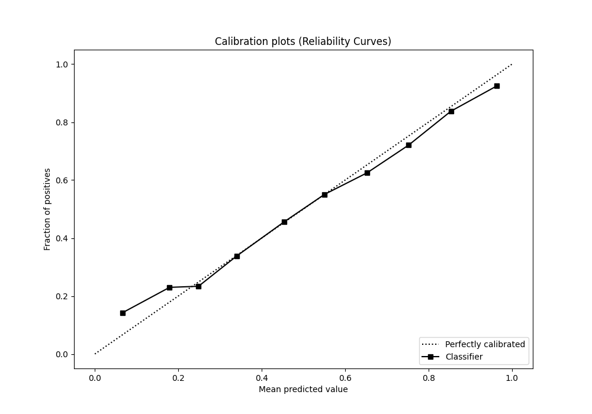
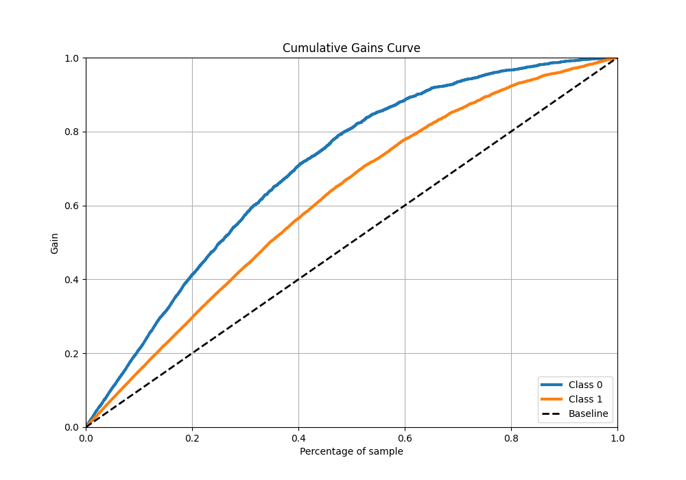
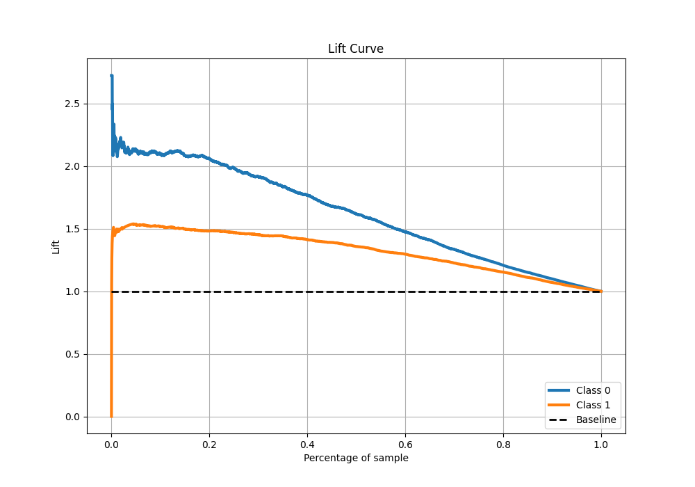

# Summary of 25_NeuralNetwork

[<< Go back](../README.md)

## Neural Network
- **n_jobs**: -1
- **dense_1_size**: 64
- **dense_2_size**: 32
- **learning_rate**: 0.08
- **explain_level**: 1

## Validation
 - **validation_type**: kfold
 - **k_folds**: 10
 - **shuffle**: True
 - **stratify**: True
 - **random_seed**: 12

## Optimized metric
f1

## Training time

24.0 seconds

## Metric details
|           |    score |   threshold |
|:----------|---------:|------------:|
| logloss   | 0.513087 | nan         |
| auc       | 0.816301 | nan         |
| f1        | 0.81713  |   0.39138   |
| accuracy  | 0.756783 |   0.483564  |
| precision | 0.971888 |   0.994412  |
| recall    | 1        |   0.0223247 |
| mcc       | 0.478156 |   0.590014  |

## Metric details with threshold from accuracy metric
|           |    score |   threshold |
|:----------|---------:|------------:|
| logloss   | 0.513087 |  nan        |
| auc       | 0.816301 |  nan        |
| f1        | 0.815582 |    0.483564 |
| accuracy  | 0.756783 |    0.483564 |
| precision | 0.784231 |    0.483564 |
| recall    | 0.849544 |    0.483564 |
| mcc       | 0.463374 |    0.483564 |

## Confusion matrix (at threshold=0.483564)
|              |   Predicted as 0 |   Predicted as 1 |
|:-------------|-----------------:|-----------------:|
| Labeled as 0 |             1138 |              769 |
| Labeled as 1 |              495 |             2795 |

## Learning curves

## Permutation-based Importance

## Confusion Matrix

## Normalized Confusion Matrix

## ROC Curve

## Kolmogorov-Smirnov Statistic

## Precision-Recall Curve

## Calibration Curve

## Cumulative Gains Curve

## Lift Curve

[<< Go back](../README.md)
