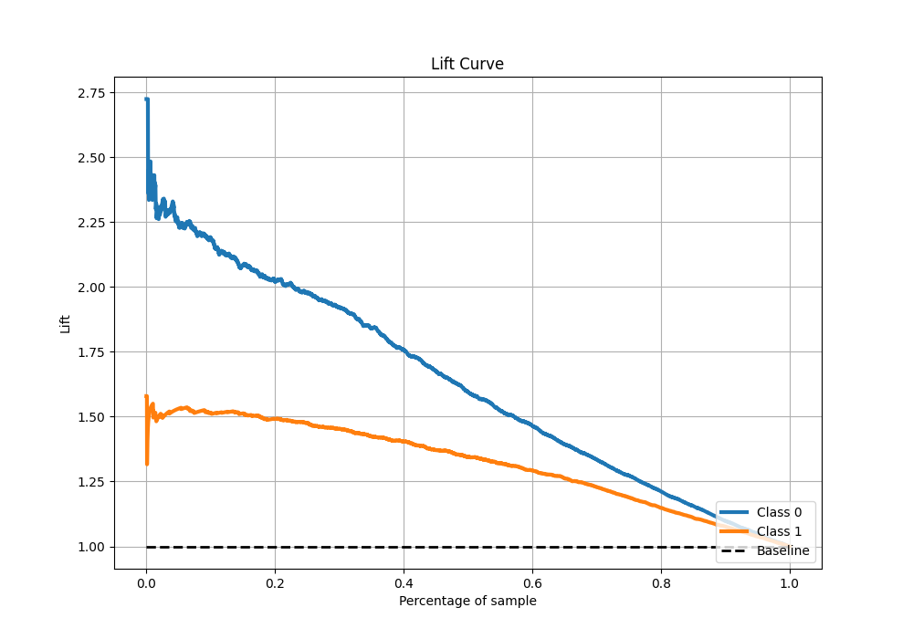

# Summary of 26_NeuralNetwork

[<< Go back](../README.md)

## Neural Network
- **n_jobs**: -1
- **dense_1_size**: 32
- **dense_2_size**: 32
- **learning_rate**: 0.05
- **explain_level**: 1

## Validation
 - **validation_type**: kfold
 - **k_folds**: 10
 - **shuffle**: True
 - **stratify**: True
 - **random_seed**: 12

## Optimized metric
f1

## Training time

15.5 seconds

## Metric details
|           |    score |     threshold |
|:----------|---------:|--------------:|
| logloss   | 0.515417 | nan           |
| auc       | 0.814244 | nan           |
| f1        | 0.817089 |   0.480737    |
| accuracy  | 0.757937 |   0.534513    |
| precision | 0.97     |   0.990493    |
| recall    | 1        |   2.29313e-07 |
| mcc       | 0.475129 |   0.534513    |

## Metric details with threshold from accuracy metric
|           |    score |   threshold |
|:----------|---------:|------------:|
| logloss   | 0.515417 |  nan        |
| auc       | 0.814244 |  nan        |
| f1        | 0.810827 |    0.534513 |
| accuracy  | 0.757937 |    0.534513 |
| precision | 0.802381 |    0.534513 |
| recall    | 0.819453 |    0.534513 |
| mcc       | 0.475129 |    0.534513 |

## Confusion matrix (at threshold=0.534513)
|              |   Predicted as 0 |   Predicted as 1 |
|:-------------|-----------------:|-----------------:|
| Labeled as 0 |             1243 |              664 |
| Labeled as 1 |              594 |             2696 |

## Learning curves

## Permutation-based Importance

## Confusion Matrix

## Normalized Confusion Matrix

## ROC Curve

## Kolmogorov-Smirnov Statistic

## Precision-Recall Curve

## Calibration Curve

## Cumulative Gains Curve

## Lift Curve

[<< Go back](../README.md)
