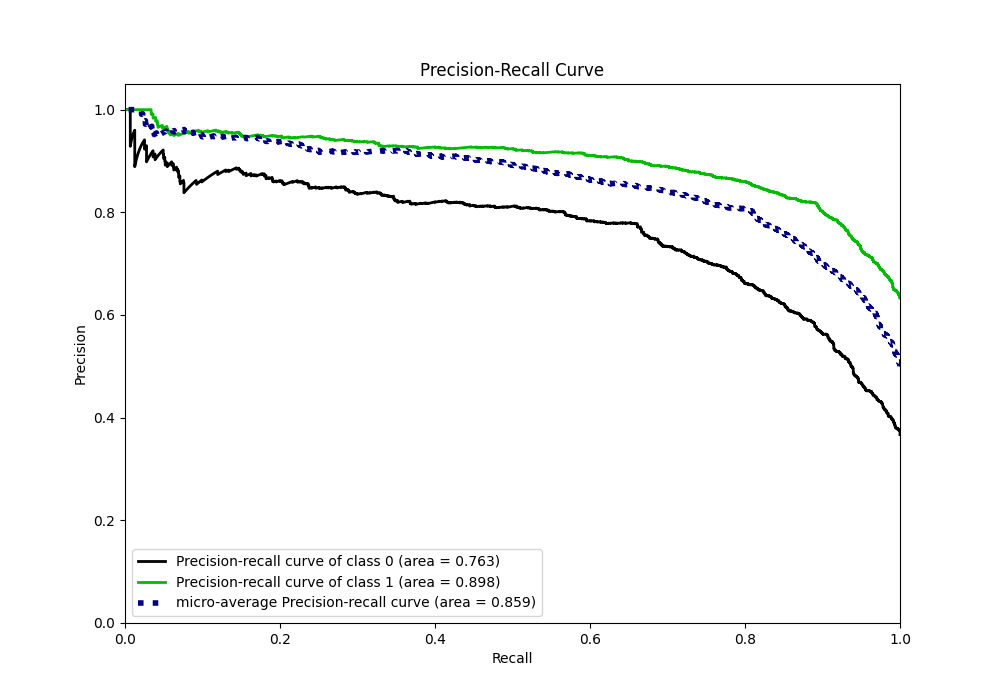

# Summary of 2_Default_LightGBM

[<< Go back](../README.md)

## LightGBM
- **n_jobs**: -1
- **objective**: binary
- **num_leaves**: 63
- **learning_rate**: 0.05
- **feature_fraction**: 0.9
- **bagging_fraction**: 0.9
- **min_data_in_leaf**: 10
- **metric**: custom
- **custom_eval_metric_name**: f1
- **explain_level**: 1

## Validation
 - **validation_type**: kfold
 - **k_folds**: 10
 - **shuffle**: True
 - **stratify**: True
 - **random_seed**: 12

## Optimized metric
f1

## Training time

23.4 seconds

## Metric details
|           |    score |   threshold |
|:----------|---------:|------------:|
| logloss   | 0.464081 | nan         |
| auc       | 0.853498 | nan         |
| f1        | 0.851557 |   0.492043  |
| accuracy  | 0.803925 |   0.502872  |
| precision | 0.965986 |   0.983822  |
| recall    | 1        |   0.0170695 |
| mcc       | 0.568748 |   0.502872  |

## Metric details with threshold from accuracy metric
|           |    score |   threshold |
|:----------|---------:|------------:|
| logloss   | 0.464081 |  nan        |
| auc       | 0.853498 |  nan        |
| f1        | 0.851306 |    0.502872 |
| accuracy  | 0.803925 |    0.502872 |
| precision | 0.818692 |    0.502872 |
| recall    | 0.886626 |    0.502872 |
| mcc       | 0.568748 |    0.502872 |

## Confusion matrix (at threshold=0.502872)
|              |   Predicted as 0 |   Predicted as 1 |
|:-------------|-----------------:|-----------------:|
| Labeled as 0 |             1261 |              646 |
| Labeled as 1 |              373 |             2917 |

## Learning curves

## Permutation-based Importance

## Confusion Matrix

## Normalized Confusion Matrix

## ROC Curve

## Kolmogorov-Smirnov Statistic

## Precision-Recall Curve

## Calibration Curve

## Cumulative Gains Curve

## Lift Curve

[<< Go back](../README.md)
