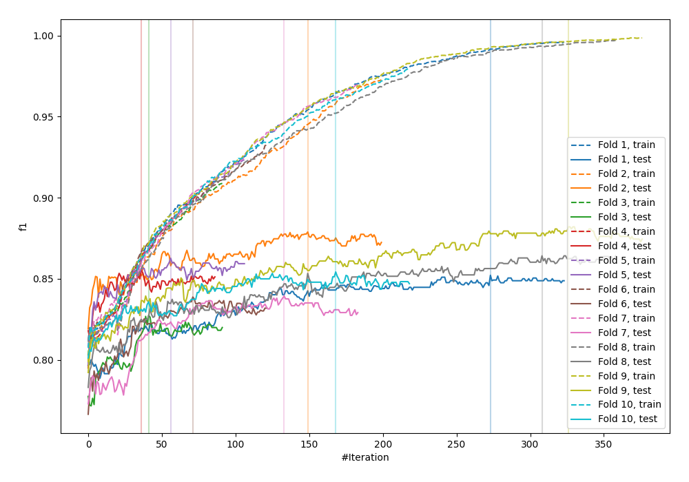
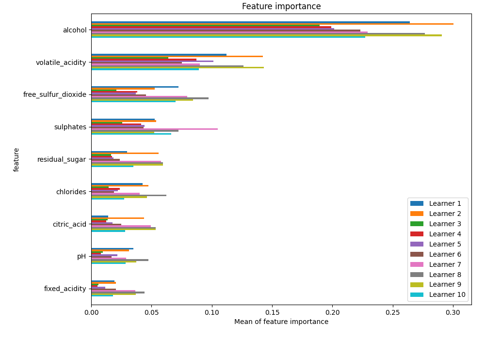
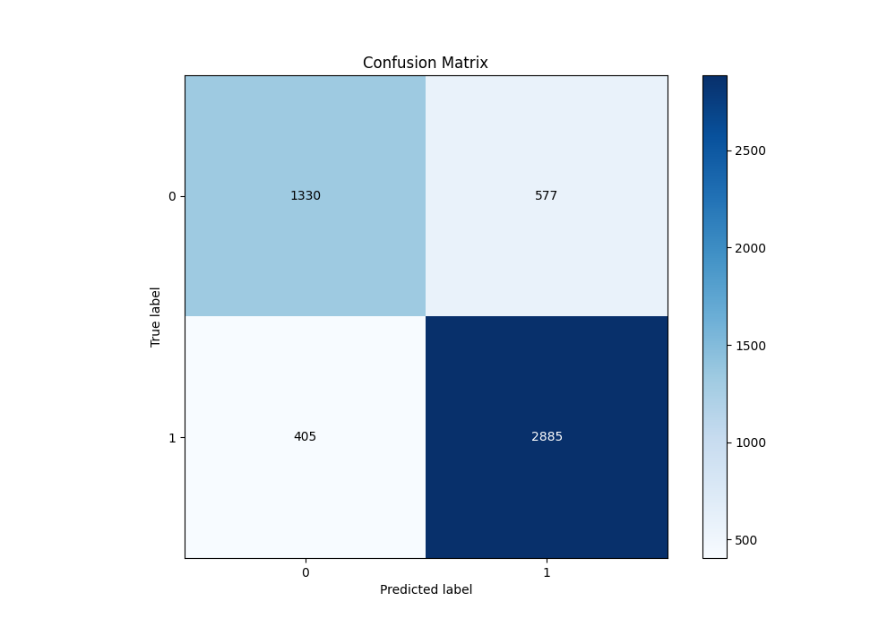
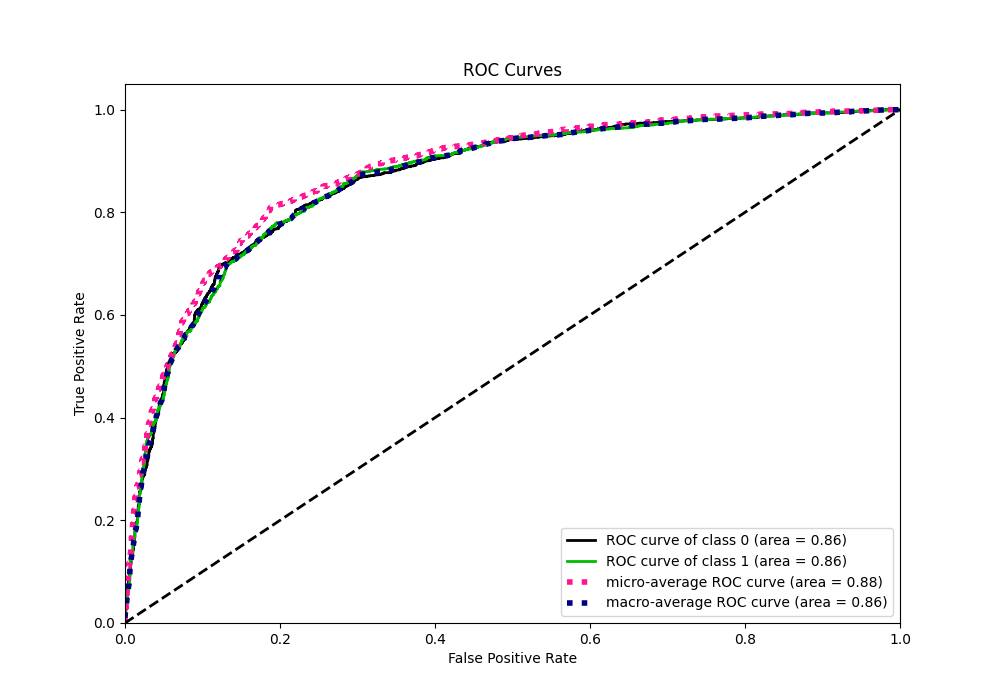
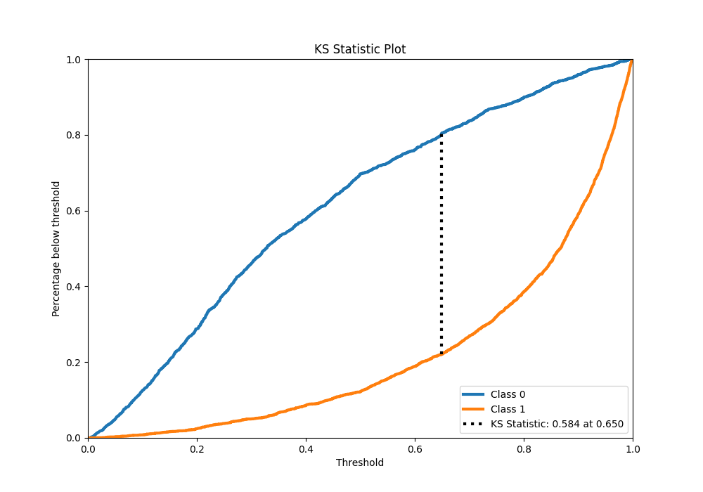
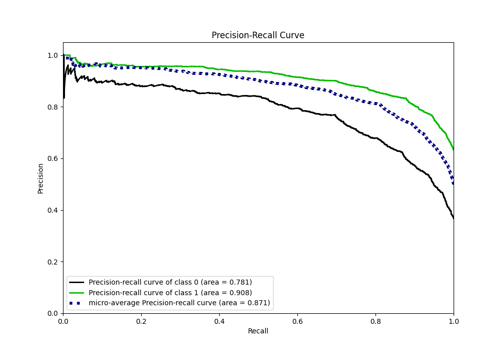
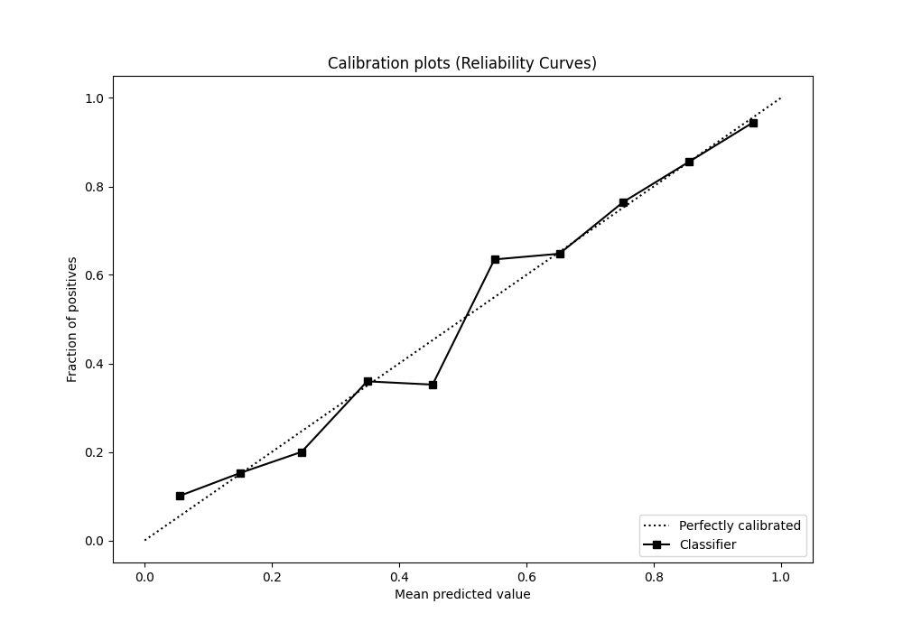
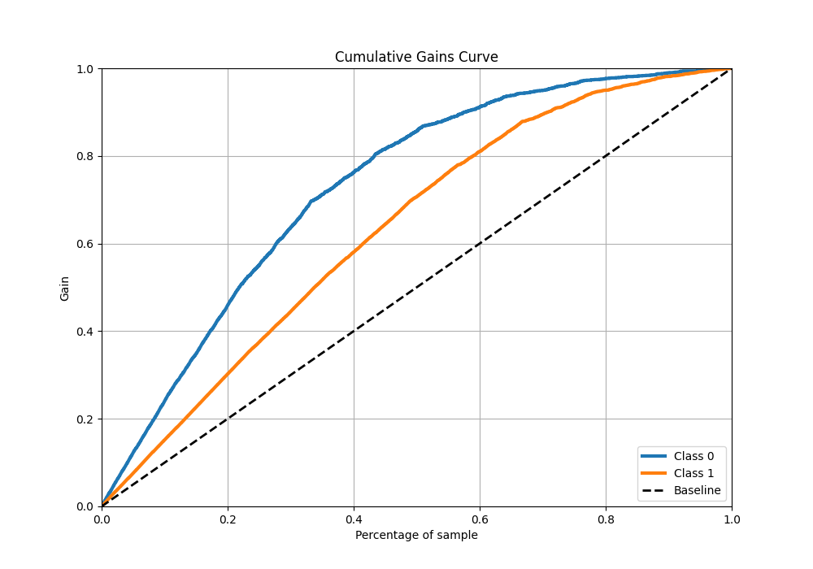
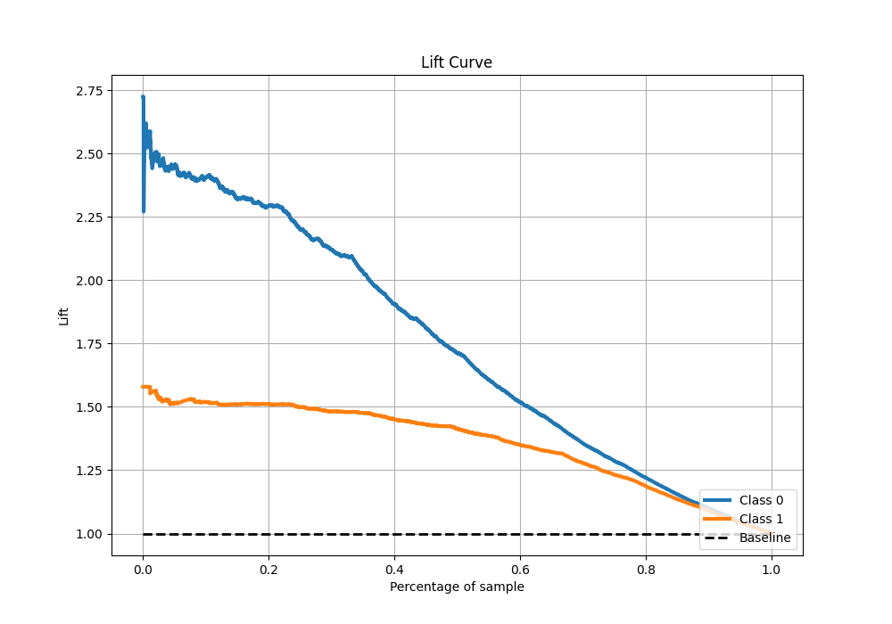

# Summary of 33_CatBoost

[<< Go back](../README.md)

## CatBoost
- **n_jobs**: -1
- **learning_rate**: 0.1
- **depth**: 9
- **rsm**: 1.0
- **loss_function**: Logloss
- **eval_metric**: F1
- **explain_level**: 1

## Validation
 - **validation_type**: kfold
 - **k_folds**: 10
 - **shuffle**: True
 - **stratify**: True
 - **random_seed**: 12

## Optimized metric
f1

## Training time

14.9 seconds

## Metric details
|           |    score |    threshold |
|:----------|---------:|-------------:|
| logloss   | 0.44331  | nan          |
| auc       | 0.864353 | nan          |
| f1        | 0.854562 |   0.501715   |
| accuracy  | 0.811045 |   0.501715   |
| precision | 0.972789 |   0.991677   |
| recall    | 1        |   0.00491435 |
| mcc       | 0.586978 |   0.501715   |

## Metric details with threshold from accuracy metric
|           |    score |   threshold |
|:----------|---------:|------------:|
| logloss   | 0.44331  |  nan        |
| auc       | 0.864353 |  nan        |
| f1        | 0.854562 |    0.501715 |
| accuracy  | 0.811045 |    0.501715 |
| precision | 0.833333 |    0.501715 |
| recall    | 0.8769   |    0.501715 |
| mcc       | 0.586978 |    0.501715 |

## Confusion matrix (at threshold=0.501715)
|              |   Predicted as 0 |   Predicted as 1 |
|:-------------|-----------------:|-----------------:|
| Labeled as 0 |             1330 |              577 |
| Labeled as 1 |              405 |             2885 |

## Learning curves

## Permutation-based Importance

## Confusion Matrix

## Normalized Confusion Matrix

## ROC Curve

## Kolmogorov-Smirnov Statistic

## Precision-Recall Curve

## Calibration Curve

## Cumulative Gains Curve

## Lift Curve

[<< Go back](../README.md)
