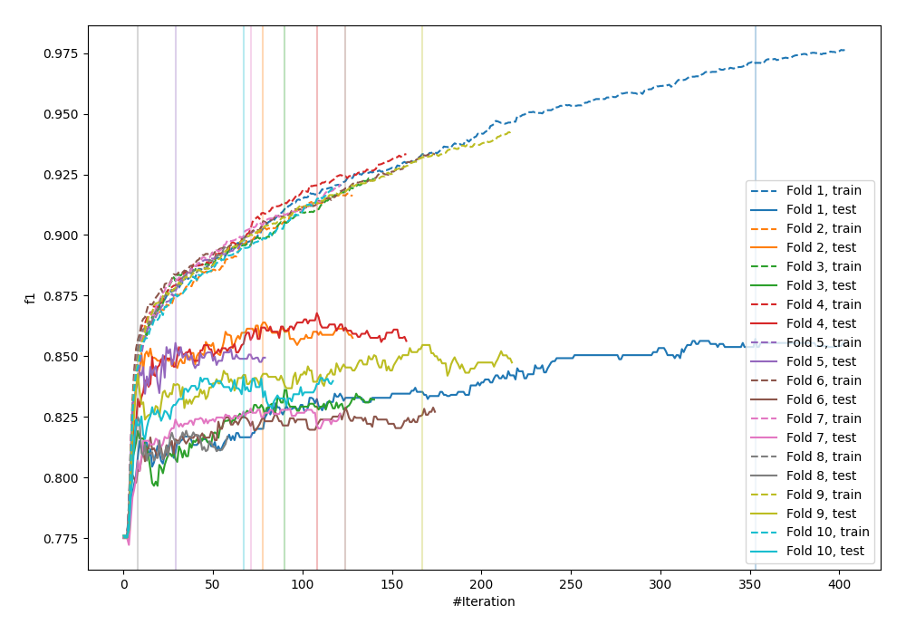
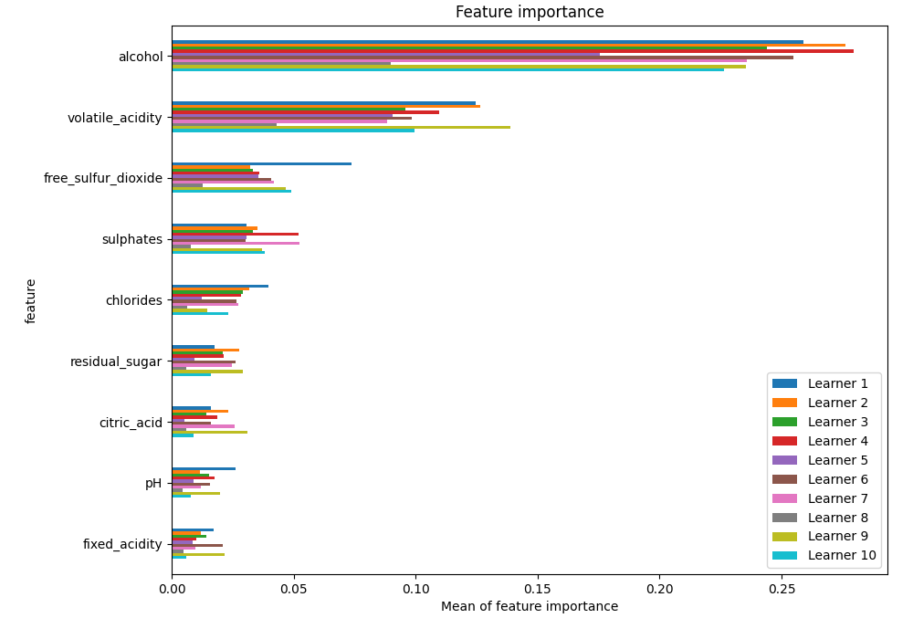
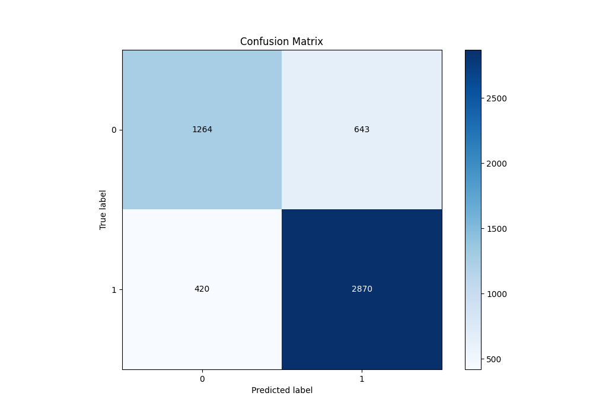
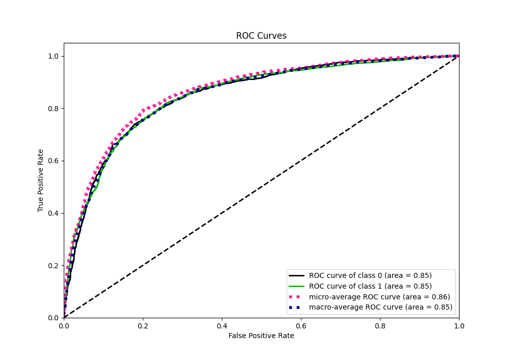
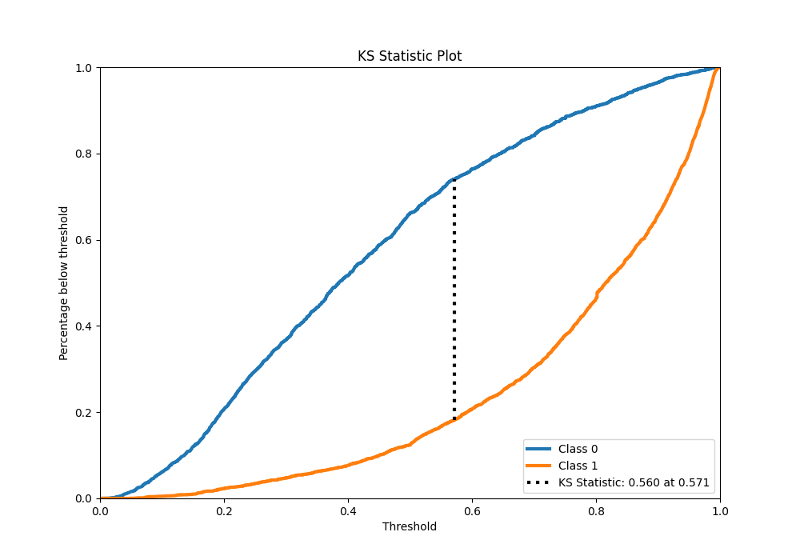
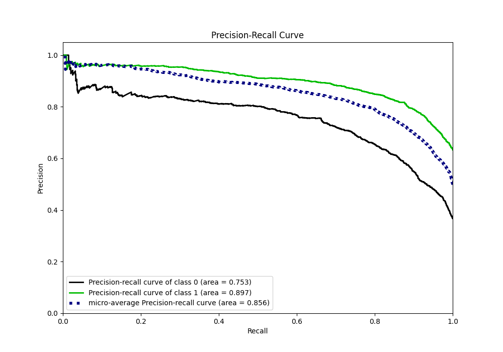
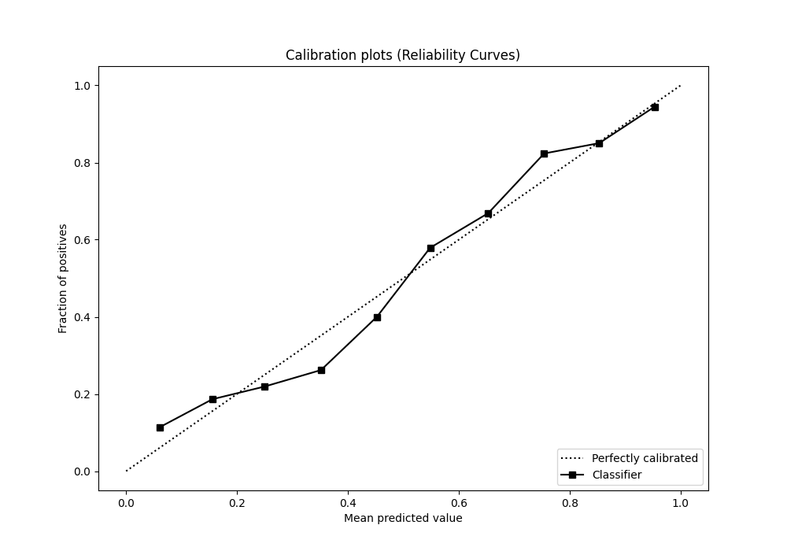
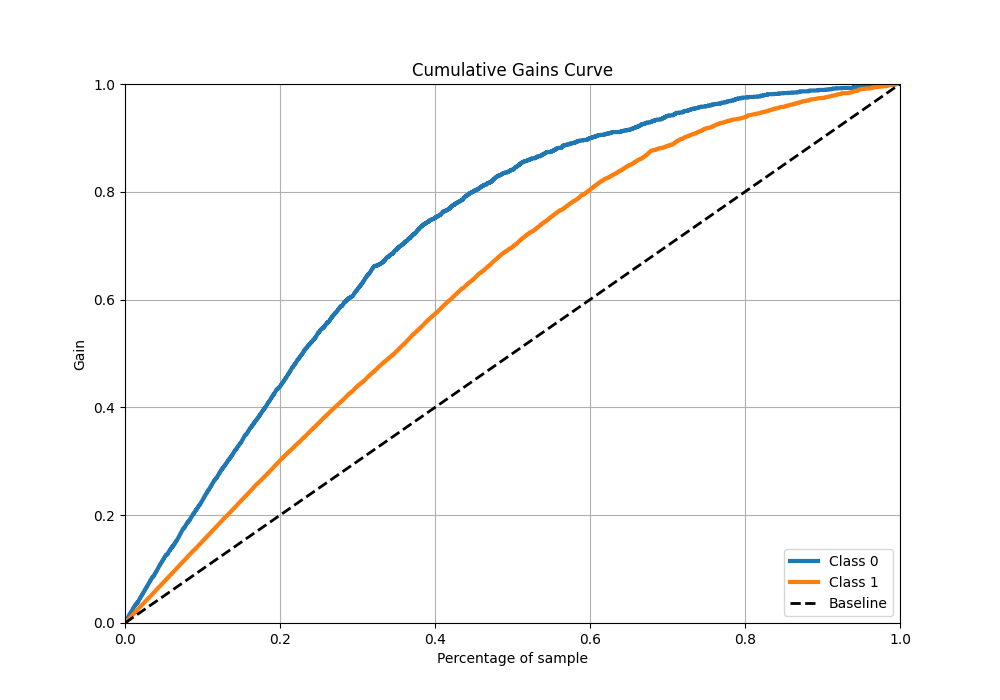
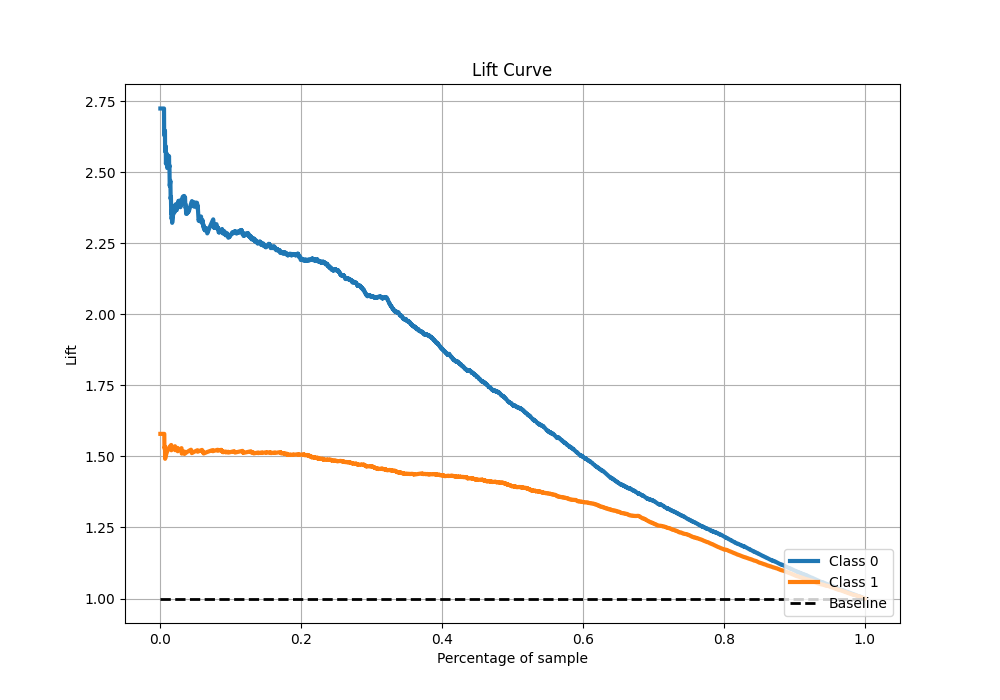

# Summary of 34_Xgboost

[<< Go back](../README.md)

## Extreme Gradient Boosting (Xgboost)
- **n_jobs**: -1
- **objective**: binary:logistic
- **eta**: 0.075
- **max_depth**: 7
- **min_child_weight**: 5
- **subsample**: 1.0
- **colsample_bytree**: 1.0
- **eval_metric**: f1
- **explain_level**: 1

## Validation
 - **validation_type**: kfold
 - **k_folds**: 10
 - **shuffle**: True
 - **stratify**: True
 - **random_seed**: 12

## Optimized metric
f1

## Training time

16.3 seconds

## Metric details
|           |    score |   threshold |
|:----------|---------:|------------:|
| logloss   | 0.465608 | nan         |
| auc       | 0.848722 | nan         |
| f1        | 0.843887 |   0.492022  |
| accuracy  | 0.795459 |   0.501928  |
| precision | 0.965986 |   0.985833  |
| recall    | 1        |   0.0146036 |
| mcc       | 0.55256  |   0.56521   |

## Metric details with threshold from accuracy metric
|           |    score |   threshold |
|:----------|---------:|------------:|
| logloss   | 0.465608 |  nan        |
| auc       | 0.848722 |  nan        |
| f1        | 0.843745 |    0.501928 |
| accuracy  | 0.795459 |    0.501928 |
| precision | 0.816966 |    0.501928 |
| recall    | 0.87234  |    0.501928 |
| mcc       | 0.551122 |    0.501928 |

## Confusion matrix (at threshold=0.501928)
|              |   Predicted as 0 |   Predicted as 1 |
|:-------------|-----------------:|-----------------:|
| Labeled as 0 |             1264 |              643 |
| Labeled as 1 |              420 |             2870 |

## Learning curves

## Permutation-based Importance

## Confusion Matrix

## Normalized Confusion Matrix

## ROC Curve

## Kolmogorov-Smirnov Statistic

## Precision-Recall Curve

## Calibration Curve

## Cumulative Gains Curve

## Lift Curve

[<< Go back](../README.md)
