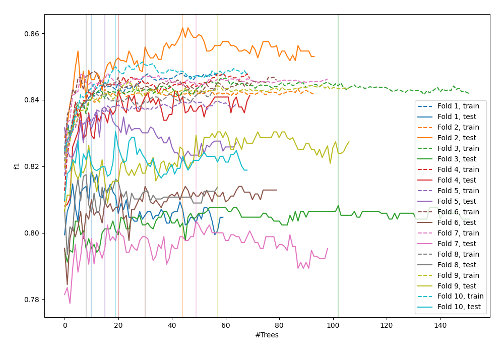
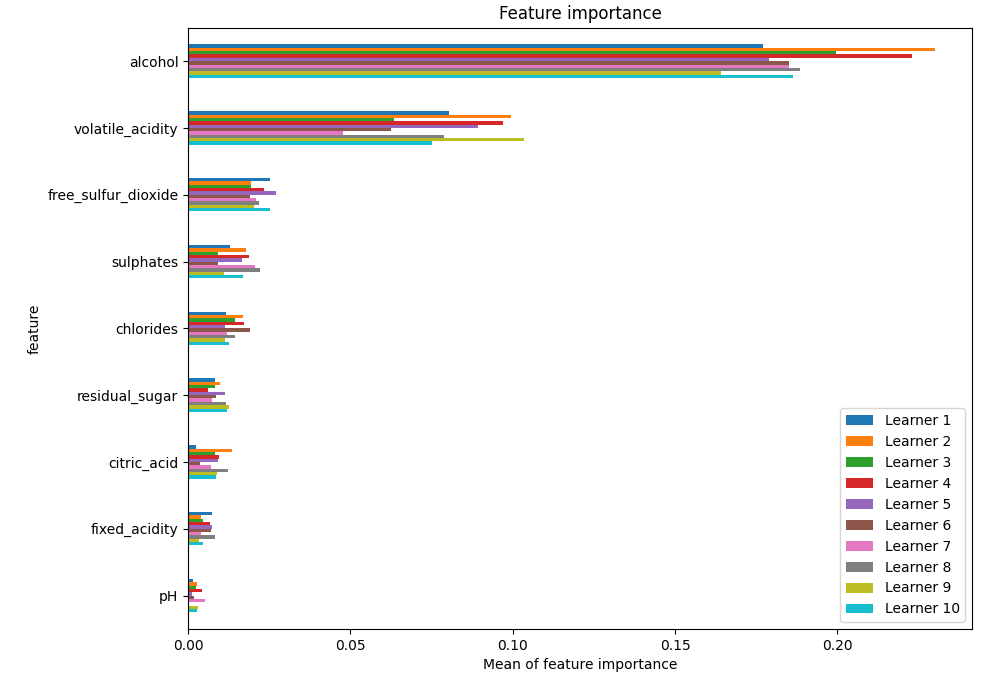
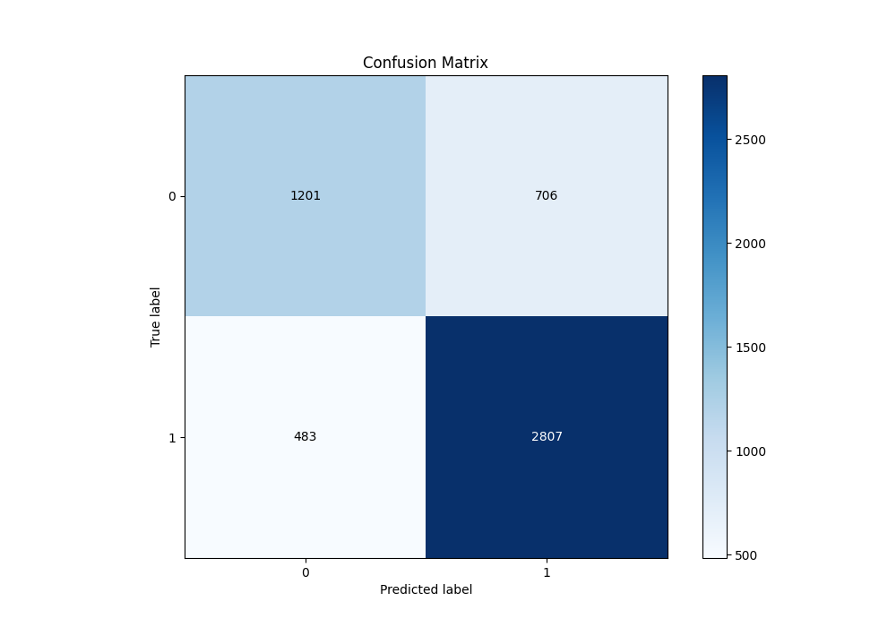
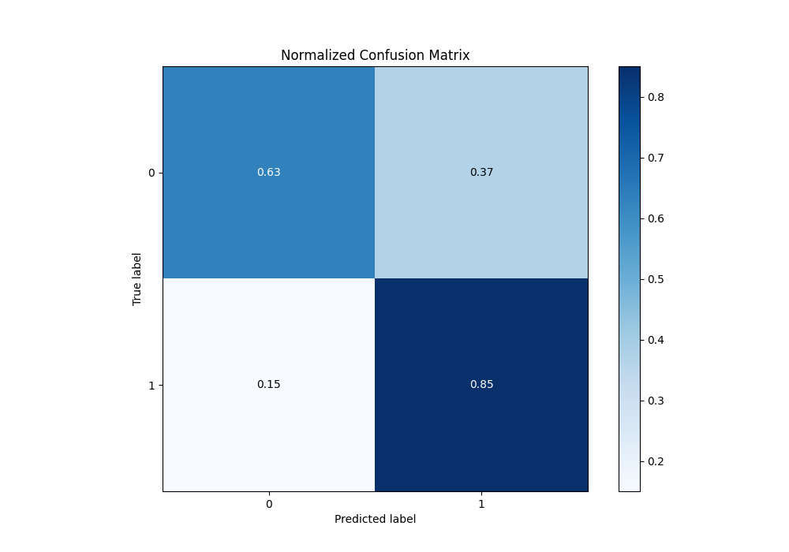
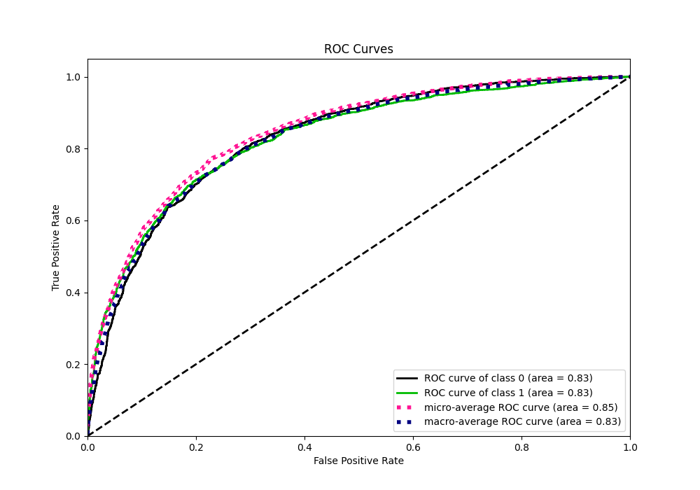
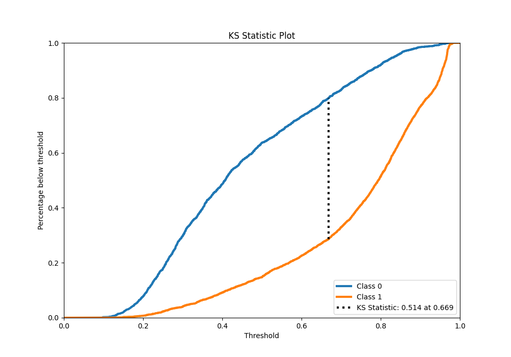
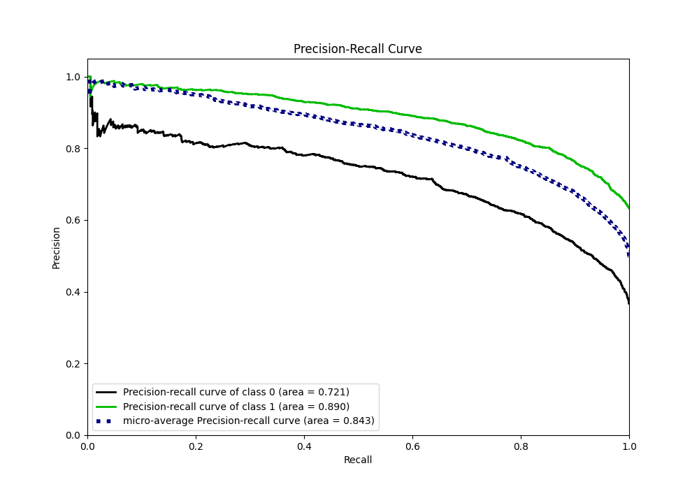
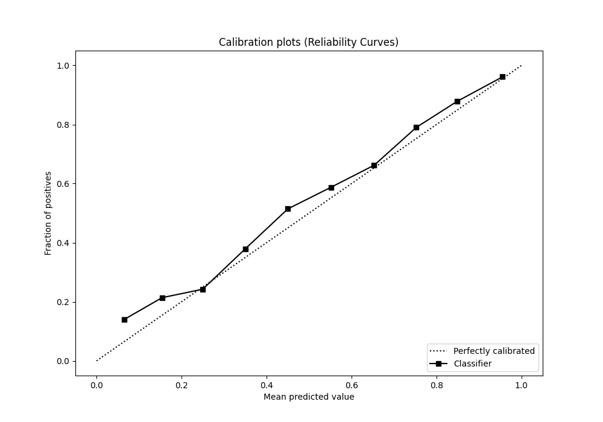
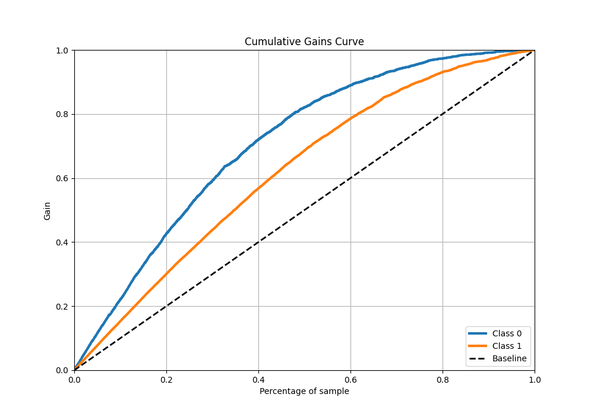
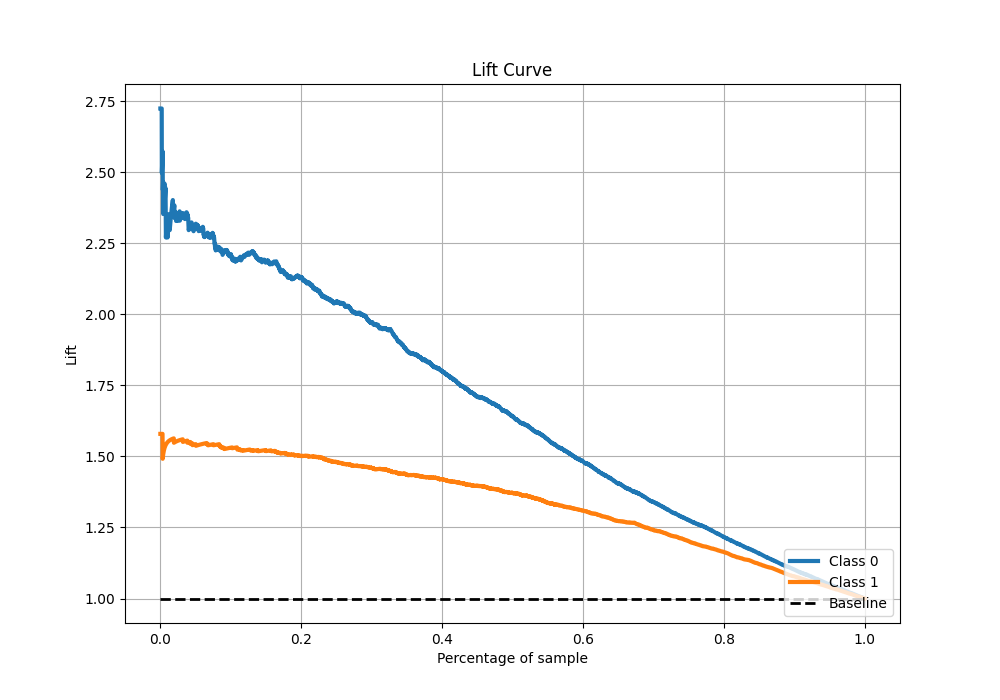

# Summary of 36_RandomForest

[<< Go back](../README.md)

## Random Forest
- **n_jobs**: -1
- **criterion**: gini
- **max_features**: 0.7
- **min_samples_split**: 30
- **max_depth**: 6
- **eval_metric_name**: f1
- **explain_level**: 1

## Validation
 - **validation_type**: kfold
 - **k_folds**: 10
 - **shuffle**: True
 - **stratify**: True
 - **random_seed**: 12

## Optimized metric
f1

## Training time

13.8 seconds

## Metric details
|           |    score |   threshold |
|:----------|---------:|------------:|
| logloss   | 0.487694 | nan         |
| auc       | 0.82991  | nan         |
| f1        | 0.826602 |   0.449444  |
| accuracy  | 0.771214 |   0.496971  |
| precision | 0.986395 |   0.96728   |
| recall    | 1        |   0.0867345 |
| mcc       | 0.497694 |   0.591526  |

## Metric details with threshold from accuracy metric
|           |    score |   threshold |
|:----------|---------:|------------:|
| logloss   | 0.487694 |  nan        |
| auc       | 0.82991  |  nan        |
| f1        | 0.825224 |    0.496971 |
| accuracy  | 0.771214 |    0.496971 |
| precision | 0.799032 |    0.496971 |
| recall    | 0.853191 |    0.496971 |
| mcc       | 0.497381 |    0.496971 |

## Confusion matrix (at threshold=0.496971)
|              |   Predicted as 0 |   Predicted as 1 |
|:-------------|-----------------:|-----------------:|
| Labeled as 0 |             1201 |              706 |
| Labeled as 1 |              483 |             2807 |

## Learning curves

## Permutation-based Importance

## Confusion Matrix

## Normalized Confusion Matrix

## ROC Curve

## Kolmogorov-Smirnov Statistic

## Precision-Recall Curve

## Calibration Curve

## Cumulative Gains Curve

## Lift Curve

[<< Go back](../README.md)
