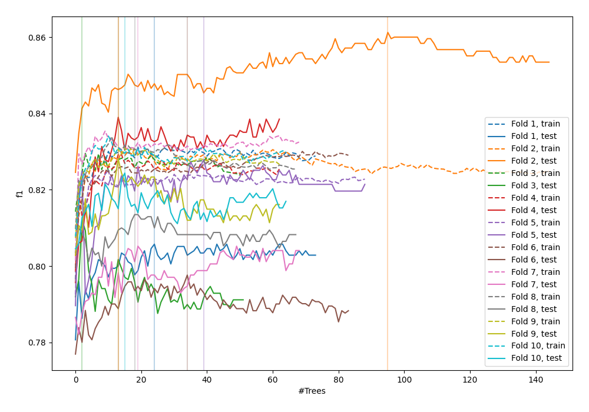
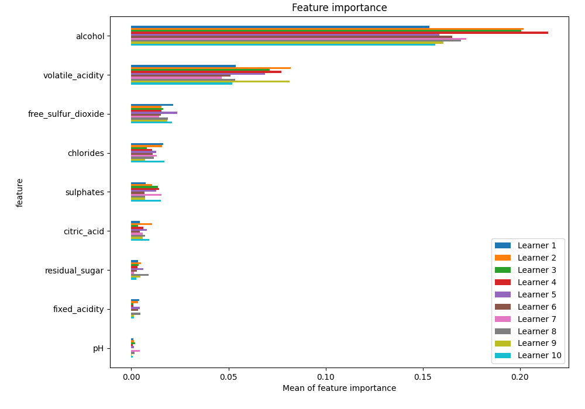
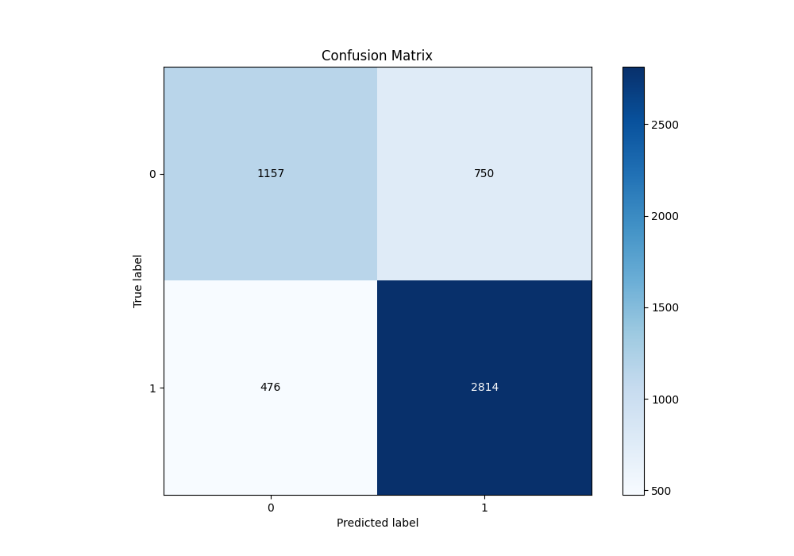
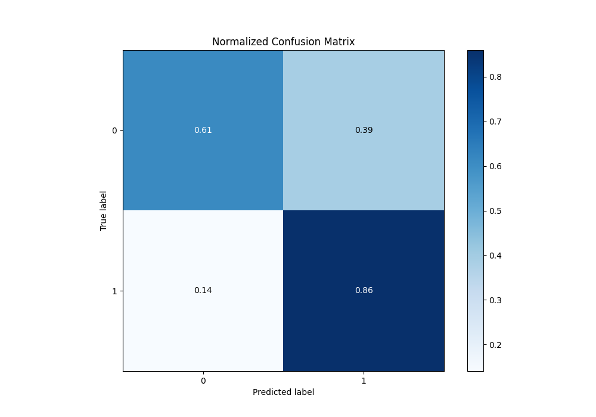
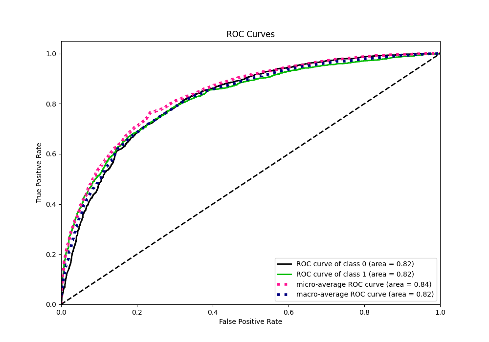
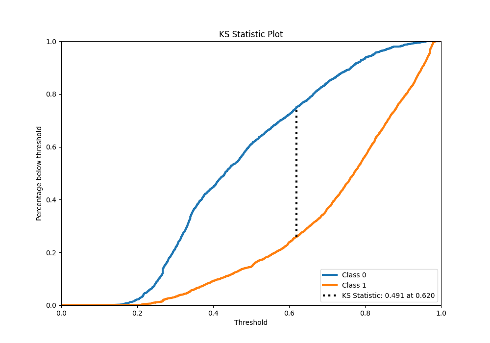
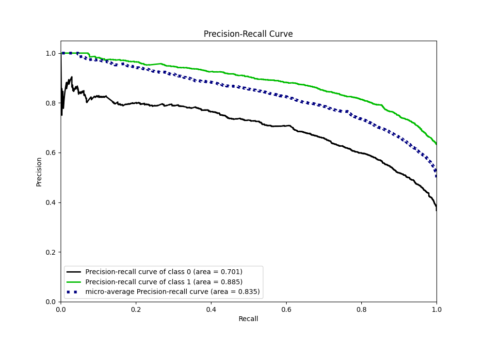
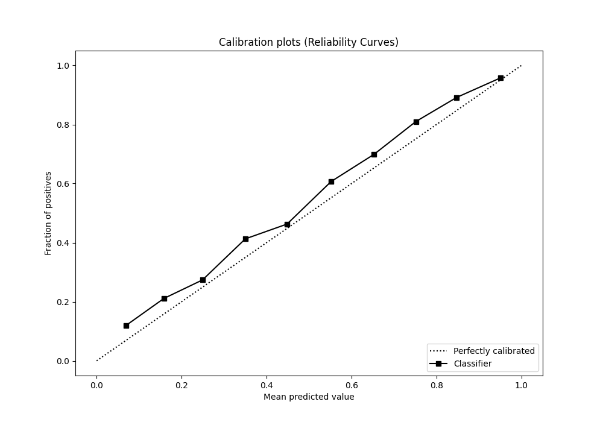
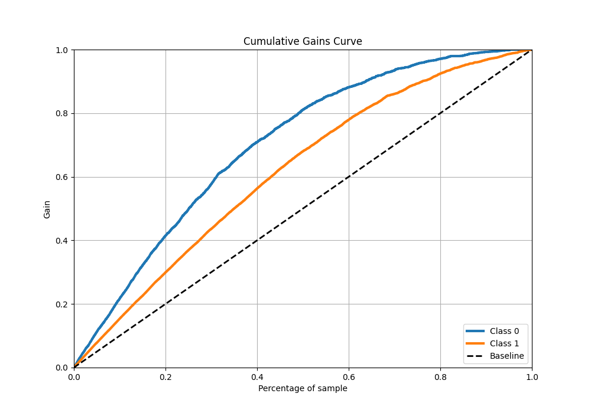
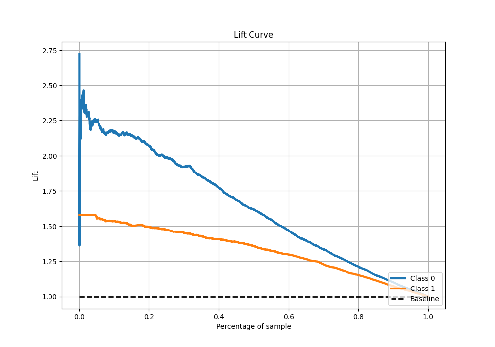

# Summary of 37_RandomForest

[<< Go back](../README.md)

## Random Forest
- **n_jobs**: -1
- **criterion**: entropy
- **max_features**: 0.6
- **min_samples_split**: 50
- **max_depth**: 5
- **eval_metric_name**: f1
- **explain_level**: 1

## Validation
 - **validation_type**: kfold
 - **k_folds**: 10
 - **shuffle**: True
 - **stratify**: True
 - **random_seed**: 12

## Optimized metric
f1

## Training time

13.2 seconds

## Metric details
|           |    score |   threshold |
|:----------|---------:|------------:|
| logloss   | 0.500413 |  nan        |
| auc       | 0.819595 |  nan        |
| f1        | 0.821126 |    0.498616 |
| accuracy  | 0.764095 |    0.498616 |
| precision | 1        |    0.96507  |
| recall    | 1        |    0.105992 |
| mcc       | 0.483202 |    0.580159 |

## Metric details with threshold from accuracy metric
|           |    score |   threshold |
|:----------|---------:|------------:|
| logloss   | 0.500413 |  nan        |
| auc       | 0.819595 |  nan        |
| f1        | 0.821126 |    0.498616 |
| accuracy  | 0.764095 |    0.498616 |
| precision | 0.789562 |    0.498616 |
| recall    | 0.855319 |    0.498616 |
| mcc       | 0.479714 |    0.498616 |

## Confusion matrix (at threshold=0.498616)
|              |   Predicted as 0 |   Predicted as 1 |
|:-------------|-----------------:|-----------------:|
| Labeled as 0 |             1157 |              750 |
| Labeled as 1 |              476 |             2814 |

## Learning curves

## Permutation-based Importance

## Confusion Matrix

## Normalized Confusion Matrix

## ROC Curve

## Kolmogorov-Smirnov Statistic

## Precision-Recall Curve

## Calibration Curve

## Cumulative Gains Curve

## Lift Curve

[<< Go back](../README.md)
