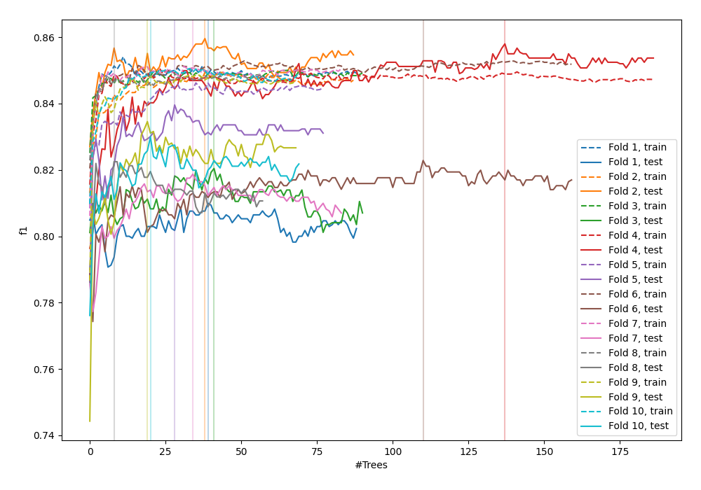
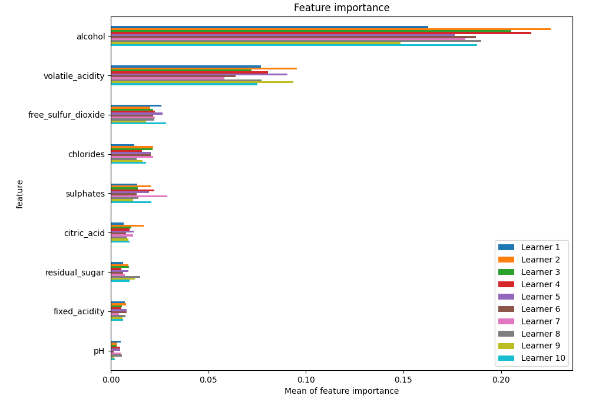
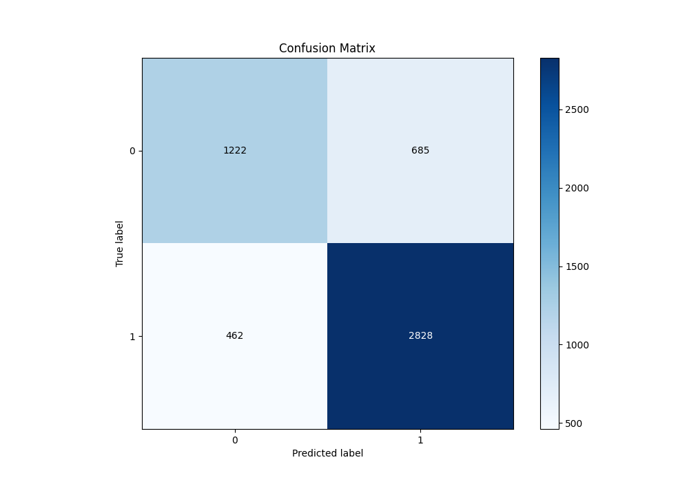
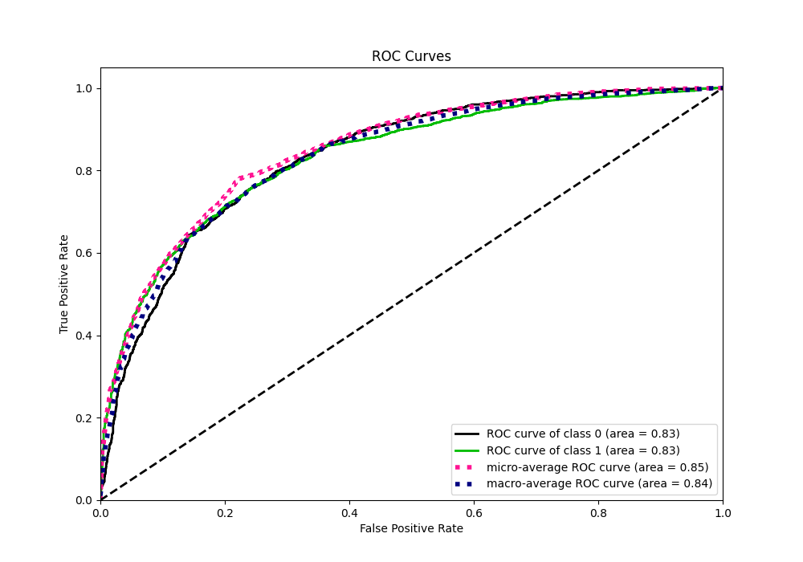
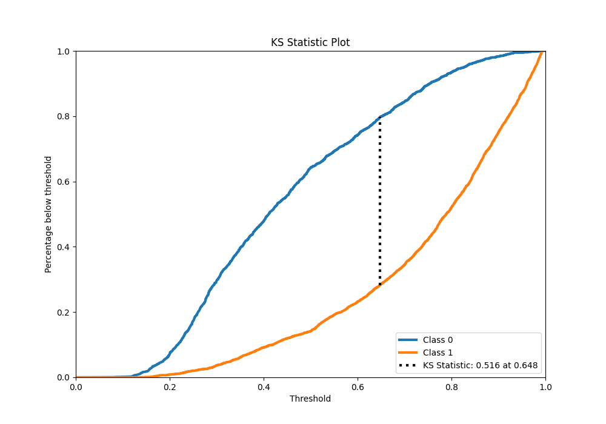
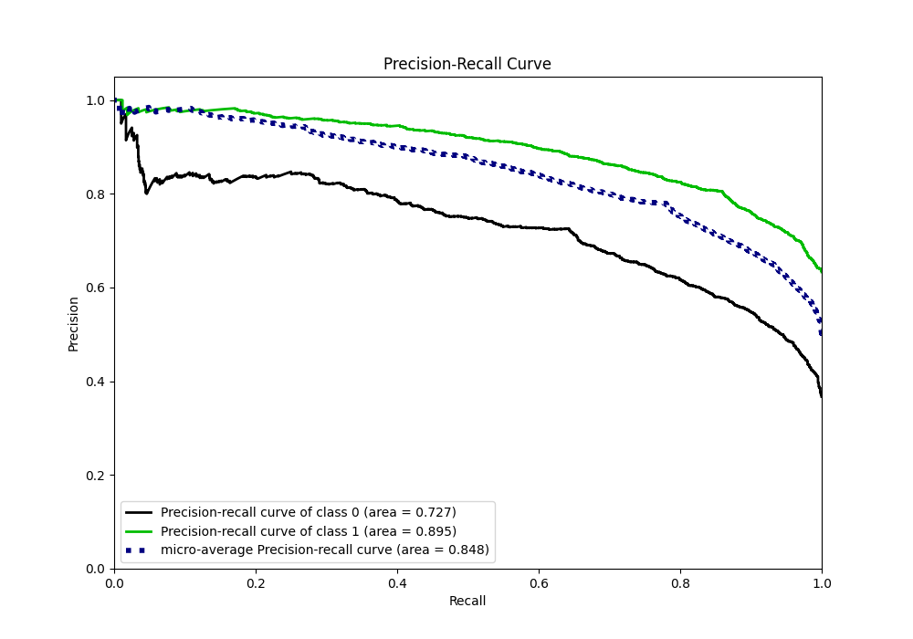
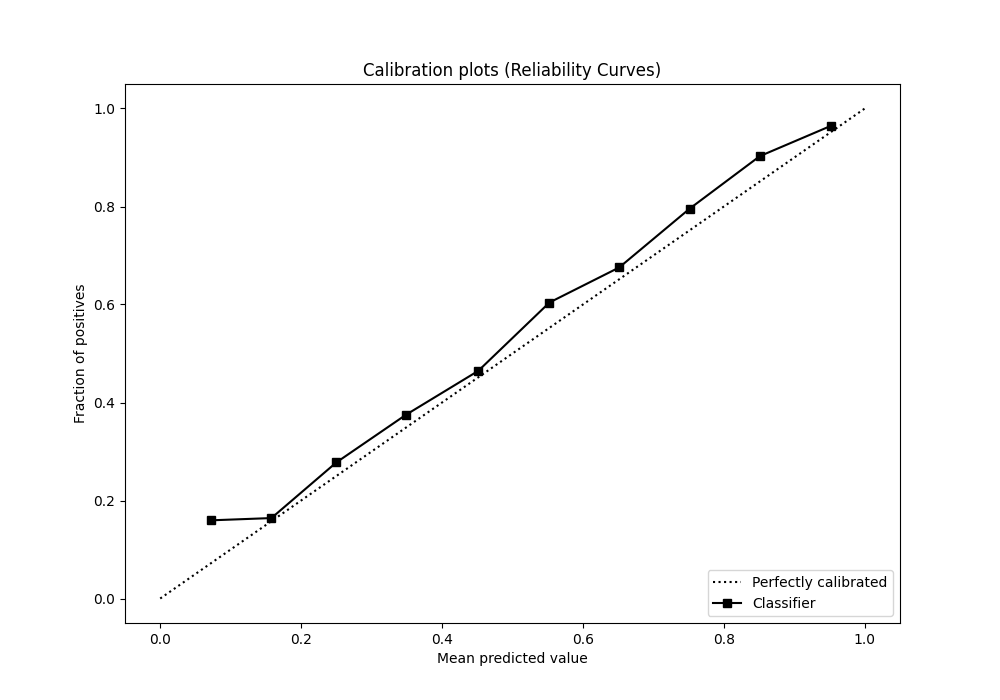
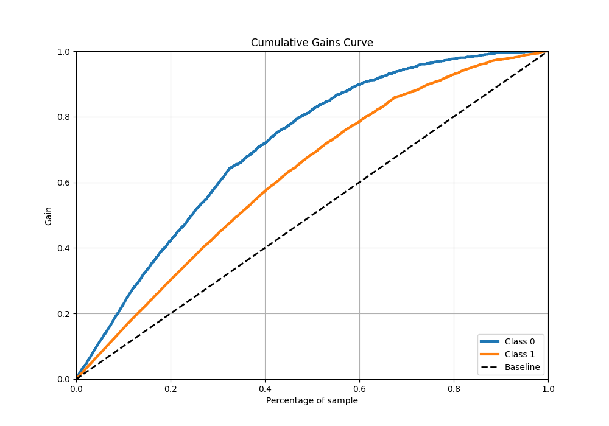
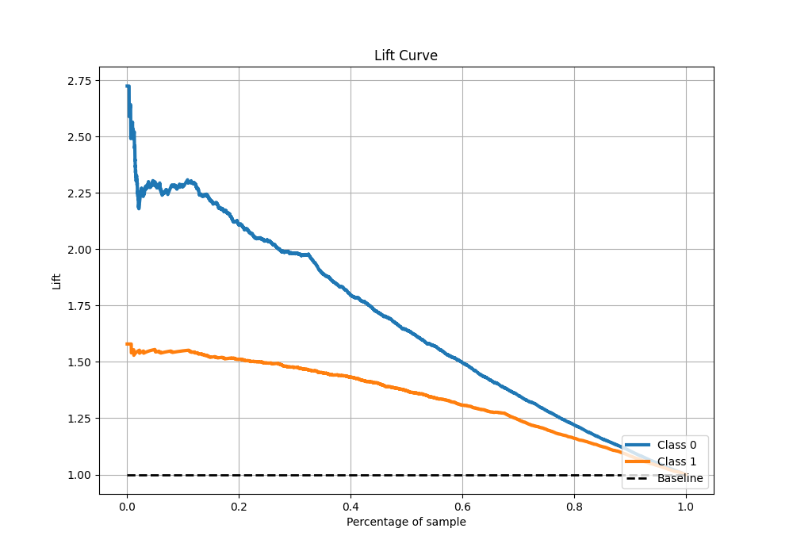

# Summary of 38_RandomForest

[<< Go back](../README.md)

## Random Forest
- **n_jobs**: -1
- **criterion**: entropy
- **max_features**: 0.6
- **min_samples_split**: 50
- **max_depth**: 7
- **eval_metric_name**: f1
- **explain_level**: 1

## Validation
 - **validation_type**: kfold
 - **k_folds**: 10
 - **shuffle**: True
 - **stratify**: True
 - **random_seed**: 12

## Optimized metric
f1

## Training time

14.0 seconds

## Metric details
|           |    score |   threshold |
|:----------|---------:|------------:|
| logloss   | 0.482587 | nan         |
| auc       | 0.834931 | nan         |
| f1        | 0.831398 |   0.499178  |
| accuracy  | 0.779296 |   0.499178  |
| precision | 0.983936 |   0.970026  |
| recall    | 1        |   0.0756401 |
| mcc       | 0.515295 |   0.499178  |

## Metric details with threshold from accuracy metric
|           |    score |   threshold |
|:----------|---------:|------------:|
| logloss   | 0.482587 |  nan        |
| auc       | 0.834931 |  nan        |
| f1        | 0.831398 |    0.499178 |
| accuracy  | 0.779296 |    0.499178 |
| precision | 0.80501  |    0.499178 |
| recall    | 0.859574 |    0.499178 |
| mcc       | 0.515295 |    0.499178 |

## Confusion matrix (at threshold=0.499178)
|              |   Predicted as 0 |   Predicted as 1 |
|:-------------|-----------------:|-----------------:|
| Labeled as 0 |             1222 |              685 |
| Labeled as 1 |              462 |             2828 |

## Learning curves

## Permutation-based Importance

## Confusion Matrix

## Normalized Confusion Matrix

## ROC Curve

## Kolmogorov-Smirnov Statistic

## Precision-Recall Curve

## Calibration Curve

## Cumulative Gains Curve

## Lift Curve

[<< Go back](../README.md)
