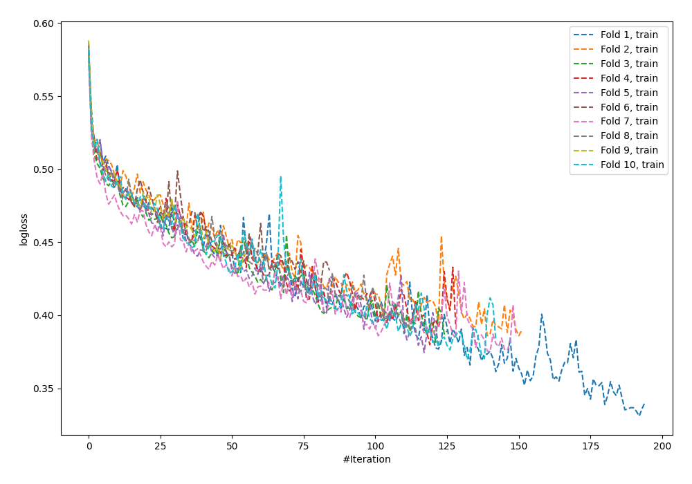
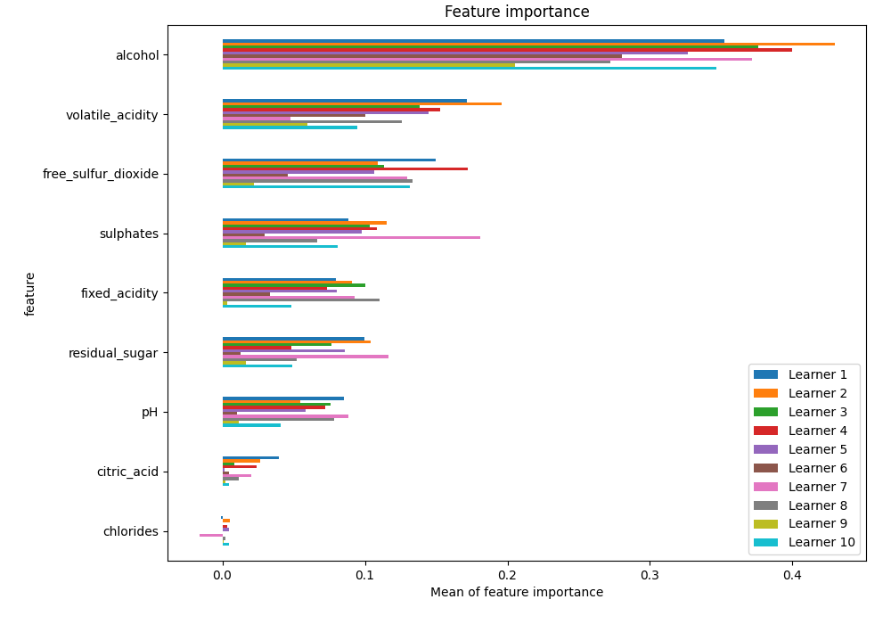
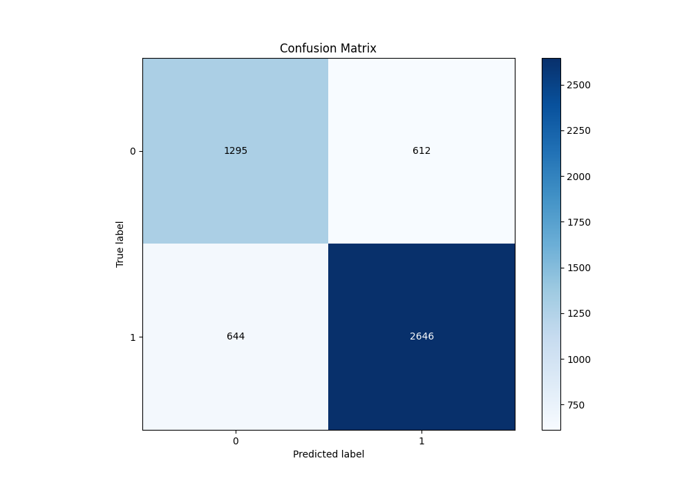
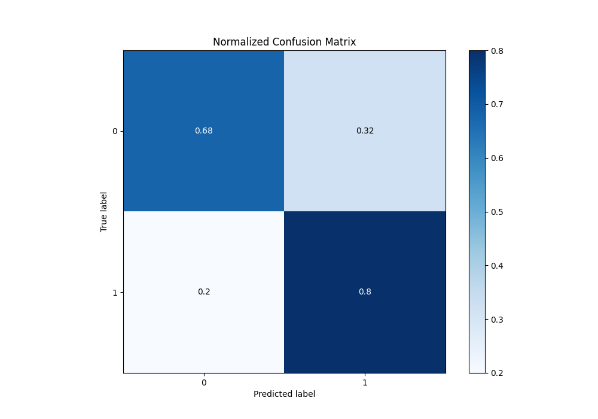
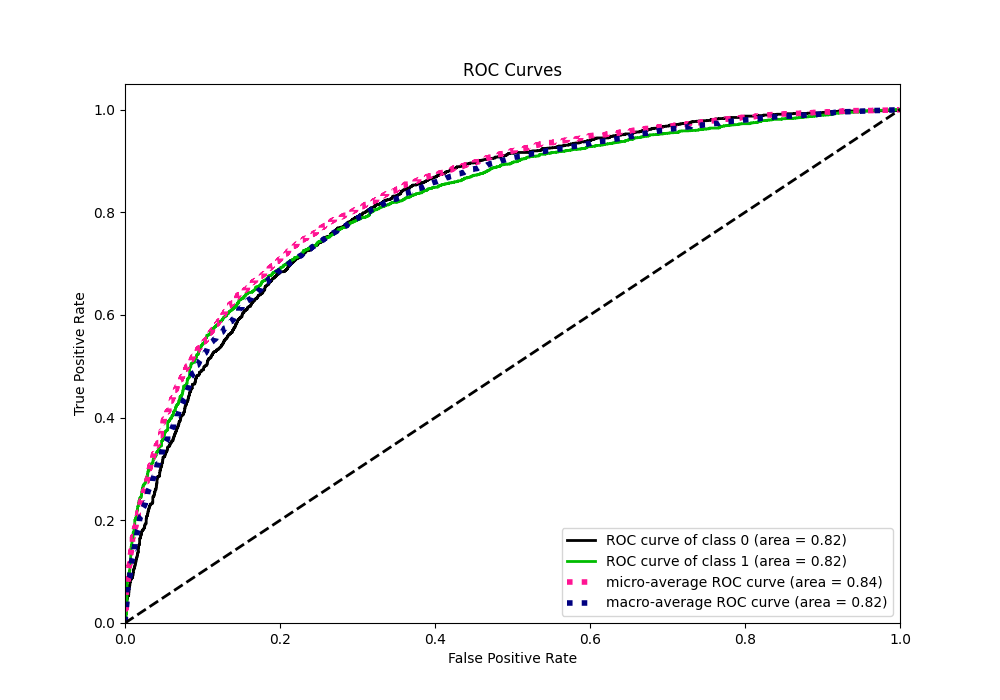
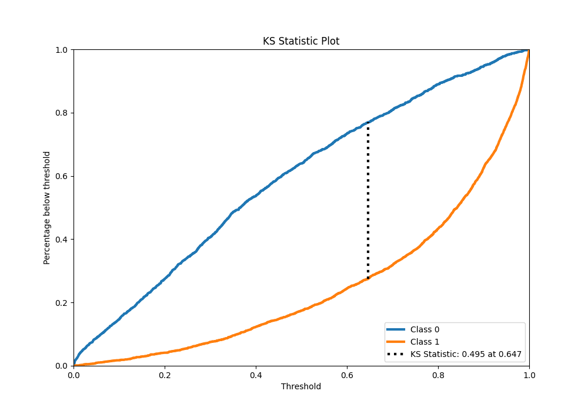
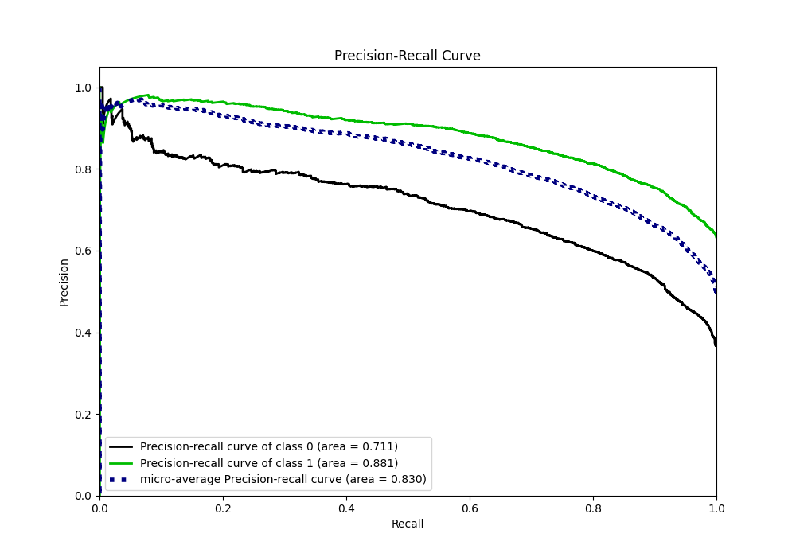
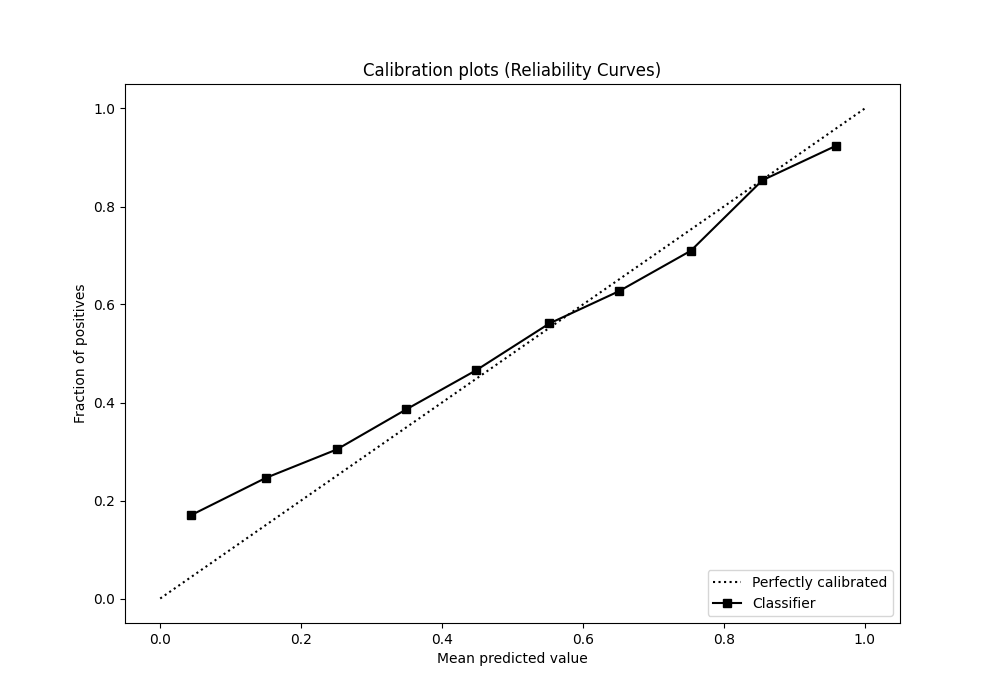
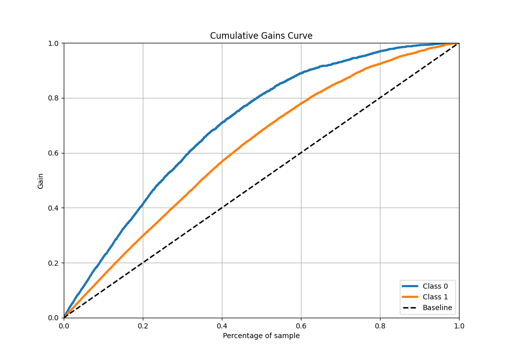
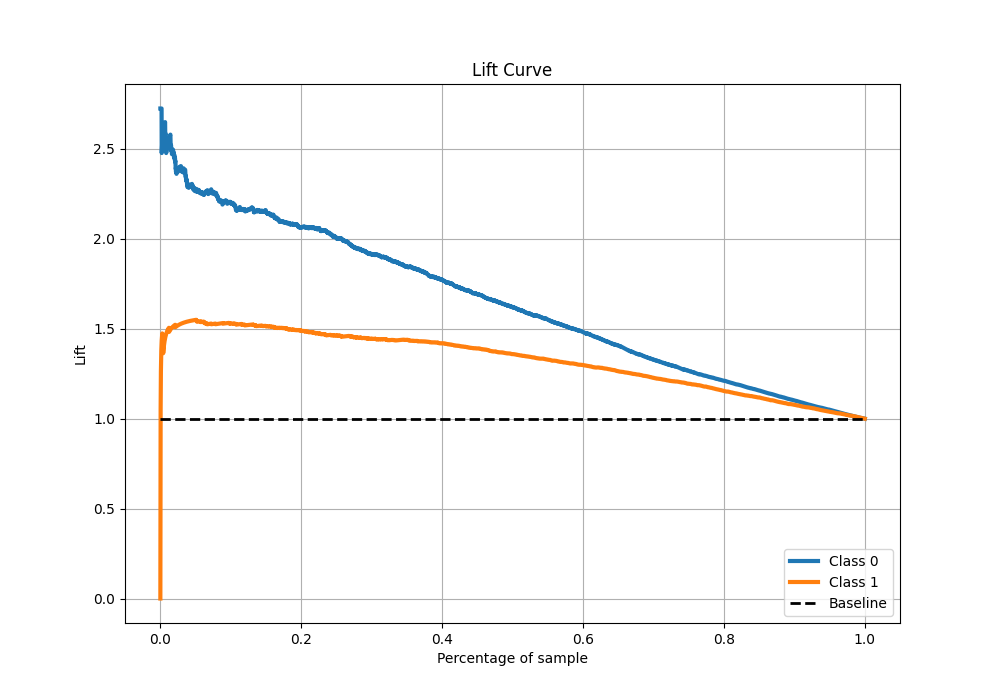

# Summary of 39_NeuralNetwork

[<< Go back](../README.md)

## Neural Network
- **n_jobs**: -1
- **dense_1_size**: 64
- **dense_2_size**: 8
- **learning_rate**: 0.01
- **explain_level**: 1

## Validation
 - **validation_type**: kfold
 - **k_folds**: 10
 - **shuffle**: True
 - **stratify**: True
 - **random_seed**: 12

## Optimized metric
f1

## Training time

18.3 seconds

## Metric details
|           |    score |     threshold |
|:----------|---------:|--------------:|
| logloss   | 0.514069 | nan           |
| auc       | 0.820375 | nan           |
| f1        | 0.821537 |   0.347151    |
| accuracy  | 0.758322 |   0.538688    |
| precision | 0.97992  |   0.989166    |
| recall    | 1        |   2.16964e-05 |
| mcc       | 0.481676 |   0.538688    |

## Metric details with threshold from accuracy metric
|           |    score |   threshold |
|:----------|---------:|------------:|
| logloss   | 0.514069 |  nan        |
| auc       | 0.820375 |  nan        |
| f1        | 0.808186 |    0.538688 |
| accuracy  | 0.758322 |    0.538688 |
| precision | 0.812155 |    0.538688 |
| recall    | 0.804255 |    0.538688 |
| mcc       | 0.481676 |    0.538688 |

## Confusion matrix (at threshold=0.538688)
|              |   Predicted as 0 |   Predicted as 1 |
|:-------------|-----------------:|-----------------:|
| Labeled as 0 |             1295 |              612 |
| Labeled as 1 |              644 |             2646 |

## Learning curves

## Permutation-based Importance

## Confusion Matrix

## Normalized Confusion Matrix

## ROC Curve

## Kolmogorov-Smirnov Statistic

## Precision-Recall Curve

## Calibration Curve

## Cumulative Gains Curve

## Lift Curve

[<< Go back](../README.md)
