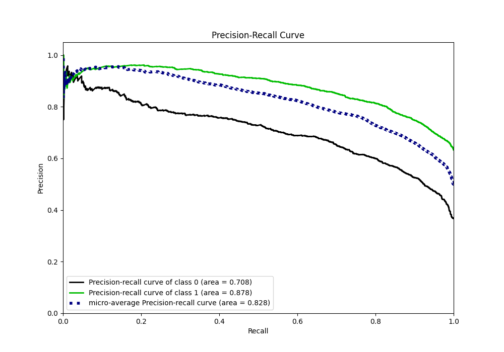

# Summary of 40_NeuralNetwork

[<< Go back](../README.md)

## Neural Network
- **n_jobs**: -1
- **dense_1_size**: 64
- **dense_2_size**: 32
- **learning_rate**: 0.01
- **explain_level**: 1

## Validation
 - **validation_type**: kfold
 - **k_folds**: 10
 - **shuffle**: True
 - **stratify**: True
 - **random_seed**: 12

## Optimized metric
f1

## Training time

25.6 seconds

## Metric details
|           |    score |     threshold |
|:----------|---------:|--------------:|
| logloss   | 0.527609 | nan           |
| auc       | 0.818214 | nan           |
| f1        | 0.818436 |   0.371685    |
| accuracy  | 0.760824 |   0.490377    |
| precision | 0.961864 |   0.973711    |
| recall    | 1        |   1.12058e-05 |
| mcc       | 0.482749 |   0.539829    |

## Metric details with threshold from accuracy metric
|           |    score |   threshold |
|:----------|---------:|------------:|
| logloss   | 0.527609 |  nan        |
| auc       | 0.818214 |  nan        |
| f1        | 0.814505 |    0.490377 |
| accuracy  | 0.760824 |    0.490377 |
| precision | 0.800059 |    0.490377 |
| recall    | 0.829483 |    0.490377 |
| mcc       | 0.478849 |    0.490377 |

## Confusion matrix (at threshold=0.490377)
|              |   Predicted as 0 |   Predicted as 1 |
|:-------------|-----------------:|-----------------:|
| Labeled as 0 |             1225 |              682 |
| Labeled as 1 |              561 |             2729 |

## Learning curves

## Permutation-based Importance

## Confusion Matrix

## Normalized Confusion Matrix

## ROC Curve

## Kolmogorov-Smirnov Statistic

## Precision-Recall Curve

## Calibration Curve

## Cumulative Gains Curve

## Lift Curve

[<< Go back](../README.md)
