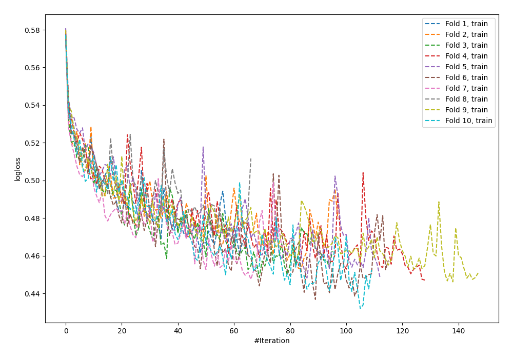
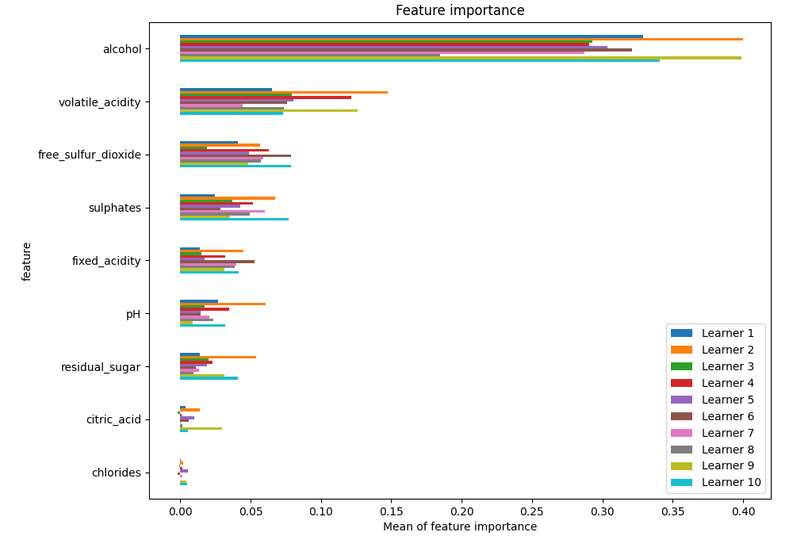
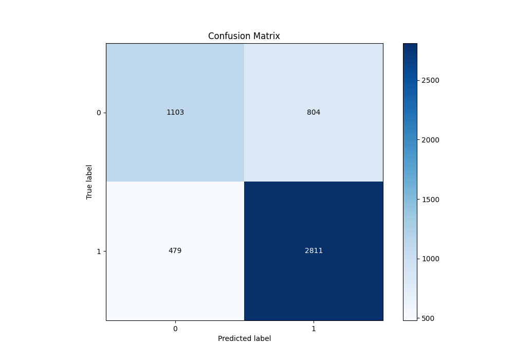
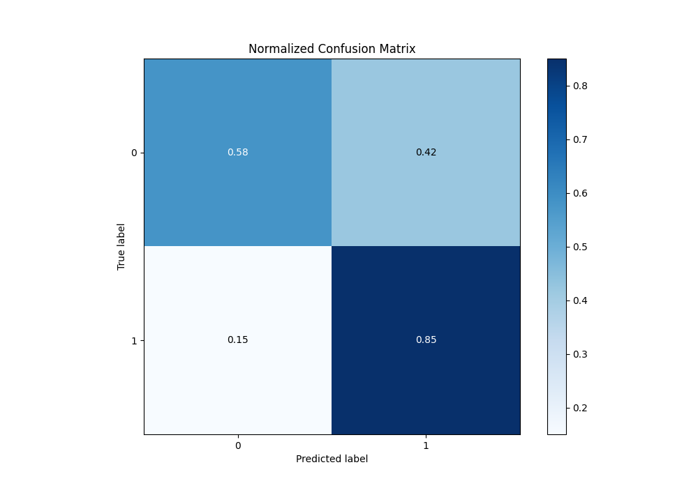
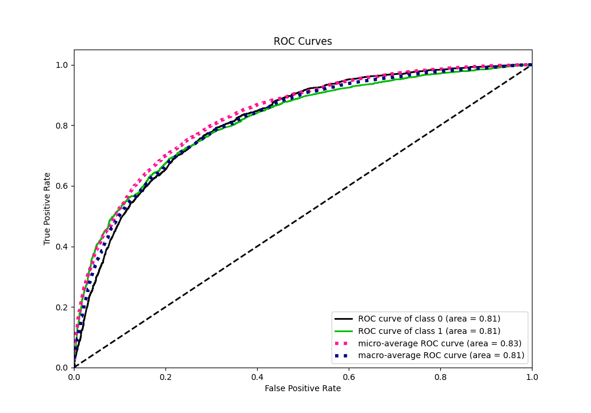
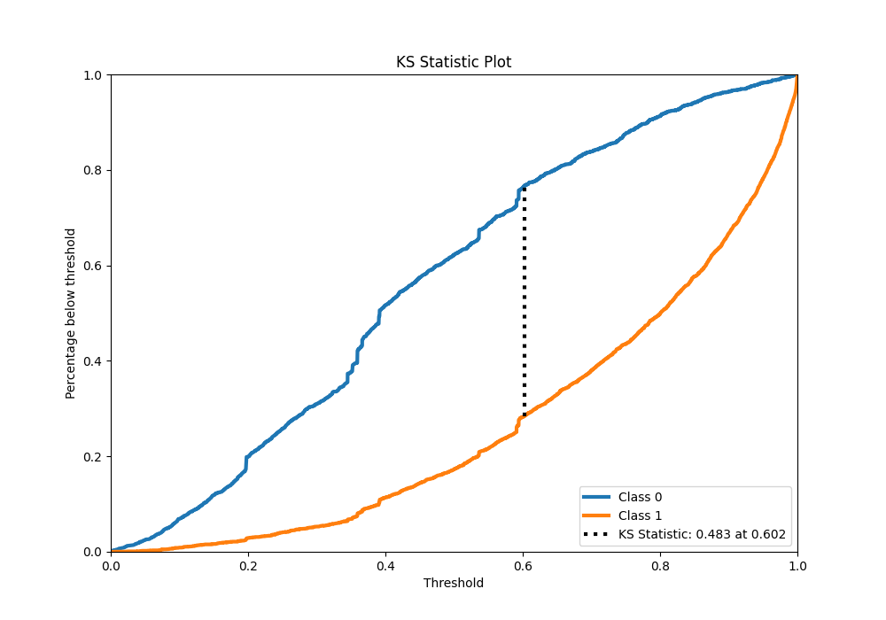
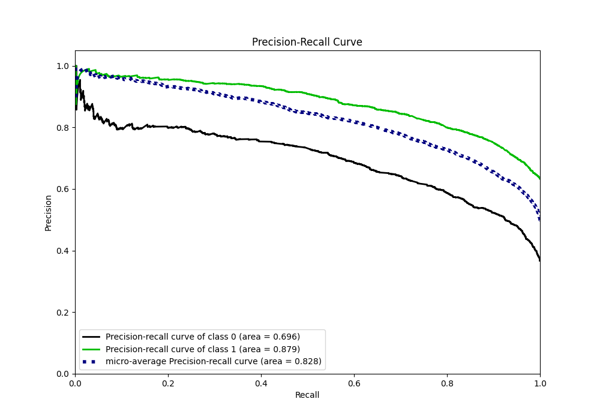
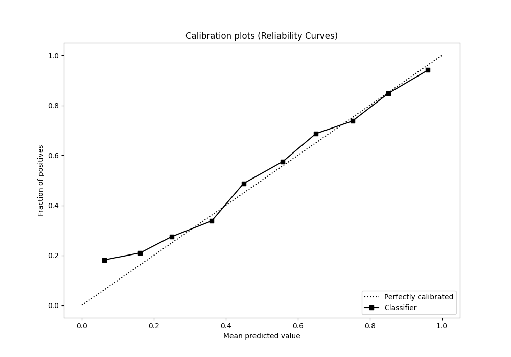
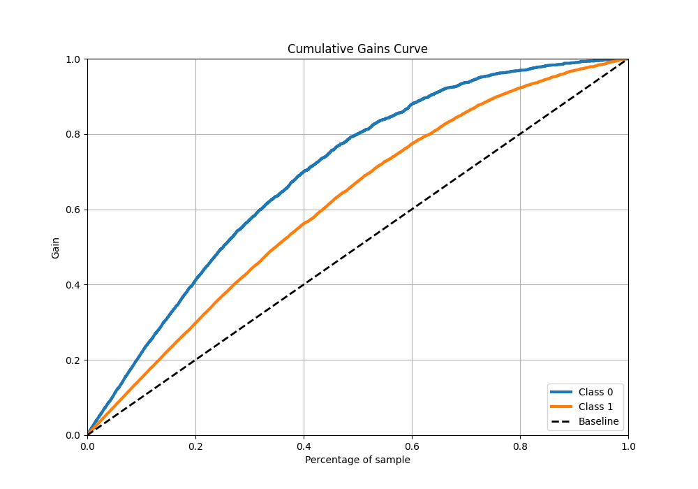
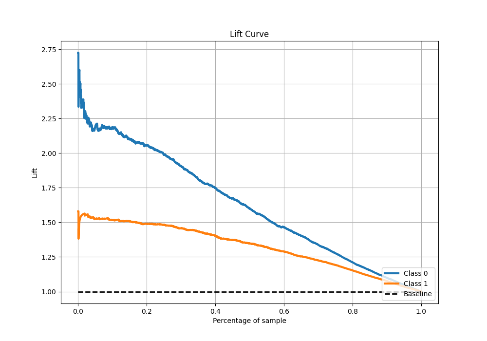

# Summary of 41_NeuralNetwork

[<< Go back](../README.md)

## Neural Network
- **n_jobs**: -1
- **dense_1_size**: 32
- **dense_2_size**: 8
- **learning_rate**: 0.05
- **explain_level**: 1

## Validation
 - **validation_type**: kfold
 - **k_folds**: 10
 - **shuffle**: True
 - **stratify**: True
 - **random_seed**: 12

## Optimized metric
f1

## Training time

13.5 seconds

## Metric details
|           |    score |     threshold |
|:----------|---------:|--------------:|
| logloss   | 0.511212 | nan           |
| auc       | 0.814181 | nan           |
| f1        | 0.818863 |   0.390482    |
| accuracy  | 0.753127 |   0.453426    |
| precision | 0.986395 |   0.996247    |
| recall    | 1        |   5.13166e-08 |
| mcc       | 0.466283 |   0.594138    |

## Metric details with threshold from accuracy metric
|           |    score |   threshold |
|:----------|---------:|------------:|
| logloss   | 0.511212 |  nan        |
| auc       | 0.814181 |  nan        |
| f1        | 0.814193 |    0.453426 |
| accuracy  | 0.753127 |    0.453426 |
| precision | 0.777593 |    0.453426 |
| recall    | 0.854407 |    0.453426 |
| mcc       | 0.453321 |    0.453426 |

## Confusion matrix (at threshold=0.453426)
|              |   Predicted as 0 |   Predicted as 1 |
|:-------------|-----------------:|-----------------:|
| Labeled as 0 |             1103 |              804 |
| Labeled as 1 |              479 |             2811 |

## Learning curves

## Permutation-based Importance

## Confusion Matrix

## Normalized Confusion Matrix

## ROC Curve

## Kolmogorov-Smirnov Statistic

## Precision-Recall Curve

## Calibration Curve

## Cumulative Gains Curve

## Lift Curve

[<< Go back](../README.md)
