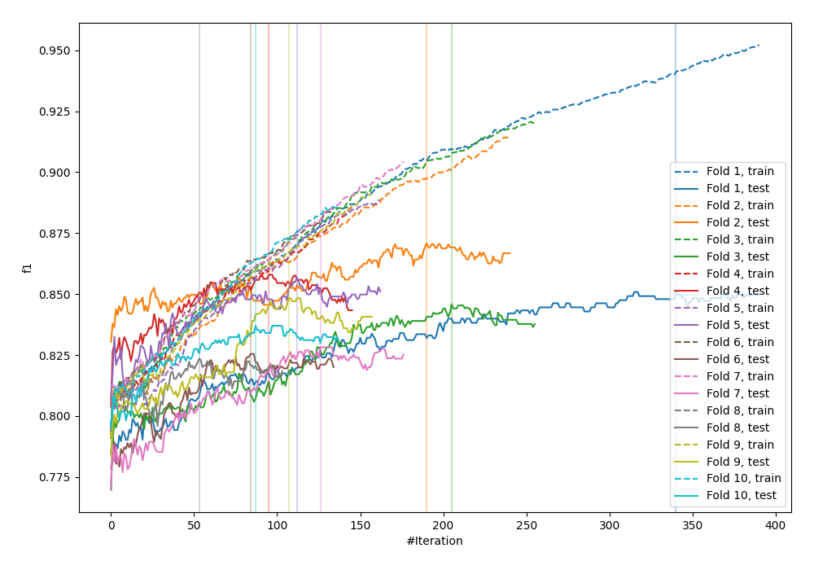
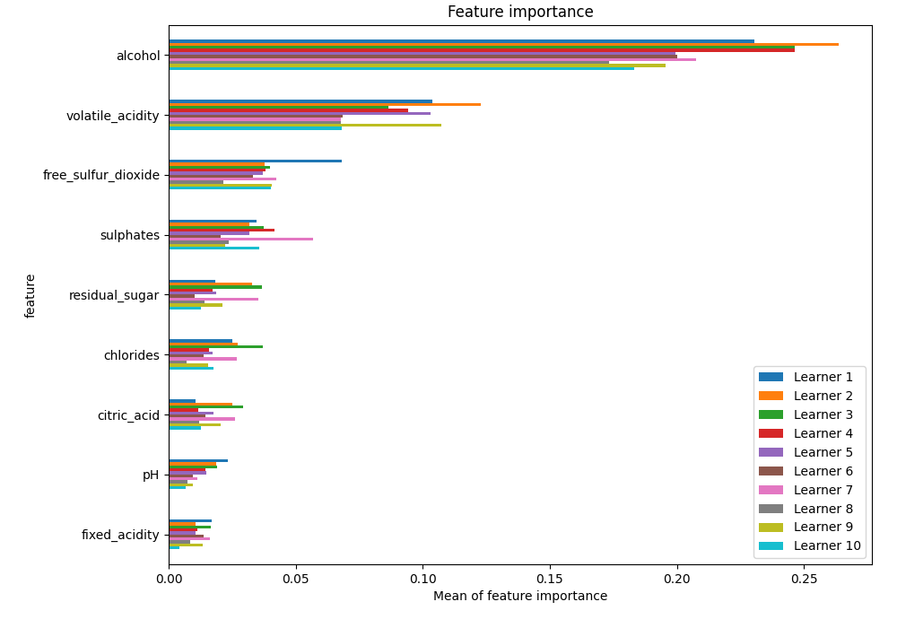
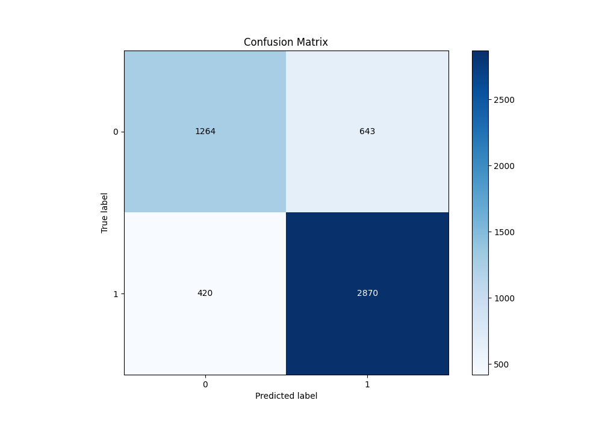
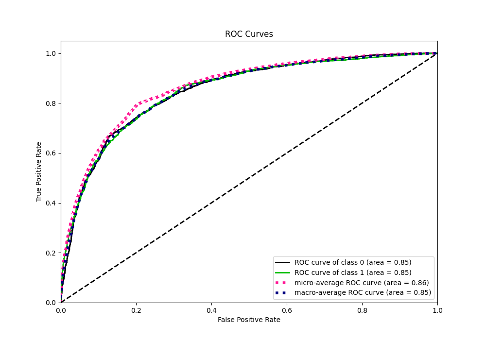
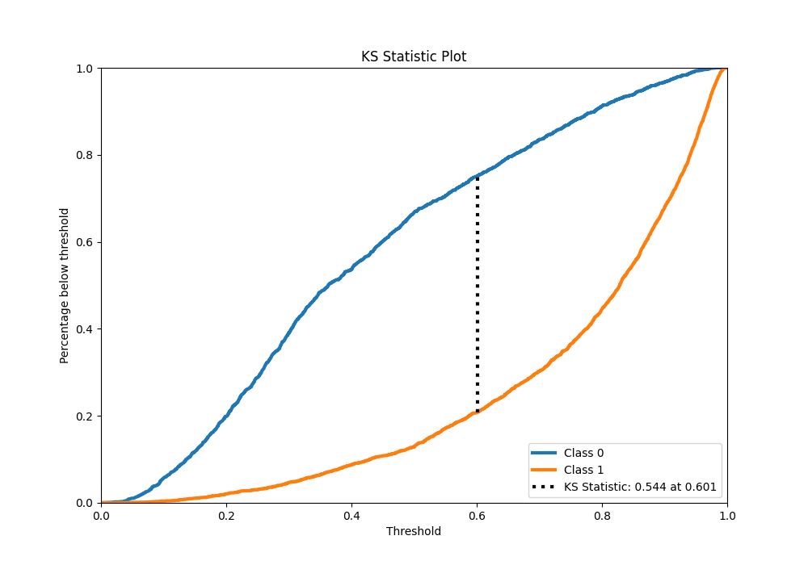
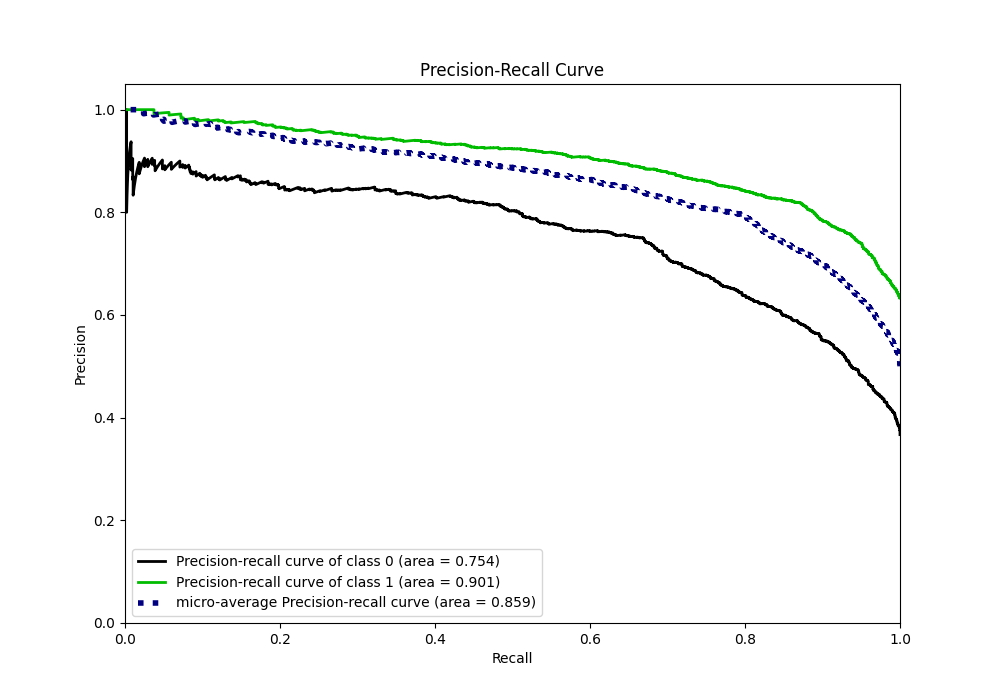
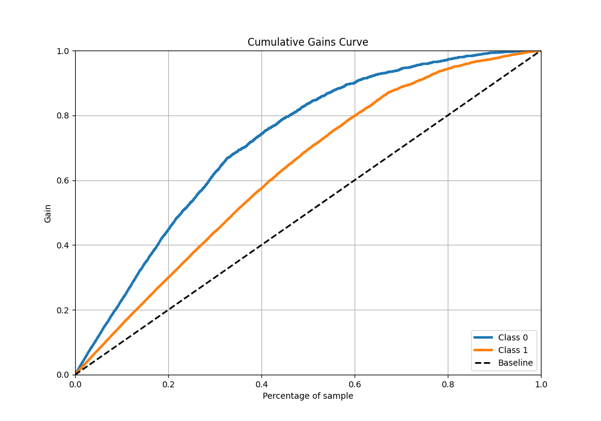
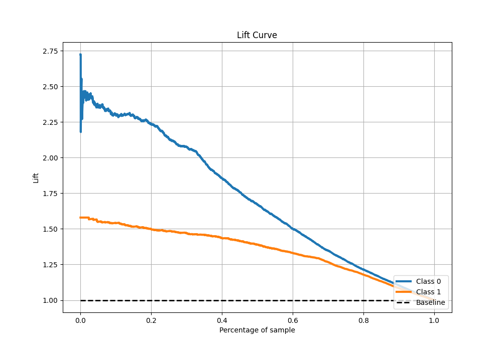

# Summary of 4_Default_CatBoost

[<< Go back](../README.md)

## CatBoost
- **n_jobs**: -1
- **learning_rate**: 0.1
- **depth**: 6
- **rsm**: 1
- **loss_function**: Logloss
- **eval_metric**: F1
- **explain_level**: 1

## Validation
 - **validation_type**: kfold
 - **k_folds**: 10
 - **shuffle**: True
 - **stratify**: True
 - **random_seed**: 12

## Optimized metric
f1

## Training time

9.9 seconds

## Metric details
|           |    score |    threshold |
|:----------|---------:|-------------:|
| logloss   | 0.463086 | nan          |
| auc       | 0.848703 | nan          |
| f1        | 0.843745 |   0.497244   |
| accuracy  | 0.795459 |   0.497244   |
| precision | 0.993197 |   0.97915    |
| recall    | 1        |   0.00957049 |
| mcc       | 0.551122 |   0.497244   |

## Metric details with threshold from accuracy metric
|           |    score |   threshold |
|:----------|---------:|------------:|
| logloss   | 0.463086 |  nan        |
| auc       | 0.848703 |  nan        |
| f1        | 0.843745 |    0.497244 |
| accuracy  | 0.795459 |    0.497244 |
| precision | 0.816966 |    0.497244 |
| recall    | 0.87234  |    0.497244 |
| mcc       | 0.551122 |    0.497244 |

## Confusion matrix (at threshold=0.497244)
|              |   Predicted as 0 |   Predicted as 1 |
|:-------------|-----------------:|-----------------:|
| Labeled as 0 |             1264 |              643 |
| Labeled as 1 |              420 |             2870 |

## Learning curves

## Permutation-based Importance

## Confusion Matrix

## Normalized Confusion Matrix

## ROC Curve

## Kolmogorov-Smirnov Statistic

## Precision-Recall Curve

## Calibration Curve

## Cumulative Gains Curve

## Lift Curve

[<< Go back](../README.md)
