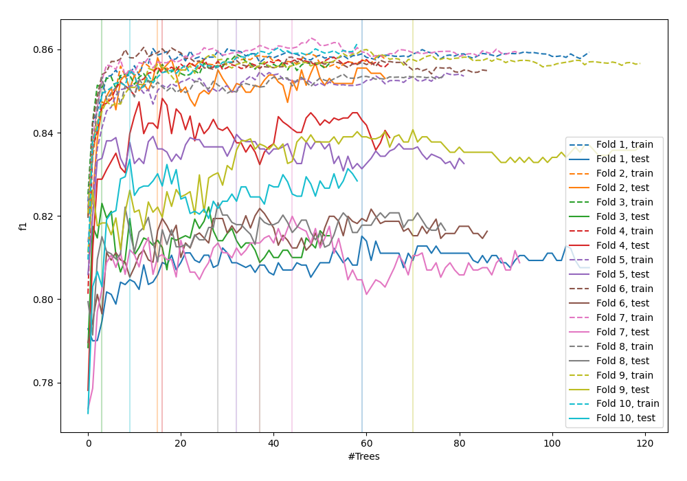
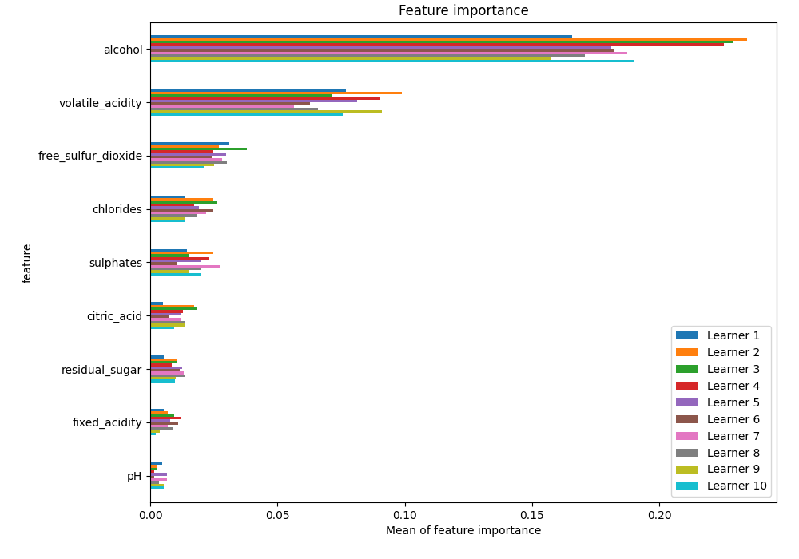
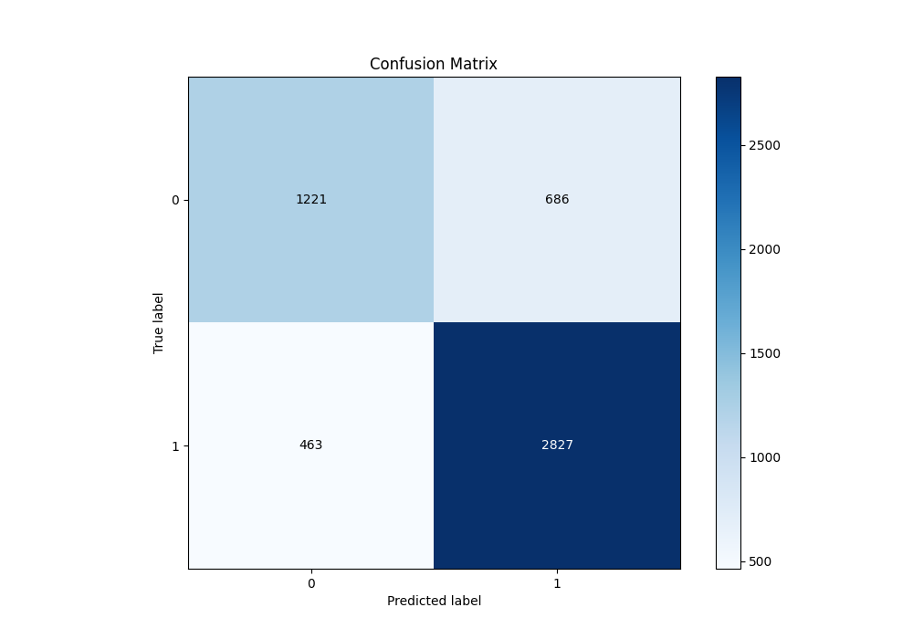
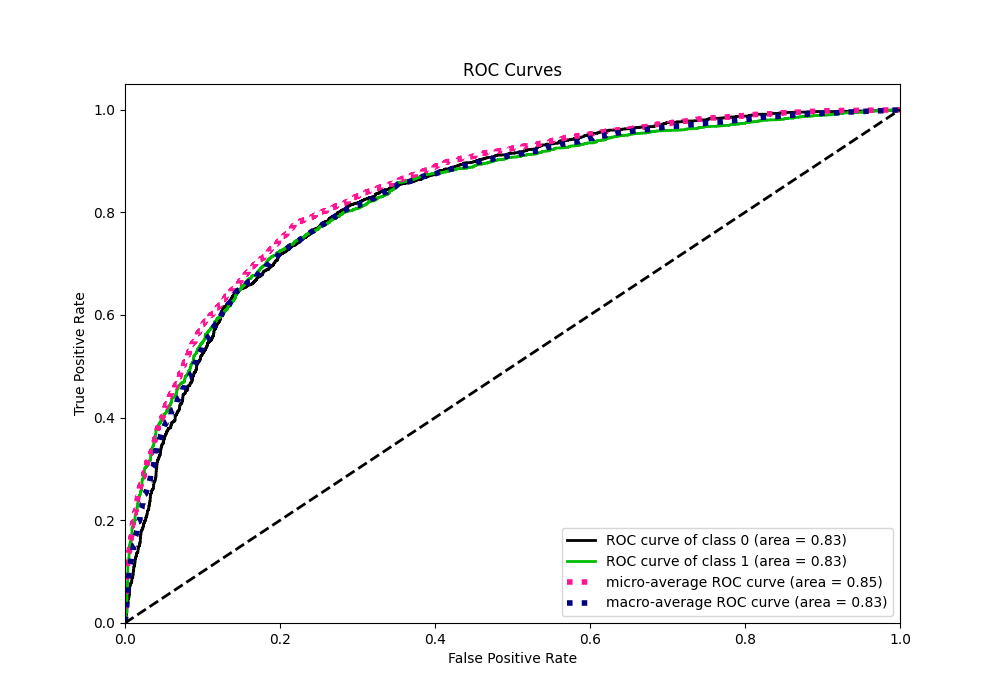
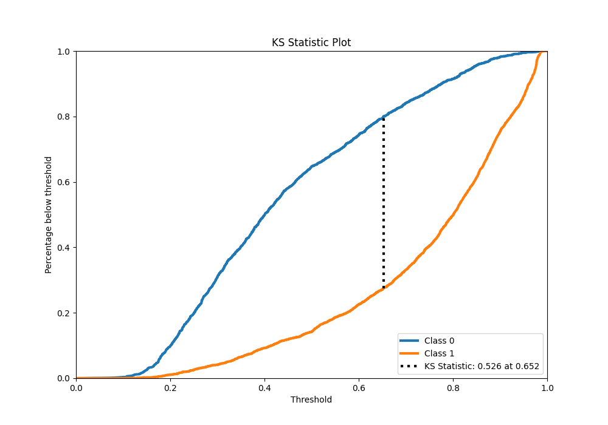
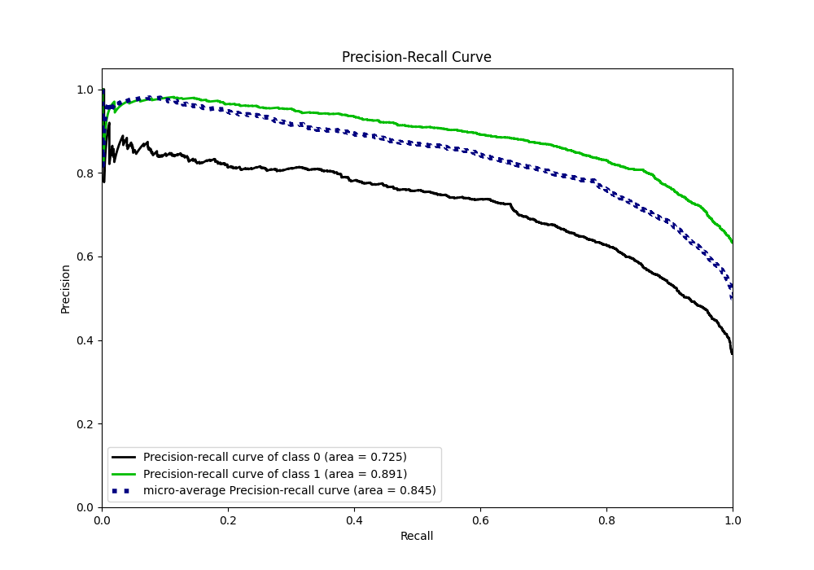
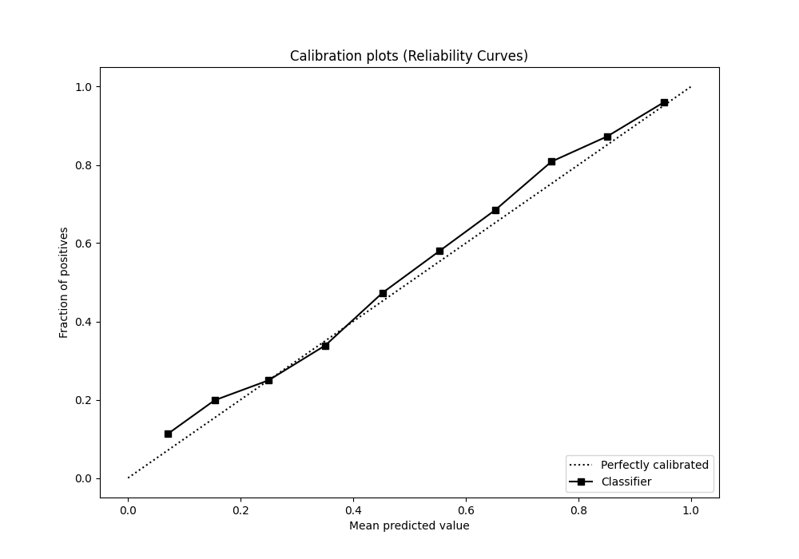
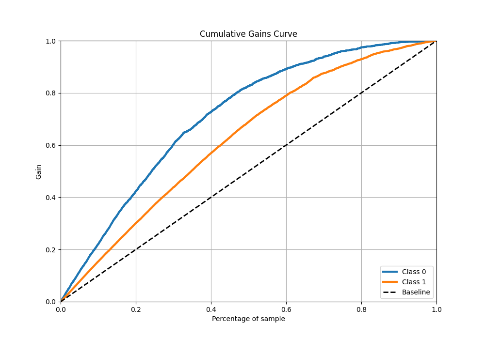
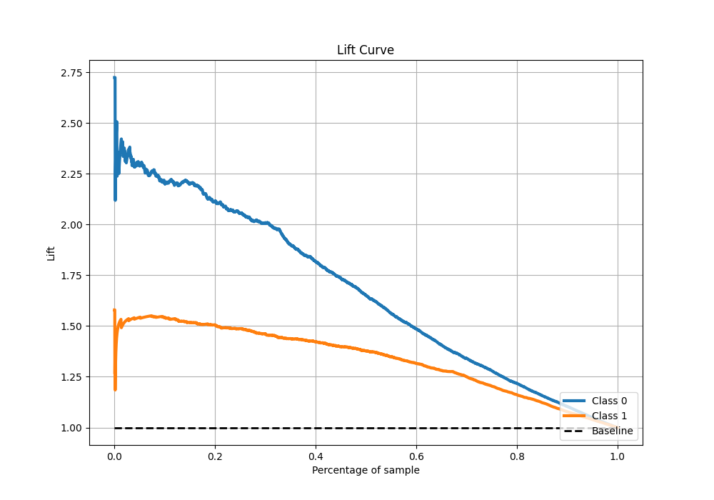

# Summary of 50_RandomForest

[<< Go back](../README.md)

## Random Forest
- **n_jobs**: -1
- **criterion**: gini
- **max_features**: 0.6
- **min_samples_split**: 30
- **max_depth**: 7
- **eval_metric_name**: f1
- **explain_level**: 1

## Validation
 - **validation_type**: kfold
 - **k_folds**: 10
 - **shuffle**: True
 - **stratify**: True
 - **random_seed**: 12

## Optimized metric
f1

## Training time

14.5 seconds

## Metric details
|           |    score |   threshold |
|:----------|---------:|------------:|
| logloss   | 0.482801 | nan         |
| auc       | 0.833833 | nan         |
| f1        | 0.83244  |   0.472712  |
| accuracy  | 0.778911 |   0.496613  |
| precision | 0.9801   |   0.955783  |
| recall    | 1        |   0.0593821 |
| mcc       | 0.514442 |   0.496613  |

## Metric details with threshold from accuracy metric
|           |    score |   threshold |
|:----------|---------:|------------:|
| logloss   | 0.482801 |  nan        |
| auc       | 0.833833 |  nan        |
| f1        | 0.831104 |    0.496613 |
| accuracy  | 0.778911 |    0.496613 |
| precision | 0.804725 |    0.496613 |
| recall    | 0.859271 |    0.496613 |
| mcc       | 0.514442 |    0.496613 |

## Confusion matrix (at threshold=0.496613)
|              |   Predicted as 0 |   Predicted as 1 |
|:-------------|-----------------:|-----------------:|
| Labeled as 0 |             1221 |              686 |
| Labeled as 1 |              463 |             2827 |

## Learning curves

## Permutation-based Importance

## Confusion Matrix

## Normalized Confusion Matrix

## ROC Curve

## Kolmogorov-Smirnov Statistic

## Precision-Recall Curve

## Calibration Curve

## Cumulative Gains Curve

## Lift Curve

[<< Go back](../README.md)
