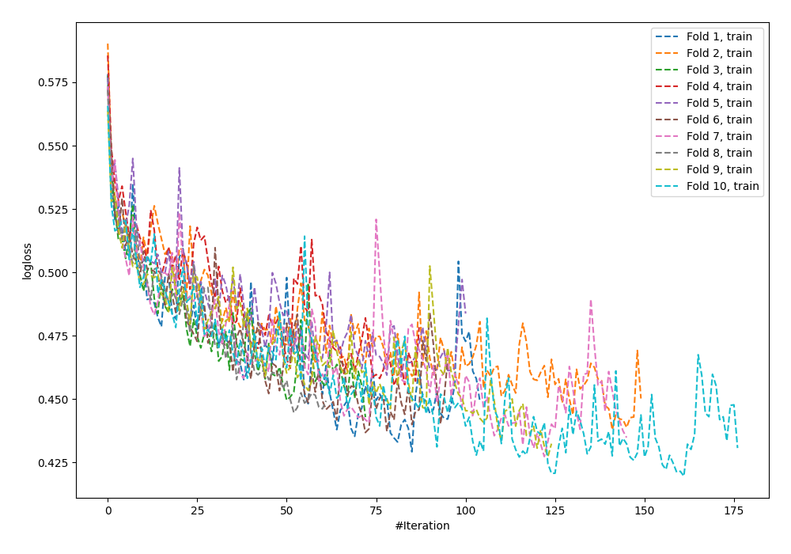
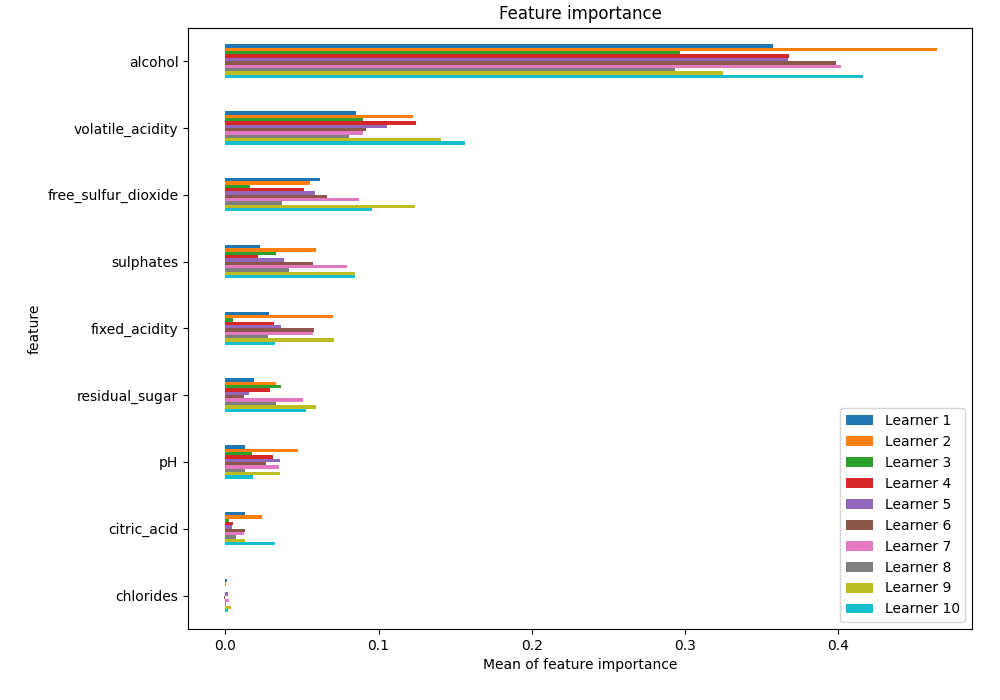
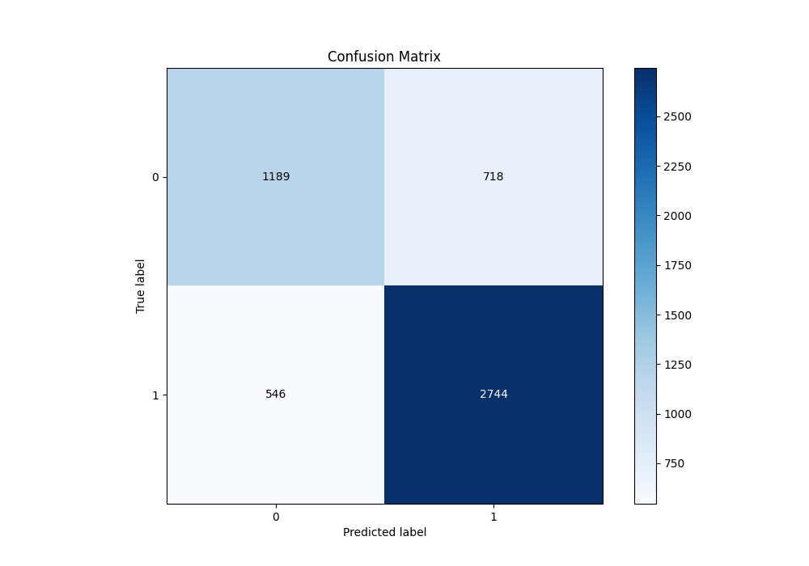
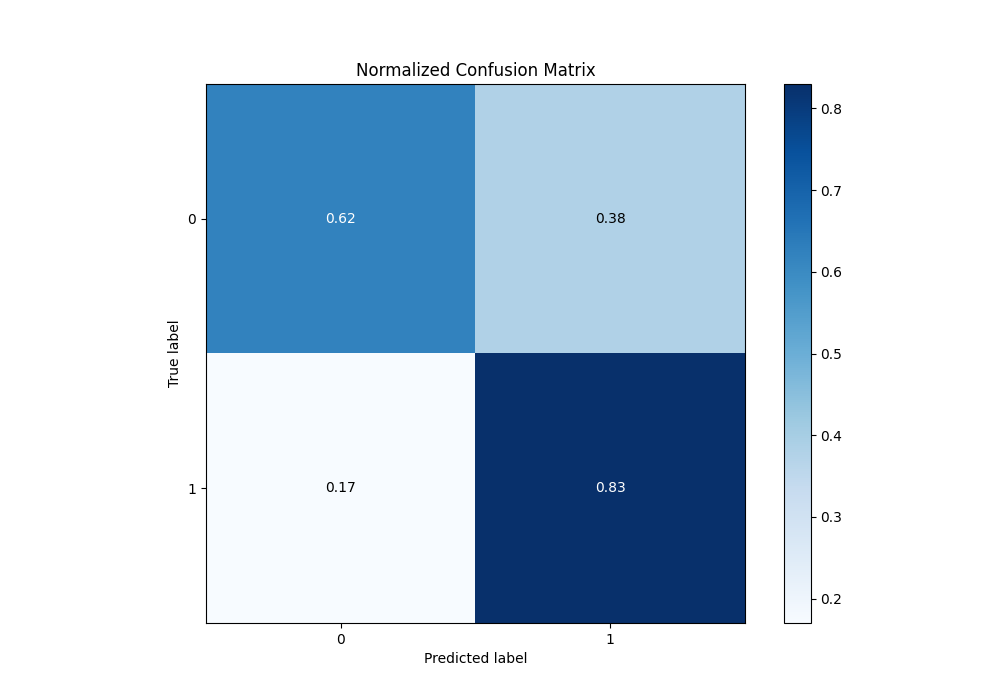
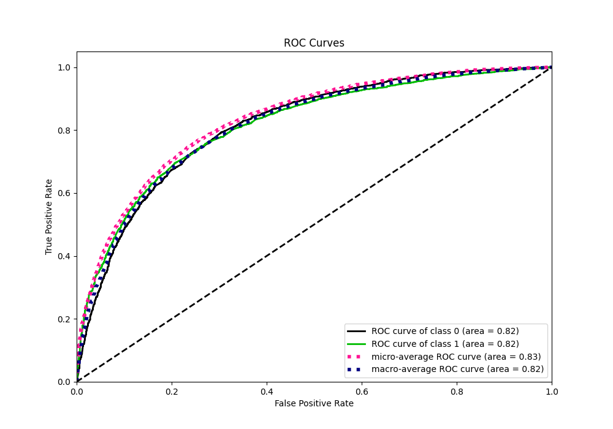
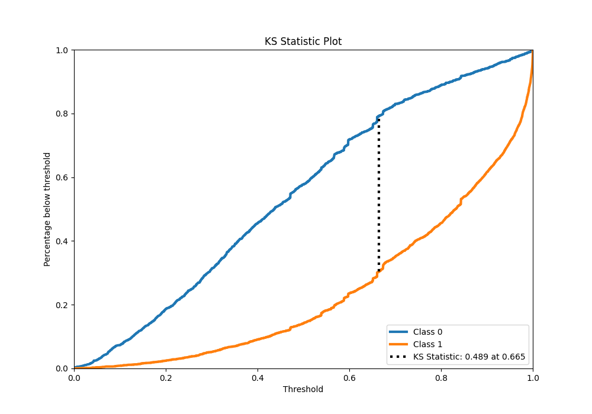
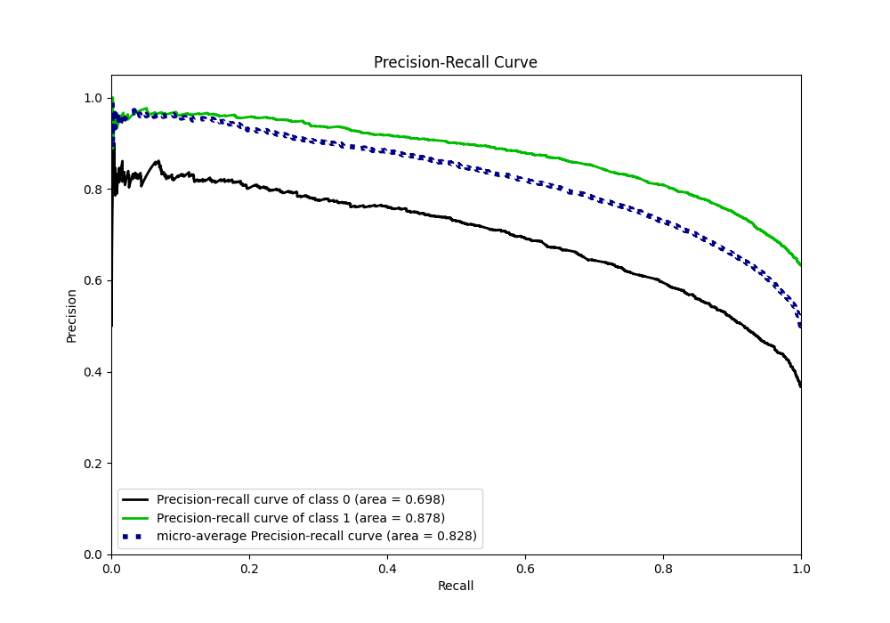
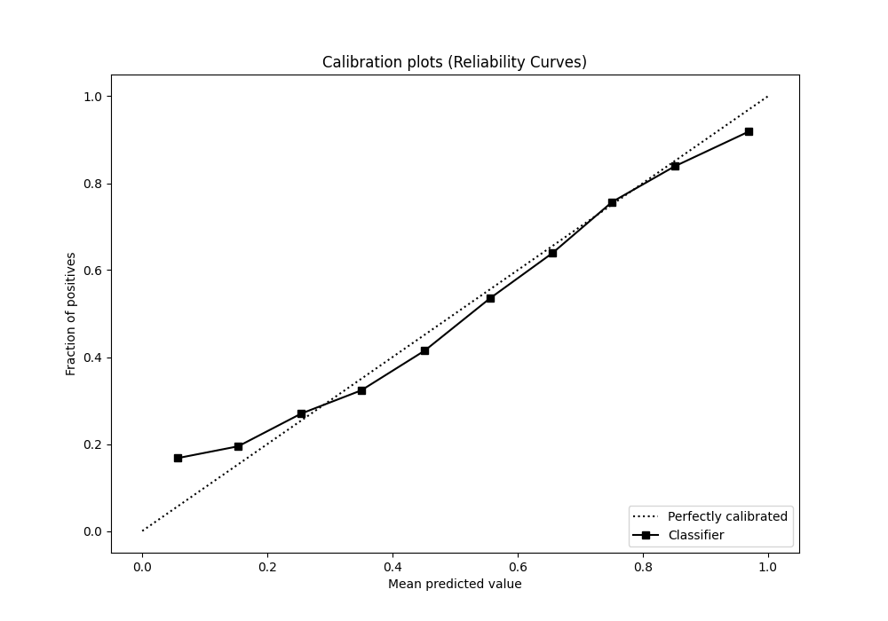
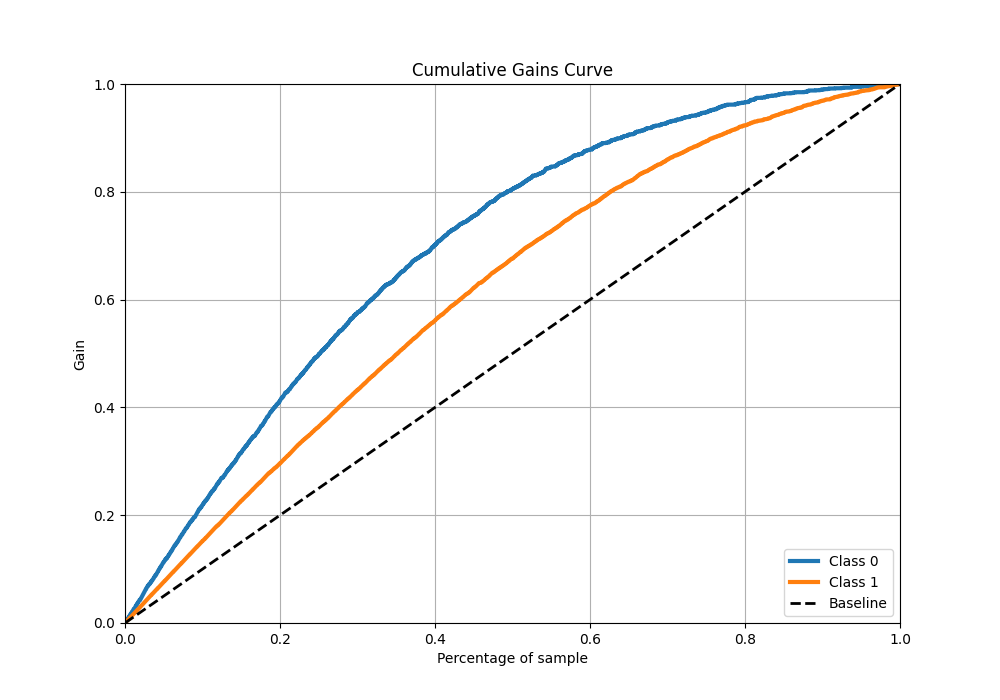
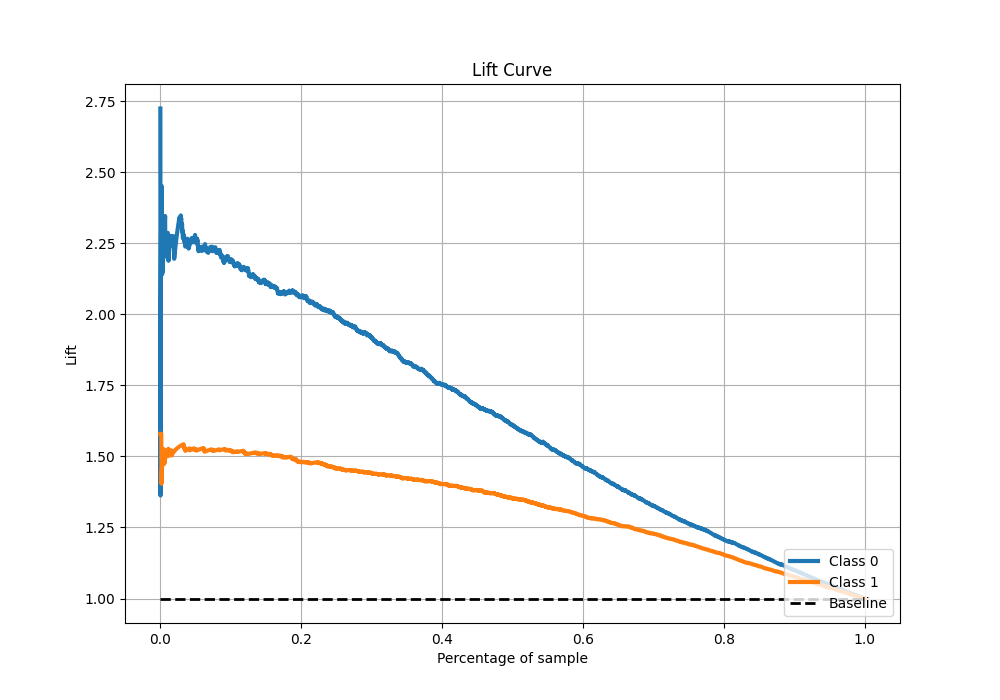

# Summary of 5_Default_NeuralNetwork

[<< Go back](../README.md)

## Neural Network
- **n_jobs**: -1
- **dense_1_size**: 32
- **dense_2_size**: 16
- **learning_rate**: 0.05
- **explain_level**: 1

## Validation
 - **validation_type**: kfold
 - **k_folds**: 10
 - **shuffle**: True
 - **stratify**: True
 - **random_seed**: 12

## Optimized metric
f1

## Training time

11.8 seconds

## Metric details
|           |    score |   threshold |
|:----------|---------:|------------:|
| logloss   | 0.522741 | nan         |
| auc       | 0.815113 | nan         |
| f1        | 0.818749 |   0.429218  |
| accuracy  | 0.756783 |   0.538077  |
| precision | 0.972789 |   0.999233  |
| recall    | 1        |   7.775e-06 |
| mcc       | 0.473618 |   0.614949  |

## Metric details with threshold from accuracy metric
|           |    score |   threshold |
|:----------|---------:|------------:|
| logloss   | 0.522741 |  nan        |
| auc       | 0.815113 |  nan        |
| f1        | 0.812796 |    0.538077 |
| accuracy  | 0.756783 |    0.538077 |
| precision | 0.792605 |    0.538077 |
| recall    | 0.834043 |    0.538077 |
| mcc       | 0.467611 |    0.538077 |

## Confusion matrix (at threshold=0.538077)
|              |   Predicted as 0 |   Predicted as 1 |
|:-------------|-----------------:|-----------------:|
| Labeled as 0 |             1189 |              718 |
| Labeled as 1 |              546 |             2744 |

## Learning curves

## Permutation-based Importance

## Confusion Matrix

## Normalized Confusion Matrix

## ROC Curve

## Kolmogorov-Smirnov Statistic

## Precision-Recall Curve

## Calibration Curve

## Cumulative Gains Curve

## Lift Curve

[<< Go back](../README.md)
