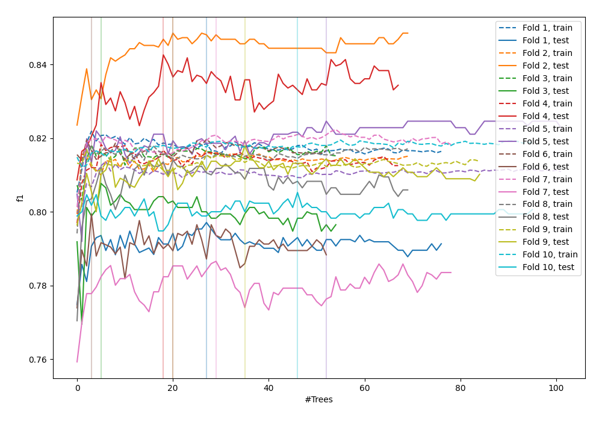
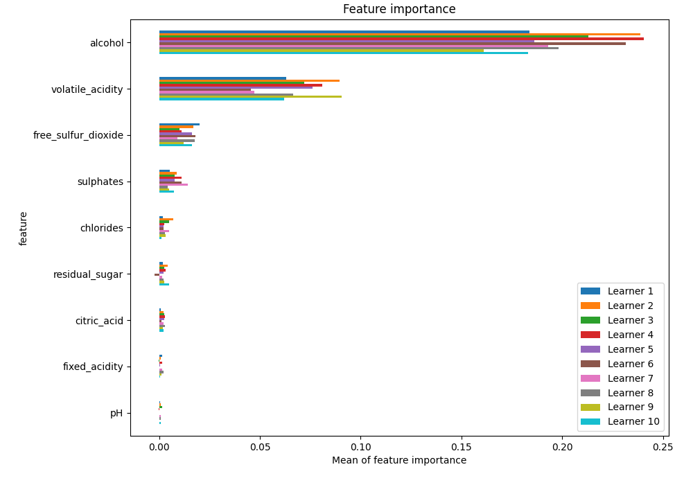
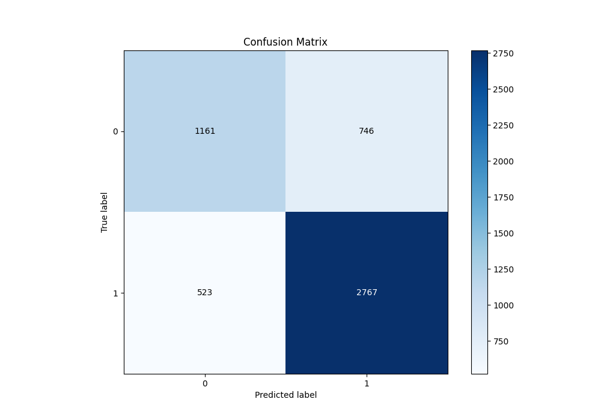
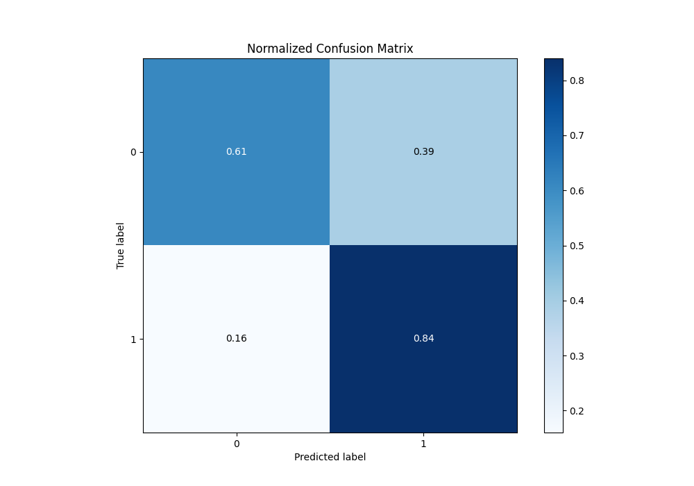
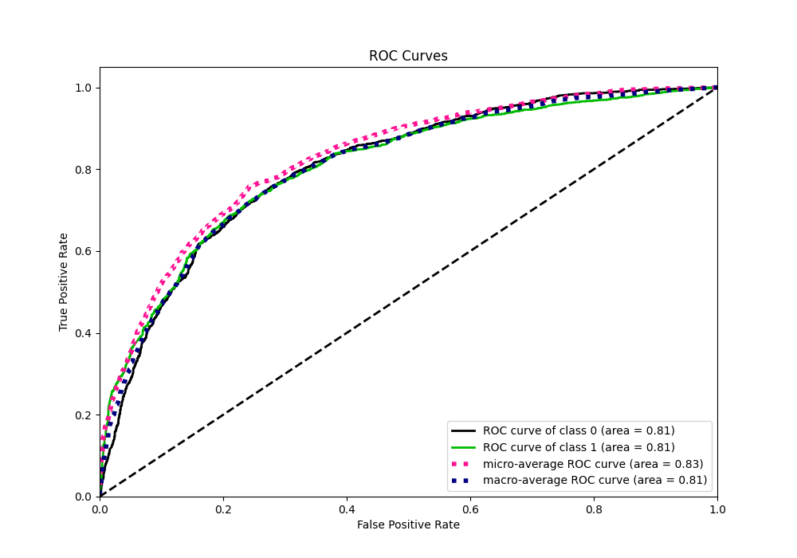
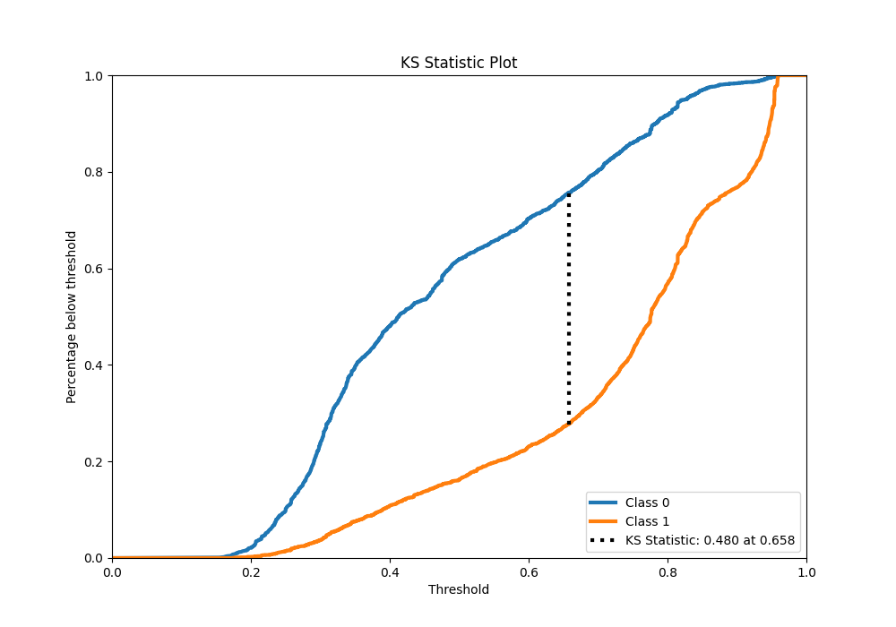
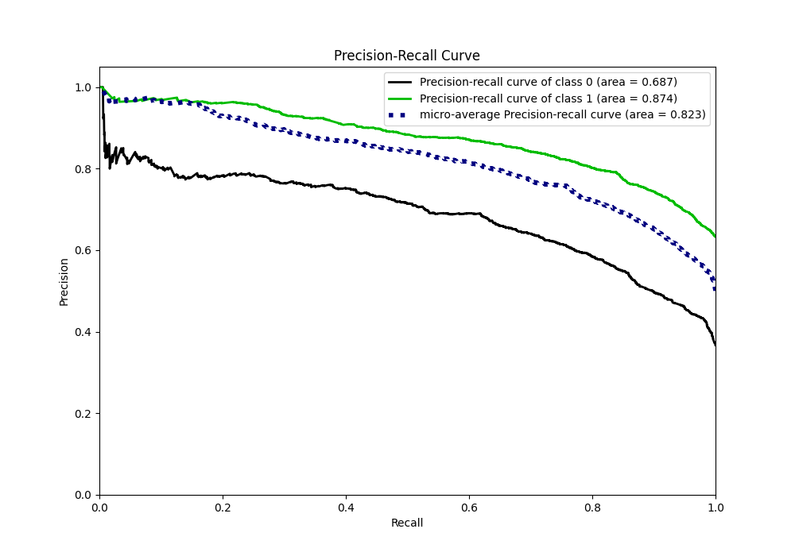
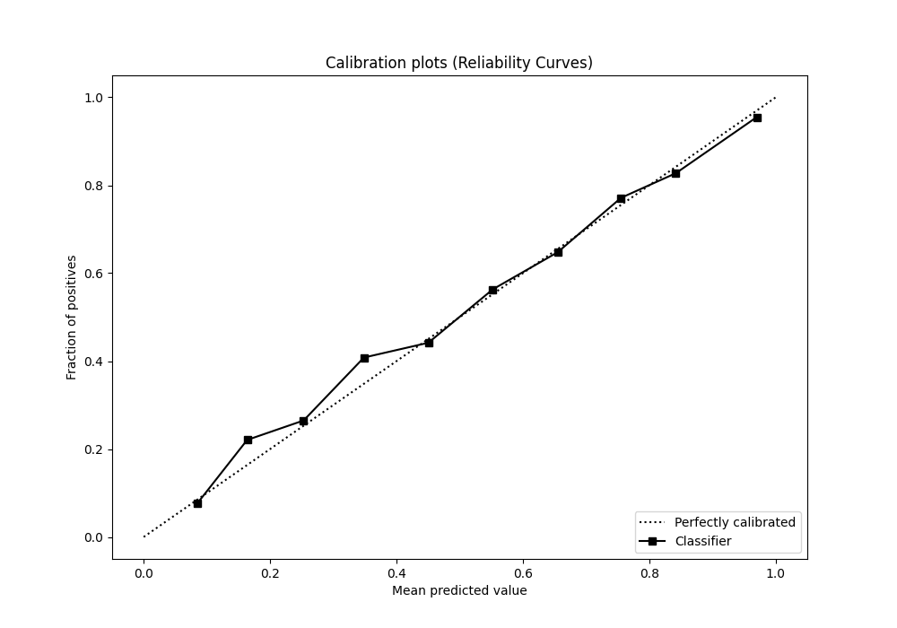
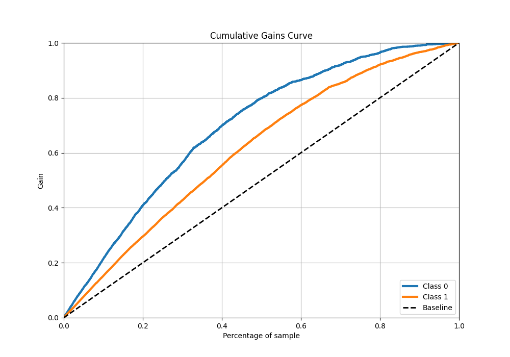
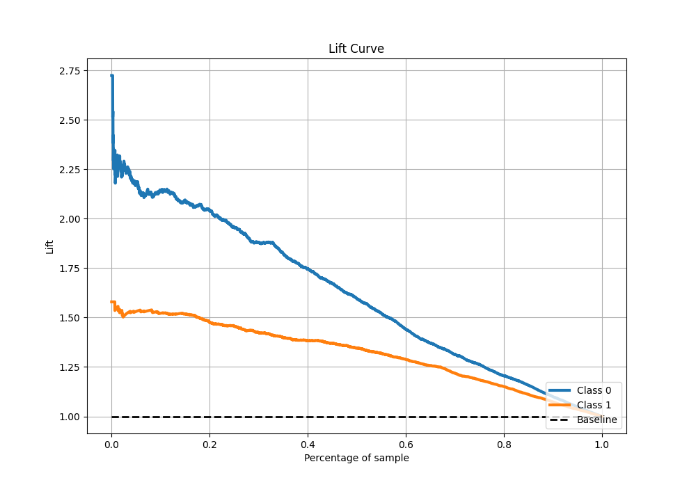

# Summary of 6_Default_RandomForest

[<< Go back](../README.md)

## Random Forest
- **n_jobs**: -1
- **criterion**: gini
- **max_features**: 0.9
- **min_samples_split**: 30
- **max_depth**: 4
- **eval_metric_name**: f1
- **explain_level**: 1

## Validation
 - **validation_type**: kfold
 - **k_folds**: 10
 - **shuffle**: True
 - **stratify**: True
 - **random_seed**: 12

## Optimized metric
f1

## Training time

11.2 seconds

## Metric details
|           |    score |   threshold |
|:----------|---------:|------------:|
| logloss   | 0.510995 | nan         |
| auc       | 0.807148 | nan         |
| f1        | 0.814376 |   0.390289  |
| accuracy  | 0.755821 |   0.490791  |
| precision | 0.973064 |   0.949288  |
| recall    | 1        |   0.0769737 |
| mcc       | 0.466049 |   0.61277   |

## Metric details with threshold from accuracy metric
|           |    score |   threshold |
|:----------|---------:|------------:|
| logloss   | 0.510995 |  nan        |
| auc       | 0.807148 |  nan        |
| f1        | 0.813465 |    0.490791 |
| accuracy  | 0.755821 |    0.490791 |
| precision | 0.787646 |    0.490791 |
| recall    | 0.841033 |    0.490791 |
| mcc       | 0.463259 |    0.490791 |

## Confusion matrix (at threshold=0.490791)
|              |   Predicted as 0 |   Predicted as 1 |
|:-------------|-----------------:|-----------------:|
| Labeled as 0 |             1161 |              746 |
| Labeled as 1 |              523 |             2767 |

## Learning curves

## Permutation-based Importance

## Confusion Matrix

## Normalized Confusion Matrix

## ROC Curve

## Kolmogorov-Smirnov Statistic

## Precision-Recall Curve

## Calibration Curve

## Cumulative Gains Curve

## Lift Curve

[<< Go back](../README.md)
