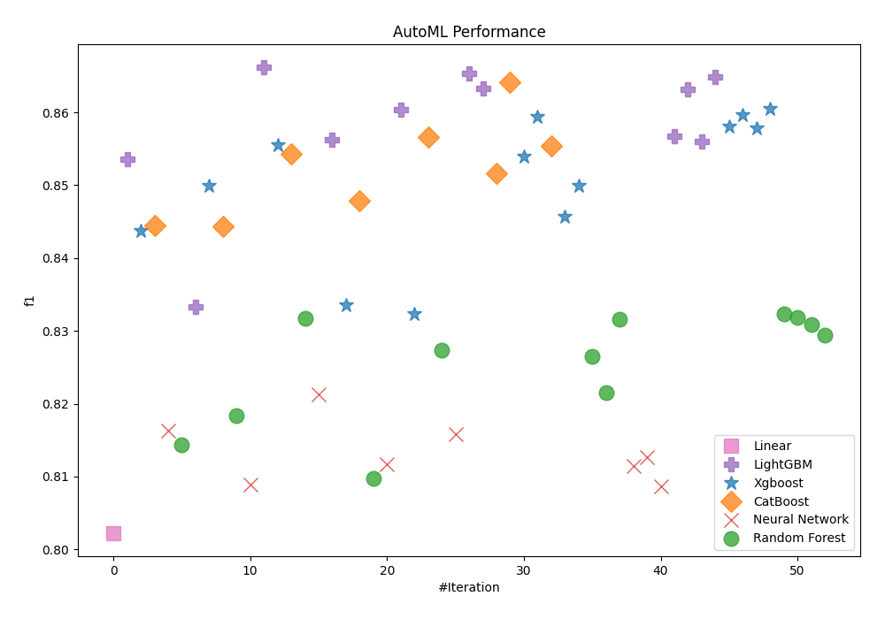
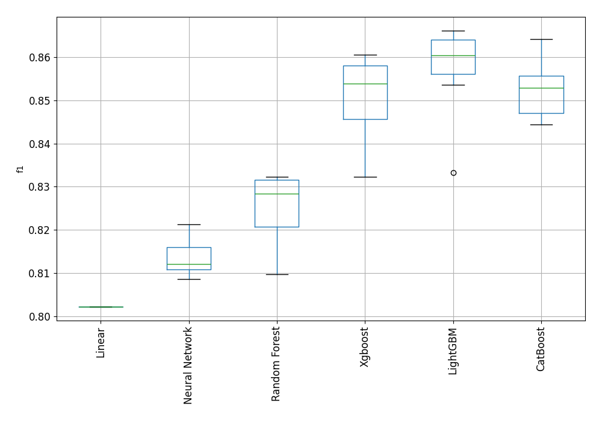

# AutoML Leaderboard

| Best model   | name                                                         | model_type     | metric_type   |   metric_value |   train_time |   single_prediction_time |
|:-------------|:-------------------------------------------------------------|:---------------|:--------------|---------------:|-------------:|-------------------------:|
|              | [1_Linear](1_Linear/README.md)                               | Linear         | f1            |       0.80226  |        12.68 |                   0.0255 |
|              | [2_Default_LightGBM](2_Default_LightGBM/README.md)           | LightGBM       | f1            |       0.853524 |        24.18 |                   0.0088 |
|              | [3_Default_Xgboost](3_Default_Xgboost/README.md)             | Xgboost        | f1            |       0.843704 |        13.98 |                   0.0125 |
|              | [4_Default_CatBoost](4_Default_CatBoost/README.md)           | CatBoost       | f1            |       0.844523 |        10.69 |                   0.0121 |
|              | [5_Default_NeuralNetwork](5_Default_NeuralNetwork/README.md) | Neural Network | f1            |       0.816356 |        12.48 |                   0.0284 |
|              | [6_Default_RandomForest](6_Default_RandomForest/README.md)   | Random Forest  | f1            |       0.814345 |        11.97 |                   0.1542 |
|              | [11_LightGBM](11_LightGBM/README.md)                         | LightGBM       | f1            |       0.833333 |        14.71 |                   0.0098 |
|              | [7_Xgboost](7_Xgboost/README.md)                             | Xgboost        | f1            |       0.849889 |        15.43 |                   0.0119 |
|              | [15_CatBoost](15_CatBoost/README.md)                         | CatBoost       | f1            |       0.844373 |        12.2  |                   0.0097 |
|              | [19_RandomForest](19_RandomForest/README.md)                 | Random Forest  | f1            |       0.818379 |        11.47 |                   0.1517 |
|              | [23_NeuralNetwork](23_NeuralNetwork/README.md)               | Neural Network | f1            |       0.808881 |        11.34 |                   0.0262 |
| **the best** | [12_LightGBM](12_LightGBM/README.md)                         | LightGBM       | f1            |       0.866153 |        23.99 |                   0.0092 |
|              | [8_Xgboost](8_Xgboost/README.md)                             | Xgboost        | f1            |       0.8555   |        14.4  |                   0.0106 |
|              | [16_CatBoost](16_CatBoost/README.md)                         | CatBoost       | f1            |       0.854317 |        12.74 |                   0.0098 |
|              | [20_RandomForest](20_RandomForest/README.md)                 | Random Forest  | f1            |       0.831712 |        12.26 |                   0.1494 |
|              | [24_NeuralNetwork](24_NeuralNetwork/README.md)               | Neural Network | f1            |       0.821296 |        17.3  |                   0.0255 |
|              | [13_LightGBM](13_LightGBM/README.md)                         | LightGBM       | f1            |       0.85625  |        33.41 |                   0.0095 |
|              | [9_Xgboost](9_Xgboost/README.md)                             | Xgboost        | f1            |       0.833524 |        12.43 |                   0.0096 |
|              | [17_CatBoost](17_CatBoost/README.md)                         | CatBoost       | f1            |       0.847868 |        12.79 |                   0.0109 |
|              | [21_RandomForest](21_RandomForest/README.md)                 | Random Forest  | f1            |       0.809717 |        12.45 |                   0.1506 |
|              | [25_NeuralNetwork](25_NeuralNetwork/README.md)               | Neural Network | f1            |       0.811706 |        24.7  |                   0.0252 |
|              | [14_LightGBM](14_LightGBM/README.md)                         | LightGBM       | f1            |       0.860393 |        39.45 |                   0.0108 |
|              | [10_Xgboost](10_Xgboost/README.md)                           | Xgboost        | f1            |       0.832319 |        13.37 |                   0.0117 |
|              | [18_CatBoost](18_CatBoost/README.md)                         | CatBoost       | f1            |       0.856553 |        12.82 |                   0.0099 |
|              | [22_RandomForest](22_RandomForest/README.md)                 | Random Forest  | f1            |       0.827333 |        14.11 |                   0.1529 |
|              | [26_NeuralNetwork](26_NeuralNetwork/README.md)               | Neural Network | f1            |       0.815824 |        16.23 |                   0.0261 |
|              | [27_LightGBM](27_LightGBM/README.md)                         | LightGBM       | f1            |       0.865356 |        31.06 |                   0.0093 |
|              | [28_LightGBM](28_LightGBM/README.md)                         | LightGBM       | f1            |       0.863256 |        32.55 |                   0.0102 |
|              | [29_CatBoost](29_CatBoost/README.md)                         | CatBoost       | f1            |       0.851579 |        13.13 |                   0.0102 |
|              | [30_CatBoost](30_CatBoost/README.md)                         | CatBoost       | f1            |       0.864154 |        14.63 |                   0.0096 |
|              | [31_Xgboost](31_Xgboost/README.md)                           | Xgboost        | f1            |       0.853913 |        18.48 |                   0.0121 |
|              | [32_Xgboost](32_Xgboost/README.md)                           | Xgboost        | f1            |       0.859389 |        18.24 |                   0.0129 |
|              | [33_CatBoost](33_CatBoost/README.md)                         | CatBoost       | f1            |       0.855452 |        15.67 |                   0.0104 |
|              | [34_Xgboost](34_Xgboost/README.md)                           | Xgboost        | f1            |       0.845703 |        17.09 |                   0.0117 |
|              | [35_Xgboost](35_Xgboost/README.md)                           | Xgboost        | f1            |       0.84997  |        16.55 |                   0.0122 |
|              | [36_RandomForest](36_RandomForest/README.md)                 | Random Forest  | f1            |       0.82651  |        14.53 |                   0.152  |
|              | [37_RandomForest](37_RandomForest/README.md)                 | Random Forest  | f1            |       0.821502 |        13.93 |                   0.1527 |
|              | [38_RandomForest](38_RandomForest/README.md)                 | Random Forest  | f1            |       0.831593 |        14.83 |                   0.1505 |
|              | [39_NeuralNetwork](39_NeuralNetwork/README.md)               | Neural Network | f1            |       0.811473 |        19.04 |                   0.027  |
|              | [40_NeuralNetwork](40_NeuralNetwork/README.md)               | Neural Network | f1            |       0.812603 |        26.34 |                   0.0267 |
|              | [41_NeuralNetwork](41_NeuralNetwork/README.md)               | Neural Network | f1            |       0.808675 |        14.25 |                   0.0253 |
|              | [42_LightGBM](42_LightGBM/README.md)                         | LightGBM       | f1            |       0.856763 |        21.32 |                   0.0099 |
|              | [43_LightGBM](43_LightGBM/README.md)                         | LightGBM       | f1            |       0.863226 |        34.62 |                   0.0095 |
|              | [44_LightGBM](44_LightGBM/README.md)                         | LightGBM       | f1            |       0.855967 |        23.12 |                   0.01   |
|              | [45_LightGBM](45_LightGBM/README.md)                         | LightGBM       | f1            |       0.864849 |        34.92 |                   0.0099 |
|              | [46_Xgboost](46_Xgboost/README.md)                           | Xgboost        | f1            |       0.858023 |        17.42 |                   0.0115 |
|              | [47_Xgboost](47_Xgboost/README.md)                           | Xgboost        | f1            |       0.859647 |        16.76 |                   0.0243 |
|              | [48_Xgboost](48_Xgboost/README.md)                           | Xgboost        | f1            |       0.857815 |        19.06 |                   0.0113 |
|              | [49_Xgboost](49_Xgboost/README.md)                           | Xgboost        | f1            |       0.860548 |        18.62 |                   0.0098 |
|              | [50_RandomForest](50_RandomForest/README.md)                 | Random Forest  | f1            |       0.832302 |        15.3  |                   0.1459 |
|              | [51_RandomForest](51_RandomForest/README.md)                 | Random Forest  | f1            |       0.831838 |        15.98 |                   0.1479 |
|              | [52_RandomForest](52_RandomForest/README.md)                 | Random Forest  | f1            |       0.830823 |        16.16 |                   0.1477 |
|              | [53_RandomForest](53_RandomForest/README.md)                 | Random Forest  | f1            |       0.829433 |        16.2  |                   0.167  |

### AutoML Performance

### AutoML Performance Boxplot
