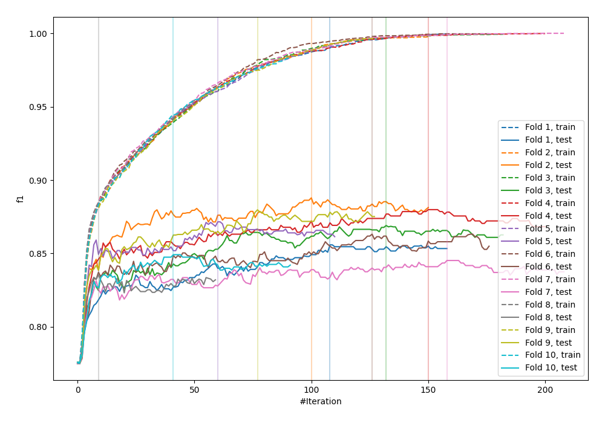

# Summary of 16_LightGBM

[<< Go back](../README.md)

## LightGBM
- **n_jobs**: -1
- **objective**: binary
- **num_leaves**: 63
- **learning_rate**: 0.1
- **feature_fraction**: 0.8
- **bagging_fraction**: 1.0
- **min_data_in_leaf**: 10
- **metric**: custom
- **custom_eval_metric_name**: f1
- **explain_level**: 1

## Validation
 - **validation_type**: kfold
 - **k_folds**: 10
 - **shuffle**: True
 - **stratify**: True
 - **random_seed**: 12

## Optimized metric
f1

## Training time

22.8 seconds

## Metric details
|           |    score |    threshold |
|:----------|---------:|-------------:|
| logloss   | 0.43474  | nan          |
| auc       | 0.872654 | nan          |
| f1        | 0.863448 |   0.499384   |
| accuracy  | 0.82259  |   0.499384   |
| precision | 0.993197 |   0.997673   |
| recall    | 1        |   0.00387056 |
| mcc       | 0.612375 |   0.499384   |

## Metric details with threshold from accuracy metric
|           |    score |   threshold |
|:----------|---------:|------------:|
| logloss   | 0.43474  |  nan        |
| auc       | 0.872654 |  nan        |
| f1        | 0.863448 |    0.499384 |
| accuracy  | 0.82259  |    0.499384 |
| precision | 0.841999 |    0.499384 |
| recall    | 0.886018 |    0.499384 |
| mcc       | 0.612375 |    0.499384 |

## Confusion matrix (at threshold=0.499384)
|              |   Predicted as 0 |   Predicted as 1 |
|:-------------|-----------------:|-----------------:|
| Labeled as 0 |             1360 |              547 |
| Labeled as 1 |              375 |             2915 |

## Learning curves

## Permutation-based Importance

## Confusion Matrix

## Normalized Confusion Matrix

## ROC Curve

## Kolmogorov-Smirnov Statistic

## Precision-Recall Curve

## Calibration Curve

## Cumulative Gains Curve

## Lift Curve

[<< Go back](../README.md)
