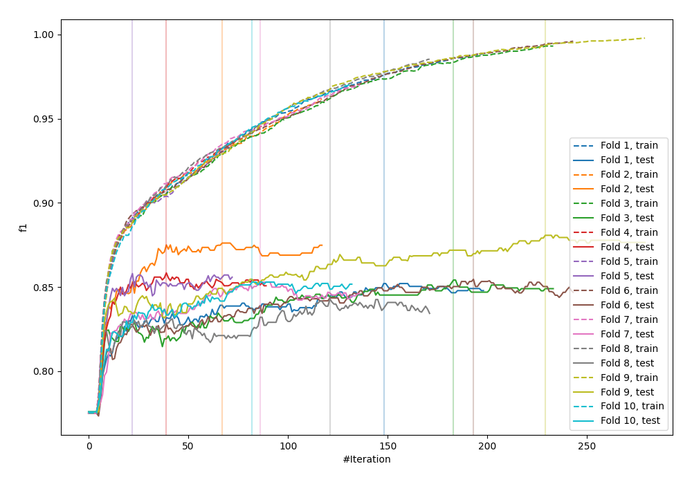
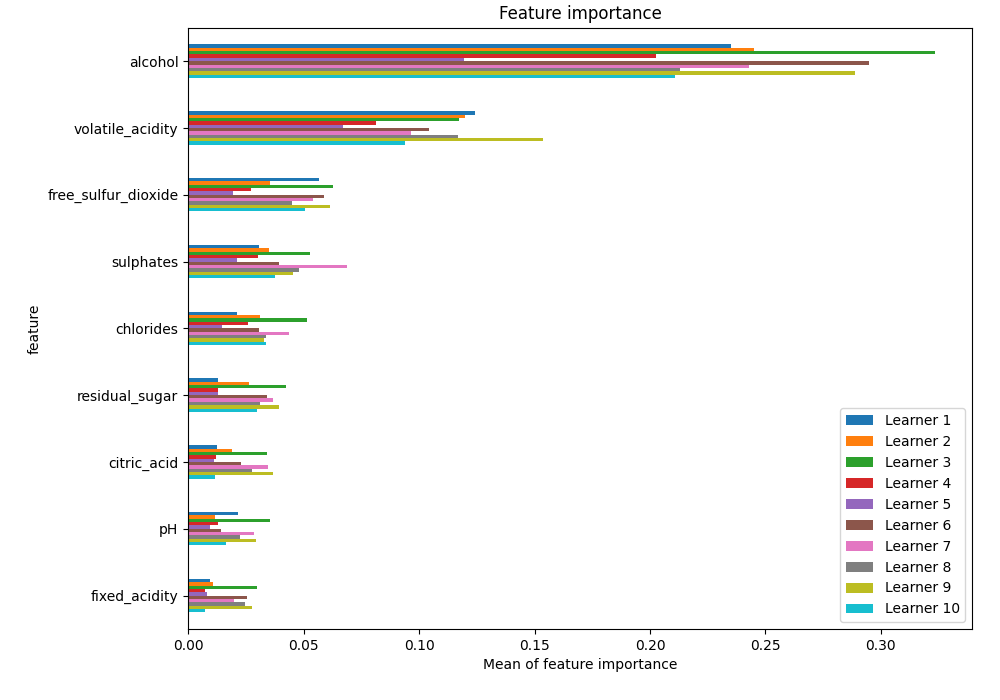
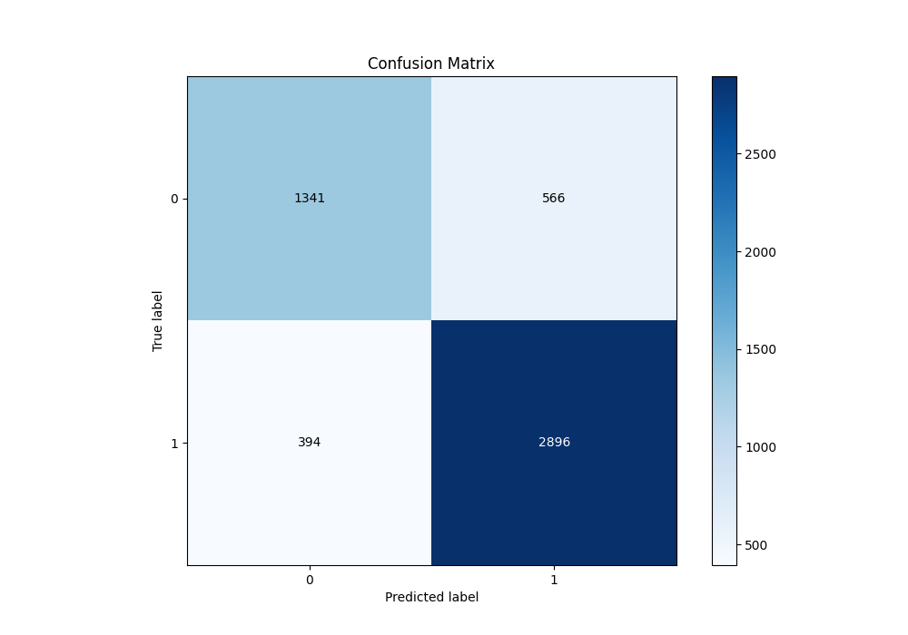
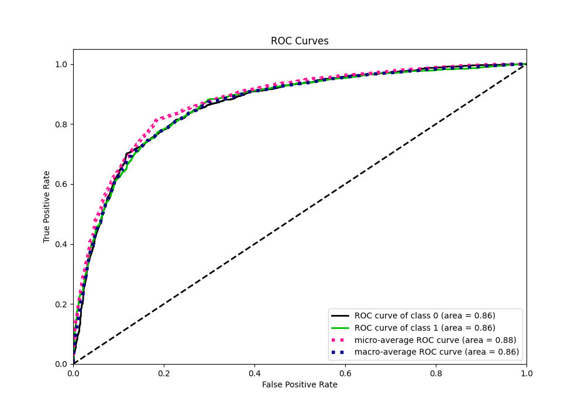
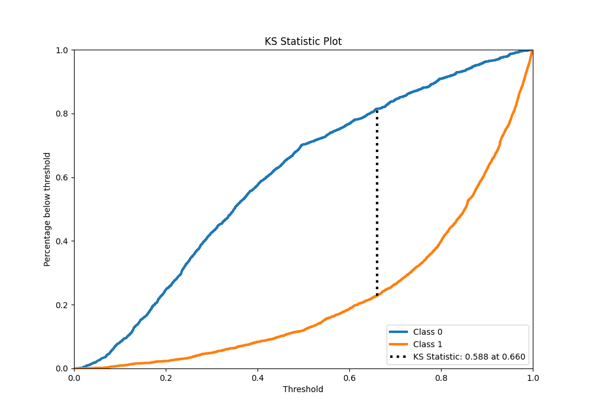
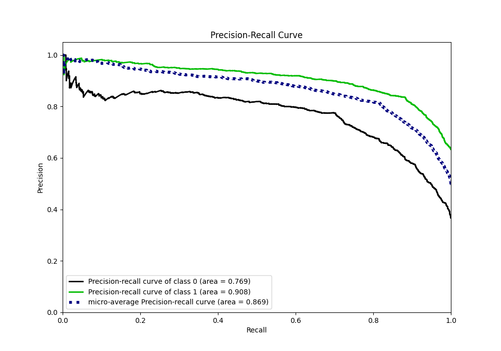
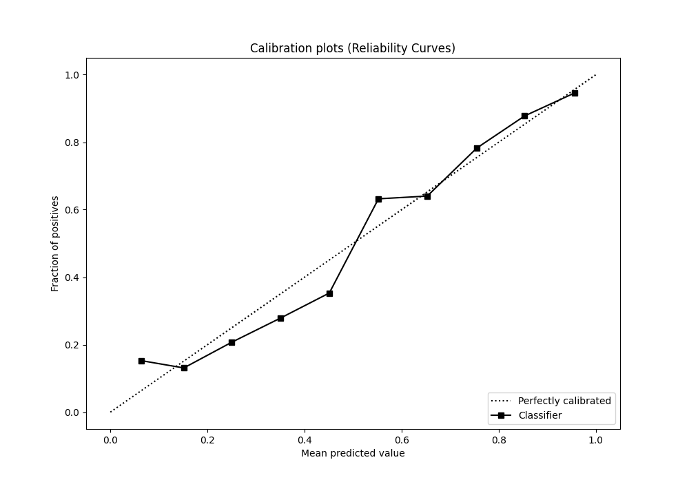
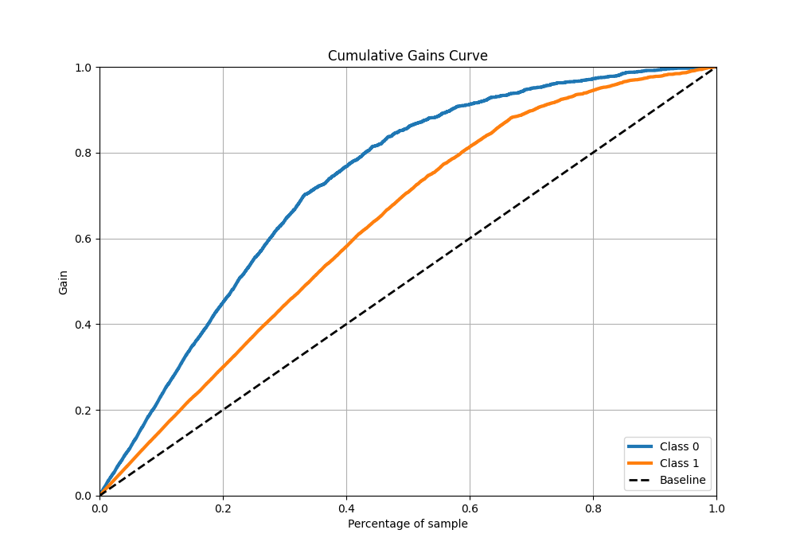
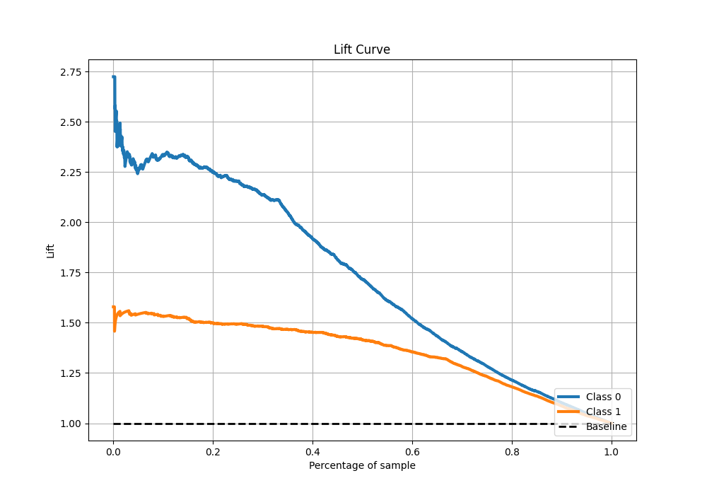

# Summary of 1_Default_LightGBM

[<< Go back](../README.md)

## LightGBM
- **n_jobs**: -1
- **objective**: binary
- **num_leaves**: 63
- **learning_rate**: 0.05
- **feature_fraction**: 0.9
- **bagging_fraction**: 0.9
- **min_data_in_leaf**: 10
- **metric**: custom
- **custom_eval_metric_name**: f1
- **explain_level**: 1

## Validation
 - **validation_type**: kfold
 - **k_folds**: 10
 - **shuffle**: True
 - **stratify**: True
 - **random_seed**: 12

## Optimized metric
f1

## Training time

29.3 seconds

## Metric details
|           |    score |    threshold |
|:----------|---------:|-------------:|
| logloss   | 0.445804 | nan          |
| auc       | 0.86318  | nan          |
| f1        | 0.85782  |   0.501228   |
| accuracy  | 0.815278 |   0.501228   |
| precision | 0.986395 |   0.991538   |
| recall    | 1        |   0.00678289 |
| mcc       | 0.59629  |   0.501228   |

## Metric details with threshold from accuracy metric
|           |    score |   threshold |
|:----------|---------:|------------:|
| logloss   | 0.445804 |  nan        |
| auc       | 0.86318  |  nan        |
| f1        | 0.85782  |    0.501228 |
| accuracy  | 0.815278 |    0.501228 |
| precision | 0.836511 |    0.501228 |
| recall    | 0.880243 |    0.501228 |
| mcc       | 0.59629  |    0.501228 |

## Confusion matrix (at threshold=0.501228)
|              |   Predicted as 0 |   Predicted as 1 |
|:-------------|-----------------:|-----------------:|
| Labeled as 0 |             1341 |              566 |
| Labeled as 1 |              394 |             2896 |

## Learning curves

## Permutation-based Importance

## Confusion Matrix

## Normalized Confusion Matrix

## ROC Curve

## Kolmogorov-Smirnov Statistic

## Precision-Recall Curve

## Calibration Curve

## Cumulative Gains Curve

## Lift Curve

[<< Go back](../README.md)
