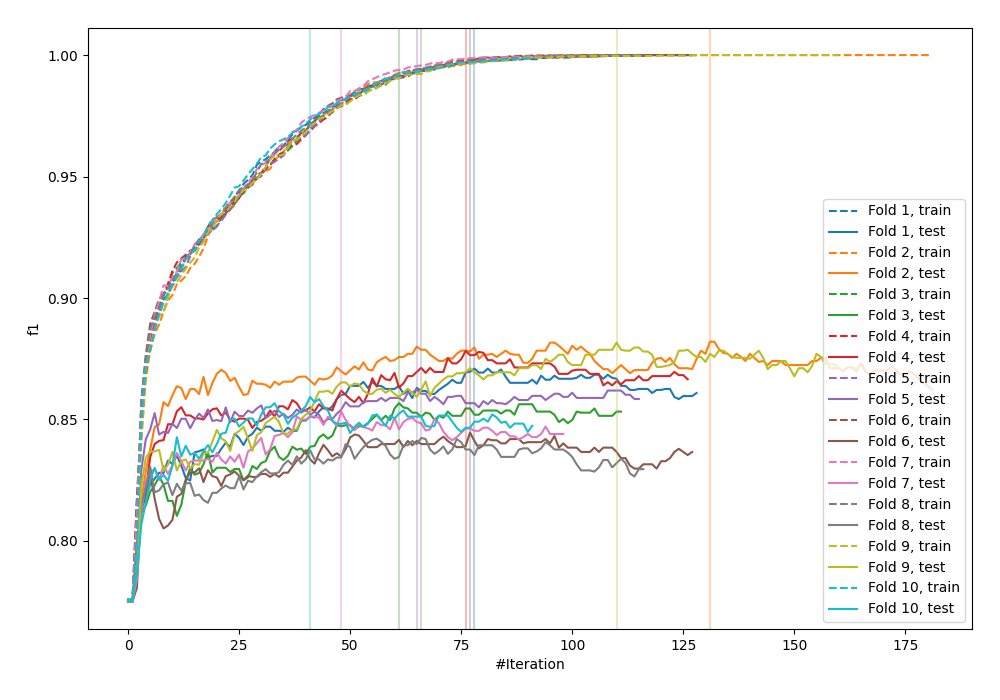
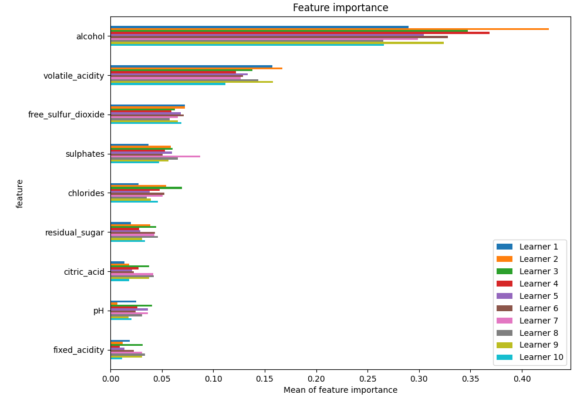
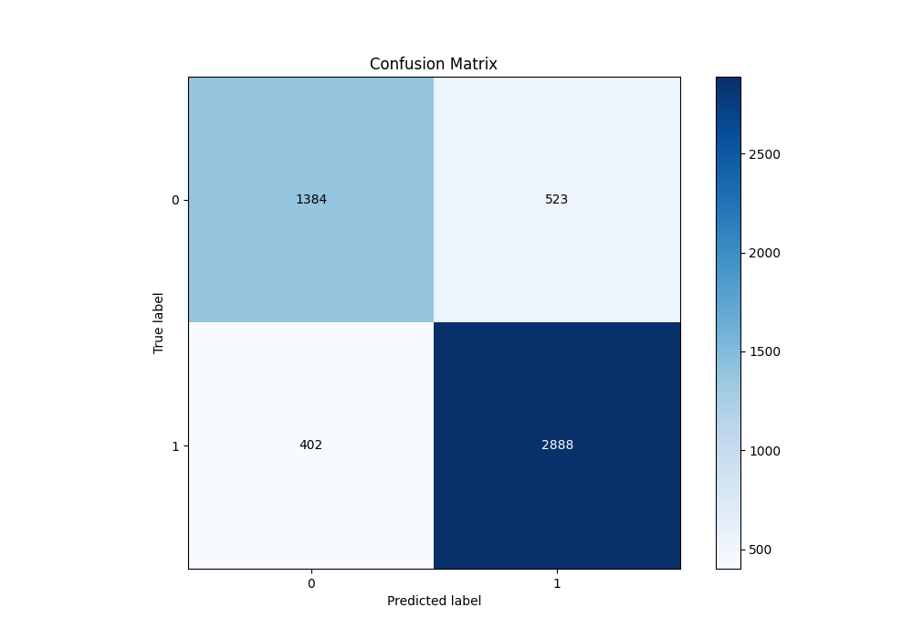
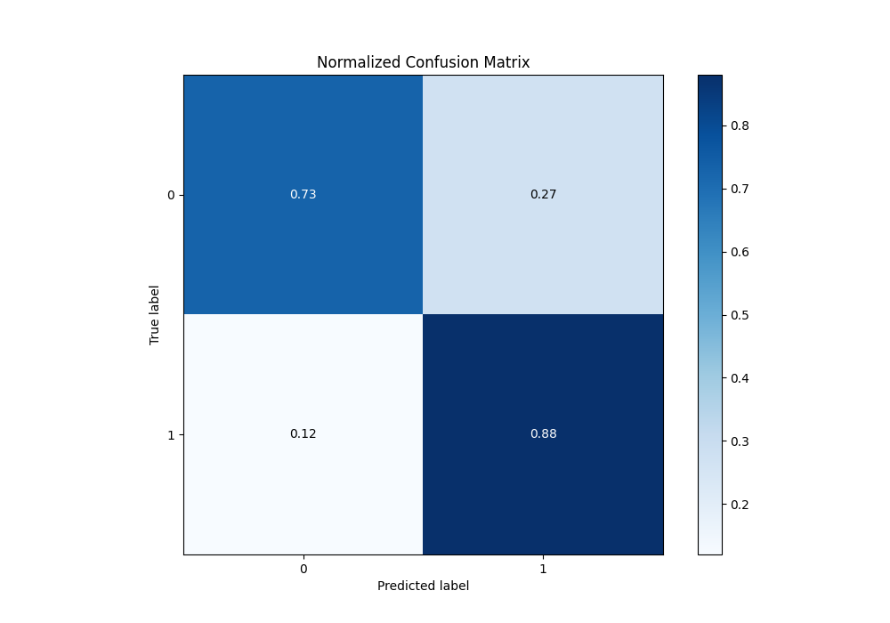
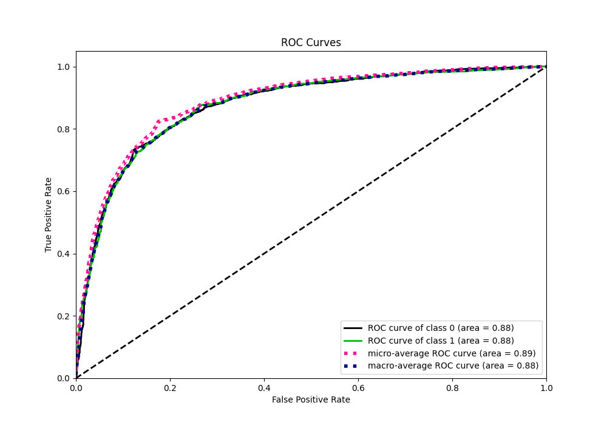
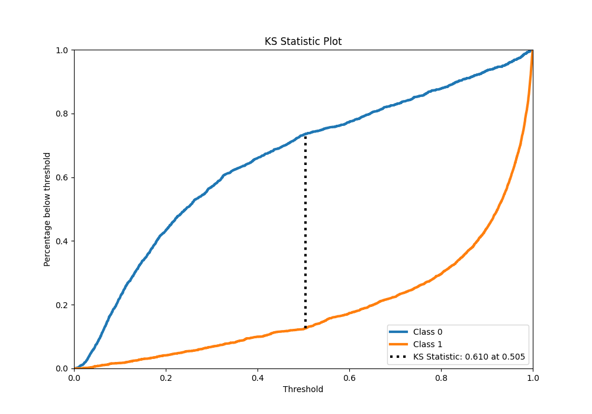
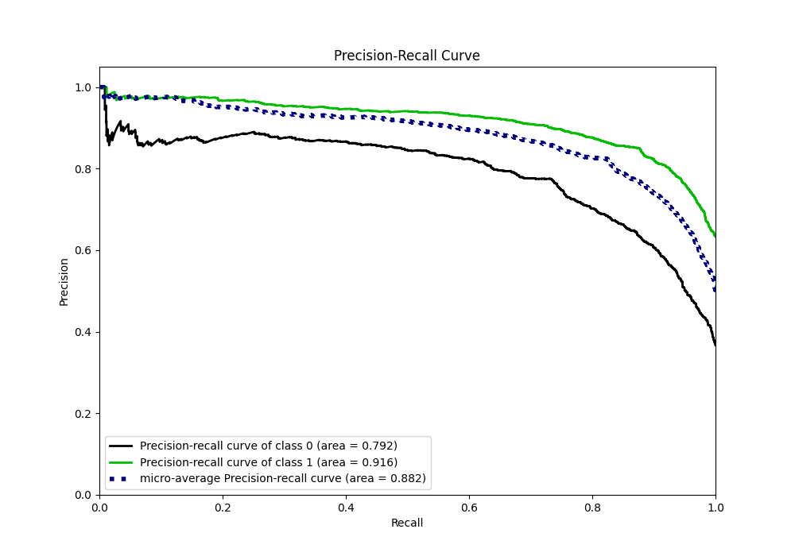
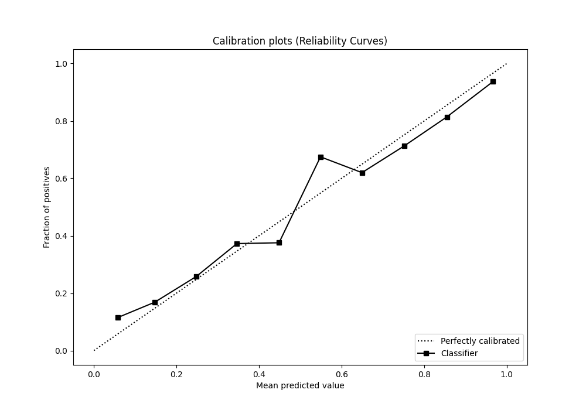
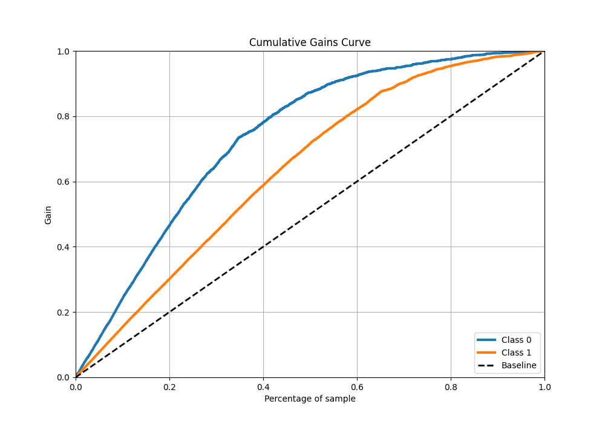
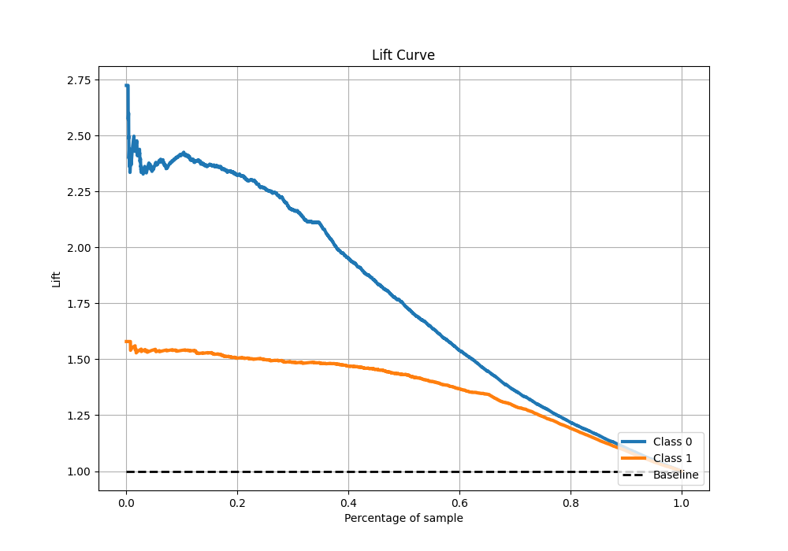

# Summary of 7_LightGBM

[<< Go back](../README.md)

## LightGBM
- **n_jobs**: -1
- **objective**: binary
- **num_leaves**: 95
- **learning_rate**: 0.1
- **feature_fraction**: 1.0
- **bagging_fraction**: 1.0
- **min_data_in_leaf**: 10
- **metric**: custom
- **custom_eval_metric_name**: f1
- **explain_level**: 1

## Validation
 - **validation_type**: kfold
 - **k_folds**: 10
 - **shuffle**: True
 - **stratify**: True
 - **random_seed**: 12

## Optimized metric
f1

## Training time

1410.2 seconds

## Metric details
|           |    score |   threshold |
|:----------|---------:|------------:|
| logloss   | 0.4336   | nan         |
| auc       | 0.875949 | nan         |
| f1        | 0.861961 |   0.49051   |
| accuracy  | 0.822013 |   0.49051   |
| precision | 0.975904 |   0.995732  |
| recall    | 1        |   0.0031041 |
| mcc       | 0.612926 |   0.510931  |

## Metric details with threshold from accuracy metric
|           |    score |   threshold |
|:----------|---------:|------------:|
| logloss   | 0.4336   |   nan       |
| auc       | 0.875949 |   nan       |
| f1        | 0.861961 |     0.49051 |
| accuracy  | 0.822013 |     0.49051 |
| precision | 0.846673 |     0.49051 |
| recall    | 0.877812 |     0.49051 |
| mcc       | 0.612507 |     0.49051 |

## Confusion matrix (at threshold=0.49051)
|              |   Predicted as 0 |   Predicted as 1 |
|:-------------|-----------------:|-----------------:|
| Labeled as 0 |             1384 |              523 |
| Labeled as 1 |              402 |             2888 |

## Learning curves

## Permutation-based Importance

## Confusion Matrix

## Normalized Confusion Matrix

## ROC Curve

## Kolmogorov-Smirnov Statistic

## Precision-Recall Curve

## Calibration Curve

## Cumulative Gains Curve

## Lift Curve

[<< Go back](../README.md)
