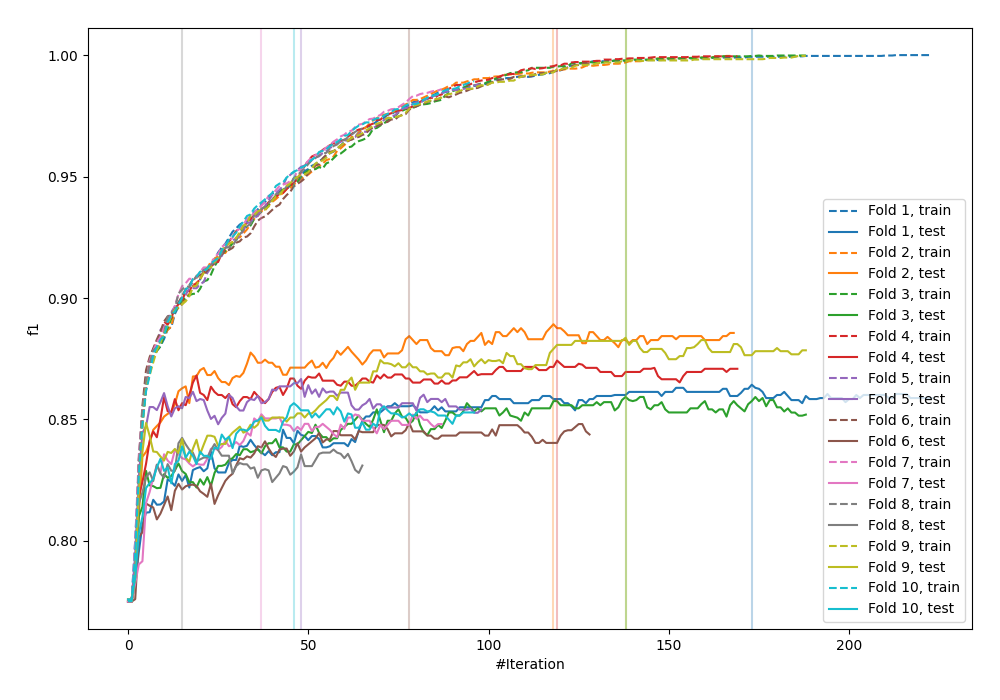
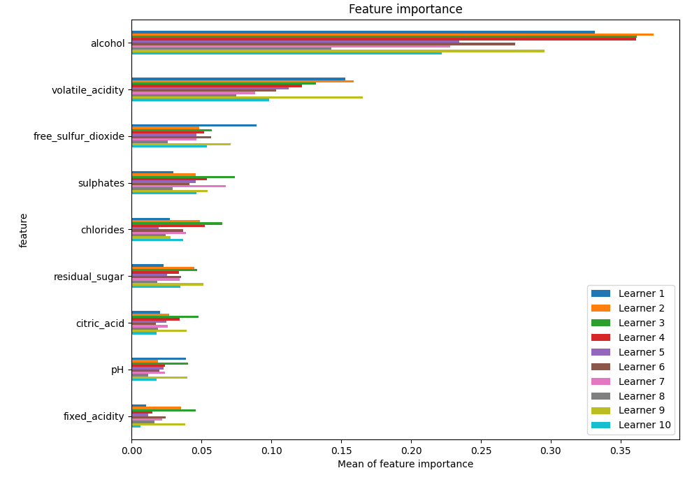
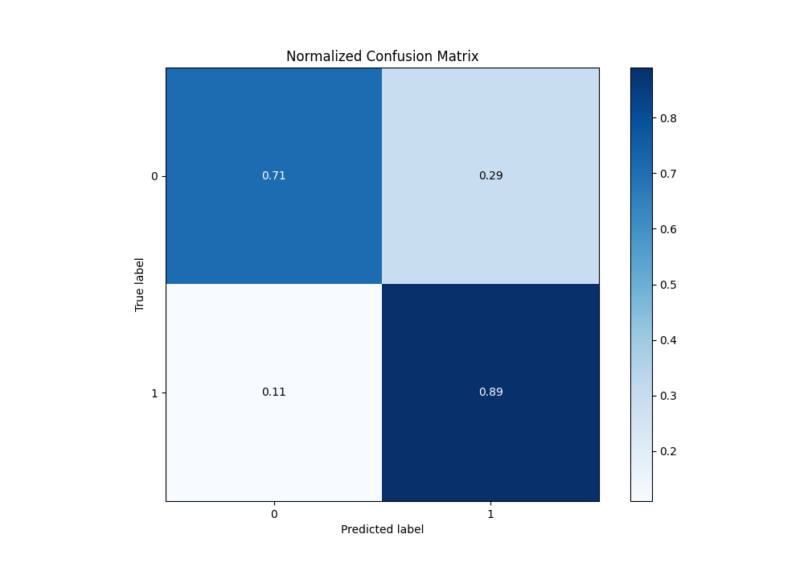
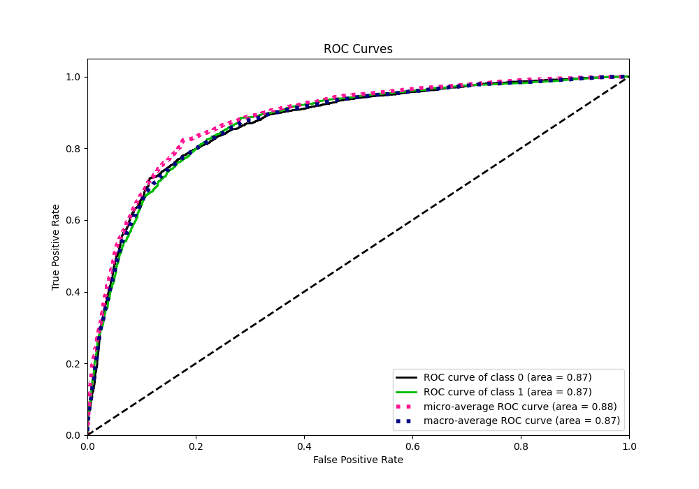
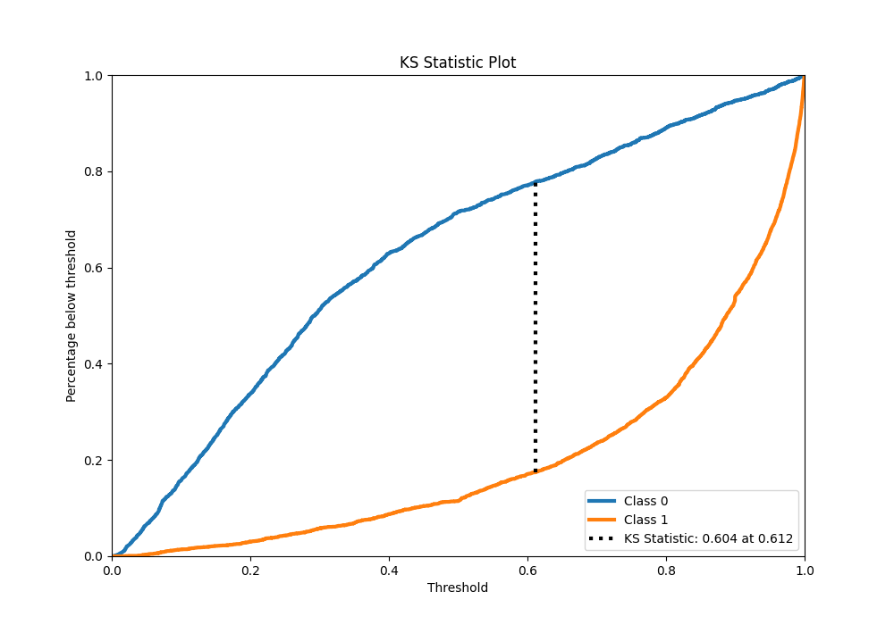
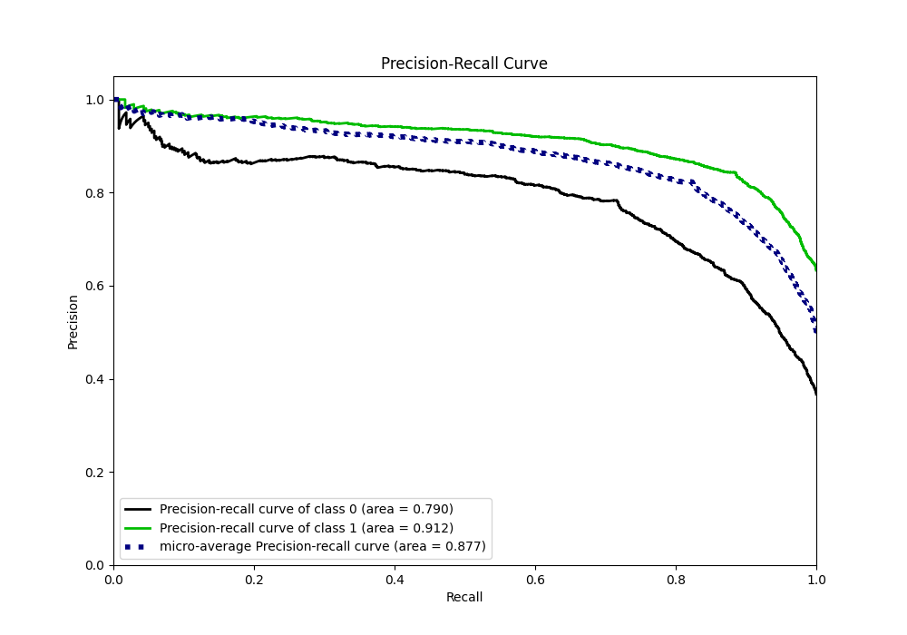
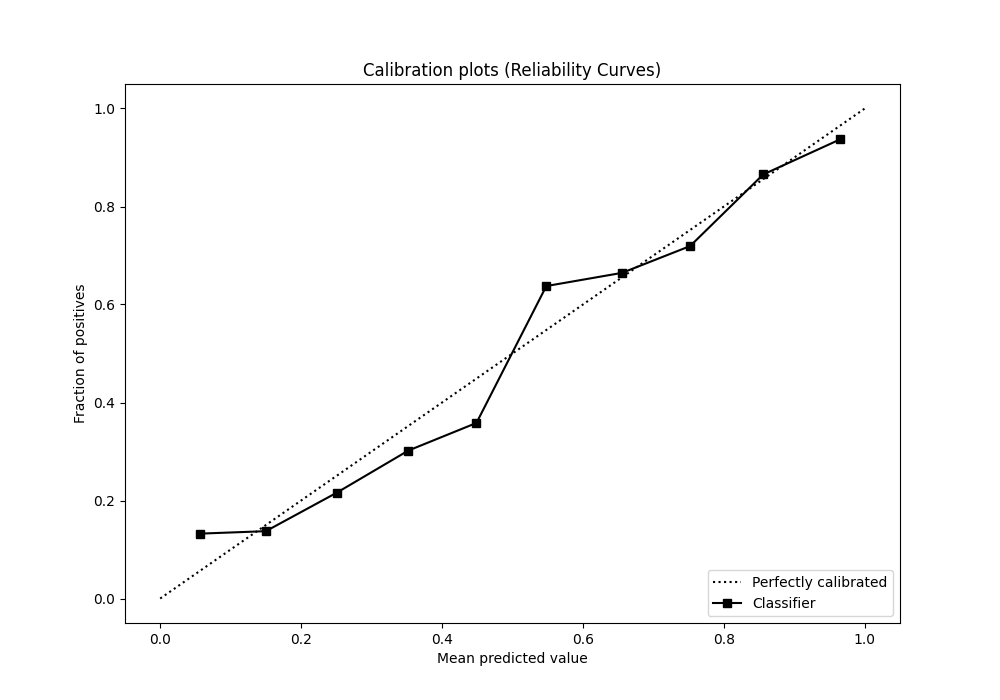
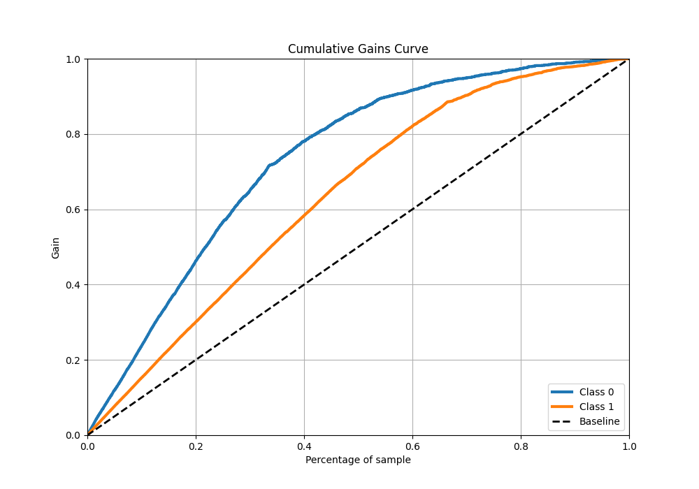
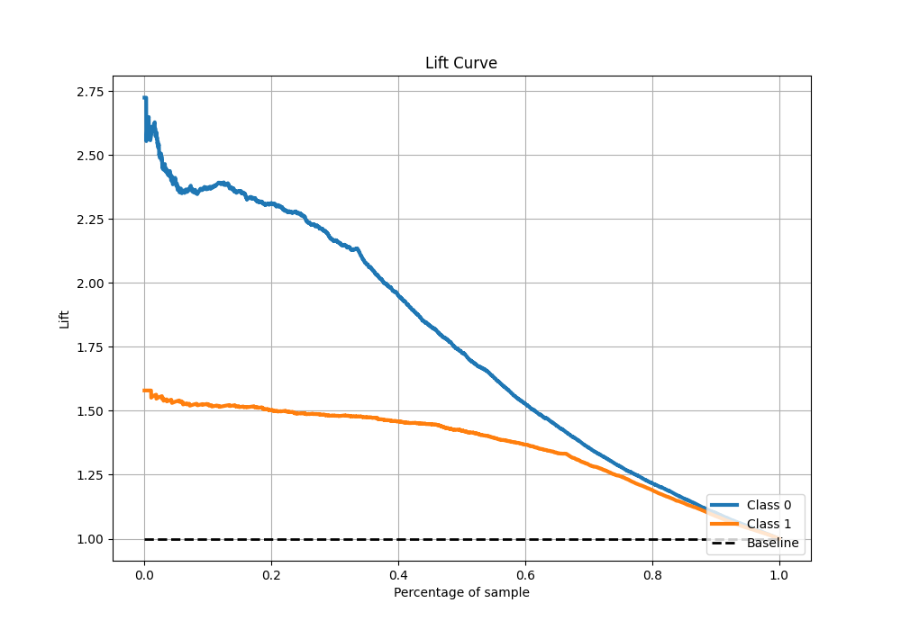

# Summary of 8_LightGBM

[<< Go back](../README.md)

## LightGBM
- **n_jobs**: -1
- **objective**: binary
- **num_leaves**: 63
- **learning_rate**: 0.1
- **feature_fraction**: 0.9
- **bagging_fraction**: 0.9
- **min_data_in_leaf**: 10
- **metric**: custom
- **custom_eval_metric_name**: f1
- **explain_level**: 1

## Validation
 - **validation_type**: kfold
 - **k_folds**: 10
 - **shuffle**: True
 - **stratify**: True
 - **random_seed**: 12

## Optimized metric
f1

## Training time

24.6 seconds

## Metric details
|           |    score |    threshold |
|:----------|---------:|-------------:|
| logloss   | 0.436629 | nan          |
| auc       | 0.871219 | nan          |
| f1        | 0.862855 |   0.497083   |
| accuracy  | 0.82182  |   0.497083   |
| precision | 0.979592 |   0.9973     |
| recall    | 1        |   0.00202476 |
| mcc       | 0.610682 |   0.497083   |

## Metric details with threshold from accuracy metric
|           |    score |   threshold |
|:----------|---------:|------------:|
| logloss   | 0.436629 |  nan        |
| auc       | 0.871219 |  nan        |
| f1        | 0.862855 |    0.497083 |
| accuracy  | 0.82182  |    0.497083 |
| precision | 0.841421 |    0.497083 |
| recall    | 0.88541  |    0.497083 |
| mcc       | 0.610682 |    0.497083 |

## Confusion matrix (at threshold=0.497083)
|              |   Predicted as 0 |   Predicted as 1 |
|:-------------|-----------------:|-----------------:|
| Labeled as 0 |             1358 |              549 |
| Labeled as 1 |              377 |             2913 |

## Learning curves

## Permutation-based Importance

## Confusion Matrix

## Normalized Confusion Matrix

## ROC Curve

## Kolmogorov-Smirnov Statistic

## Precision-Recall Curve

## Calibration Curve

## Cumulative Gains Curve

## Lift Curve

[<< Go back](../README.md)
