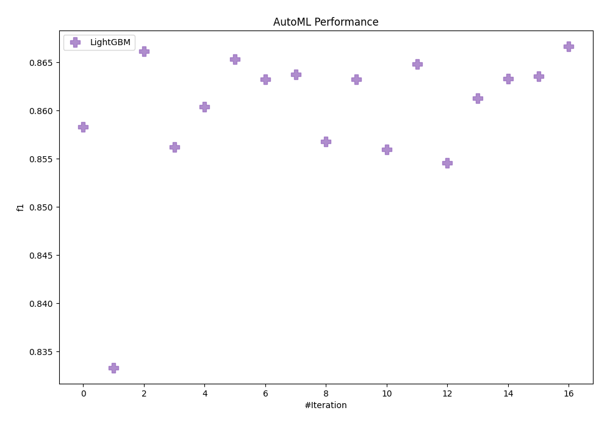
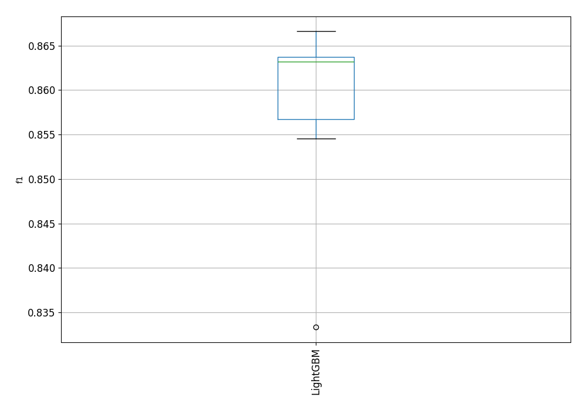

# AutoML Leaderboard

| Best model   | name                                               | model_type   | metric_type   |   metric_value |   train_time |
|:-------------|:---------------------------------------------------|:-------------|:--------------|---------------:|-------------:|
|              | [1_Default_LightGBM](1_Default_LightGBM/README.md) | LightGBM     | f1            |       0.858327 |        30.19 |
|              | [2_LightGBM](2_LightGBM/README.md)                 | LightGBM     | f1            |       0.833333 |         9.35 |
|              | [3_LightGBM](3_LightGBM/README.md)                 | LightGBM     | f1            |       0.866153 |        19.14 |
|              | [4_LightGBM](4_LightGBM/README.md)                 | LightGBM     | f1            |       0.85625  |        28.32 |
|              | [5_LightGBM](5_LightGBM/README.md)                 | LightGBM     | f1            |       0.860393 |        33.19 |
|              | [6_LightGBM](6_LightGBM/README.md)                 | LightGBM     | f1            |       0.865356 |        24.95 |
|              | [7_LightGBM](7_LightGBM/README.md)                 | LightGBM     | f1            |       0.863256 |      1410.99 |
|              | [8_LightGBM](8_LightGBM/README.md)                 | LightGBM     | f1            |       0.863751 |        25.34 |
|              | [9_LightGBM](9_LightGBM/README.md)                 | LightGBM     | f1            |       0.856763 |        14.6  |
|              | [10_LightGBM](10_LightGBM/README.md)               | LightGBM     | f1            |       0.863226 |        27.84 |
|              | [11_LightGBM](11_LightGBM/README.md)               | LightGBM     | f1            |       0.855967 |        16.39 |
|              | [12_LightGBM](12_LightGBM/README.md)               | LightGBM     | f1            |       0.864849 |        26.5  |
|              | [13_LightGBM](13_LightGBM/README.md)               | LightGBM     | f1            |       0.854559 |        16.07 |
|              | [14_LightGBM](14_LightGBM/README.md)               | LightGBM     | f1            |       0.861275 |        24.6  |
|              | [15_LightGBM](15_LightGBM/README.md)               | LightGBM     | f1            |       0.863333 |        22.87 |
|              | [16_LightGBM](16_LightGBM/README.md)               | LightGBM     | f1            |       0.863576 |        23.57 |
| **the best** | [17_LightGBM](17_LightGBM/README.md)               | LightGBM     | f1            |       0.866637 |        27.47 |

### AutoML Performance

### AutoML Performance Boxplot
