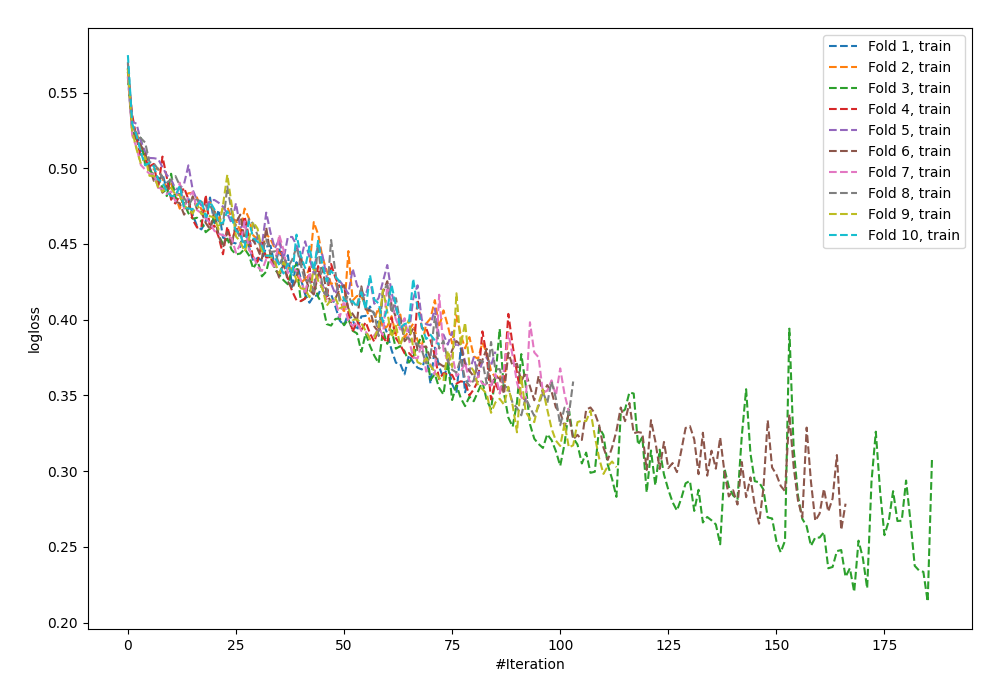
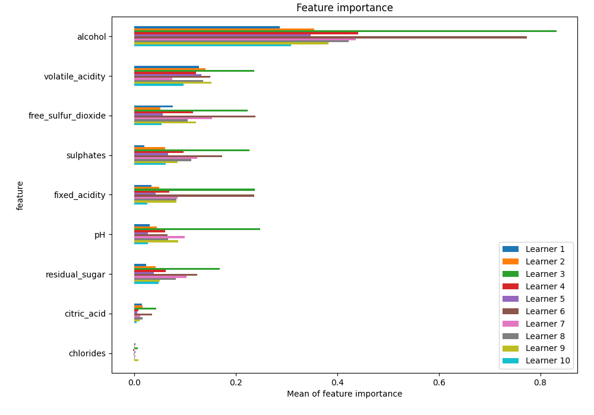
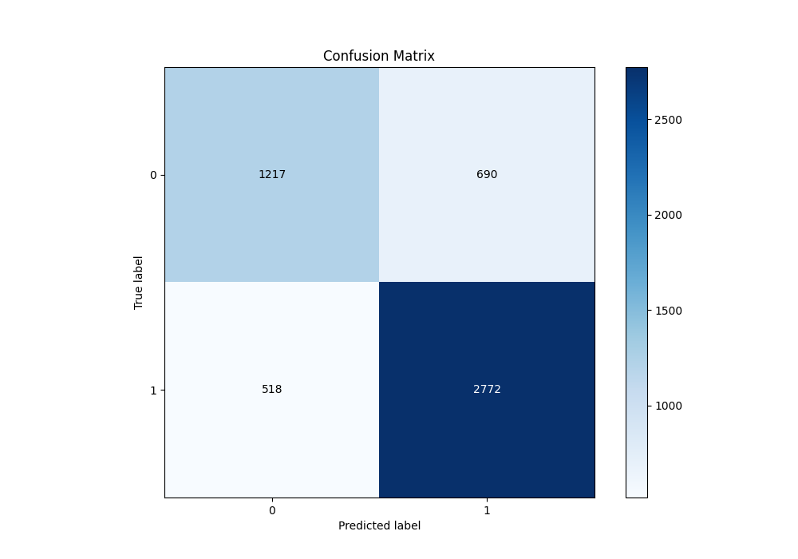
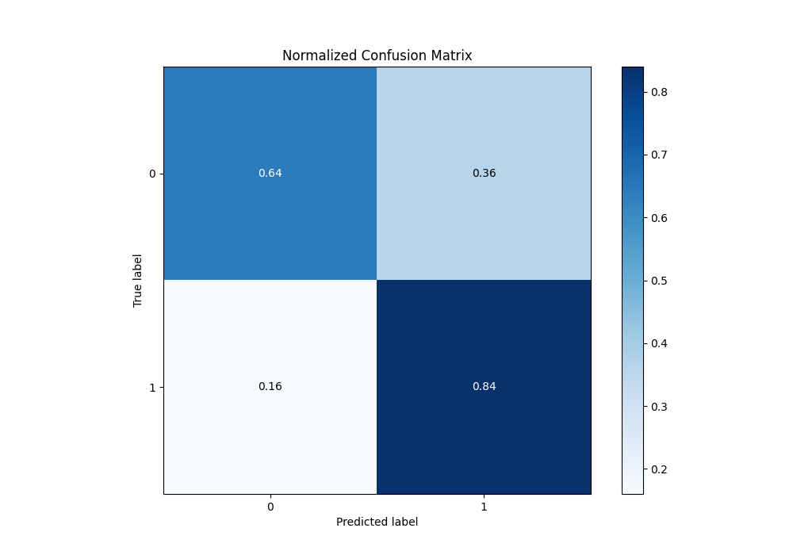
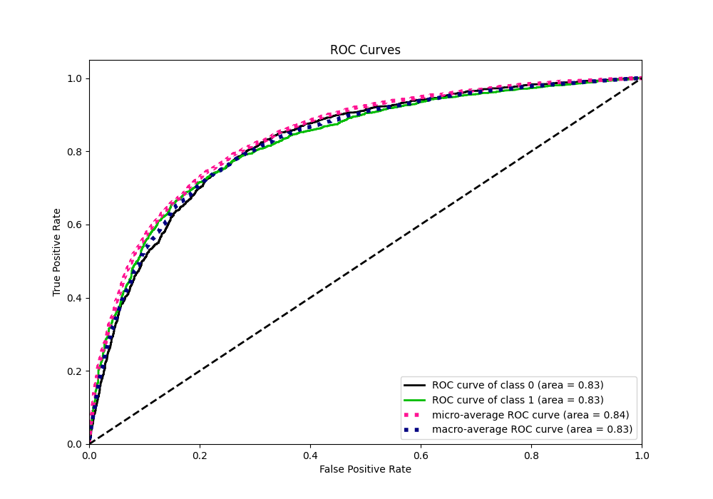
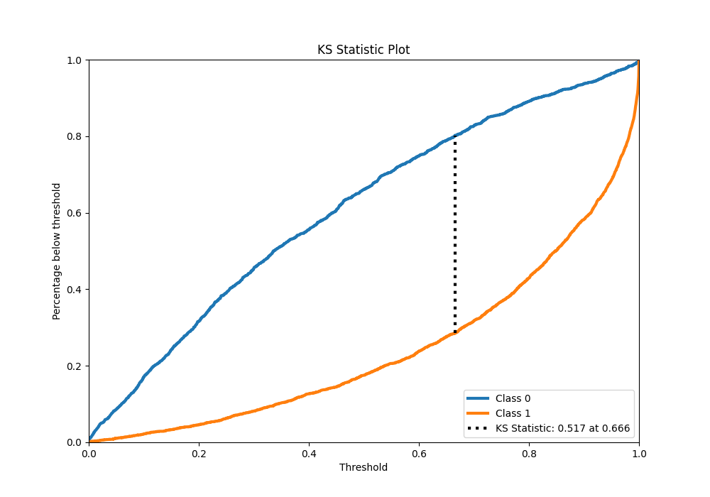
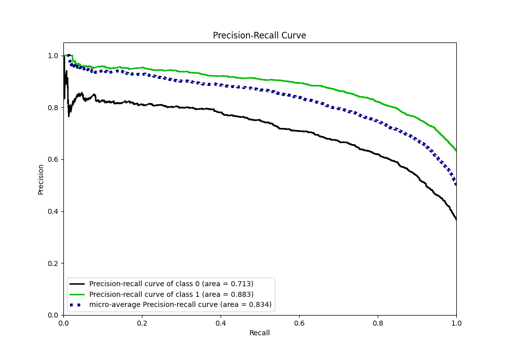
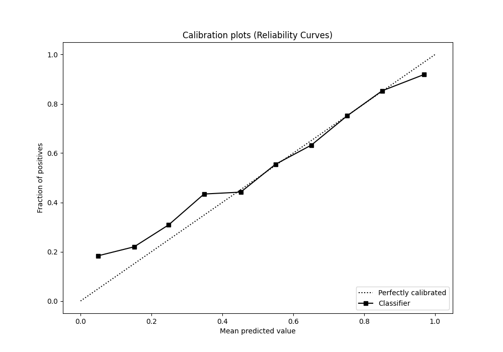
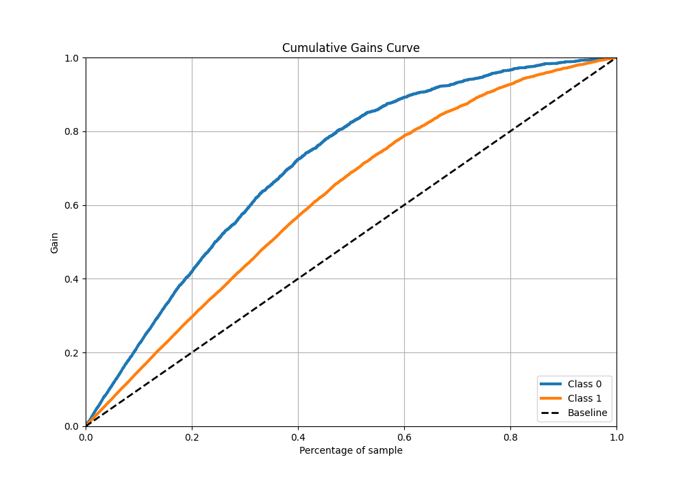
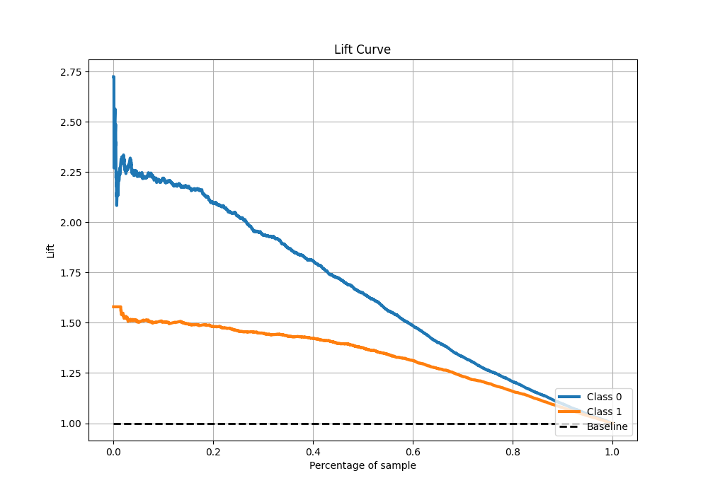

# Summary of 100_NeuralNetwork

[<< Go back](../README.md)

## Neural Network
- **n_jobs**: -1
- **dense_1_size**: 64
- **dense_2_size**: 32
- **learning_rate**: 0.01
- **explain_level**: 1

## Validation
 - **validation_type**: kfold
 - **k_folds**: 10
 - **shuffle**: True
 - **stratify**: True
 - **random_seed**: 12

## Optimized metric
f1

## Training time

39.2 seconds

## Metric details
|           |    score |     threshold |
|:----------|---------:|--------------:|
| logloss   | 0.524461 | nan           |
| auc       | 0.82606  | nan           |
| f1        | 0.823742 |   0.337826    |
| accuracy  | 0.767558 |   0.47212     |
| precision | 0.965986 |   0.999498    |
| recall    | 1        |   5.46706e-15 |
| mcc       | 0.501764 |   0.569751    |

## Metric details with threshold from accuracy metric
|           |    score |   threshold |
|:----------|---------:|------------:|
| logloss   | 0.524461 |   nan       |
| auc       | 0.82606  |   nan       |
| f1        | 0.82109  |     0.47212 |
| accuracy  | 0.767558 |     0.47212 |
| precision | 0.800693 |     0.47212 |
| recall    | 0.842553 |     0.47212 |
| mcc       | 0.491315 |     0.47212 |

## Confusion matrix (at threshold=0.47212)
|              |   Predicted as 0 |   Predicted as 1 |
|:-------------|-----------------:|-----------------:|
| Labeled as 0 |             1217 |              690 |
| Labeled as 1 |              518 |             2772 |

## Learning curves

## Permutation-based Importance

## Confusion Matrix

## Normalized Confusion Matrix

## ROC Curve

## Kolmogorov-Smirnov Statistic

## Precision-Recall Curve

## Calibration Curve

## Cumulative Gains Curve

## Lift Curve

[<< Go back](../README.md)
