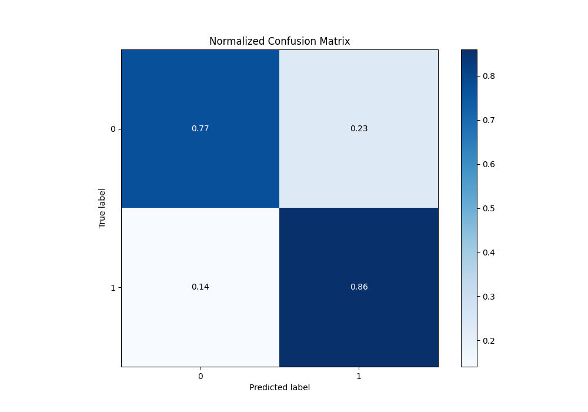

# Summary of 100_NeuralNetwork_Stacked

[<< Go back](../README.md)

## Neural Network
- **n_jobs**: -1
- **dense_1_size**: 64
- **dense_2_size**: 32
- **learning_rate**: 0.01
- **explain_level**: 1

## Validation
 - **validation_type**: kfold
 - **k_folds**: 10
 - **shuffle**: True
 - **stratify**: True
 - **random_seed**: 12

## Optimized metric
f1

## Training time

35.4 seconds

## Metric details
|           |    score |     threshold |
|:----------|---------:|--------------:|
| logloss   | 0.411926 | nan           |
| auc       | 0.884423 | nan           |
| f1        | 0.865521 |   0.469472    |
| accuracy  | 0.827208 |   0.563622    |
| precision | 0.972789 |   0.967418    |
| recall    | 1        |   1.85896e-08 |
| mcc       | 0.62944  |   0.563622    |

## Metric details with threshold from accuracy metric
|           |    score |   threshold |
|:----------|---------:|------------:|
| logloss   | 0.411926 |  nan        |
| auc       | 0.884423 |  nan        |
| f1        | 0.862859 |    0.563622 |
| accuracy  | 0.827208 |    0.563622 |
| precision | 0.867096 |    0.563622 |
| recall    | 0.858663 |    0.563622 |
| mcc       | 0.62944  |    0.563622 |

## Confusion matrix (at threshold=0.563622)
|              |   Predicted as 0 |   Predicted as 1 |
|:-------------|-----------------:|-----------------:|
| Labeled as 0 |             1474 |              433 |
| Labeled as 1 |              465 |             2825 |

## Learning curves

## Permutation-based Importance

## Confusion Matrix

## Normalized Confusion Matrix

## ROC Curve

## Kolmogorov-Smirnov Statistic

## Precision-Recall Curve

## Calibration Curve

## Cumulative Gains Curve

## Lift Curve

[<< Go back](../README.md)
