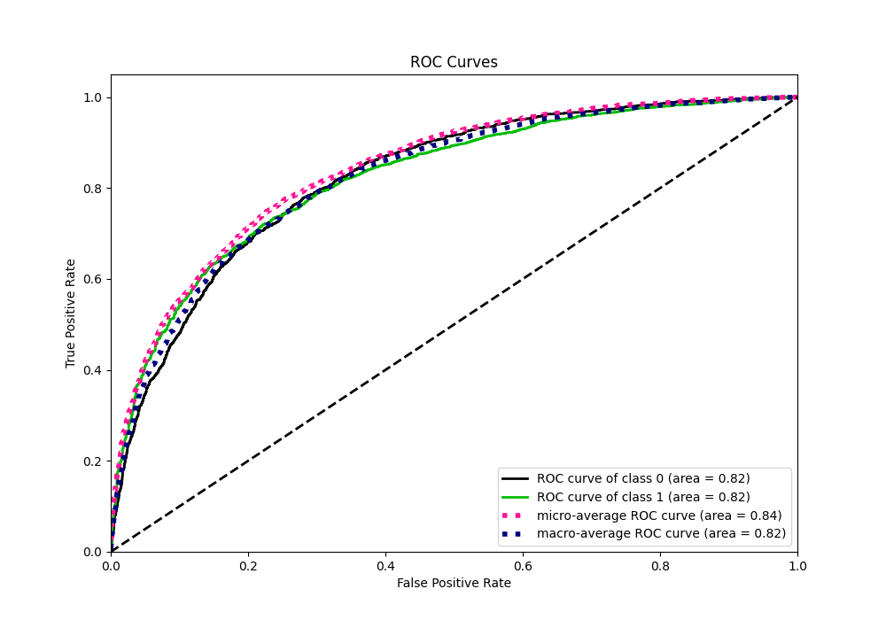

# Summary of 101_NeuralNetwork

[<< Go back](../README.md)

## Neural Network
- **n_jobs**: -1
- **dense_1_size**: 64
- **dense_2_size**: 8
- **learning_rate**: 0.01
- **explain_level**: 1

## Validation
 - **validation_type**: kfold
 - **k_folds**: 10
 - **shuffle**: True
 - **stratify**: True
 - **random_seed**: 12

## Optimized metric
f1

## Training time

21.1 seconds

## Metric details
|           |    score |     threshold |
|:----------|---------:|--------------:|
| logloss   | 0.501844 | nan           |
| auc       | 0.823739 | nan           |
| f1        | 0.818681 |   0.407884    |
| accuracy  | 0.761208 |   0.471206    |
| precision | 0.979592 |   0.998262    |
| recall    | 1        |   1.48992e-10 |
| mcc       | 0.479974 |   0.521127    |

## Metric details with threshold from accuracy metric
|           |    score |   threshold |
|:----------|---------:|------------:|
| logloss   | 0.501844 |  nan        |
| auc       | 0.823739 |  nan        |
| f1        | 0.81758  |    0.471206 |
| accuracy  | 0.761208 |    0.471206 |
| precision | 0.791631 |    0.471206 |
| recall    | 0.845289 |    0.471206 |
| mcc       | 0.475202 |    0.471206 |

## Confusion matrix (at threshold=0.471206)
|              |   Predicted as 0 |   Predicted as 1 |
|:-------------|-----------------:|-----------------:|
| Labeled as 0 |             1175 |              732 |
| Labeled as 1 |              509 |             2781 |

## Learning curves

## Permutation-based Importance

## Confusion Matrix

## Normalized Confusion Matrix

## ROC Curve

## Kolmogorov-Smirnov Statistic

## Precision-Recall Curve

## Calibration Curve

## Cumulative Gains Curve

## Lift Curve

[<< Go back](../README.md)
