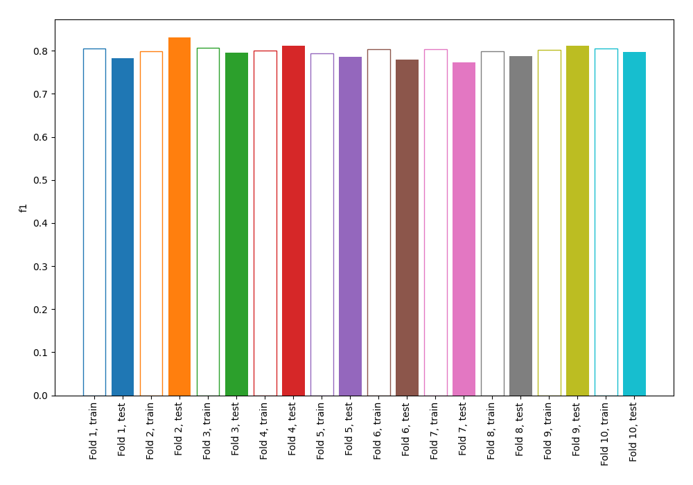
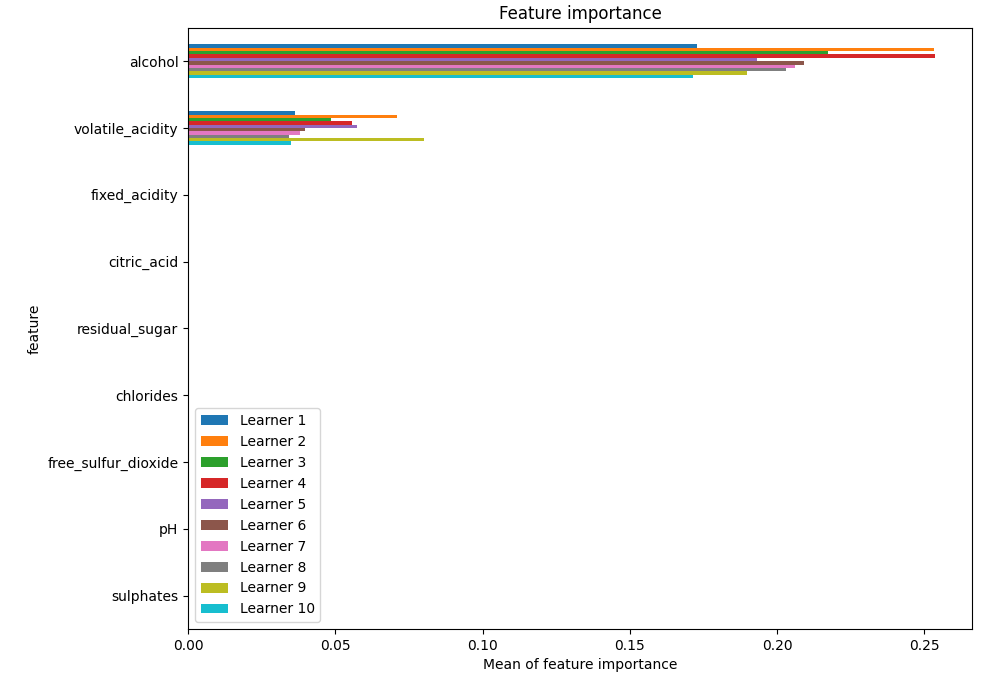
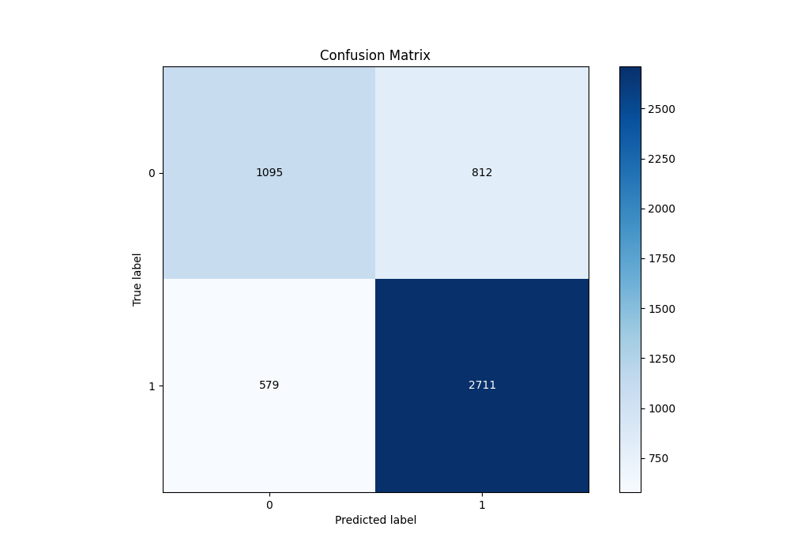
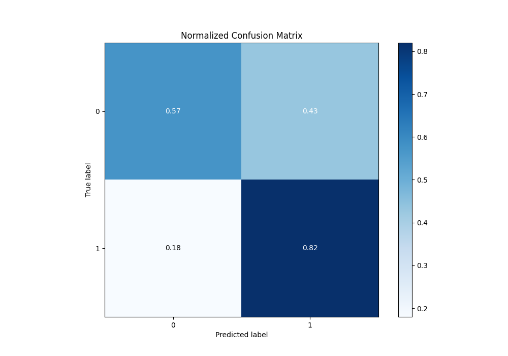
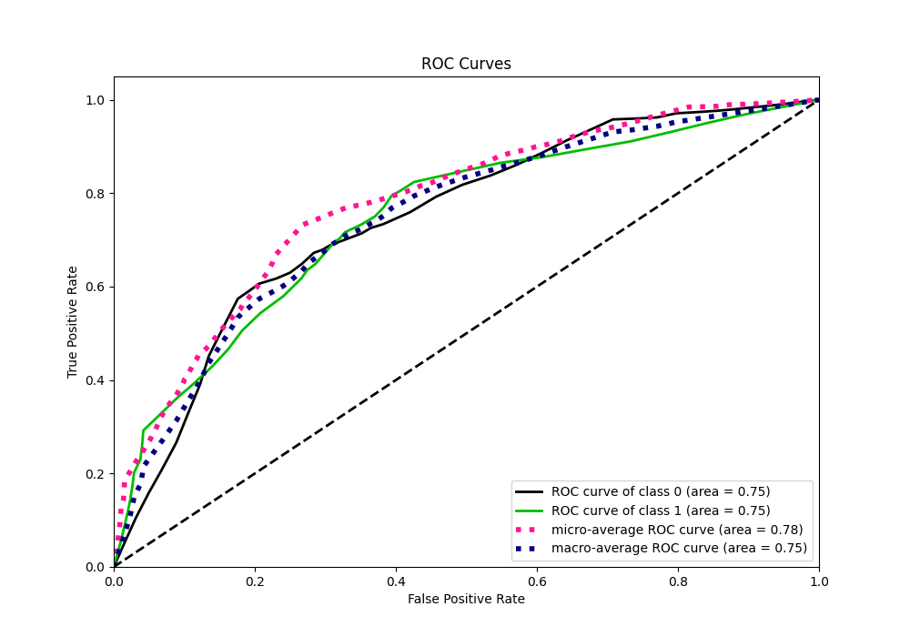
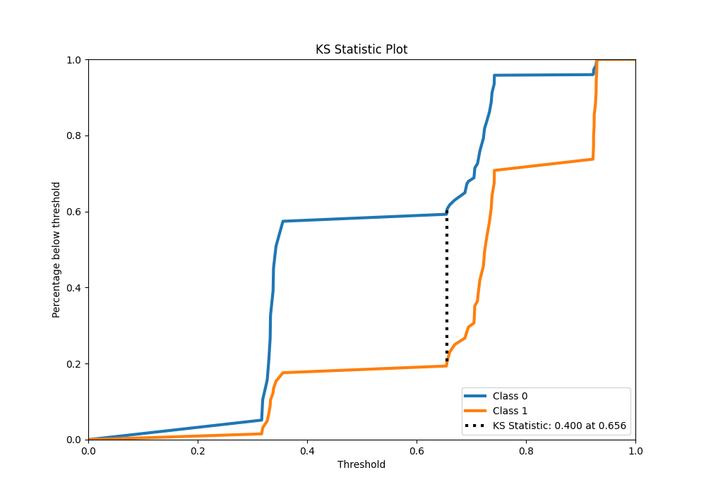
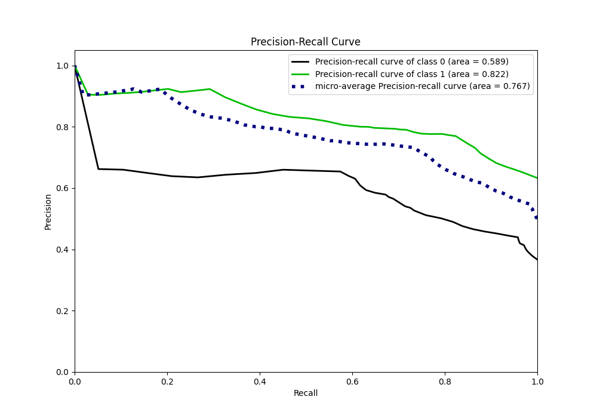
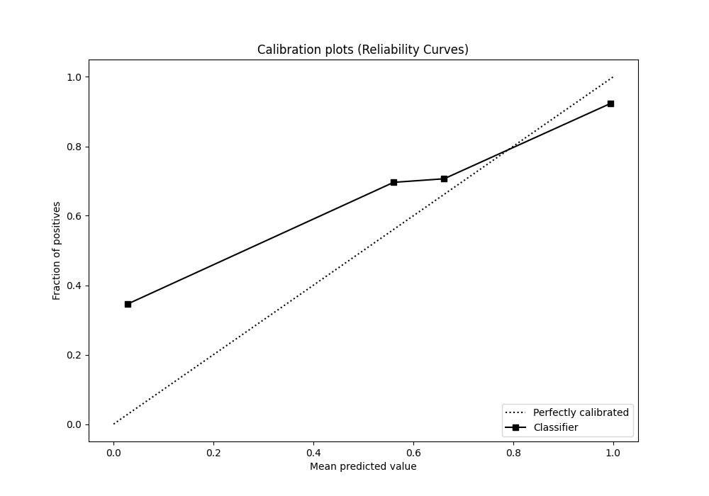
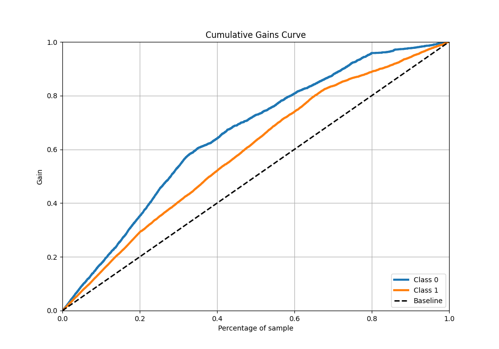
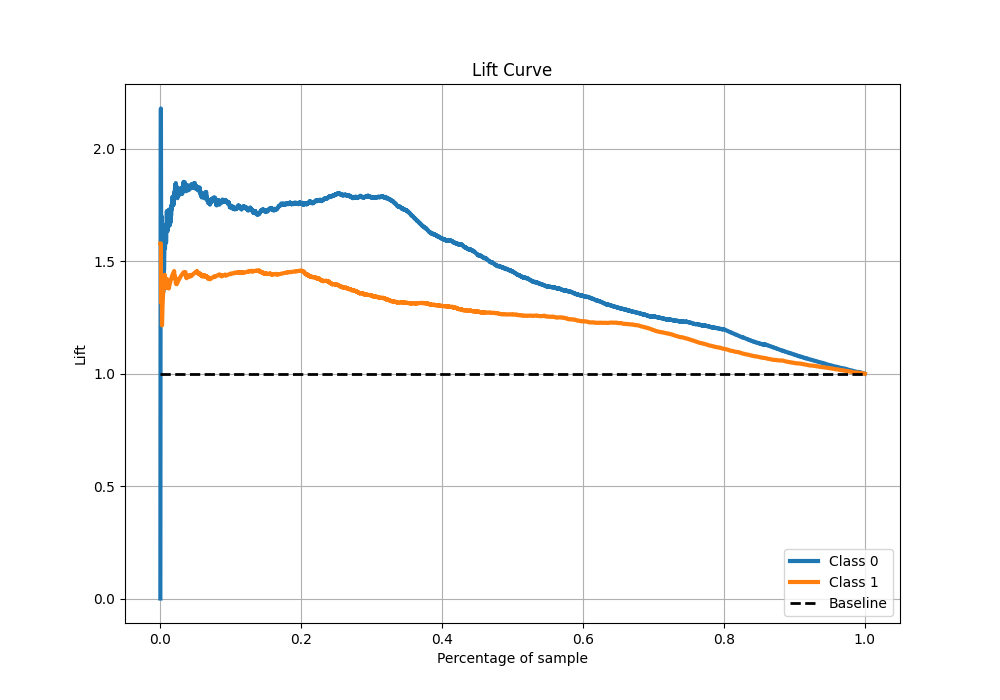

# Summary of 102_DecisionTree

[<< Go back](../README.md)

## Decision Tree
- **n_jobs**: -1
- **criterion**: gini
- **max_depth**: 2
- **explain_level**: 1

## Validation
 - **validation_type**: kfold
 - **k_folds**: 10
 - **shuffle**: True
 - **stratify**: True
 - **random_seed**: 12

## Optimized metric
f1

## Training time

16.4 seconds

## Metric details
|           |    score |   threshold |
|:----------|---------:|------------:|
| logloss   | 0.551878 |  nan        |
| auc       | 0.747047 |  nan        |
| f1        | 0.795831 |    0.355853 |
| accuracy  | 0.732346 |    0.355853 |
| precision | 0.923611 |    0.923529 |
| recall    | 1        |    0.285253 |
| mcc       | 0.410728 |    0.355853 |

## Metric details with threshold from accuracy metric
|           |    score |   threshold |
|:----------|---------:|------------:|
| logloss   | 0.551878 |  nan        |
| auc       | 0.747047 |  nan        |
| f1        | 0.795831 |    0.355853 |
| accuracy  | 0.732346 |    0.355853 |
| precision | 0.769515 |    0.355853 |
| recall    | 0.824012 |    0.355853 |
| mcc       | 0.410728 |    0.355853 |

## Confusion matrix (at threshold=0.355853)
|              |   Predicted as 0 |   Predicted as 1 |
|:-------------|-----------------:|-----------------:|
| Labeled as 0 |             1095 |              812 |
| Labeled as 1 |              579 |             2711 |

## Learning curves

## Permutation-based Importance

## Confusion Matrix

## Normalized Confusion Matrix

## ROC Curve

## Kolmogorov-Smirnov Statistic

## Precision-Recall Curve

## Calibration Curve

## Cumulative Gains Curve

## Lift Curve

[<< Go back](../README.md)
