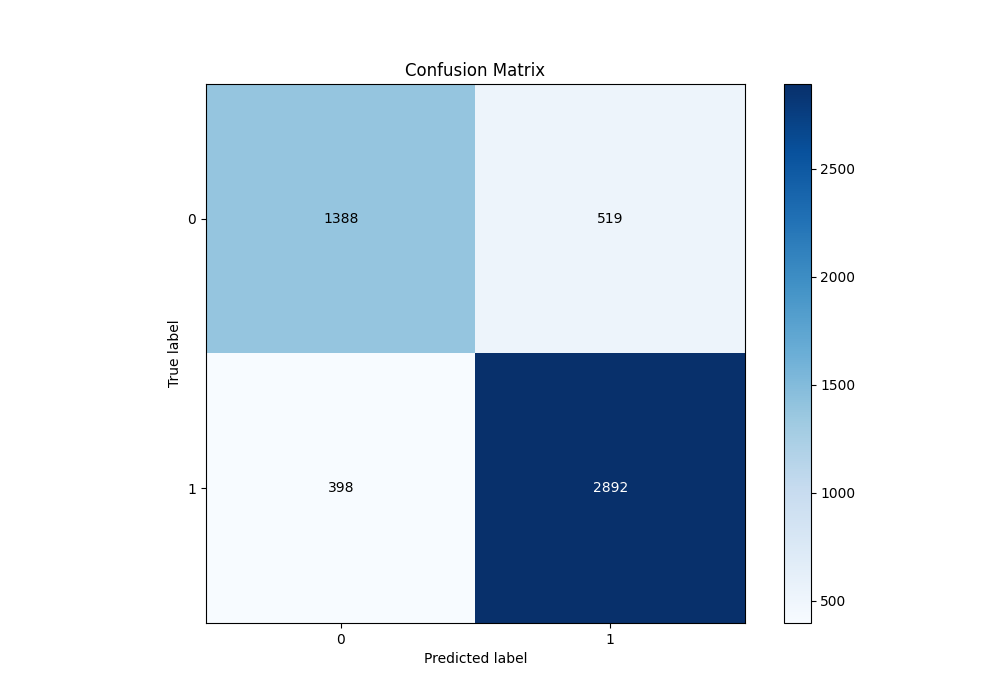

# Summary of 106_CatBoost

[<< Go back](../README.md)

## CatBoost
- **n_jobs**: -1
- **learning_rate**: 0.2
- **depth**: 9
- **rsm**: 0.9
- **loss_function**: Logloss
- **eval_metric**: F1
- **explain_level**: 1

## Validation
 - **validation_type**: kfold
 - **k_folds**: 10
 - **shuffle**: True
 - **stratify**: True
 - **random_seed**: 12

## Optimized metric
f1

## Training time

20.1 seconds

## Metric details
|           |    score |     threshold |
|:----------|---------:|--------------:|
| logloss   | 0.435767 | nan           |
| auc       | 0.87518  | nan           |
| f1        | 0.863155 |   0.505767    |
| accuracy  | 0.823552 |   0.505767    |
| precision | 0.972789 |   0.997098    |
| recall    | 1        |   0.000797629 |
| mcc       | 0.61587  |   0.505767    |

## Metric details with threshold from accuracy metric
|           |    score |   threshold |
|:----------|---------:|------------:|
| logloss   | 0.435767 |  nan        |
| auc       | 0.87518  |  nan        |
| f1        | 0.863155 |    0.505767 |
| accuracy  | 0.823552 |    0.505767 |
| precision | 0.847845 |    0.505767 |
| recall    | 0.879027 |    0.505767 |
| mcc       | 0.61587  |    0.505767 |

## Confusion matrix (at threshold=0.505767)
|              |   Predicted as 0 |   Predicted as 1 |
|:-------------|-----------------:|-----------------:|
| Labeled as 0 |             1388 |              519 |
| Labeled as 1 |              398 |             2892 |

## Learning curves

## Permutation-based Importance

## Confusion Matrix

## Normalized Confusion Matrix

## ROC Curve

## Kolmogorov-Smirnov Statistic

## Precision-Recall Curve

## Calibration Curve

## Cumulative Gains Curve

## Lift Curve

[<< Go back](../README.md)
