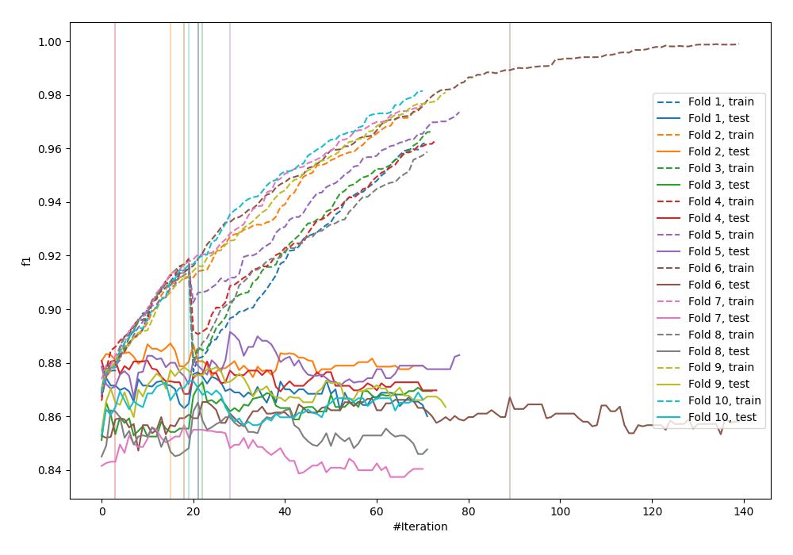
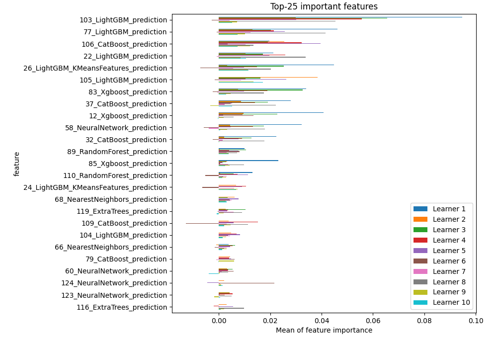
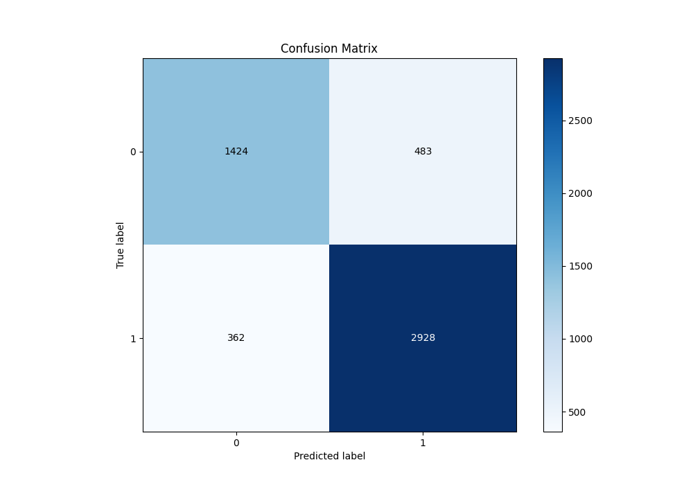
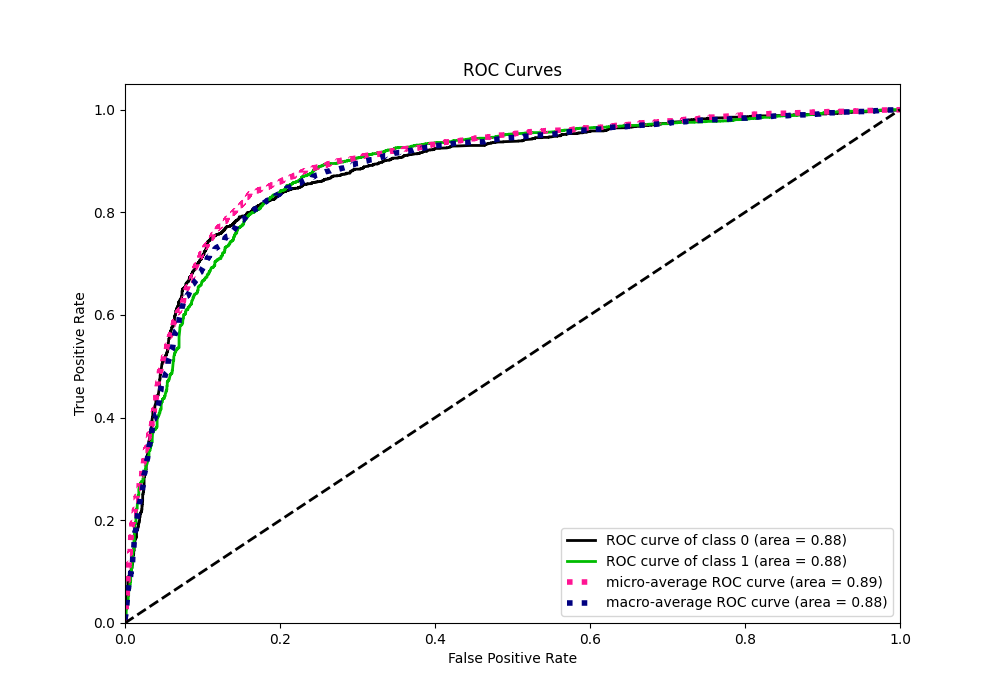
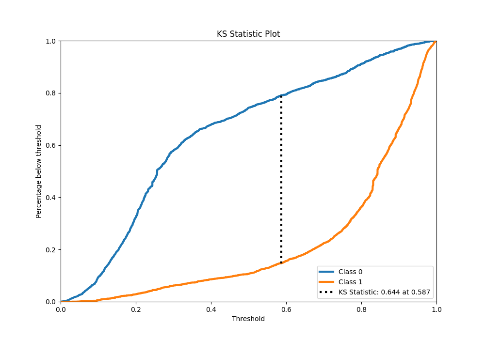
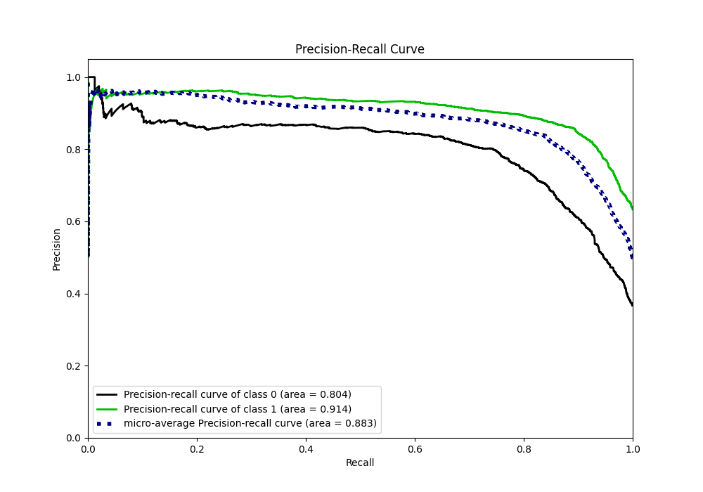
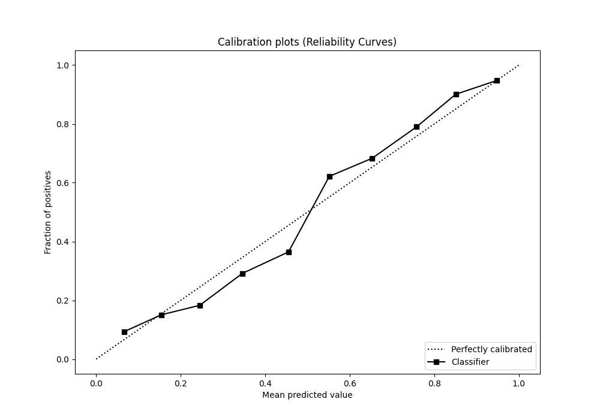
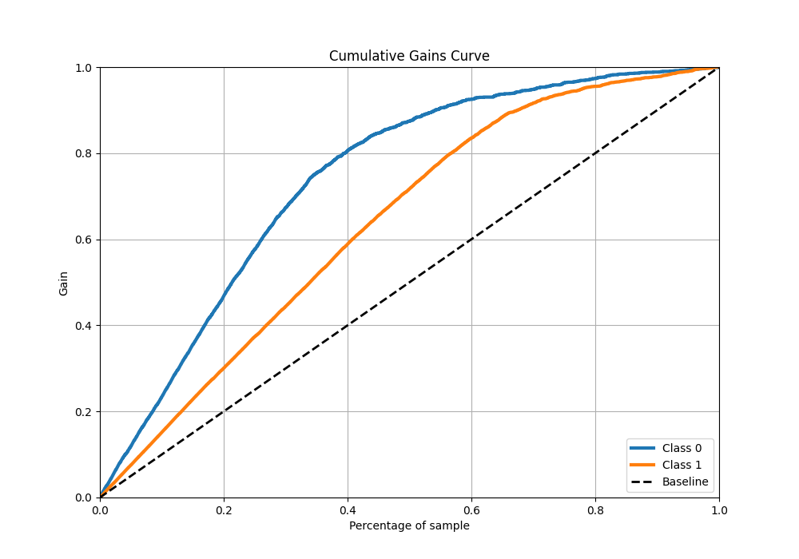
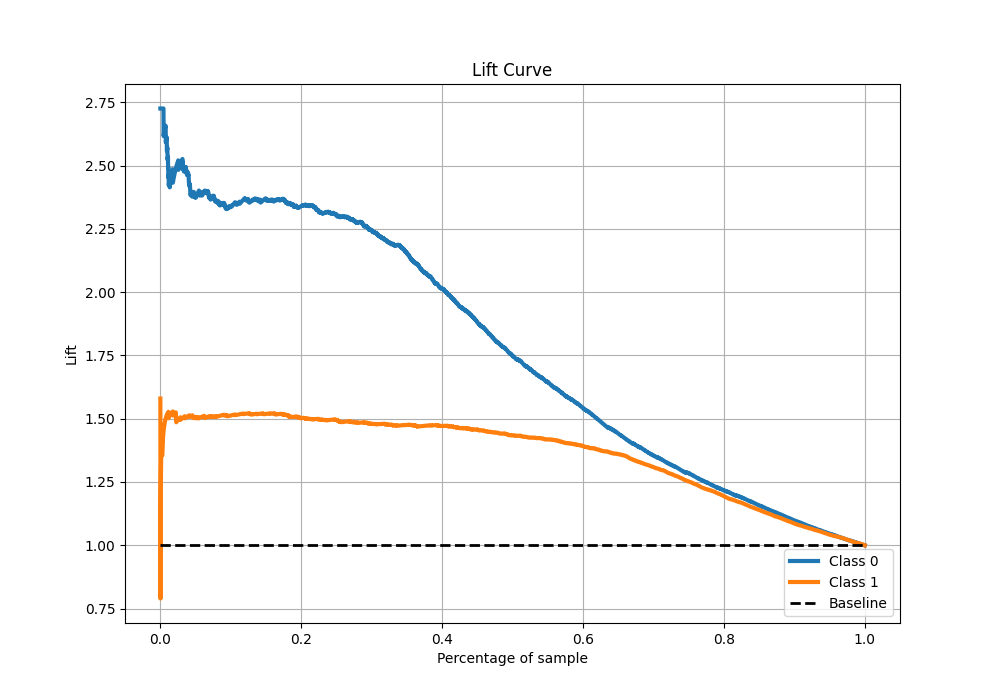

# Summary of 106_CatBoost_Stacked

[<< Go back](../README.md)

## CatBoost
- **n_jobs**: -1
- **learning_rate**: 0.2
- **depth**: 9
- **rsm**: 0.9
- **loss_function**: Logloss
- **eval_metric**: F1
- **explain_level**: 1

## Validation
 - **validation_type**: kfold
 - **k_folds**: 10
 - **shuffle**: True
 - **stratify**: True
 - **random_seed**: 12

## Optimized metric
f1

## Training time

29.9 seconds

## Metric details
|           |    score |    threshold |
|:----------|---------:|-------------:|
| logloss   | 0.413032 | nan          |
| auc       | 0.881841 | nan          |
| f1        | 0.873899 |   0.509381   |
| accuracy  | 0.837406 |   0.509381   |
| precision | 0.961983 |   0.94675    |
| recall    | 1        |   0.00222308 |
| mcc       | 0.646132 |   0.509381   |

## Metric details with threshold from accuracy metric
|           |    score |   threshold |
|:----------|---------:|------------:|
| logloss   | 0.413032 |  nan        |
| auc       | 0.881841 |  nan        |
| f1        | 0.873899 |    0.509381 |
| accuracy  | 0.837406 |    0.509381 |
| precision | 0.858399 |    0.509381 |
| recall    | 0.88997  |    0.509381 |
| mcc       | 0.646132 |    0.509381 |

## Confusion matrix (at threshold=0.509381)
|              |   Predicted as 0 |   Predicted as 1 |
|:-------------|-----------------:|-----------------:|
| Labeled as 0 |             1424 |              483 |
| Labeled as 1 |              362 |             2928 |

## Learning curves

## Permutation-based Importance

## Confusion Matrix

## Normalized Confusion Matrix

## ROC Curve

## Kolmogorov-Smirnov Statistic

## Precision-Recall Curve

## Calibration Curve

## Cumulative Gains Curve

## Lift Curve

[<< Go back](../README.md)
