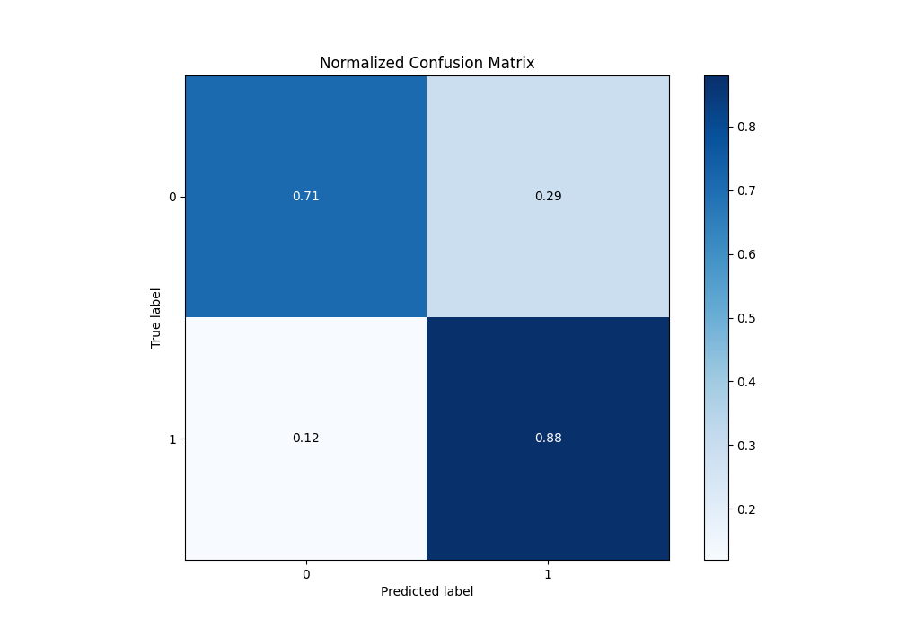
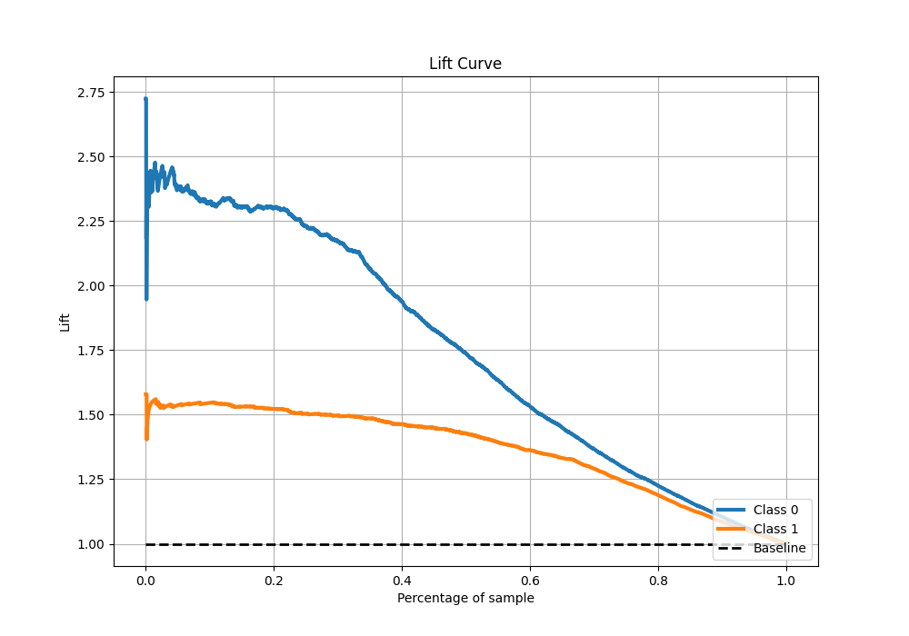

# Summary of 108_CatBoost

[<< Go back](../README.md)

## CatBoost
- **n_jobs**: -1
- **learning_rate**: 0.2
- **depth**: 8
- **rsm**: 0.9
- **loss_function**: Logloss
- **eval_metric**: F1
- **explain_level**: 1

## Validation
 - **validation_type**: kfold
 - **k_folds**: 10
 - **shuffle**: True
 - **stratify**: True
 - **random_seed**: 12

## Optimized metric
f1

## Training time

18.0 seconds

## Metric details
|           |    score |   threshold |
|:----------|---------:|------------:|
| logloss   | 0.435895 | nan         |
| auc       | 0.872365 | nan         |
| f1        | 0.861671 |   0.501925  |
| accuracy  | 0.820281 |   0.501925  |
| precision | 0.98018  |   0.980961  |
| recall    | 1        |   0.0013424 |
| mcc       | 0.607296 |   0.501925  |

## Metric details with threshold from accuracy metric
|           |    score |   threshold |
|:----------|---------:|------------:|
| logloss   | 0.435895 |  nan        |
| auc       | 0.872365 |  nan        |
| f1        | 0.861671 |    0.501925 |
| accuracy  | 0.820281 |    0.501925 |
| precision | 0.840266 |    0.501925 |
| recall    | 0.884195 |    0.501925 |
| mcc       | 0.607296 |    0.501925 |

## Confusion matrix (at threshold=0.501925)
|              |   Predicted as 0 |   Predicted as 1 |
|:-------------|-----------------:|-----------------:|
| Labeled as 0 |             1354 |              553 |
| Labeled as 1 |              381 |             2909 |

## Learning curves

## Permutation-based Importance

## Confusion Matrix

## Normalized Confusion Matrix

## ROC Curve

## Kolmogorov-Smirnov Statistic

## Precision-Recall Curve

## Calibration Curve

## Cumulative Gains Curve

## Lift Curve

[<< Go back](../README.md)
