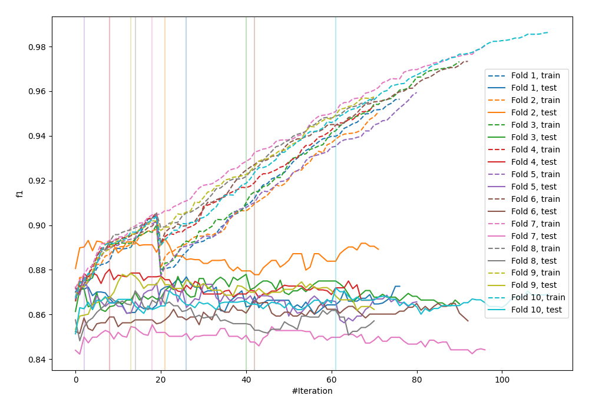
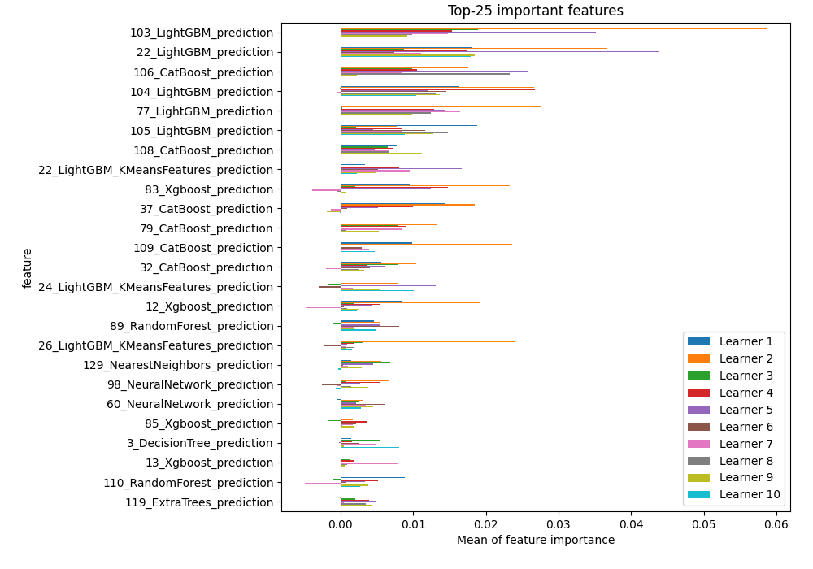
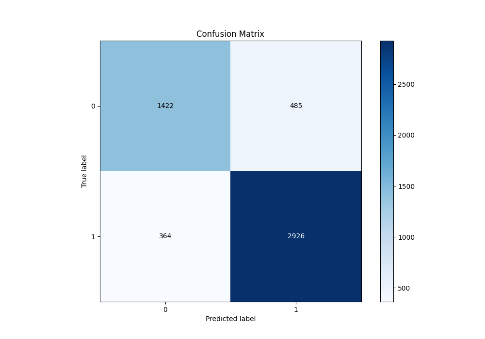
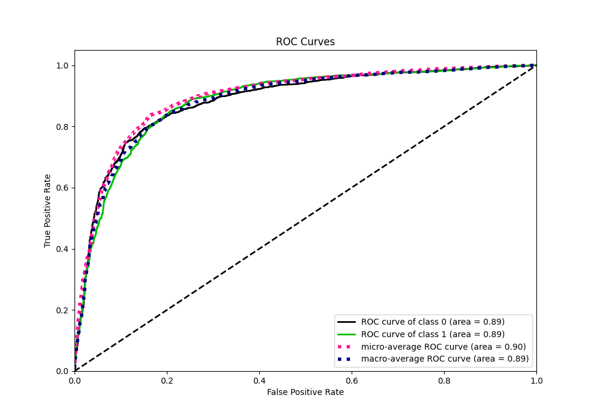
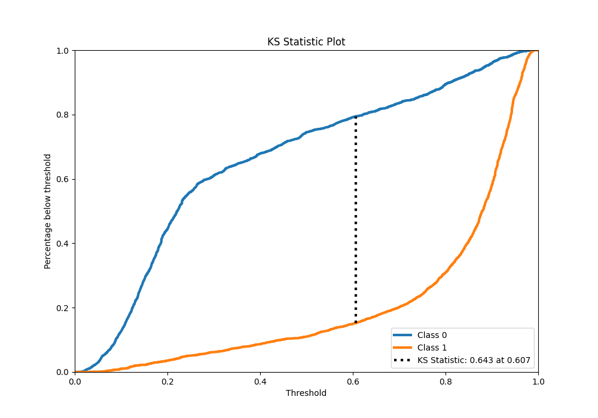
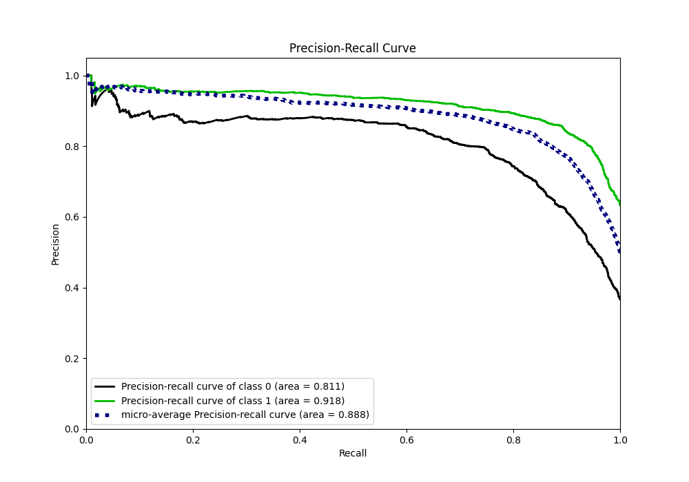
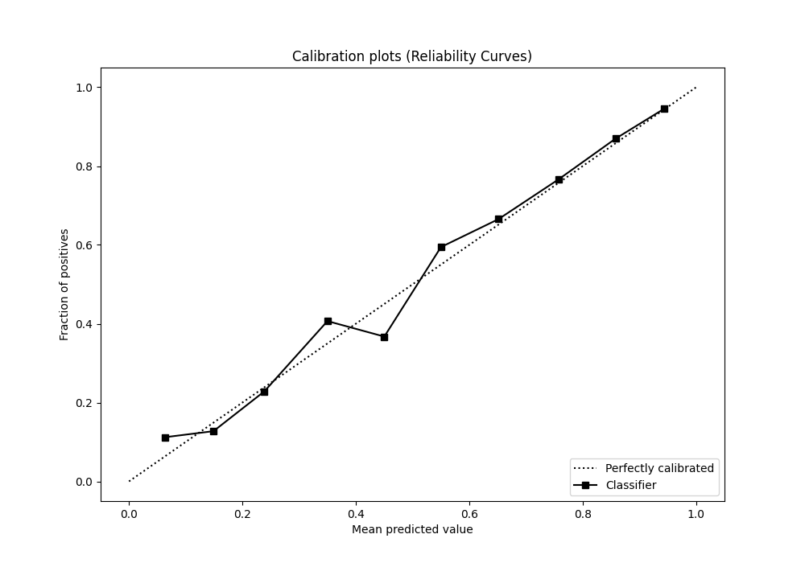
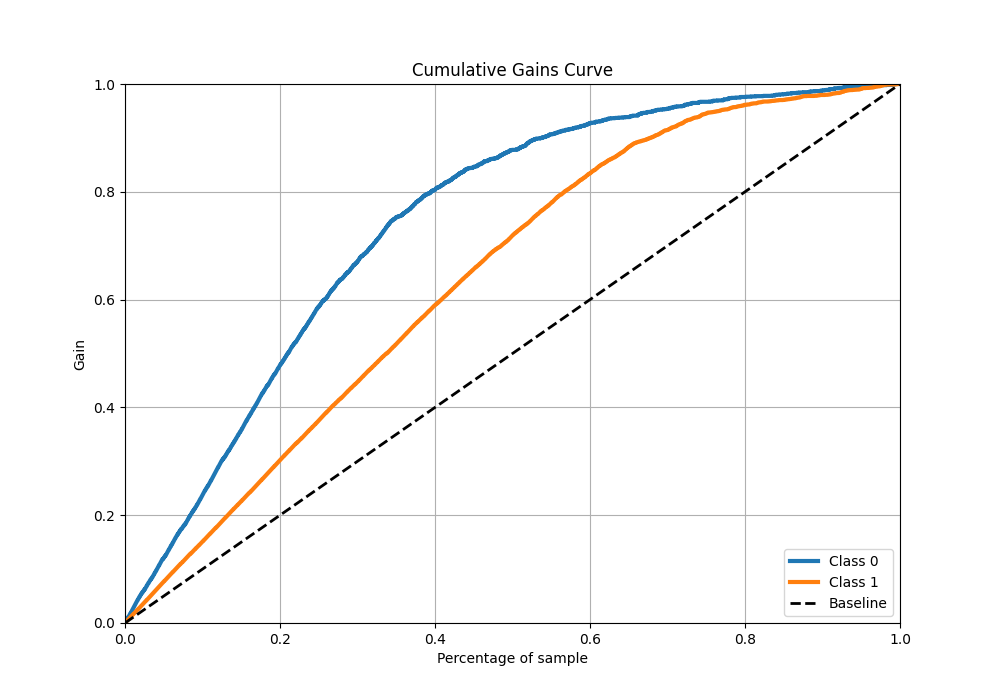
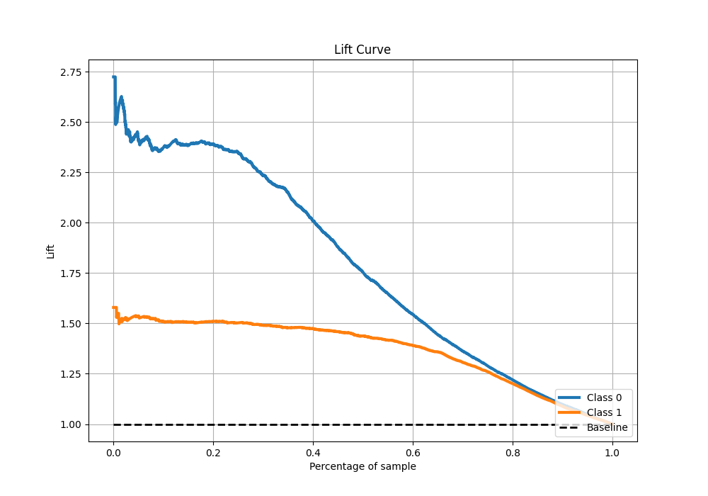

# Summary of 108_CatBoost_Stacked

[<< Go back](../README.md)

## CatBoost
- **n_jobs**: -1
- **learning_rate**: 0.2
- **depth**: 8
- **rsm**: 0.9
- **loss_function**: Logloss
- **eval_metric**: F1
- **explain_level**: 1

## Validation
 - **validation_type**: kfold
 - **k_folds**: 10
 - **shuffle**: True
 - **stratify**: True
 - **random_seed**: 12

## Optimized metric
f1

## Training time

27.2 seconds

## Metric details
|           |    score |   threshold |
|:----------|---------:|------------:|
| logloss   | 0.404482 | nan         |
| auc       | 0.885173 | nan         |
| f1        | 0.873302 |   0.502365  |
| accuracy  | 0.836637 |   0.502365  |
| precision | 0.970588 |   0.96567   |
| recall    | 1        |   0.0117173 |
| mcc       | 0.644451 |   0.502365  |

## Metric details with threshold from accuracy metric
|           |    score |   threshold |
|:----------|---------:|------------:|
| logloss   | 0.404482 |  nan        |
| auc       | 0.885173 |  nan        |
| f1        | 0.873302 |    0.502365 |
| accuracy  | 0.836637 |    0.502365 |
| precision | 0.857813 |    0.502365 |
| recall    | 0.889362 |    0.502365 |
| mcc       | 0.644451 |    0.502365 |

## Confusion matrix (at threshold=0.502365)
|              |   Predicted as 0 |   Predicted as 1 |
|:-------------|-----------------:|-----------------:|
| Labeled as 0 |             1422 |              485 |
| Labeled as 1 |              364 |             2926 |

## Learning curves

## Permutation-based Importance

## Confusion Matrix

## Normalized Confusion Matrix

## ROC Curve

## Kolmogorov-Smirnov Statistic

## Precision-Recall Curve

## Calibration Curve

## Cumulative Gains Curve

## Lift Curve

[<< Go back](../README.md)
