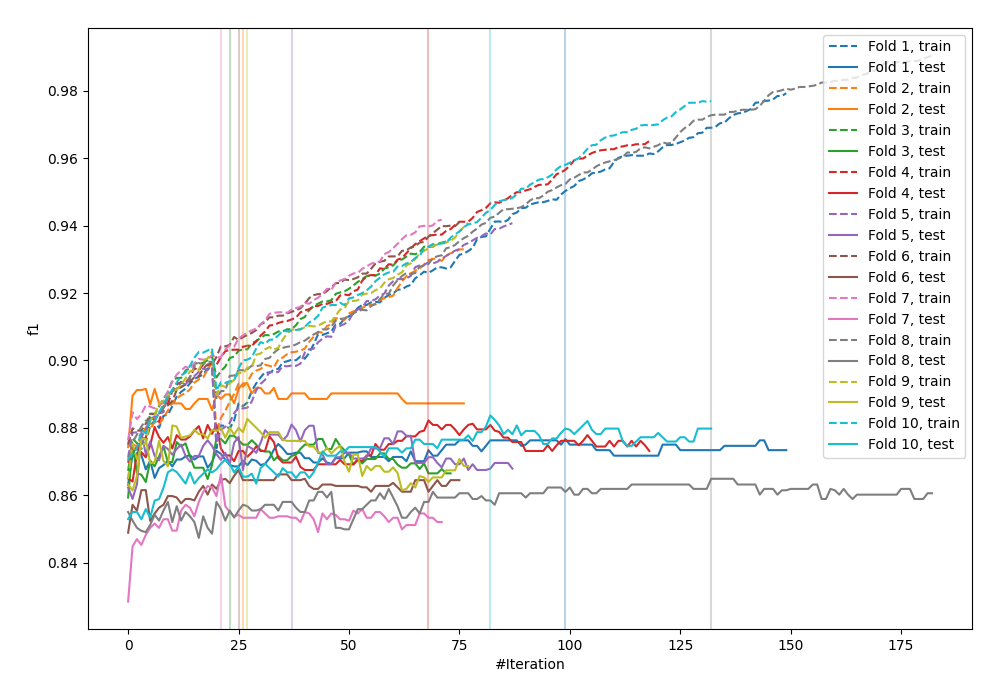
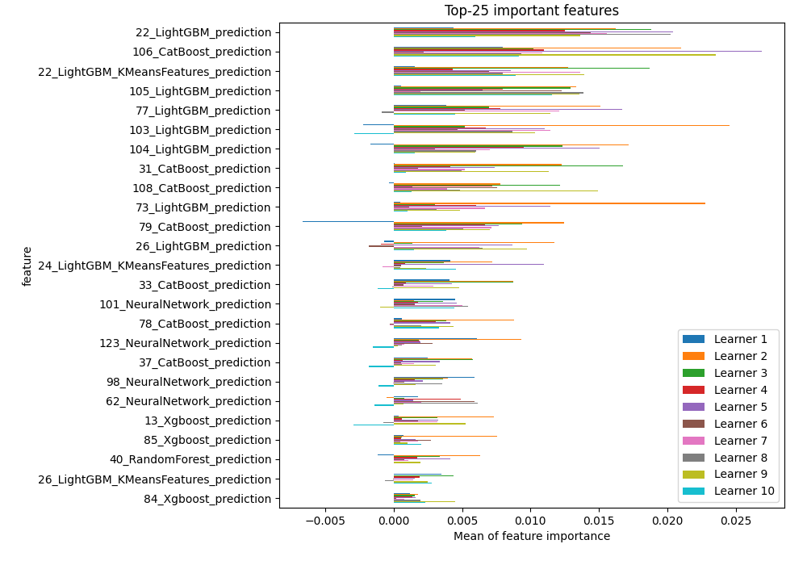
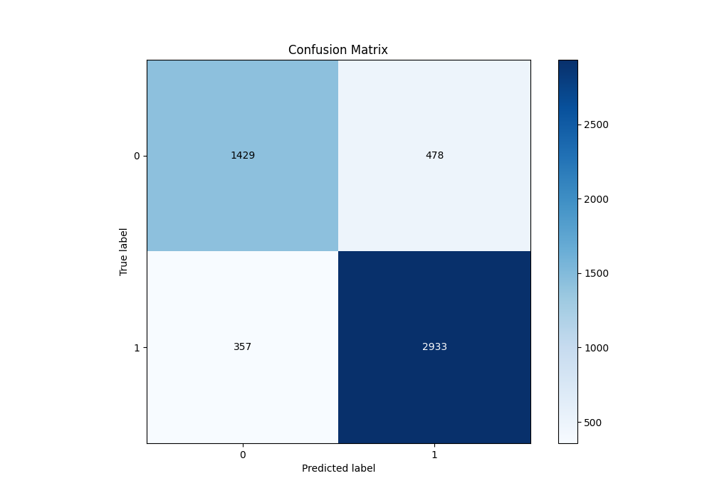
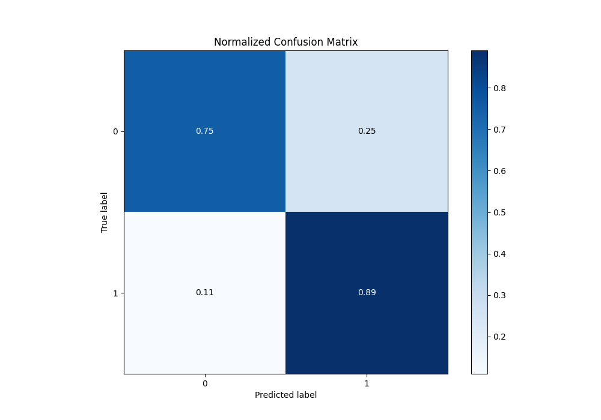
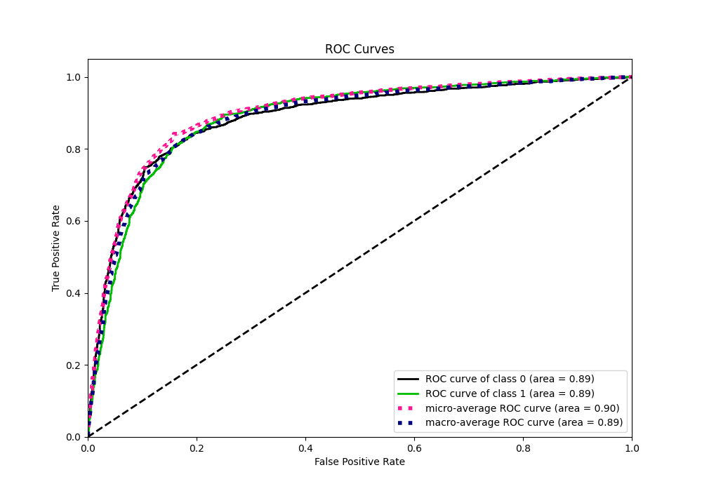
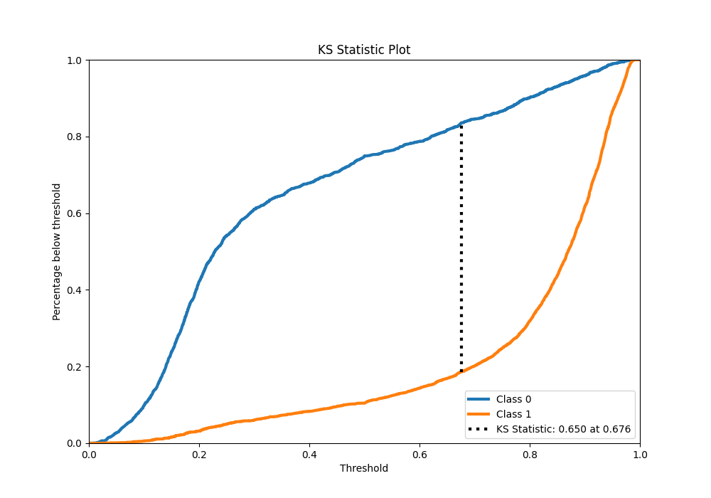
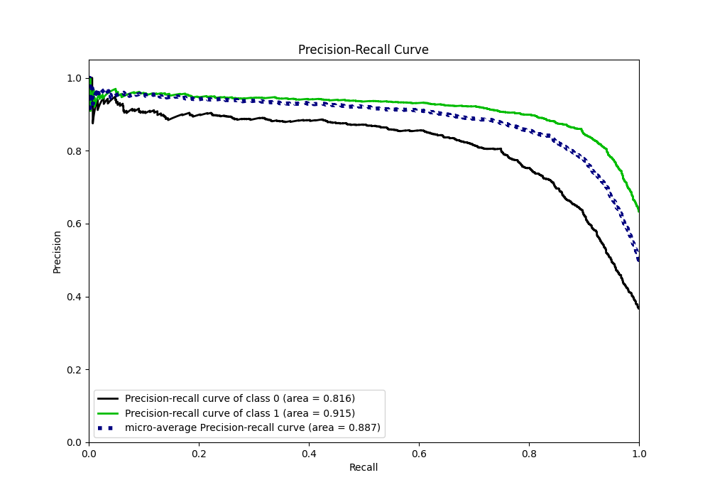
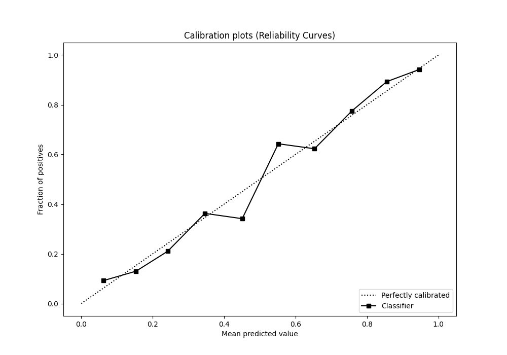
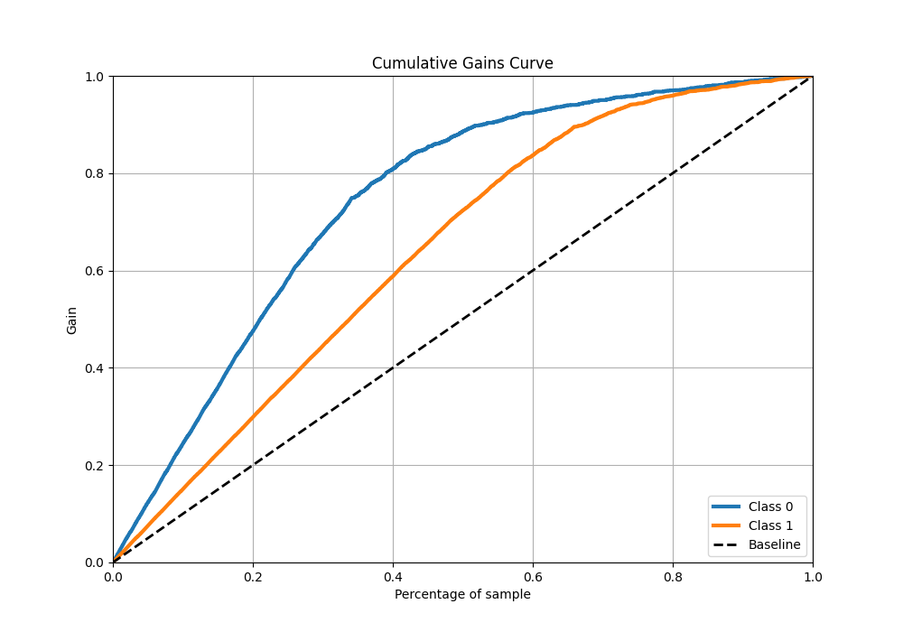
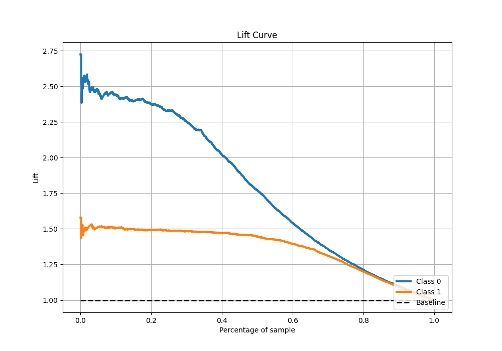

# Summary of 109_CatBoost_Stacked

[<< Go back](../README.md)

## CatBoost
- **n_jobs**: -1
- **learning_rate**: 0.1
- **depth**: 9
- **rsm**: 0.9
- **loss_function**: Logloss
- **eval_metric**: F1
- **explain_level**: 1

## Validation
 - **validation_type**: kfold
 - **k_folds**: 10
 - **shuffle**: True
 - **stratify**: True
 - **random_seed**: 12

## Optimized metric
f1

## Training time

35.8 seconds

## Metric details
|           |    score |    threshold |
|:----------|---------:|-------------:|
| logloss   | 0.402636 | nan          |
| auc       | 0.886062 | nan          |
| f1        | 0.875392 |   0.505014   |
| accuracy  | 0.83933  |   0.505014   |
| precision | 0.965753 |   0.974925   |
| recall    | 1        |   0.00895499 |
| mcc       | 0.650335 |   0.505014   |

## Metric details with threshold from accuracy metric
|           |    score |   threshold |
|:----------|---------:|------------:|
| logloss   | 0.402636 |  nan        |
| auc       | 0.886062 |  nan        |
| f1        | 0.875392 |    0.505014 |
| accuracy  | 0.83933  |    0.505014 |
| precision | 0.859865 |    0.505014 |
| recall    | 0.891489 |    0.505014 |
| mcc       | 0.650335 |    0.505014 |

## Confusion matrix (at threshold=0.505014)
|              |   Predicted as 0 |   Predicted as 1 |
|:-------------|-----------------:|-----------------:|
| Labeled as 0 |             1429 |              478 |
| Labeled as 1 |              357 |             2933 |

## Learning curves

## Permutation-based Importance

## Confusion Matrix

## Normalized Confusion Matrix

## ROC Curve

## Kolmogorov-Smirnov Statistic

## Precision-Recall Curve

## Calibration Curve

## Cumulative Gains Curve

## Lift Curve

[<< Go back](../README.md)
