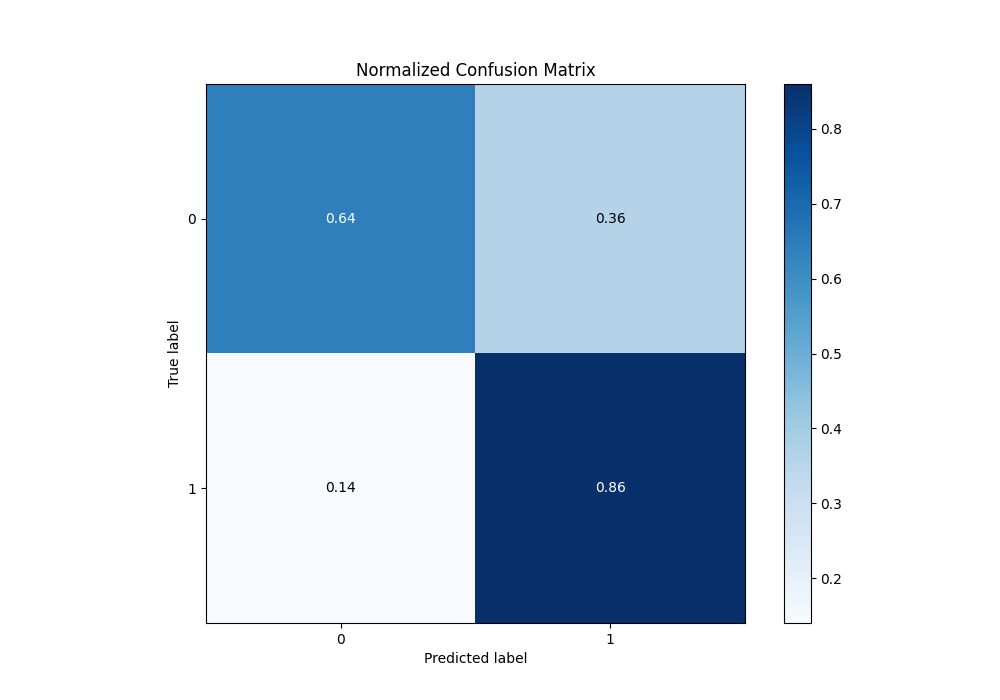
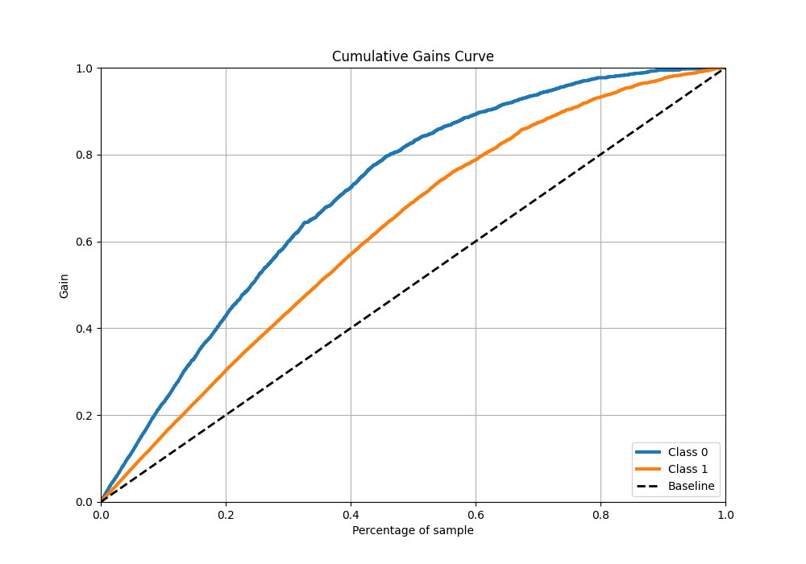

# Summary of 111_RandomForest

[<< Go back](../README.md)

## Random Forest
- **n_jobs**: -1
- **criterion**: gini
- **max_features**: 0.6
- **min_samples_split**: 40
- **max_depth**: 7
- **eval_metric_name**: f1
- **explain_level**: 1

## Validation
 - **validation_type**: kfold
 - **k_folds**: 10
 - **shuffle**: True
 - **stratify**: True
 - **random_seed**: 12

## Optimized metric
f1

## Training time

18.5 seconds

## Metric details
|           |    score |   threshold |
|:----------|---------:|------------:|
| logloss   | 0.479771 | nan         |
| auc       | 0.836653 | nan         |
| f1        | 0.830222 |   0.497201  |
| accuracy  | 0.777756 |   0.497201  |
| precision | 0.983333 |   0.962605  |
| recall    | 1        |   0.0583241 |
| mcc       | 0.51921  |   0.616094  |

## Metric details with threshold from accuracy metric
|           |    score |   threshold |
|:----------|---------:|------------:|
| logloss   | 0.479771 |  nan        |
| auc       | 0.836653 |  nan        |
| f1        | 0.830222 |    0.497201 |
| accuracy  | 0.777756 |    0.497201 |
| precision | 0.803871 |    0.497201 |
| recall    | 0.858359 |    0.497201 |
| mcc       | 0.511883 |    0.497201 |

## Confusion matrix (at threshold=0.497201)
|              |   Predicted as 0 |   Predicted as 1 |
|:-------------|-----------------:|-----------------:|
| Labeled as 0 |             1218 |              689 |
| Labeled as 1 |              466 |             2824 |

## Learning curves

## Permutation-based Importance

## Confusion Matrix

## Normalized Confusion Matrix

## ROC Curve

## Kolmogorov-Smirnov Statistic

## Precision-Recall Curve

## Calibration Curve

## Cumulative Gains Curve

## Lift Curve

[<< Go back](../README.md)
