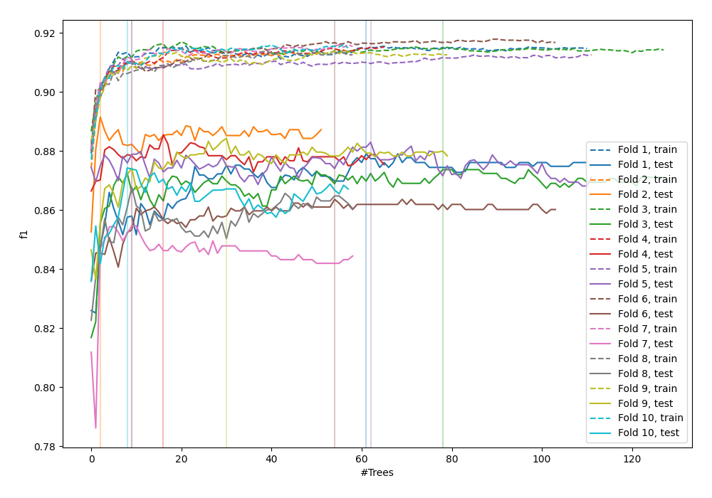
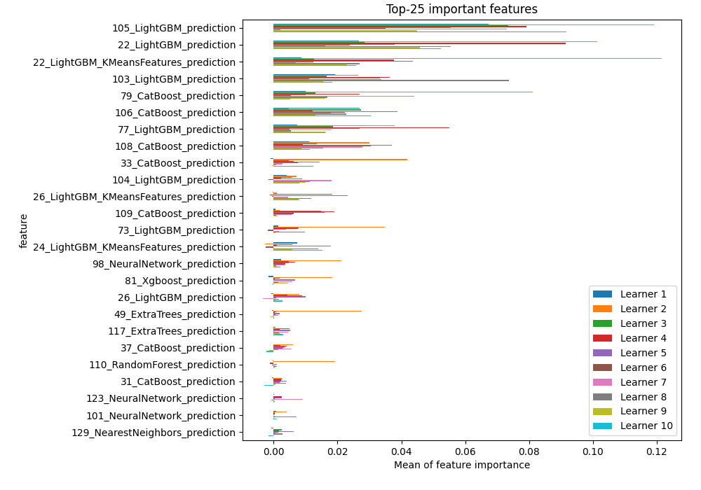
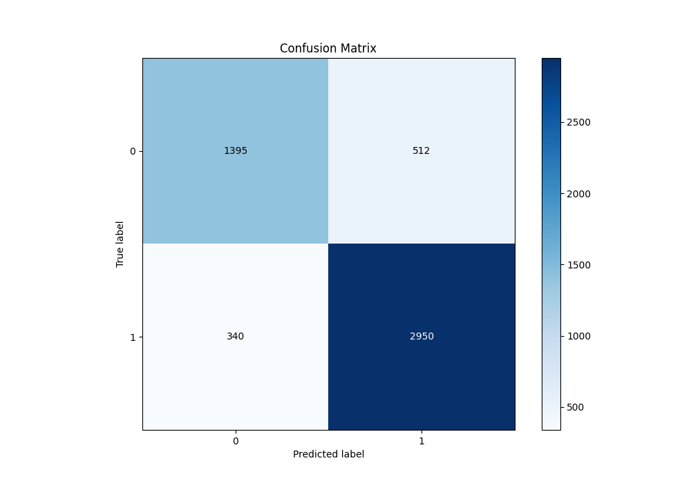
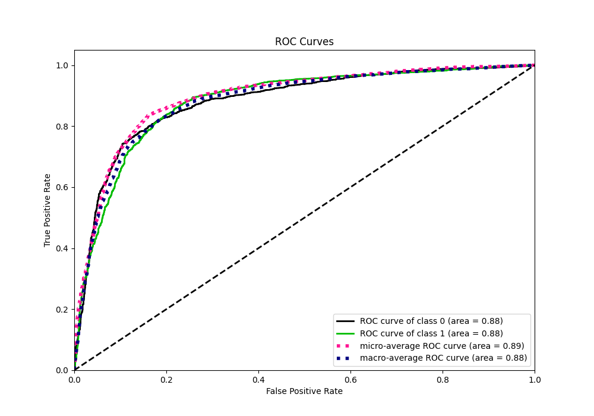
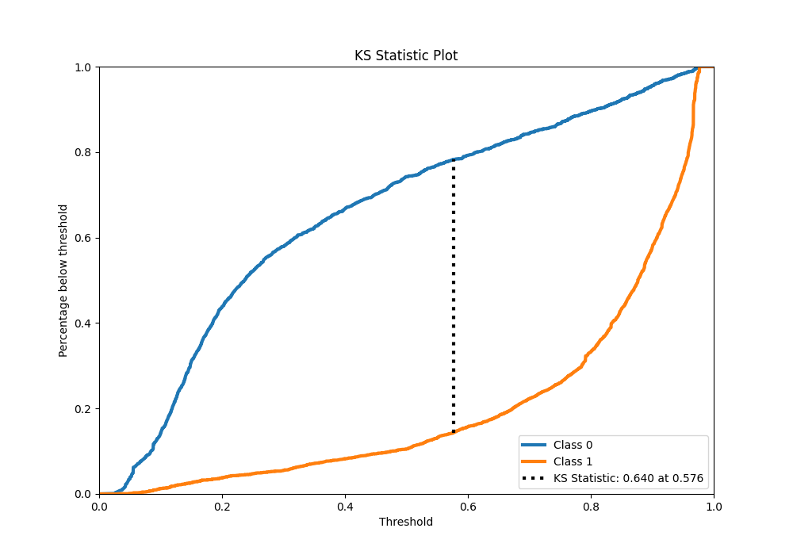
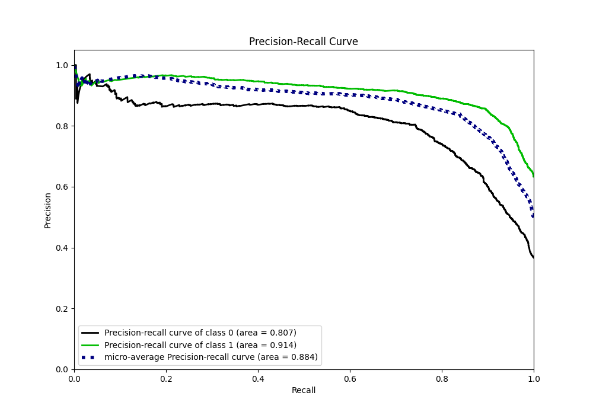
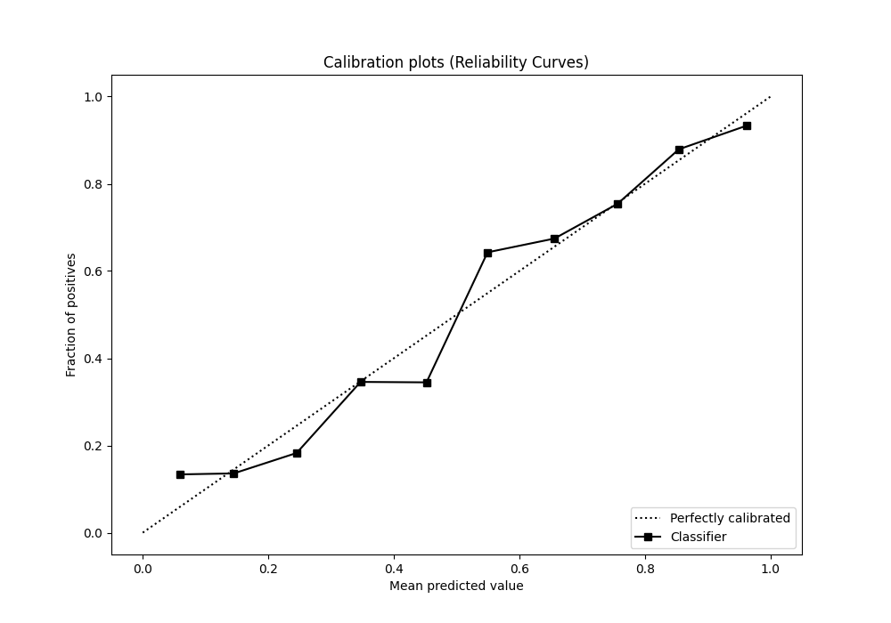
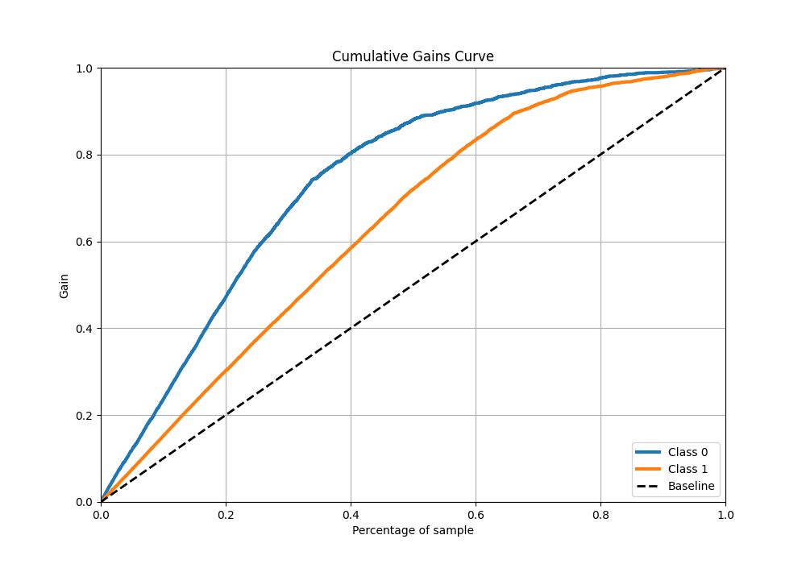
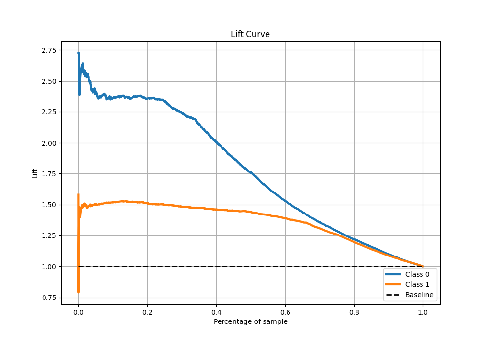

# Summary of 112_RandomForest_Stacked

[<< Go back](../README.md)

## Random Forest
- **n_jobs**: -1
- **criterion**: gini
- **max_features**: 0.8
- **min_samples_split**: 20
- **max_depth**: 7
- **eval_metric_name**: f1
- **explain_level**: 1

## Validation
 - **validation_type**: kfold
 - **k_folds**: 10
 - **shuffle**: True
 - **stratify**: True
 - **random_seed**: 12

## Optimized metric
f1

## Training time

44.6 seconds

## Metric details
|           |    score |   threshold |
|:----------|---------:|------------:|
| logloss   | 0.408711 | nan         |
| auc       | 0.882232 | nan         |
| f1        | 0.873815 |   0.489949  |
| accuracy  | 0.836059 |   0.489949  |
| precision | 0.966514 |   0.959684  |
| recall    | 1        |   0.0219382 |
| mcc       | 0.64277  |   0.510226  |

## Metric details with threshold from accuracy metric
|           |    score |   threshold |
|:----------|---------:|------------:|
| logloss   | 0.408711 |  nan        |
| auc       | 0.882232 |  nan        |
| f1        | 0.873815 |    0.489949 |
| accuracy  | 0.836059 |    0.489949 |
| precision | 0.852109 |    0.489949 |
| recall    | 0.896657 |    0.489949 |
| mcc       | 0.642005 |    0.489949 |

## Confusion matrix (at threshold=0.489949)
|              |   Predicted as 0 |   Predicted as 1 |
|:-------------|-----------------:|-----------------:|
| Labeled as 0 |             1395 |              512 |
| Labeled as 1 |              340 |             2950 |

## Learning curves

## Permutation-based Importance

## Confusion Matrix

## Normalized Confusion Matrix

## ROC Curve

## Kolmogorov-Smirnov Statistic

## Precision-Recall Curve

## Calibration Curve

## Cumulative Gains Curve

## Lift Curve

[<< Go back](../README.md)
