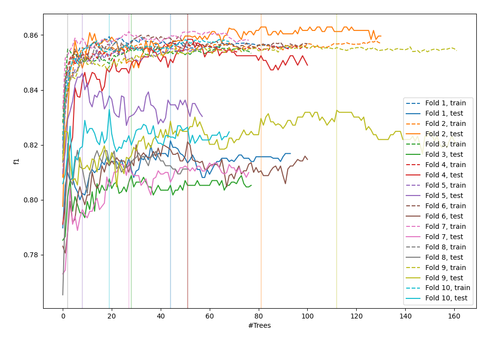
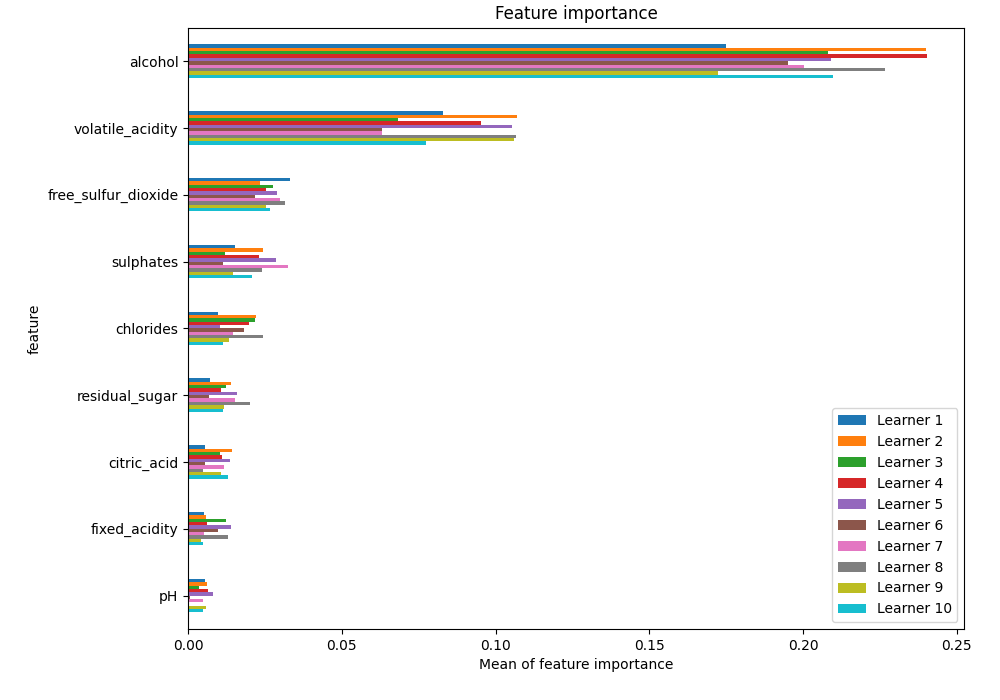
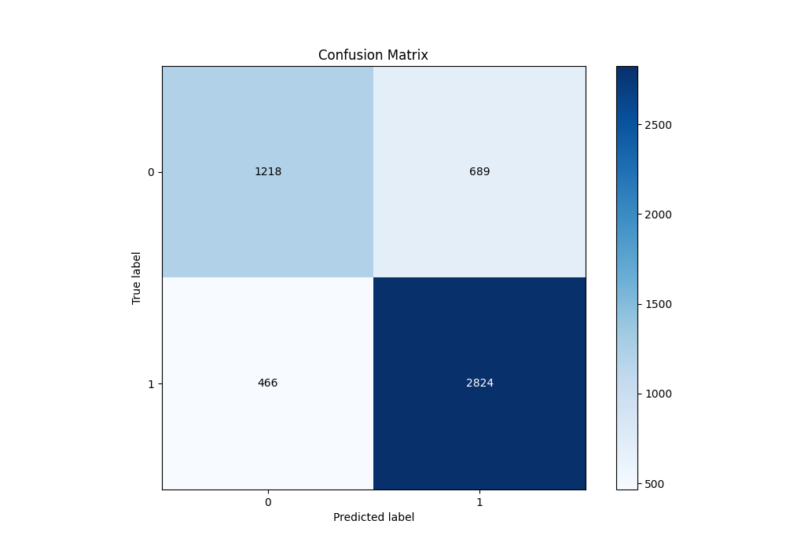
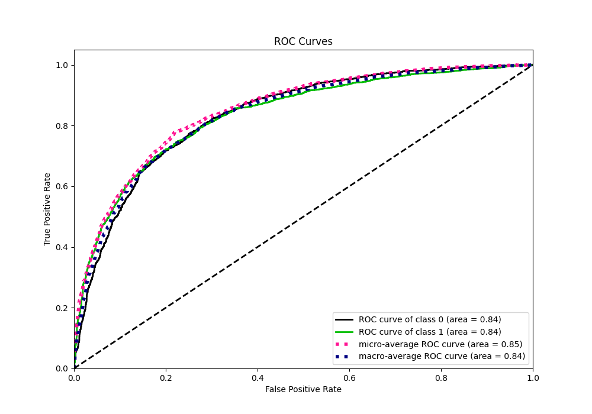
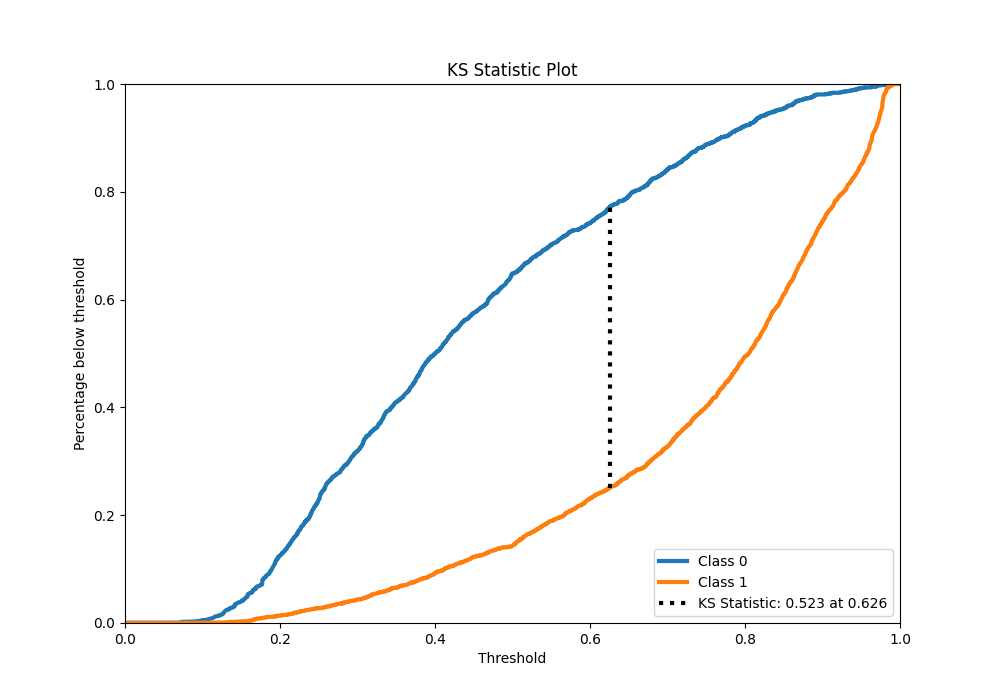
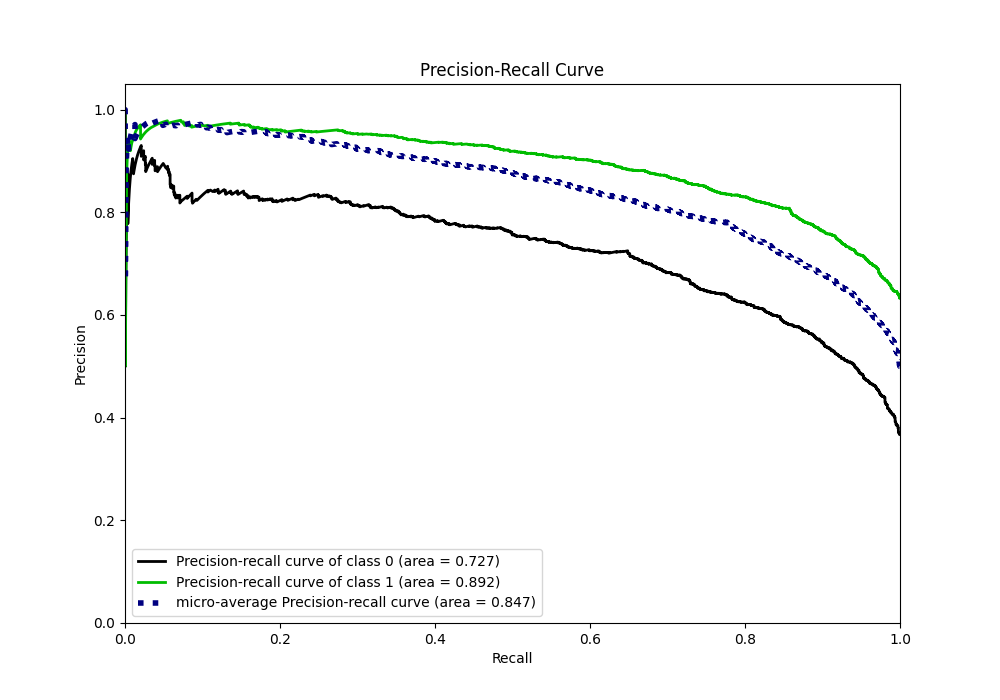
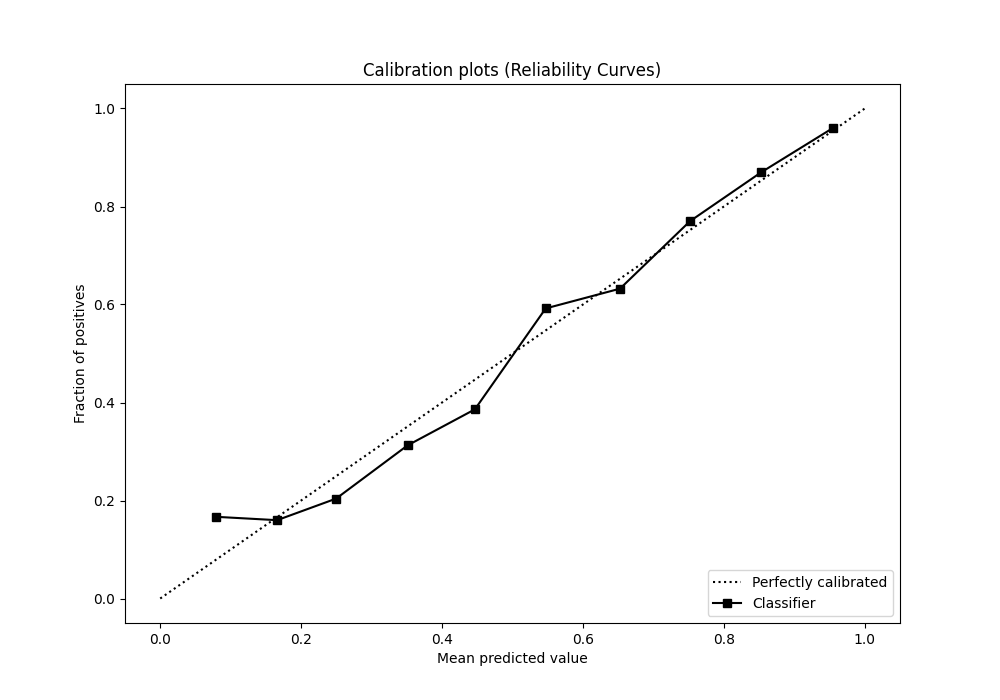
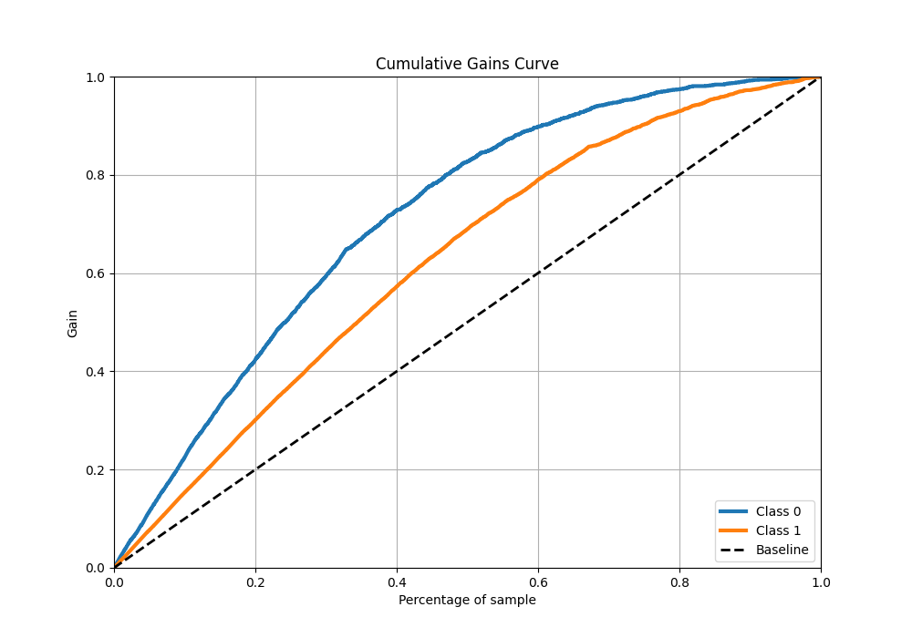
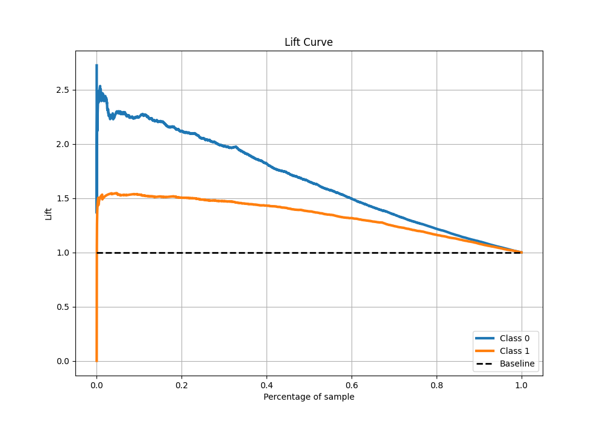

# Summary of 113_RandomForest

[<< Go back](../README.md)

## Random Forest
- **n_jobs**: -1
- **criterion**: gini
- **max_features**: 0.8
- **min_samples_split**: 40
- **max_depth**: 7
- **eval_metric_name**: f1
- **explain_level**: 1

## Validation
 - **validation_type**: kfold
 - **k_folds**: 10
 - **shuffle**: True
 - **stratify**: True
 - **random_seed**: 12

## Optimized metric
f1

## Training time

18.4 seconds

## Metric details
|           |    score |   threshold |
|:----------|---------:|------------:|
| logloss   | 0.481107 |  nan        |
| auc       | 0.83578  |  nan        |
| f1        | 0.830222 |    0.49652  |
| accuracy  | 0.777756 |    0.49652  |
| precision | 0.975904 |    0.970937 |
| recall    | 1        |    0        |
| mcc       | 0.512479 |    0.505382 |

## Metric details with threshold from accuracy metric
|           |    score |   threshold |
|:----------|---------:|------------:|
| logloss   | 0.481107 |   nan       |
| auc       | 0.83578  |   nan       |
| f1        | 0.830222 |     0.49652 |
| accuracy  | 0.777756 |     0.49652 |
| precision | 0.803871 |     0.49652 |
| recall    | 0.858359 |     0.49652 |
| mcc       | 0.511883 |     0.49652 |

## Confusion matrix (at threshold=0.49652)
|              |   Predicted as 0 |   Predicted as 1 |
|:-------------|-----------------:|-----------------:|
| Labeled as 0 |             1218 |              689 |
| Labeled as 1 |              466 |             2824 |

## Learning curves

## Permutation-based Importance

## Confusion Matrix

## Normalized Confusion Matrix

## ROC Curve

## Kolmogorov-Smirnov Statistic

## Precision-Recall Curve

## Calibration Curve

## Cumulative Gains Curve

## Lift Curve

[<< Go back](../README.md)
