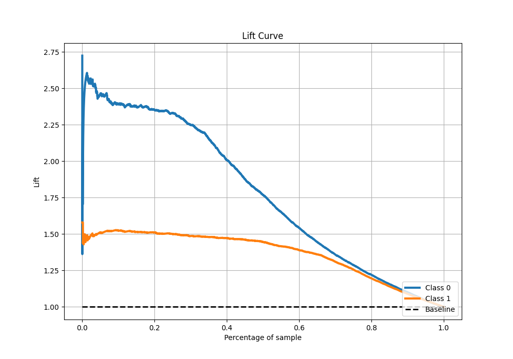

# Summary of 113_RandomForest_Stacked

[<< Go back](../README.md)

## Random Forest
- **n_jobs**: -1
- **criterion**: gini
- **max_features**: 0.8
- **min_samples_split**: 40
- **max_depth**: 7
- **eval_metric_name**: f1
- **explain_level**: 1

## Validation
 - **validation_type**: kfold
 - **k_folds**: 10
 - **shuffle**: True
 - **stratify**: True
 - **random_seed**: 12

## Optimized metric
f1

## Training time

43.2 seconds

## Metric details
|           |    score |   threshold |
|:----------|---------:|------------:|
| logloss   | 0.403215 | nan         |
| auc       | 0.885539 | nan         |
| f1        | 0.875    |   0.489189  |
| accuracy  | 0.838176 |   0.511508  |
| precision | 0.96627  |   0.95869   |
| recall    | 1        |   0.0209526 |
| mcc       | 0.647813 |   0.511508  |

## Metric details with threshold from accuracy metric
|           |    score |   threshold |
|:----------|---------:|------------:|
| logloss   | 0.403215 |  nan        |
| auc       | 0.885539 |  nan        |
| f1        | 0.874496 |    0.511508 |
| accuracy  | 0.838176 |    0.511508 |
| precision | 0.858986 |    0.511508 |
| recall    | 0.890578 |    0.511508 |
| mcc       | 0.647813 |    0.511508 |

## Confusion matrix (at threshold=0.511508)
|              |   Predicted as 0 |   Predicted as 1 |
|:-------------|-----------------:|-----------------:|
| Labeled as 0 |             1426 |              481 |
| Labeled as 1 |              360 |             2930 |

## Learning curves

## Permutation-based Importance

## Confusion Matrix

## Normalized Confusion Matrix

## ROC Curve

## Kolmogorov-Smirnov Statistic

## Precision-Recall Curve

## Calibration Curve

## Cumulative Gains Curve

## Lift Curve

[<< Go back](../README.md)
