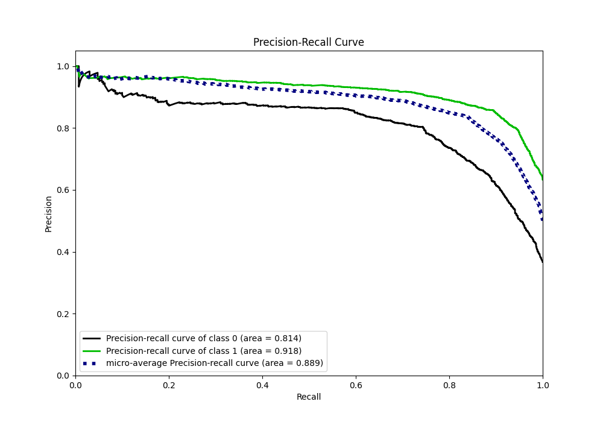

# Summary of 114_RandomForest_Stacked

[<< Go back](../README.md)

## Random Forest
- **n_jobs**: -1
- **criterion**: gini
- **max_features**: 0.7
- **min_samples_split**: 20
- **max_depth**: 7
- **eval_metric_name**: f1
- **explain_level**: 1

## Validation
 - **validation_type**: kfold
 - **k_folds**: 10
 - **shuffle**: True
 - **stratify**: True
 - **random_seed**: 12

## Optimized metric
f1

## Training time

44.3 seconds

## Metric details
|           |    score |   threshold |
|:----------|---------:|------------:|
| logloss   | 0.404033 | nan         |
| auc       | 0.885241 | nan         |
| f1        | 0.874408 |   0.489138  |
| accuracy  | 0.837021 |   0.508569  |
| precision | 0.965616 |   0.967509  |
| recall    | 1        |   0.0121695 |
| mcc       | 0.645291 |   0.508569  |

## Metric details with threshold from accuracy metric
|           |    score |   threshold |
|:----------|---------:|------------:|
| logloss   | 0.404033 |  nan        |
| auc       | 0.885241 |  nan        |
| f1        | 0.873601 |    0.508569 |
| accuracy  | 0.837021 |    0.508569 |
| precision | 0.858106 |    0.508569 |
| recall    | 0.889666 |    0.508569 |
| mcc       | 0.645291 |    0.508569 |

## Confusion matrix (at threshold=0.508569)
|              |   Predicted as 0 |   Predicted as 1 |
|:-------------|-----------------:|-----------------:|
| Labeled as 0 |             1423 |              484 |
| Labeled as 1 |              363 |             2927 |

## Learning curves

## Permutation-based Importance

## Confusion Matrix

## Normalized Confusion Matrix

## ROC Curve

## Kolmogorov-Smirnov Statistic

## Precision-Recall Curve

## Calibration Curve

## Cumulative Gains Curve

## Lift Curve

[<< Go back](../README.md)
