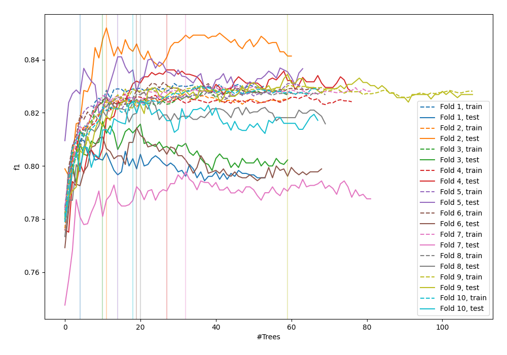
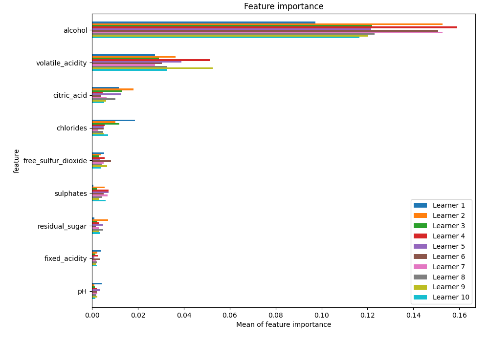
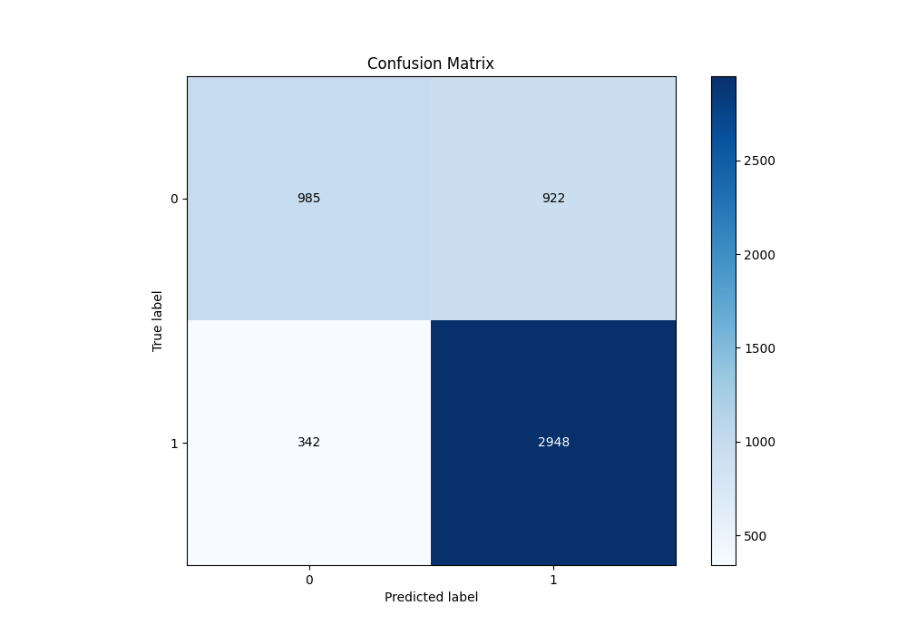
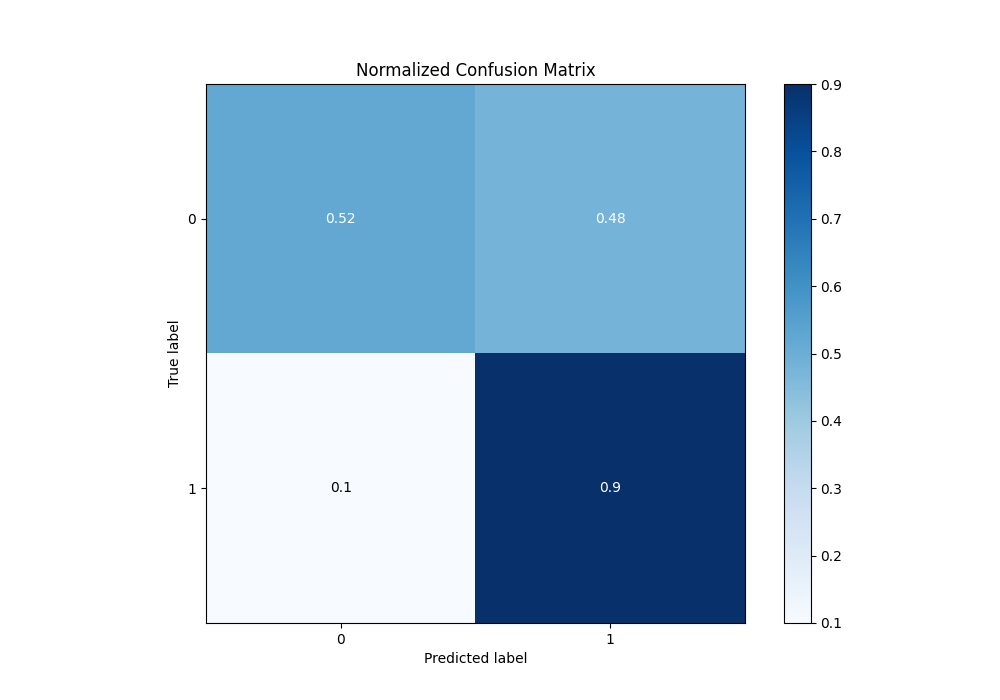
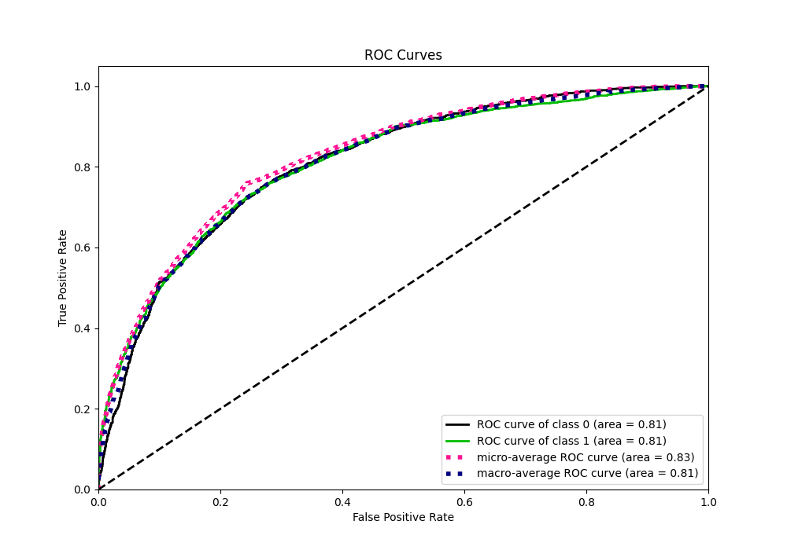
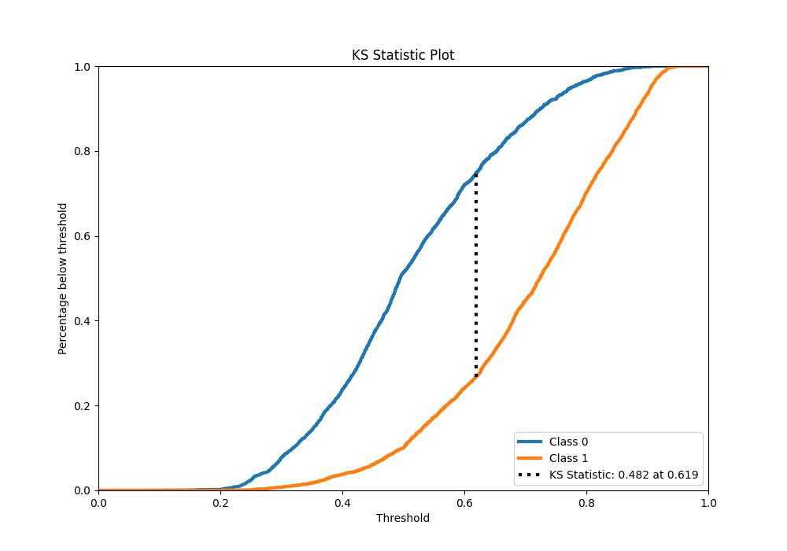
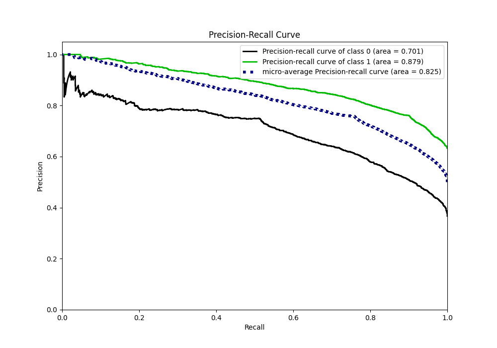
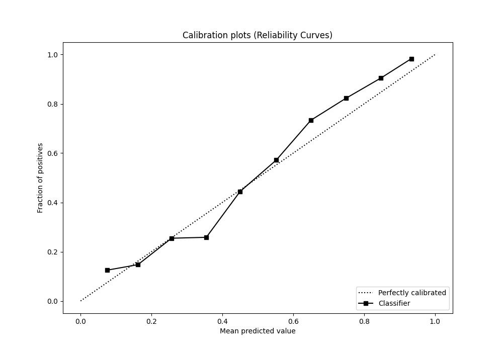
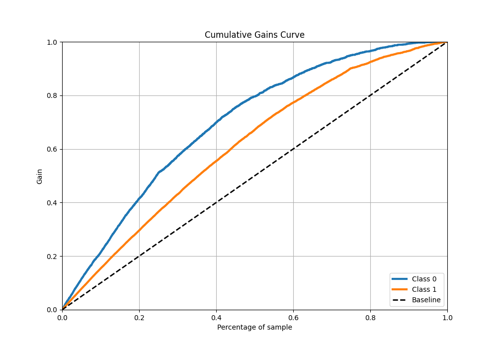
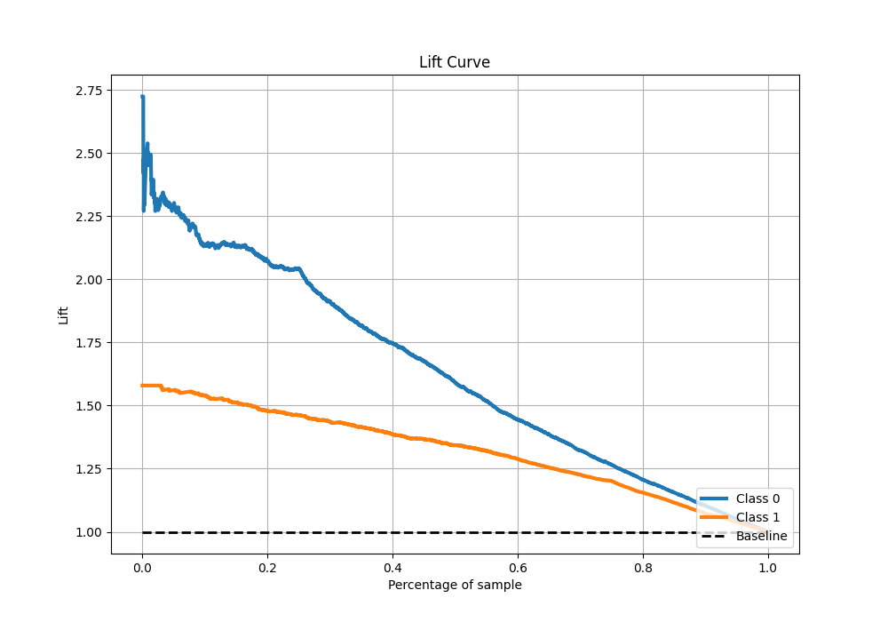

# Summary of 117_ExtraTrees

[<< Go back](../README.md)

## Extra Trees Classifier (Extra Trees)
- **n_jobs**: -1
- **criterion**: gini
- **max_features**: 0.6
- **min_samples_split**: 40
- **max_depth**: 7
- **eval_metric_name**: f1
- **explain_level**: 1

## Validation
 - **validation_type**: kfold
 - **k_folds**: 10
 - **shuffle**: True
 - **stratify**: True
 - **random_seed**: 12

## Optimized metric
f1

## Training time

17.0 seconds

## Metric details
|           |    score |   threshold |
|:----------|---------:|------------:|
| logloss   | 0.525263 |  nan        |
| auc       | 0.812283 |  nan        |
| f1        | 0.823742 |    0.495165 |
| accuracy  | 0.756783 |    0.502091 |
| precision | 1        |    0.908013 |
| recall    | 1        |    0.124901 |
| mcc       | 0.466049 |    0.597027 |

## Metric details with threshold from accuracy metric
|           |    score |   threshold |
|:----------|---------:|------------:|
| logloss   | 0.525263 |  nan        |
| auc       | 0.812283 |  nan        |
| f1        | 0.823464 |    0.502091 |
| accuracy  | 0.756783 |    0.502091 |
| precision | 0.761757 |    0.502091 |
| recall    | 0.896049 |    0.502091 |
| mcc       | 0.456012 |    0.502091 |

## Confusion matrix (at threshold=0.502091)
|              |   Predicted as 0 |   Predicted as 1 |
|:-------------|-----------------:|-----------------:|
| Labeled as 0 |              985 |              922 |
| Labeled as 1 |              342 |             2948 |

## Learning curves

## Permutation-based Importance

## Confusion Matrix

## Normalized Confusion Matrix

## ROC Curve

## Kolmogorov-Smirnov Statistic

## Precision-Recall Curve

## Calibration Curve

## Cumulative Gains Curve

## Lift Curve

[<< Go back](../README.md)
