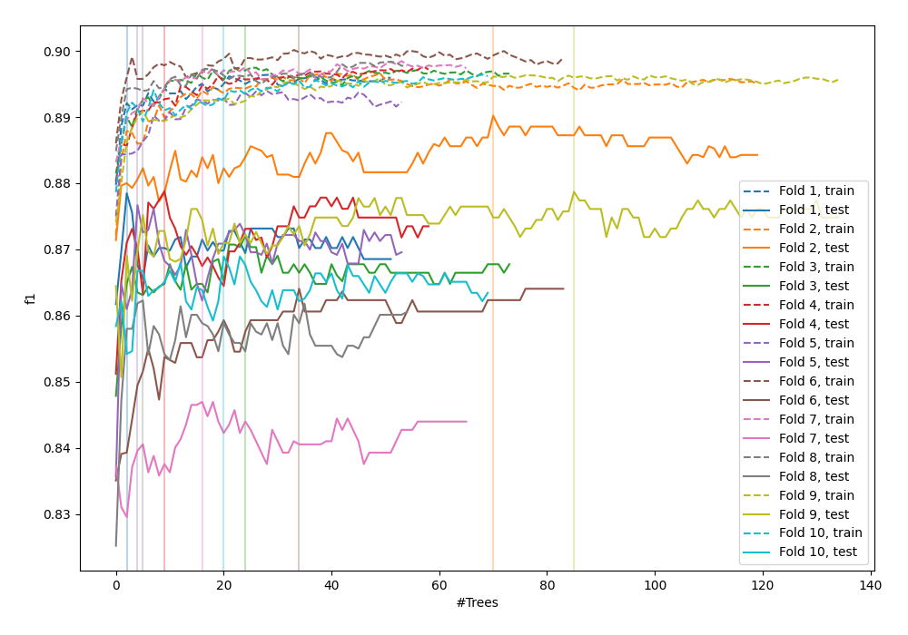
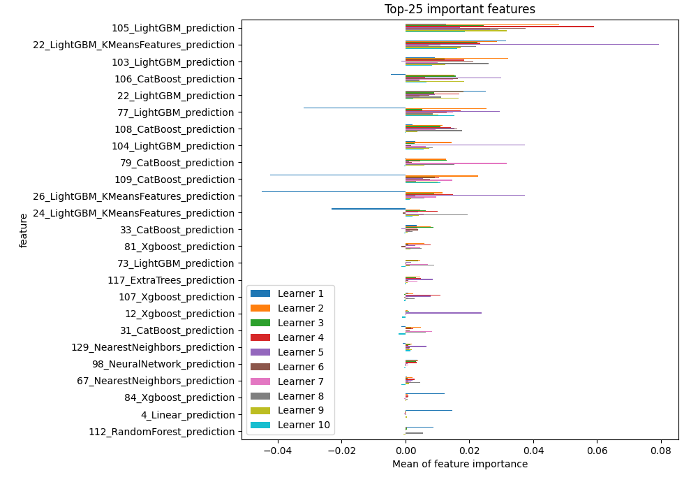
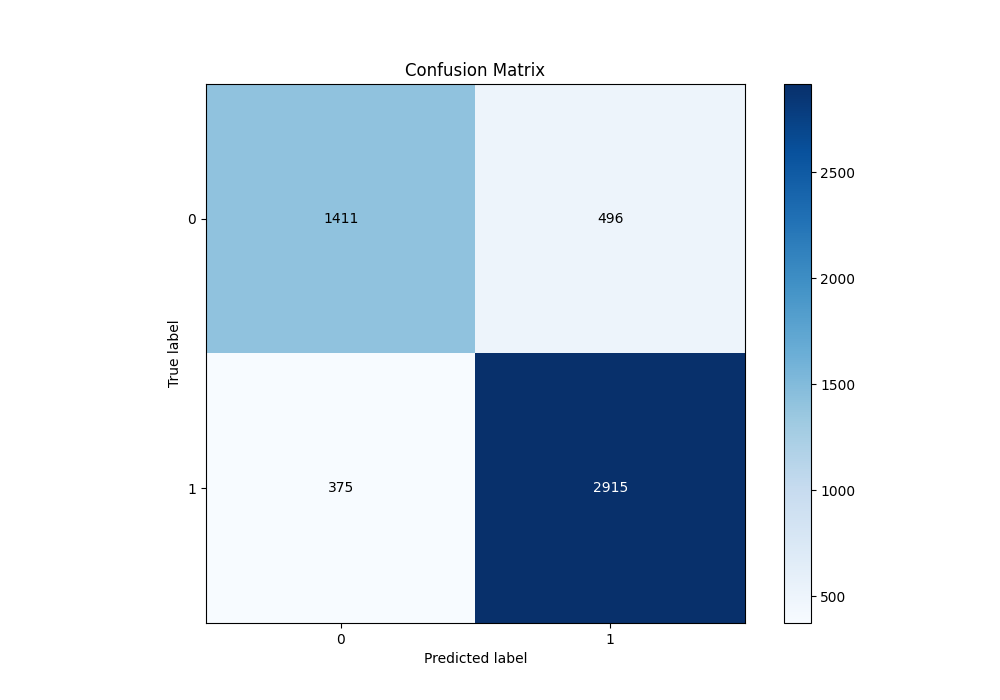
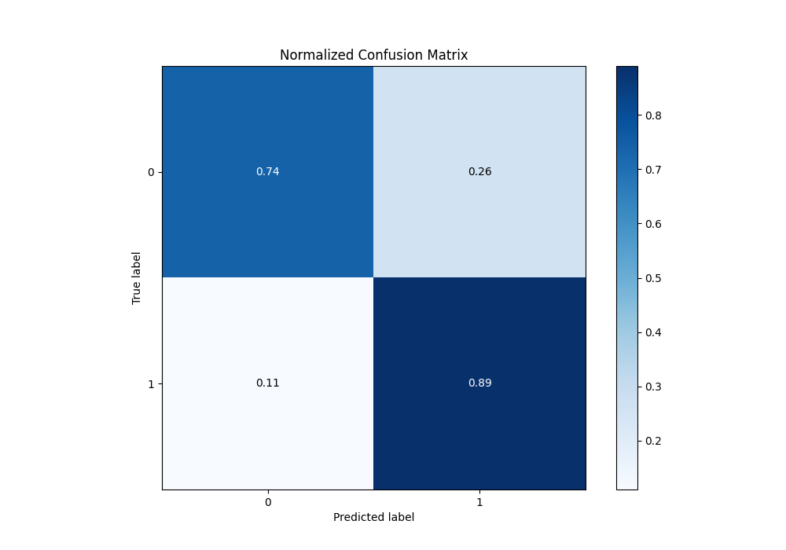
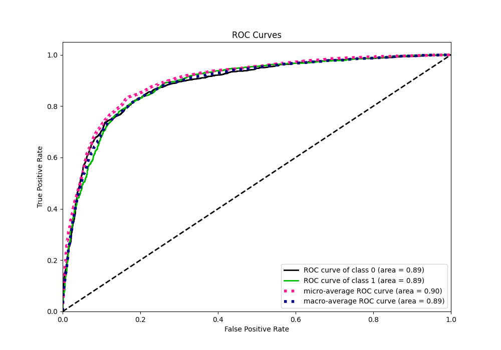
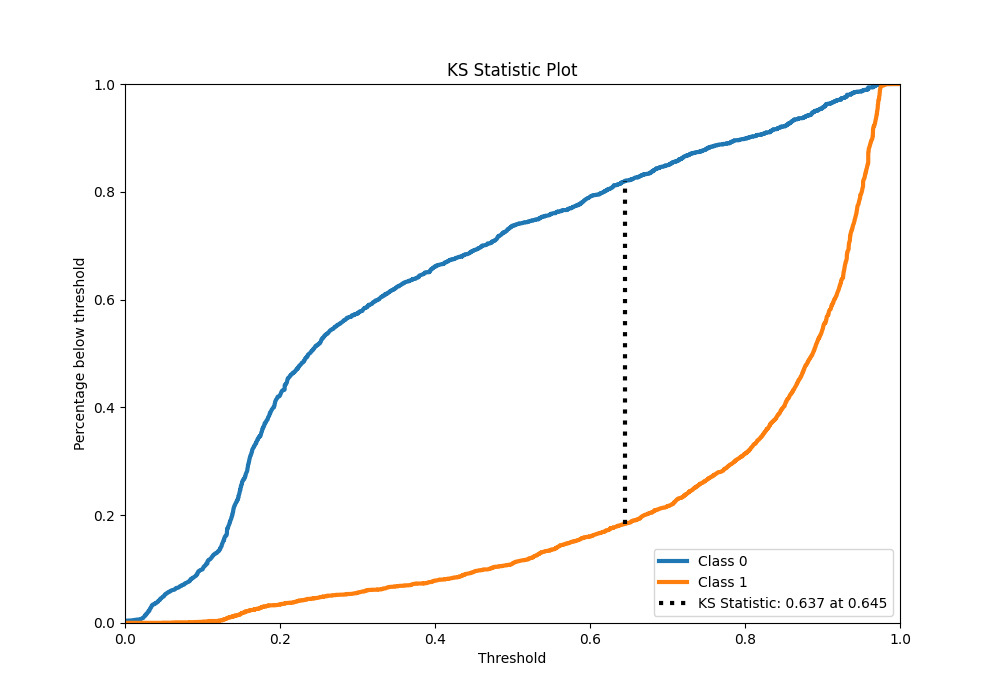
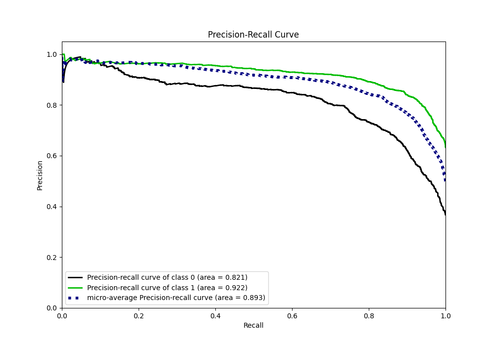
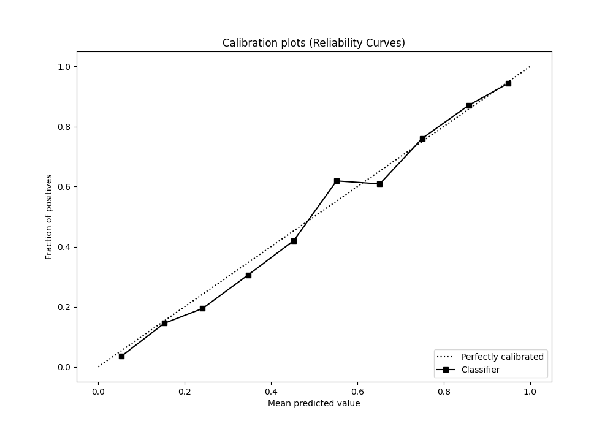
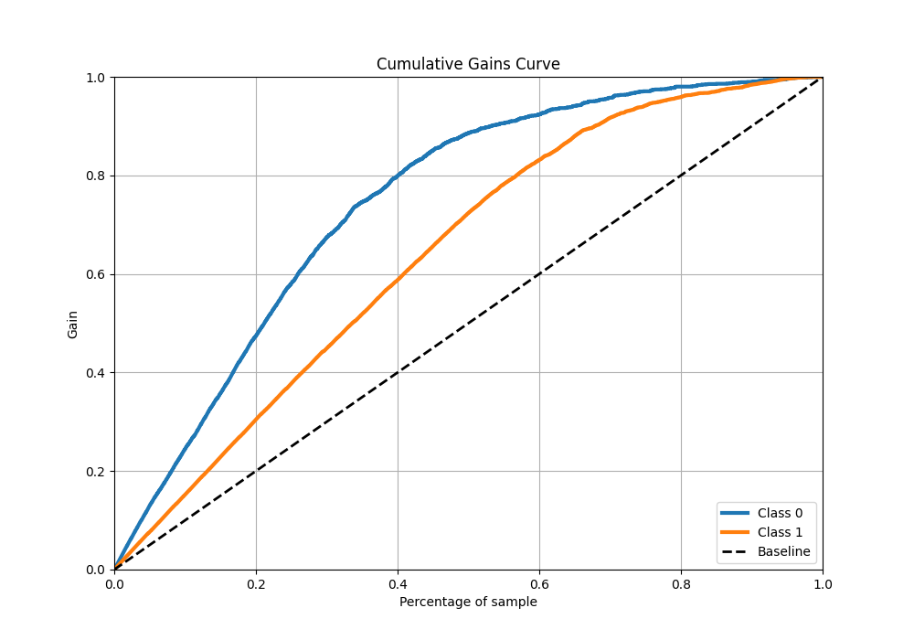
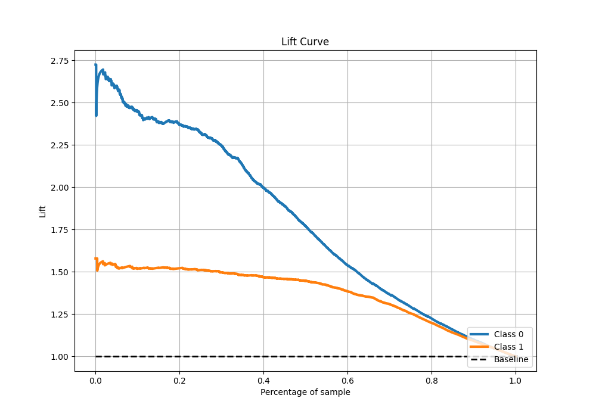

# Summary of 117_ExtraTrees_Stacked

[<< Go back](../README.md)

## Extra Trees Classifier (Extra Trees)
- **n_jobs**: -1
- **criterion**: gini
- **max_features**: 0.6
- **min_samples_split**: 40
- **max_depth**: 7
- **eval_metric_name**: f1
- **explain_level**: 1

## Validation
 - **validation_type**: kfold
 - **k_folds**: 10
 - **shuffle**: True
 - **stratify**: True
 - **random_seed**: 12

## Optimized metric
f1

## Training time

28.2 seconds

## Metric details
|           |    score |   threshold |
|:----------|---------:|------------:|
| logloss   | 0.403747 |  nan        |
| auc       | 0.887153 |  nan        |
| f1        | 0.870557 |    0.490865 |
| accuracy  | 0.832403 |    0.506377 |
| precision | 0.979798 |    0.969474 |
| recall    | 0.999696 |    0        |
| mcc       | 0.635204 |    0.506377 |

## Metric details with threshold from accuracy metric
|           |    score |   threshold |
|:----------|---------:|------------:|
| logloss   | 0.403747 |  nan        |
| auc       | 0.887153 |  nan        |
| f1        | 0.870019 |    0.506377 |
| accuracy  | 0.832403 |    0.506377 |
| precision | 0.854588 |    0.506377 |
| recall    | 0.886018 |    0.506377 |
| mcc       | 0.635204 |    0.506377 |

## Confusion matrix (at threshold=0.506377)
|              |   Predicted as 0 |   Predicted as 1 |
|:-------------|-----------------:|-----------------:|
| Labeled as 0 |             1411 |              496 |
| Labeled as 1 |              375 |             2915 |

## Learning curves

## Permutation-based Importance

## Confusion Matrix

## Normalized Confusion Matrix

## ROC Curve

## Kolmogorov-Smirnov Statistic

## Precision-Recall Curve

## Calibration Curve

## Cumulative Gains Curve

## Lift Curve

[<< Go back](../README.md)
