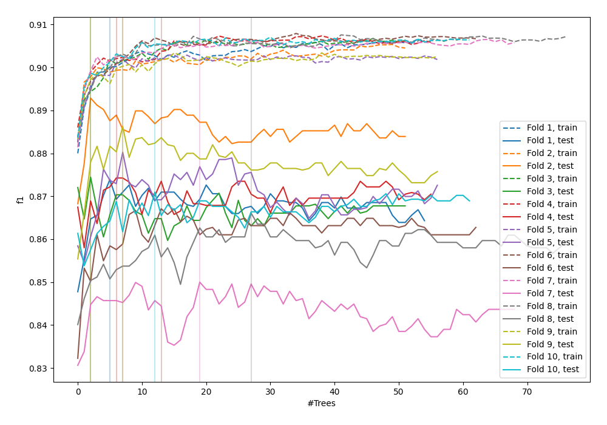
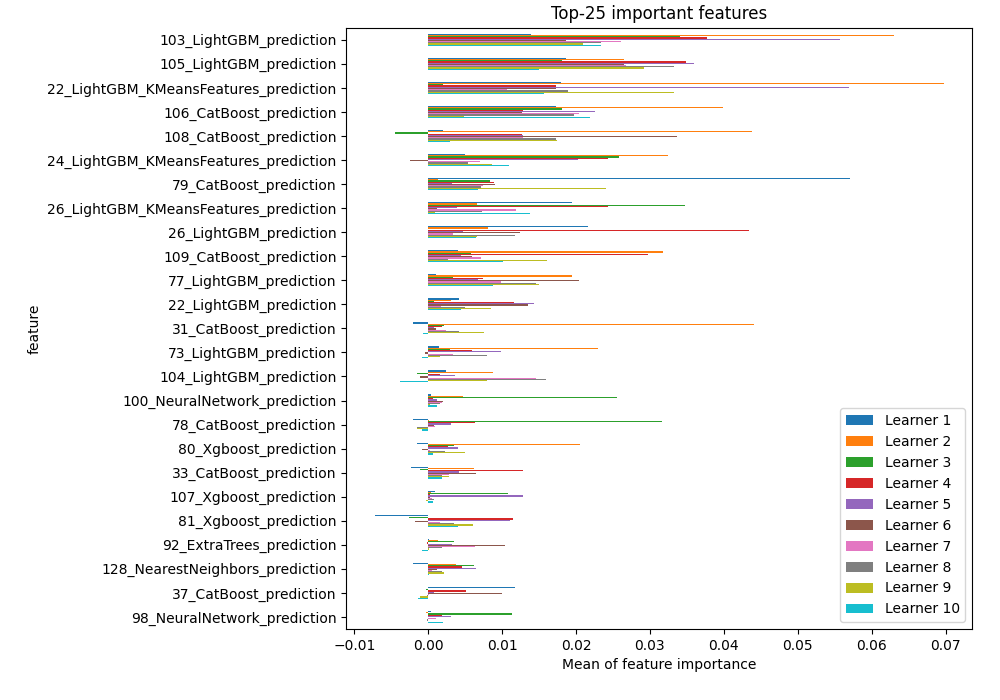
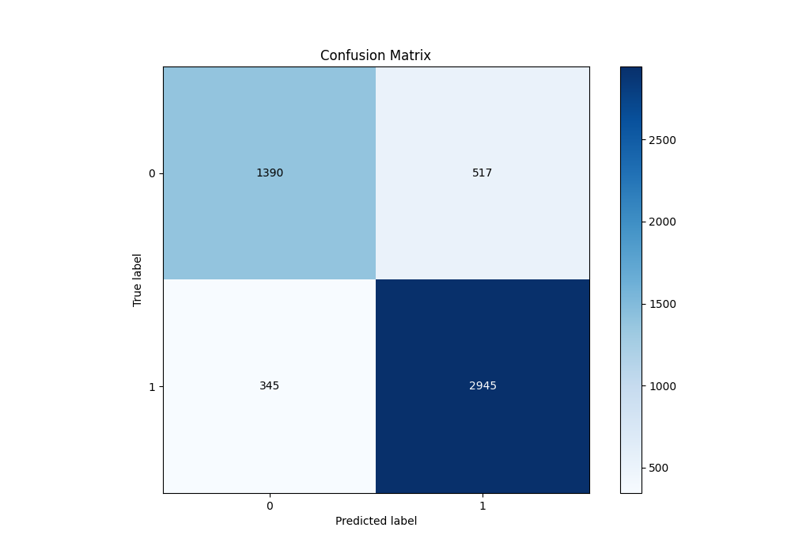
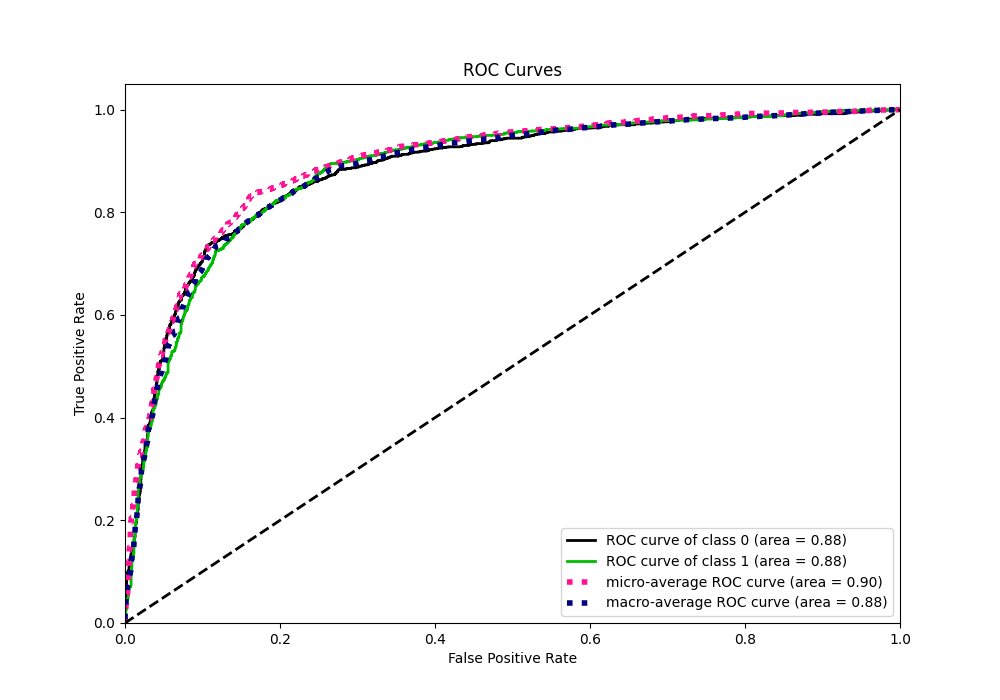
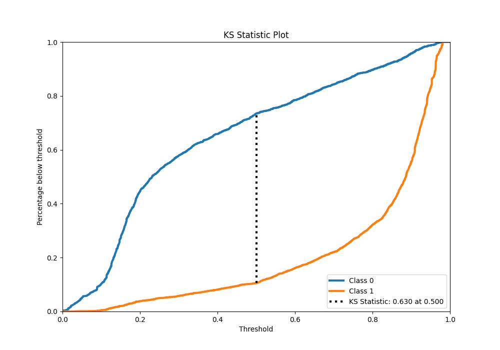
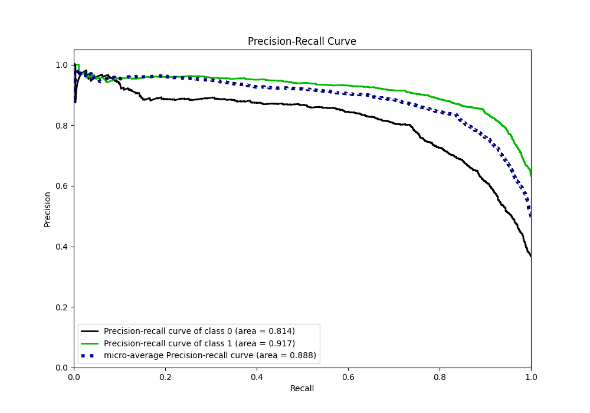
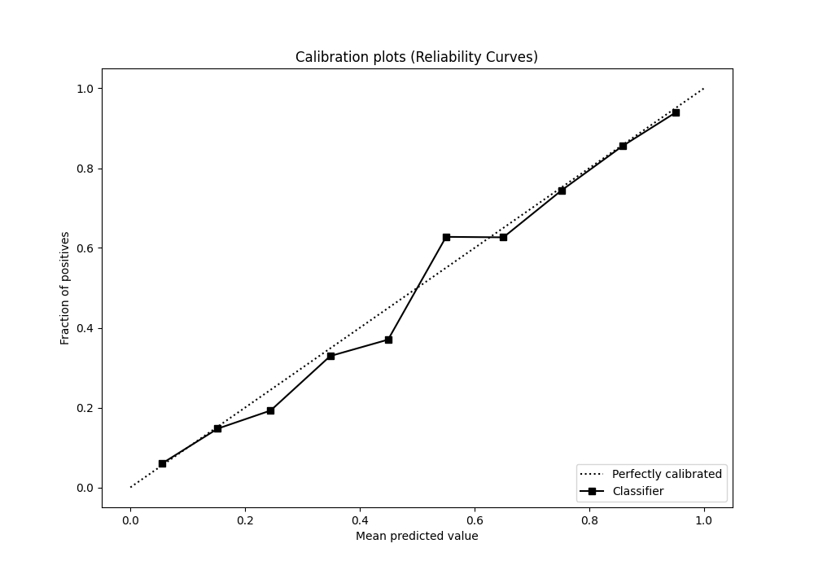
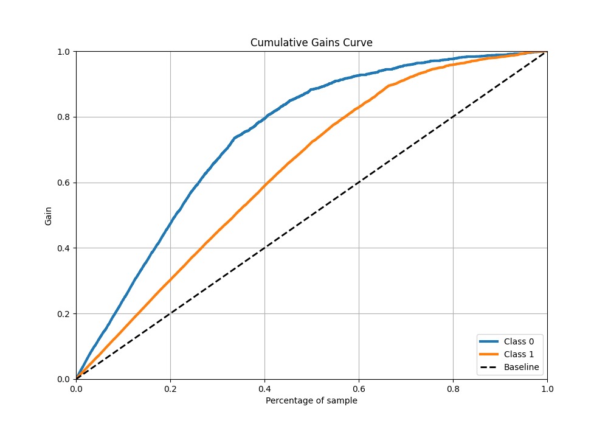
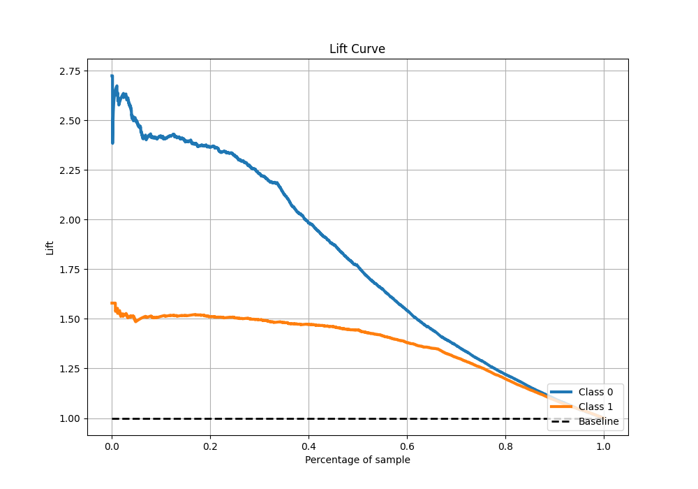

# Summary of 118_ExtraTrees_Stacked

[<< Go back](../README.md)

## Extra Trees Classifier (Extra Trees)
- **n_jobs**: -1
- **criterion**: gini
- **max_features**: 0.7
- **min_samples_split**: 20
- **max_depth**: 7
- **eval_metric_name**: f1
- **explain_level**: 1

## Validation
 - **validation_type**: kfold
 - **k_folds**: 10
 - **shuffle**: True
 - **stratify**: True
 - **random_seed**: 12

## Optimized metric
f1

## Training time

27.3 seconds

## Metric details
|           |    score |   threshold |
|:----------|---------:|------------:|
| logloss   | 0.406643 |  nan        |
| auc       | 0.884106 |  nan        |
| f1        | 0.872334 |    0.494961 |
| accuracy  | 0.834135 |    0.494961 |
| precision | 0.965986 |    0.970315 |
| recall    | 1        |    0        |
| mcc       | 0.637772 |    0.494961 |

## Metric details with threshold from accuracy metric
|           |    score |   threshold |
|:----------|---------:|------------:|
| logloss   | 0.406643 |  nan        |
| auc       | 0.884106 |  nan        |
| f1        | 0.872334 |    0.494961 |
| accuracy  | 0.834135 |    0.494961 |
| precision | 0.850664 |    0.494961 |
| recall    | 0.895137 |    0.494961 |
| mcc       | 0.637772 |    0.494961 |

## Confusion matrix (at threshold=0.494961)
|              |   Predicted as 0 |   Predicted as 1 |
|:-------------|-----------------:|-----------------:|
| Labeled as 0 |             1390 |              517 |
| Labeled as 1 |              345 |             2945 |

## Learning curves

## Permutation-based Importance

## Confusion Matrix

## Normalized Confusion Matrix

## ROC Curve

## Kolmogorov-Smirnov Statistic

## Precision-Recall Curve

## Calibration Curve

## Cumulative Gains Curve

## Lift Curve

[<< Go back](../README.md)
