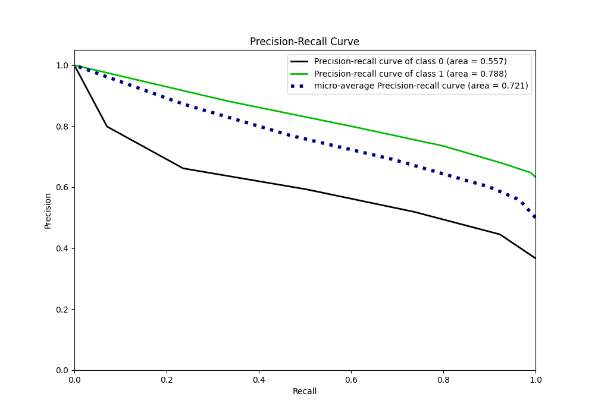
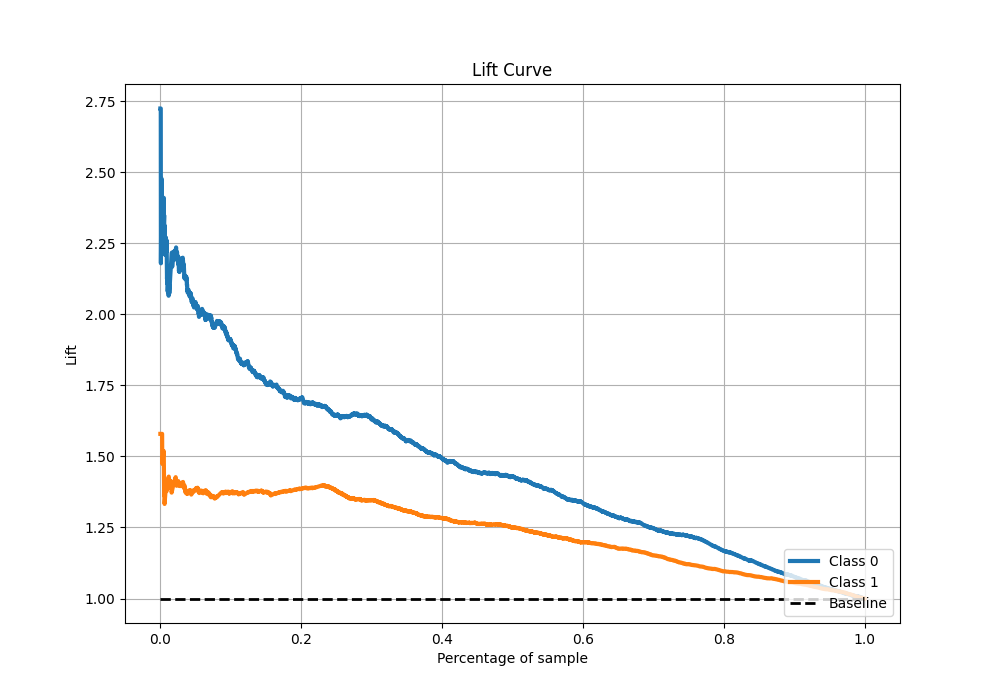

# Summary of 11_Default_NearestNeighbors

[<< Go back](../README.md)

## k-Nearest Neighbors (Nearest Neighbors)
- **n_jobs**: -1
- **n_neighbors**: 5
- **weights**: uniform
- **explain_level**: 1

## Validation
 - **validation_type**: kfold
 - **k_folds**: 10
 - **shuffle**: True
 - **stratify**: True
 - **random_seed**: 12

## Optimized metric
f1

## Training time

4.1 seconds

## Metric details
|           |    score |   threshold |
|:----------|---------:|------------:|
| logloss   | 1.04501  |       nan   |
| auc       | 0.724329 |       nan   |
| f1        | 0.783912 |         0.2 |
| accuracy  | 0.690976 |         0.4 |
| precision | 0.881928 |         0.8 |
| recall    | 0.989666 |         0   |
| mcc       | 0.329358 |         0.6 |

## Metric details with threshold from accuracy metric
|           |    score |   threshold |
|:----------|---------:|------------:|
| logloss   | 1.04501  |       nan   |
| auc       | 0.724329 |       nan   |
| f1        | 0.766162 |         0.4 |
| accuracy  | 0.690976 |         0.4 |
| precision | 0.735327 |         0.4 |
| recall    | 0.799696 |         0.4 |
| mcc       | 0.315444 |         0.4 |

## Confusion matrix (at threshold=0.4)
|              |   Predicted as 0 |   Predicted as 1 |
|:-------------|-----------------:|-----------------:|
| Labeled as 0 |              960 |              947 |
| Labeled as 1 |              659 |             2631 |

## Learning curves

## Confusion Matrix

## Normalized Confusion Matrix

## ROC Curve

## Kolmogorov-Smirnov Statistic

## Precision-Recall Curve

## Calibration Curve

## Cumulative Gains Curve

## Lift Curve

[<< Go back](../README.md)
