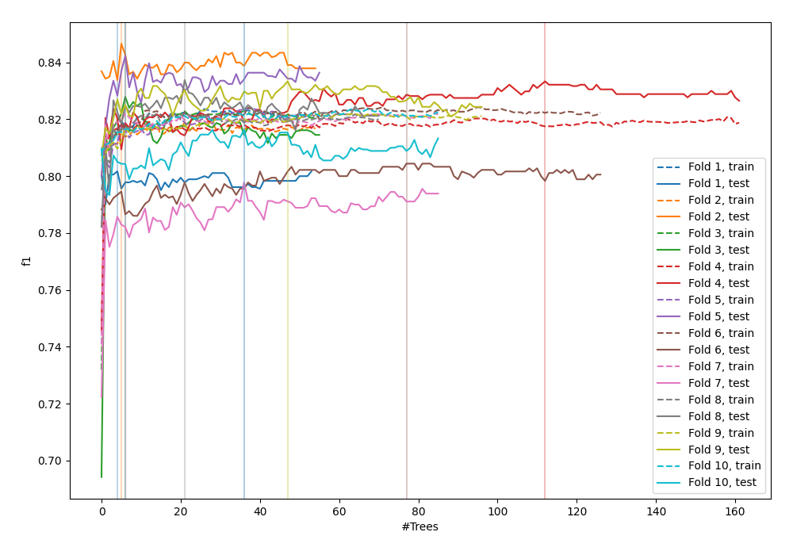
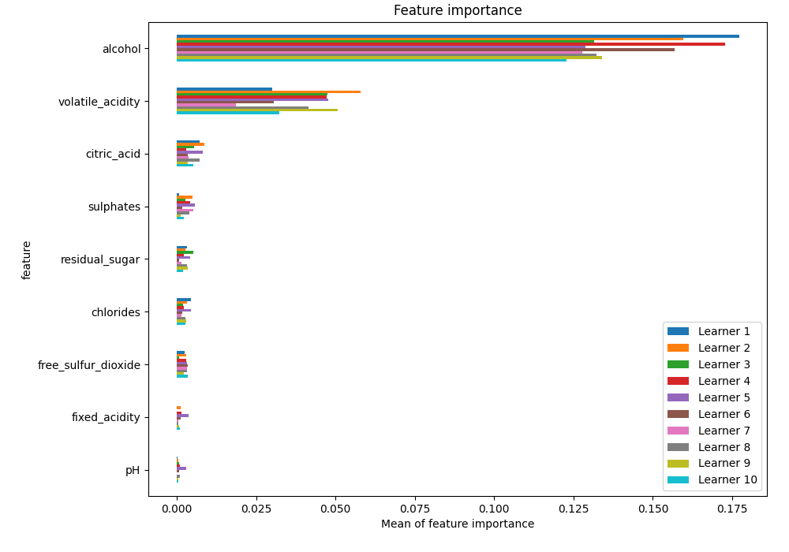
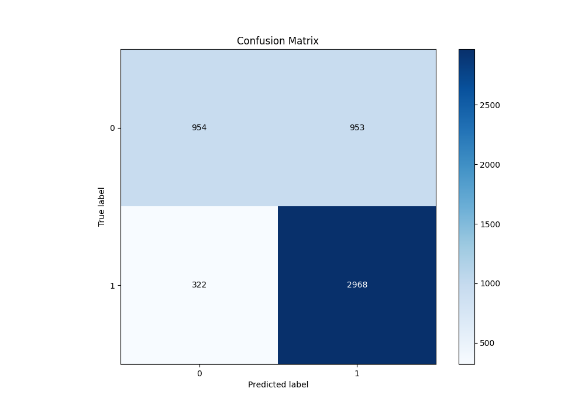
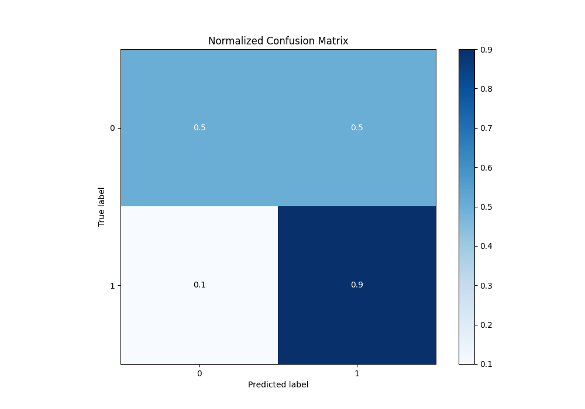
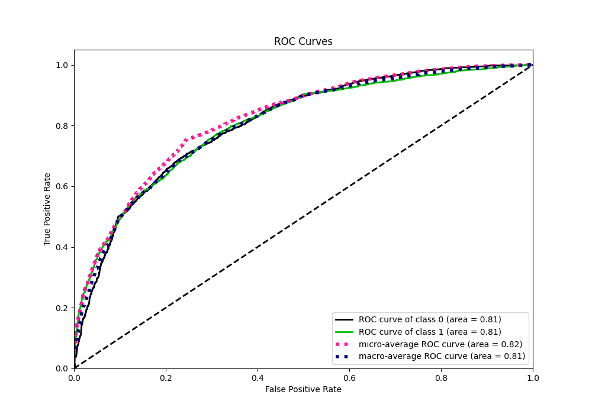
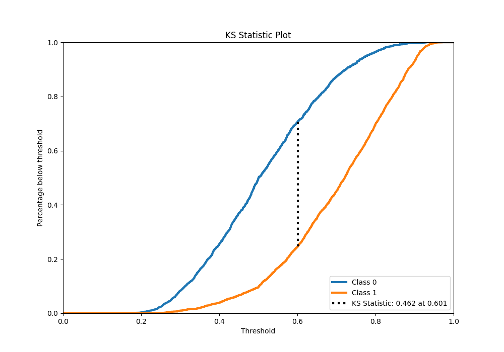
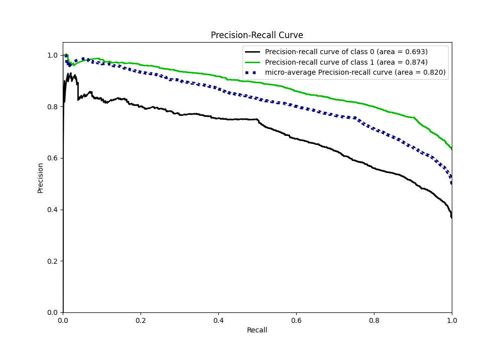
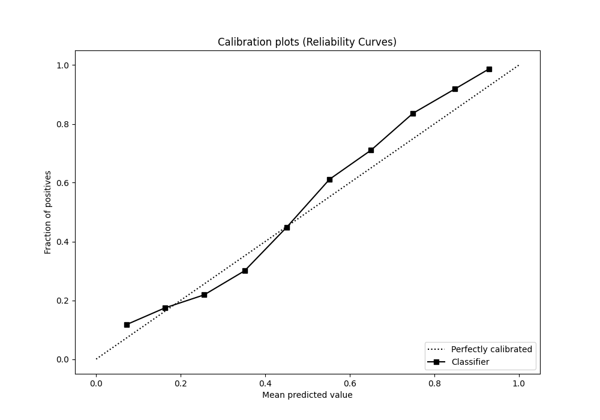
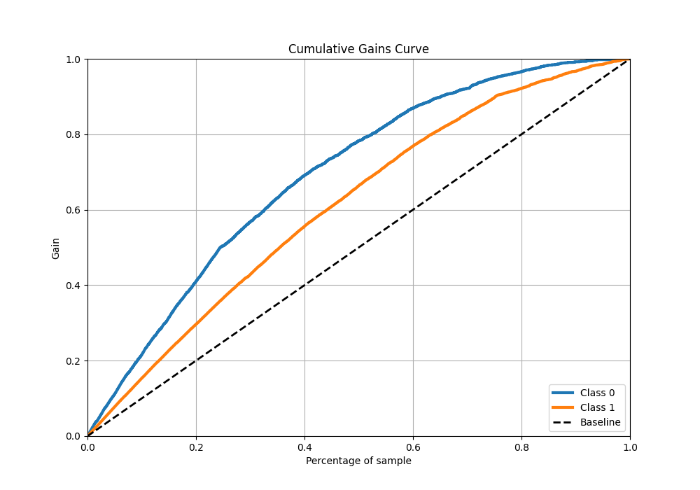
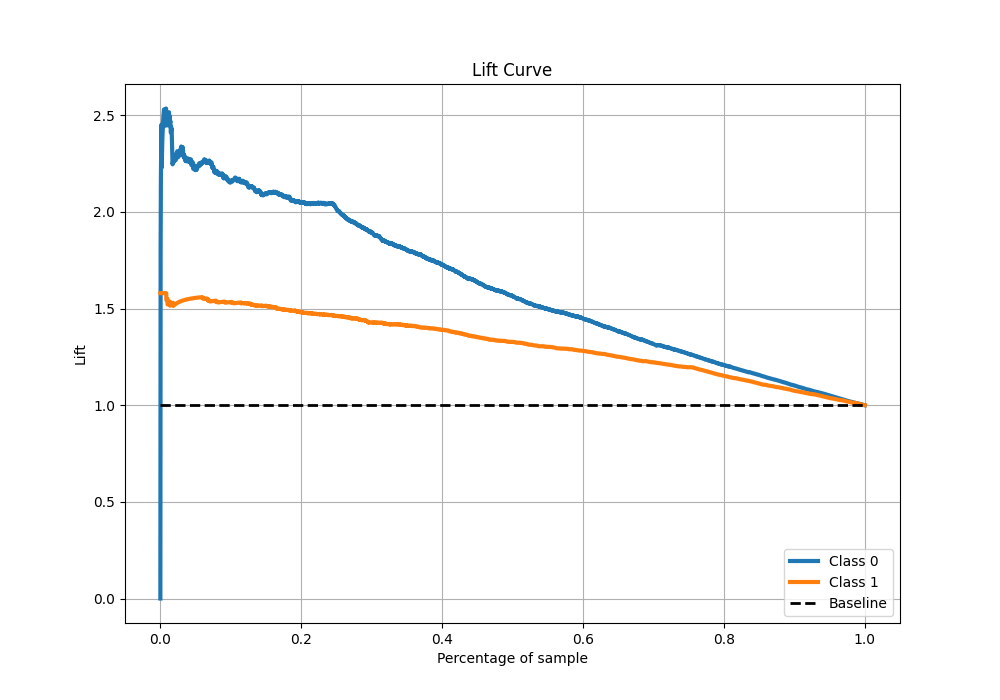

# Summary of 120_ExtraTrees

[<< Go back](../README.md)

## Extra Trees Classifier (Extra Trees)
- **n_jobs**: -1
- **criterion**: gini
- **max_features**: 0.8
- **min_samples_split**: 30
- **max_depth**: 5
- **eval_metric_name**: f1
- **explain_level**: 1

## Validation
 - **validation_type**: kfold
 - **k_folds**: 10
 - **shuffle**: True
 - **stratify**: True
 - **random_seed**: 12

## Optimized metric
f1

## Training time

17.5 seconds

## Metric details
|           |    score |   threshold |
|:----------|---------:|------------:|
| logloss   | 0.528458 |  nan        |
| auc       | 0.806259 |  nan        |
| f1        | 0.823187 |    0.500924 |
| accuracy  | 0.754666 |    0.500924 |
| precision | 0.986667 |    0.890416 |
| recall    | 1        |    0.121413 |
| mcc       | 0.452783 |    0.577297 |

## Metric details with threshold from accuracy metric
|           |    score |   threshold |
|:----------|---------:|------------:|
| logloss   | 0.528458 |  nan        |
| auc       | 0.806259 |  nan        |
| f1        | 0.823187 |    0.500924 |
| accuracy  | 0.754666 |    0.500924 |
| precision | 0.75695  |    0.500924 |
| recall    | 0.902128 |    0.500924 |
| mcc       | 0.450606 |    0.500924 |

## Confusion matrix (at threshold=0.500924)
|              |   Predicted as 0 |   Predicted as 1 |
|:-------------|-----------------:|-----------------:|
| Labeled as 0 |              954 |              953 |
| Labeled as 1 |              322 |             2968 |

## Learning curves

## Permutation-based Importance

## Confusion Matrix

## Normalized Confusion Matrix

## ROC Curve

## Kolmogorov-Smirnov Statistic

## Precision-Recall Curve

## Calibration Curve

## Cumulative Gains Curve

## Lift Curve

[<< Go back](../README.md)
