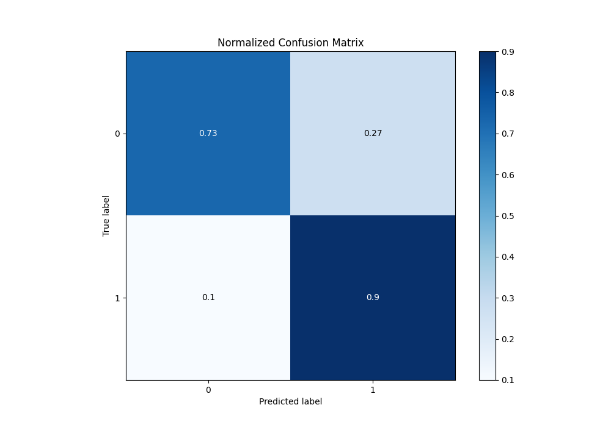

# Summary of 120_ExtraTrees_Stacked

[<< Go back](../README.md)

## Extra Trees Classifier (Extra Trees)
- **n_jobs**: -1
- **criterion**: gini
- **max_features**: 0.8
- **min_samples_split**: 30
- **max_depth**: 5
- **eval_metric_name**: f1
- **explain_level**: 1

## Validation
 - **validation_type**: kfold
 - **k_folds**: 10
 - **shuffle**: True
 - **stratify**: True
 - **random_seed**: 12

## Optimized metric
f1

## Training time

28.2 seconds

## Metric details
|           |    score |   threshold |
|:----------|---------:|------------:|
| logloss   | 0.402774 | nan         |
| auc       | 0.886262 | nan         |
| f1        | 0.87263  |   0.498091  |
| accuracy  | 0.83452  |   0.498091  |
| precision | 0.969925 |   0.96087   |
| recall    | 1        |   0.0160708 |
| mcc       | 0.638619 |   0.498091  |

## Metric details with threshold from accuracy metric
|           |    score |   threshold |
|:----------|---------:|------------:|
| logloss   | 0.402774 |  nan        |
| auc       | 0.886262 |  nan        |
| f1        | 0.87263  |    0.498091 |
| accuracy  | 0.83452  |    0.498091 |
| precision | 0.850953 |    0.498091 |
| recall    | 0.895441 |    0.498091 |
| mcc       | 0.638619 |    0.498091 |

## Confusion matrix (at threshold=0.498091)
|              |   Predicted as 0 |   Predicted as 1 |
|:-------------|-----------------:|-----------------:|
| Labeled as 0 |             1391 |              516 |
| Labeled as 1 |              344 |             2946 |

## Learning curves

## Permutation-based Importance

## Confusion Matrix

## Normalized Confusion Matrix

## ROC Curve

## Kolmogorov-Smirnov Statistic

## Precision-Recall Curve

## Calibration Curve

## Cumulative Gains Curve

## Lift Curve

[<< Go back](../README.md)
