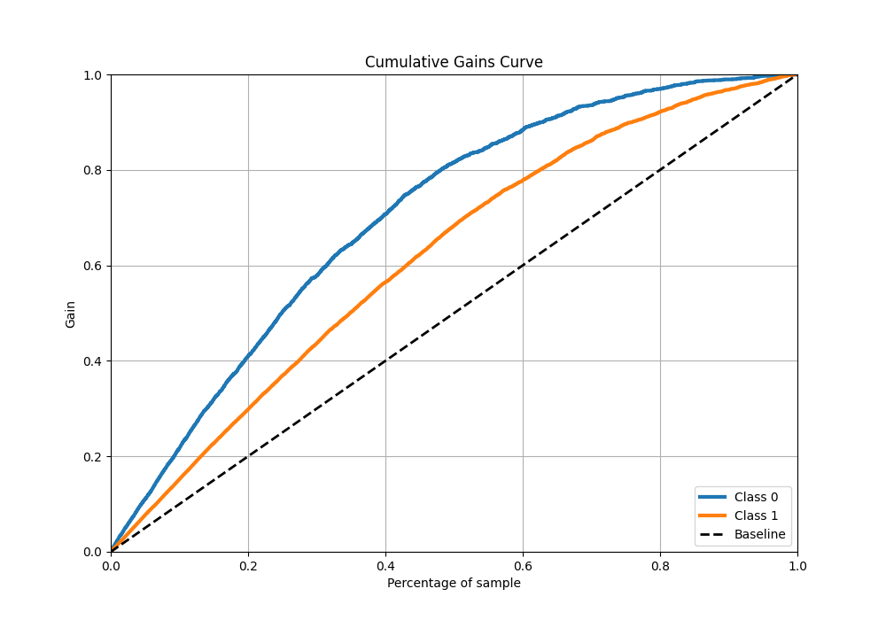

# Summary of 122_NeuralNetwork

[<< Go back](../README.md)

## Neural Network
- **n_jobs**: -1
- **dense_1_size**: 32
- **dense_2_size**: 16
- **learning_rate**: 0.01
- **explain_level**: 1

## Validation
 - **validation_type**: kfold
 - **k_folds**: 10
 - **shuffle**: True
 - **stratify**: True
 - **random_seed**: 12

## Optimized metric
f1

## Training time

18.1 seconds

## Metric details
|           |    score |     threshold |
|:----------|---------:|--------------:|
| logloss   | 0.503729 | nan           |
| auc       | 0.82107  | nan           |
| f1        | 0.82175  |   0.426723    |
| accuracy  | 0.761016 |   0.485943    |
| precision | 0.975904 |   0.989618    |
| recall    | 1        |   4.38229e-10 |
| mcc       | 0.488584 |   0.607452    |

## Metric details with threshold from accuracy metric
|           |    score |   threshold |
|:----------|---------:|------------:|
| logloss   | 0.503729 |  nan        |
| auc       | 0.82107  |  nan        |
| f1        | 0.816055 |    0.485943 |
| accuracy  | 0.761016 |    0.485943 |
| precision | 0.795783 |    0.485943 |
| recall    | 0.837386 |    0.485943 |
| mcc       | 0.476923 |    0.485943 |

## Confusion matrix (at threshold=0.485943)
|              |   Predicted as 0 |   Predicted as 1 |
|:-------------|-----------------:|-----------------:|
| Labeled as 0 |             1200 |              707 |
| Labeled as 1 |              535 |             2755 |

## Learning curves

## Permutation-based Importance

## Confusion Matrix

## Normalized Confusion Matrix

## ROC Curve

## Kolmogorov-Smirnov Statistic

## Precision-Recall Curve

## Calibration Curve

## Cumulative Gains Curve

## Lift Curve

[<< Go back](../README.md)
