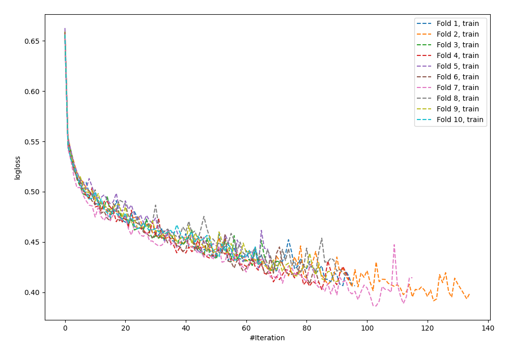
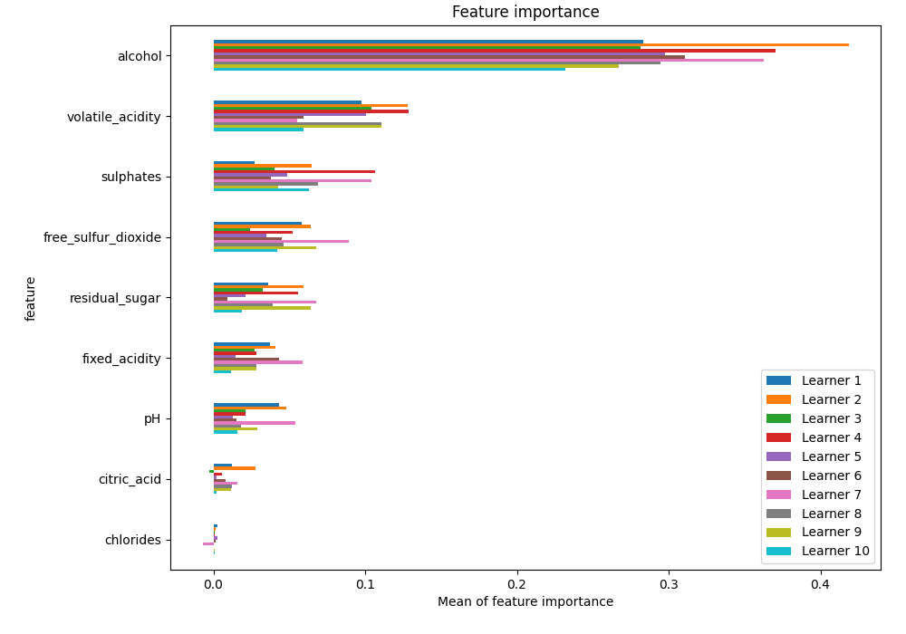
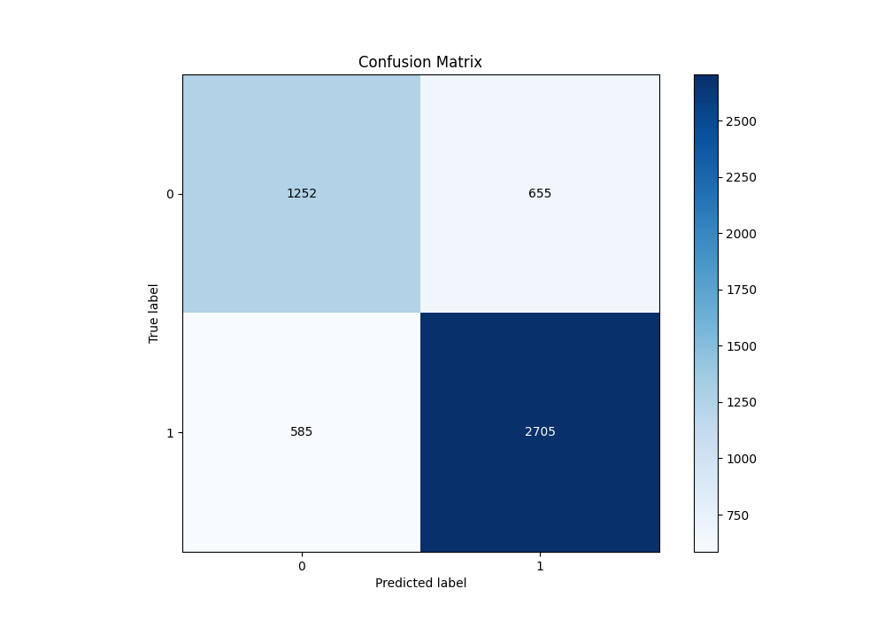
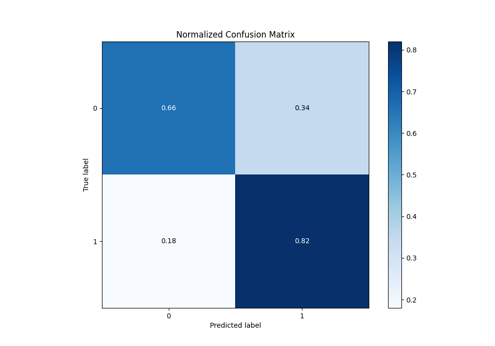
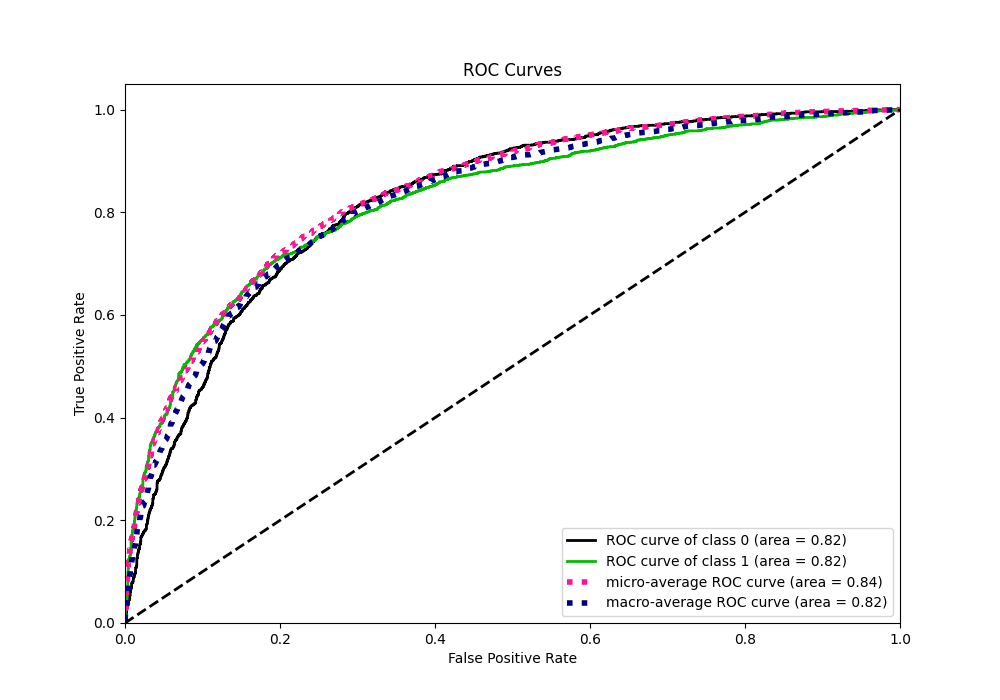
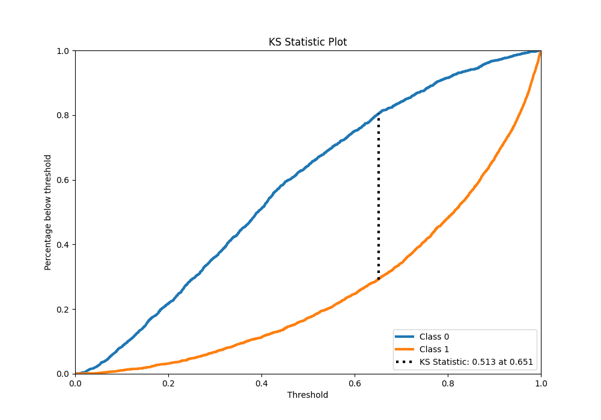
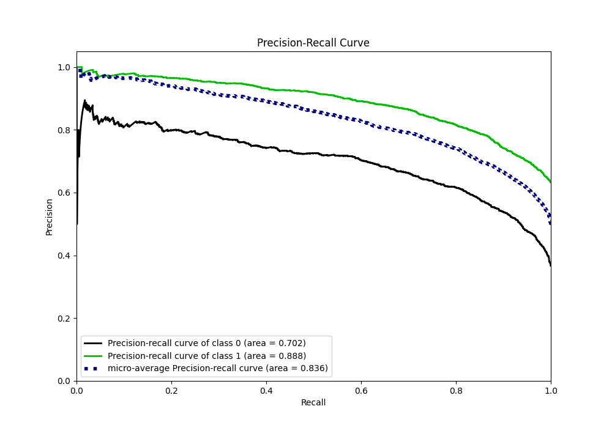
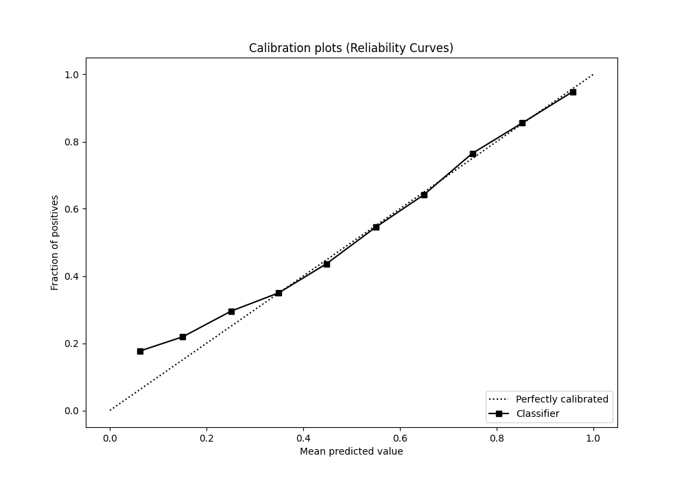
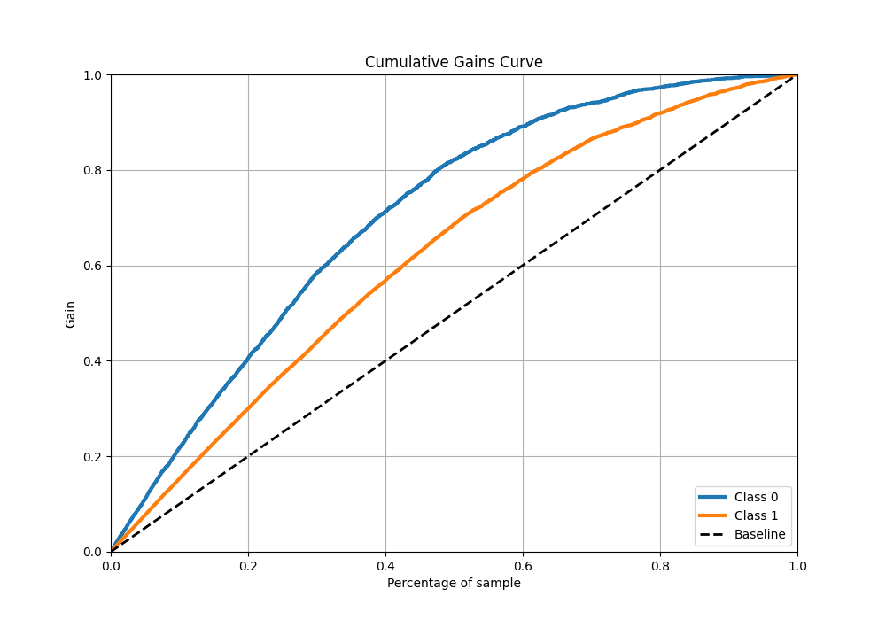
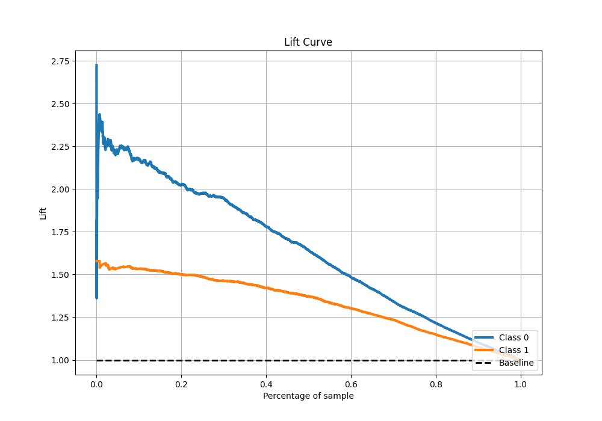

# Summary of 123_NeuralNetwork

[<< Go back](../README.md)

## Neural Network
- **n_jobs**: -1
- **dense_1_size**: 32
- **dense_2_size**: 16
- **learning_rate**: 0.01
- **explain_level**: 1

## Validation
 - **validation_type**: kfold
 - **k_folds**: 10
 - **shuffle**: True
 - **stratify**: True
 - **random_seed**: 12

## Optimized metric
f1

## Training time

17.3 seconds

## Metric details
|           |    score |    threshold |
|:----------|---------:|-------------:|
| logloss   | 0.498107 | nan          |
| auc       | 0.824044 | nan          |
| f1        | 0.820874 |   0.438133   |
| accuracy  | 0.761401 |   0.50935    |
| precision | 0.9801   |   0.975516   |
| recall    | 1        |   0.00159407 |
| mcc       | 0.494322 |   0.65238    |

## Metric details with threshold from accuracy metric
|           |    score |   threshold |
|:----------|---------:|------------:|
| logloss   | 0.498107 |   nan       |
| auc       | 0.824044 |   nan       |
| f1        | 0.813534 |     0.50935 |
| accuracy  | 0.761401 |     0.50935 |
| precision | 0.80506  |     0.50935 |
| recall    | 0.822188 |     0.50935 |
| mcc       | 0.482645 |     0.50935 |

## Confusion matrix (at threshold=0.50935)
|              |   Predicted as 0 |   Predicted as 1 |
|:-------------|-----------------:|-----------------:|
| Labeled as 0 |             1252 |              655 |
| Labeled as 1 |              585 |             2705 |

## Learning curves

## Permutation-based Importance

## Confusion Matrix

## Normalized Confusion Matrix

## ROC Curve

## Kolmogorov-Smirnov Statistic

## Precision-Recall Curve

## Calibration Curve

## Cumulative Gains Curve

## Lift Curve

[<< Go back](../README.md)
