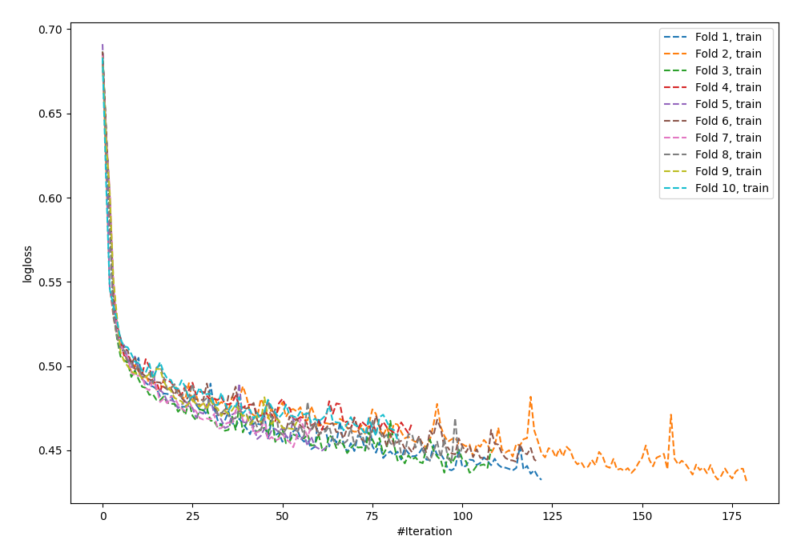
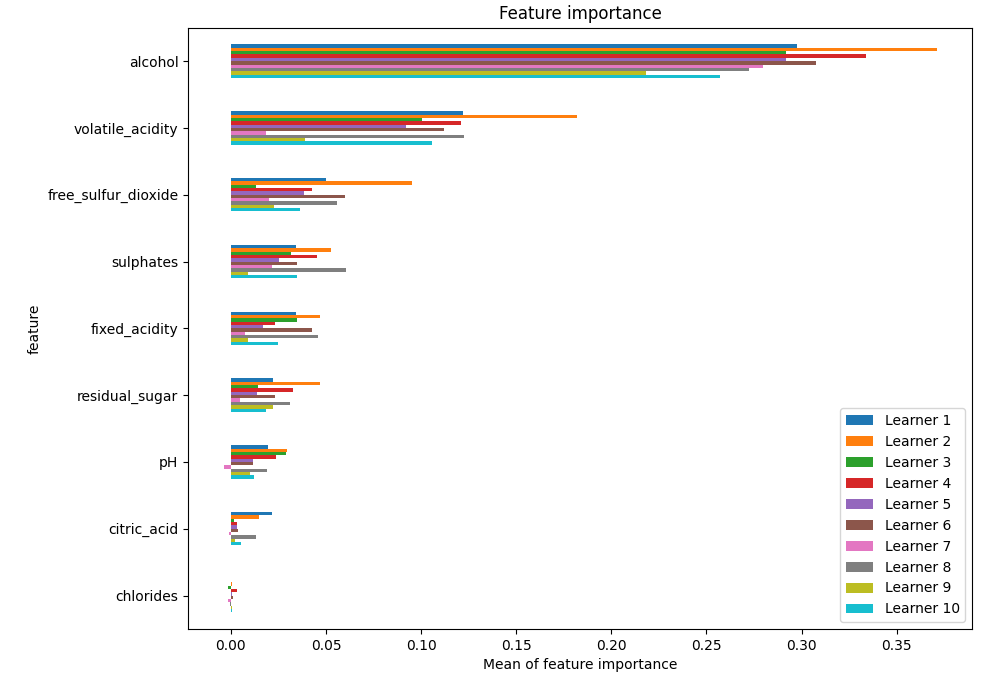
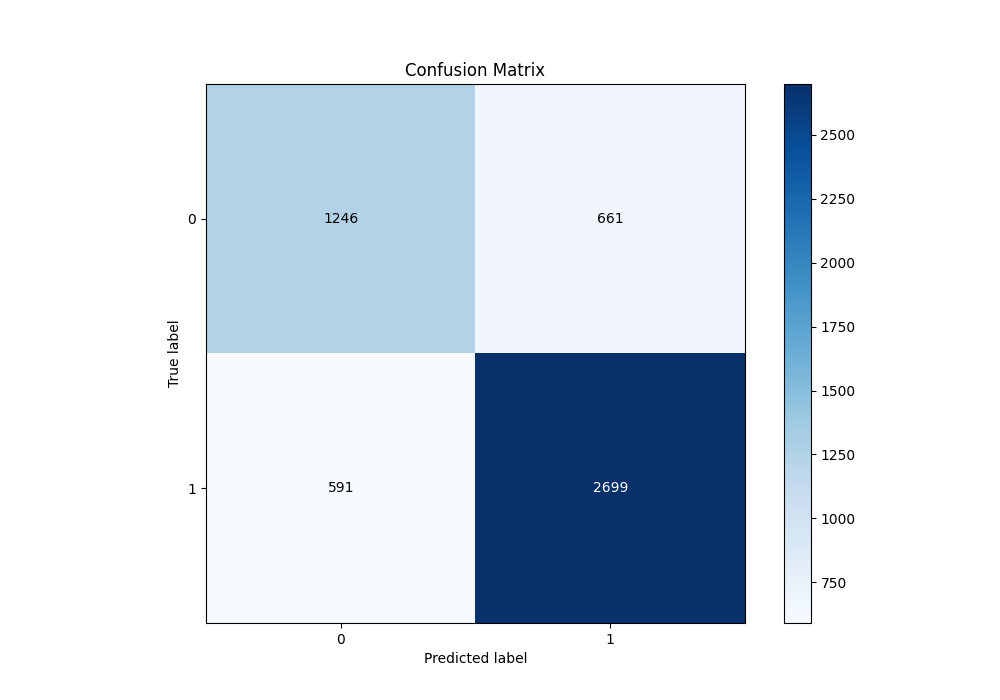
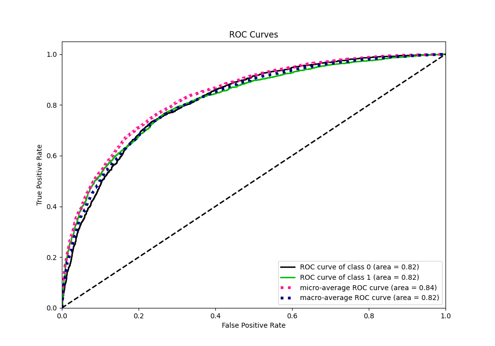
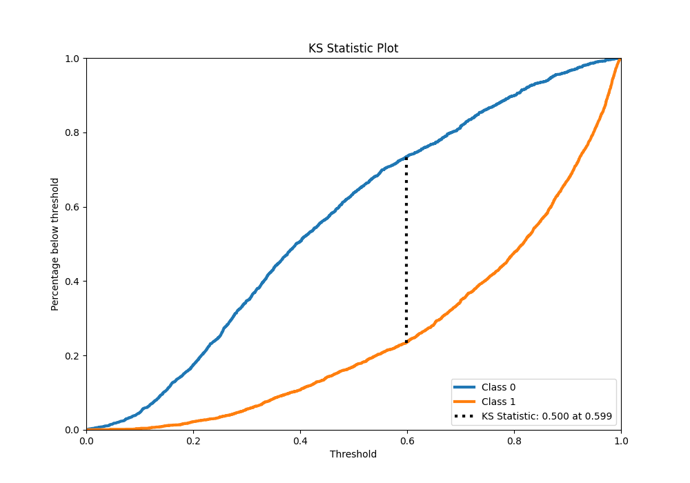
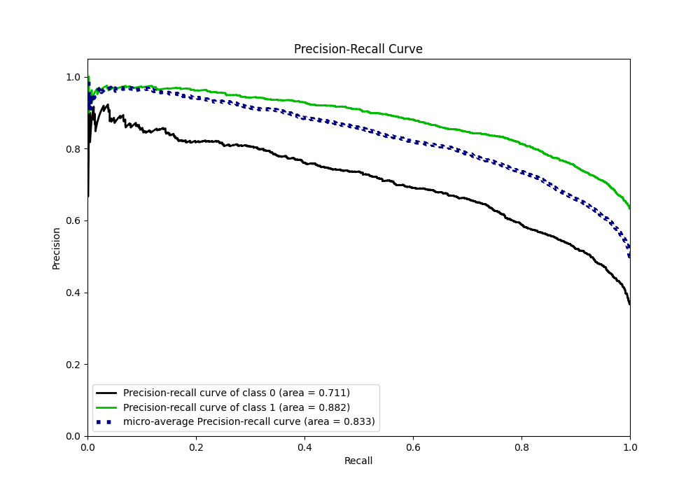
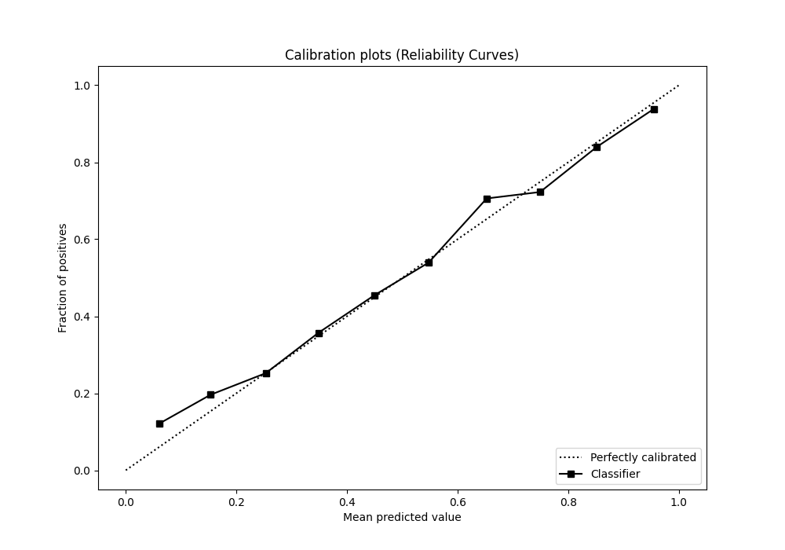
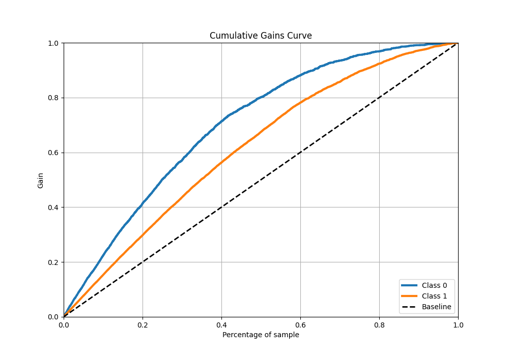
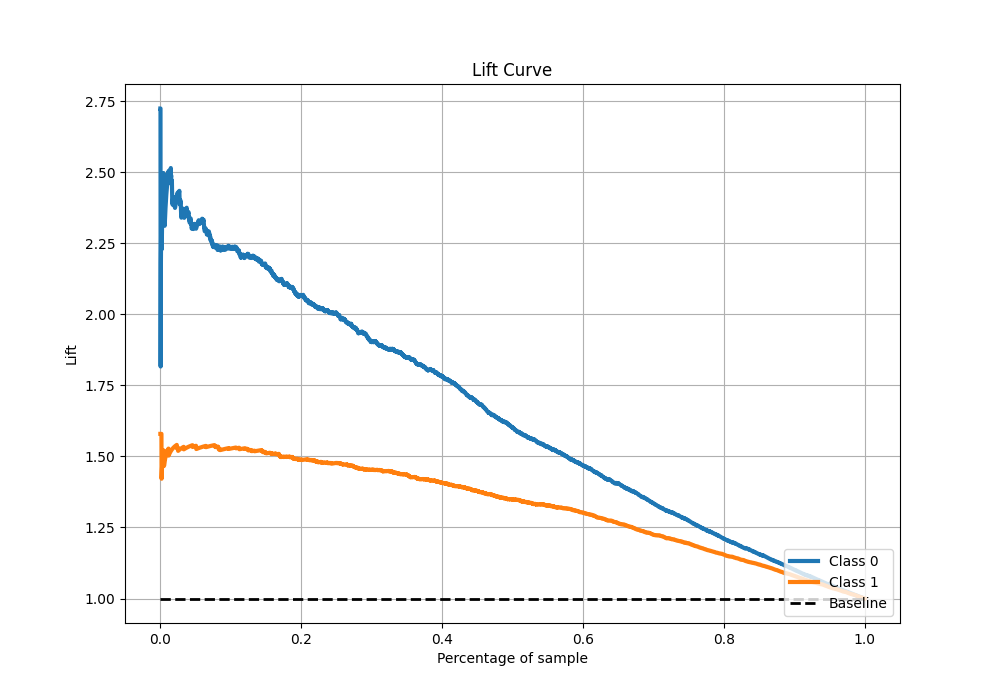

# Summary of 124_NeuralNetwork

[<< Go back](../README.md)

## Neural Network
- **n_jobs**: -1
- **dense_1_size**: 32
- **dense_2_size**: 4
- **learning_rate**: 0.01
- **explain_level**: 1

## Validation
 - **validation_type**: kfold
 - **k_folds**: 10
 - **shuffle**: True
 - **stratify**: True
 - **random_seed**: 12

## Optimized metric
f1

## Training time

17.2 seconds

## Metric details
|           |    score |    threshold |
|:----------|---------:|-------------:|
| logloss   | 0.499503 | nan          |
| auc       | 0.819533 | nan          |
| f1        | 0.819026 |   0.388598   |
| accuracy  | 0.759092 |   0.515165   |
| precision | 0.972637 |   0.97184    |
| recall    | 1        |   0.00011728 |
| mcc       | 0.487135 |   0.590929   |

## Metric details with threshold from accuracy metric
|           |    score |   threshold |
|:----------|---------:|------------:|
| logloss   | 0.499503 |  nan        |
| auc       | 0.819533 |  nan        |
| f1        | 0.811729 |    0.515165 |
| accuracy  | 0.759092 |    0.515165 |
| precision | 0.803274 |    0.515165 |
| recall    | 0.820365 |    0.515165 |
| mcc       | 0.477634 |    0.515165 |

## Confusion matrix (at threshold=0.515165)
|              |   Predicted as 0 |   Predicted as 1 |
|:-------------|-----------------:|-----------------:|
| Labeled as 0 |             1246 |              661 |
| Labeled as 1 |              591 |             2699 |

## Learning curves

## Permutation-based Importance

## Confusion Matrix

## Normalized Confusion Matrix

## ROC Curve

## Kolmogorov-Smirnov Statistic

## Precision-Recall Curve

## Calibration Curve

## Cumulative Gains Curve

## Lift Curve

[<< Go back](../README.md)
