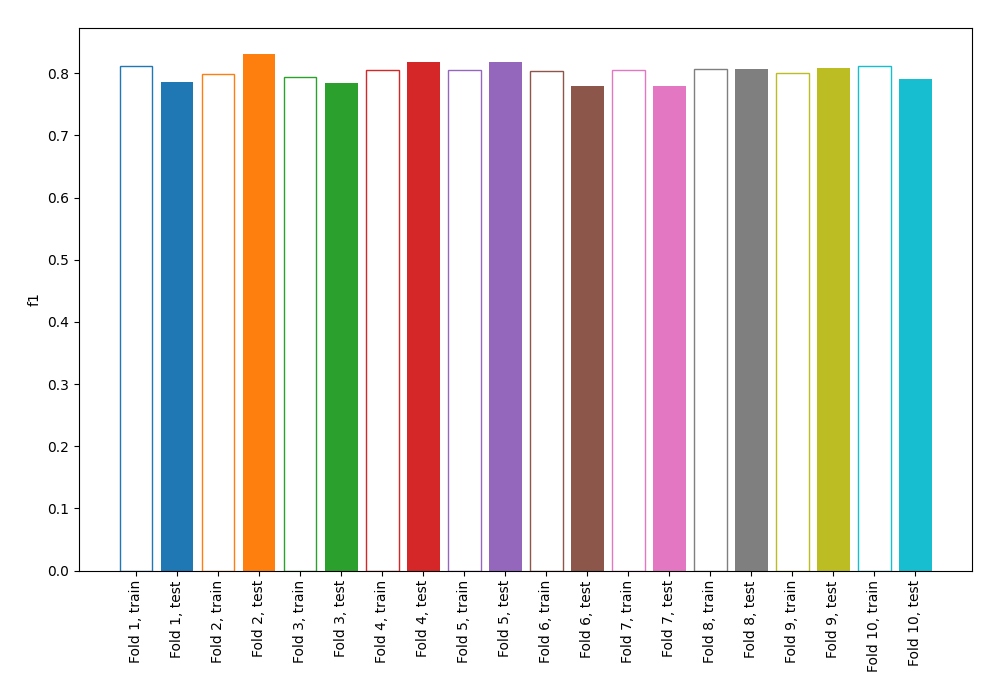
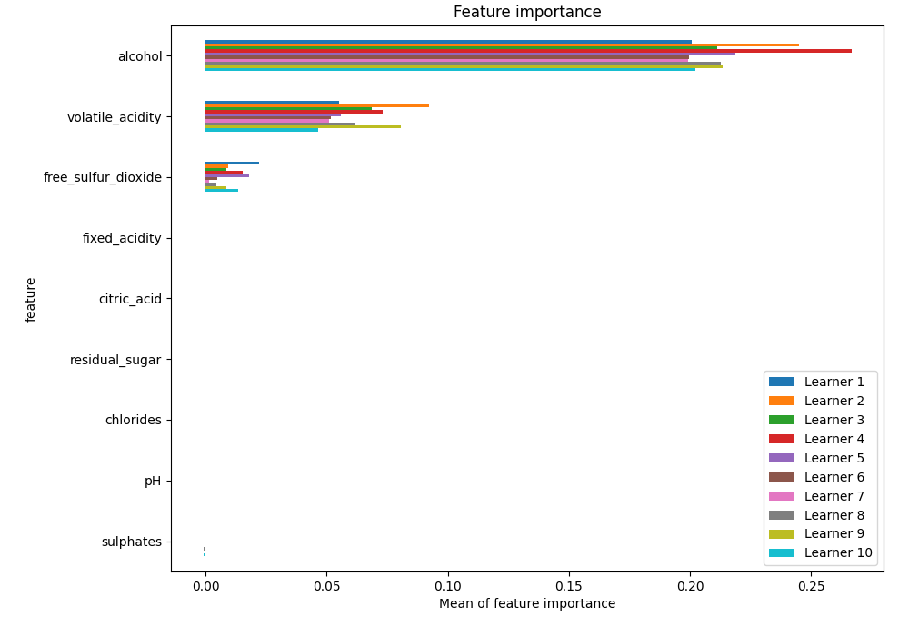
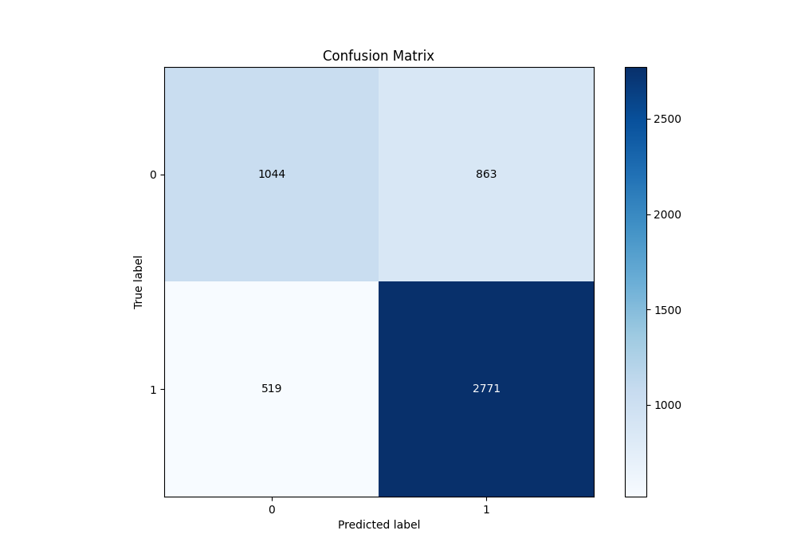
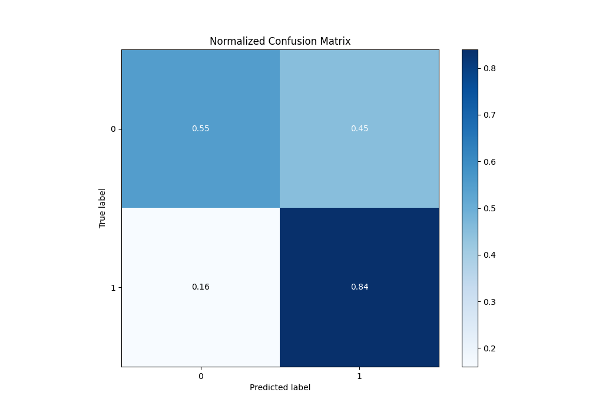
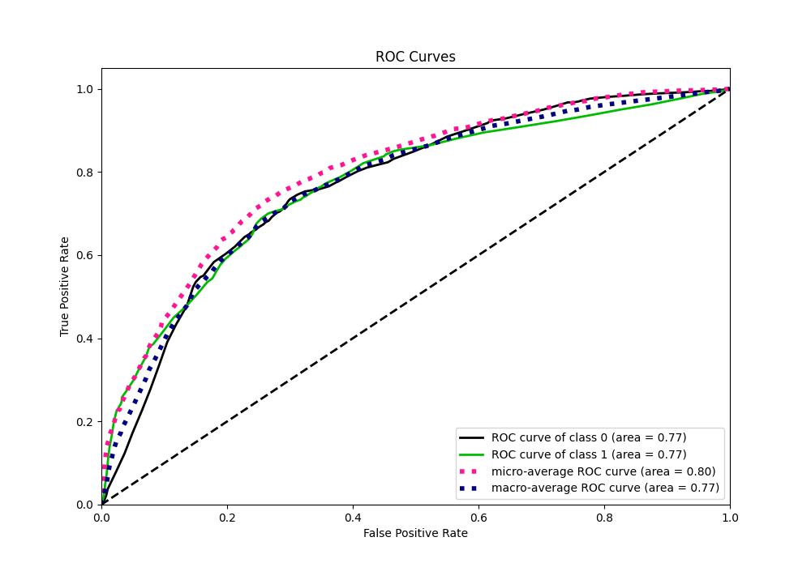
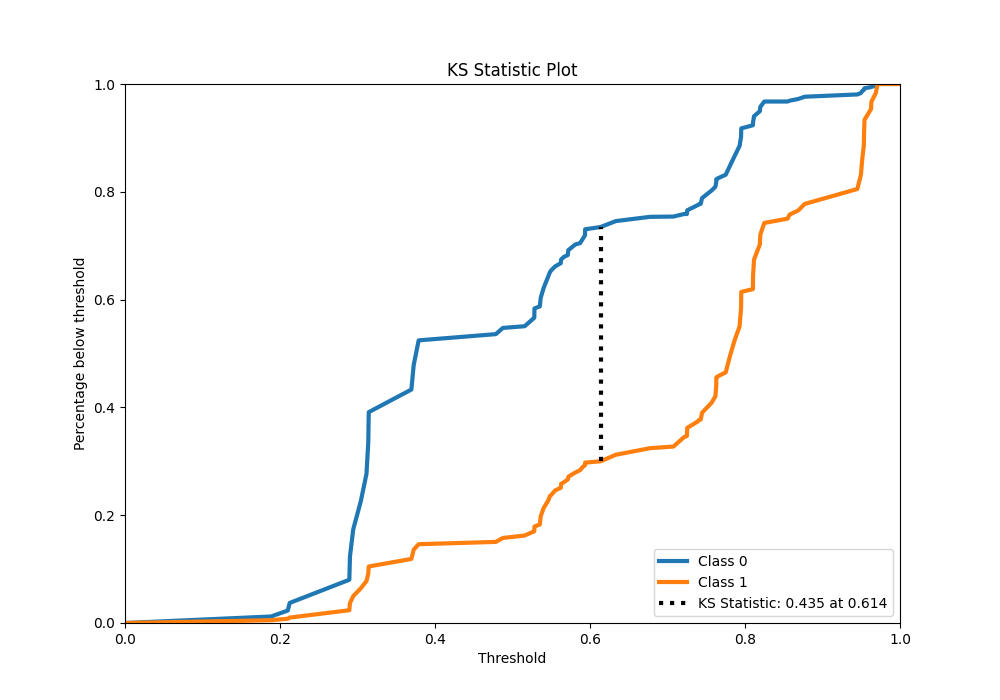
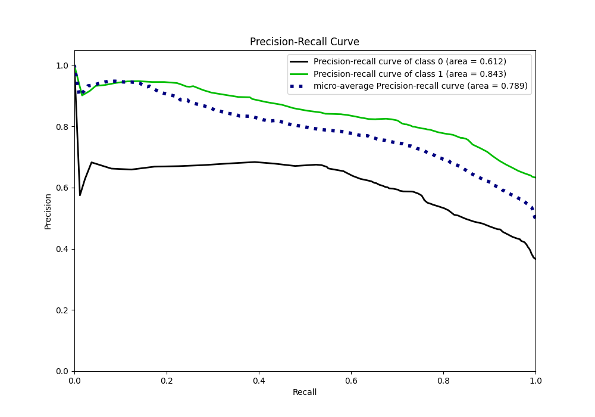
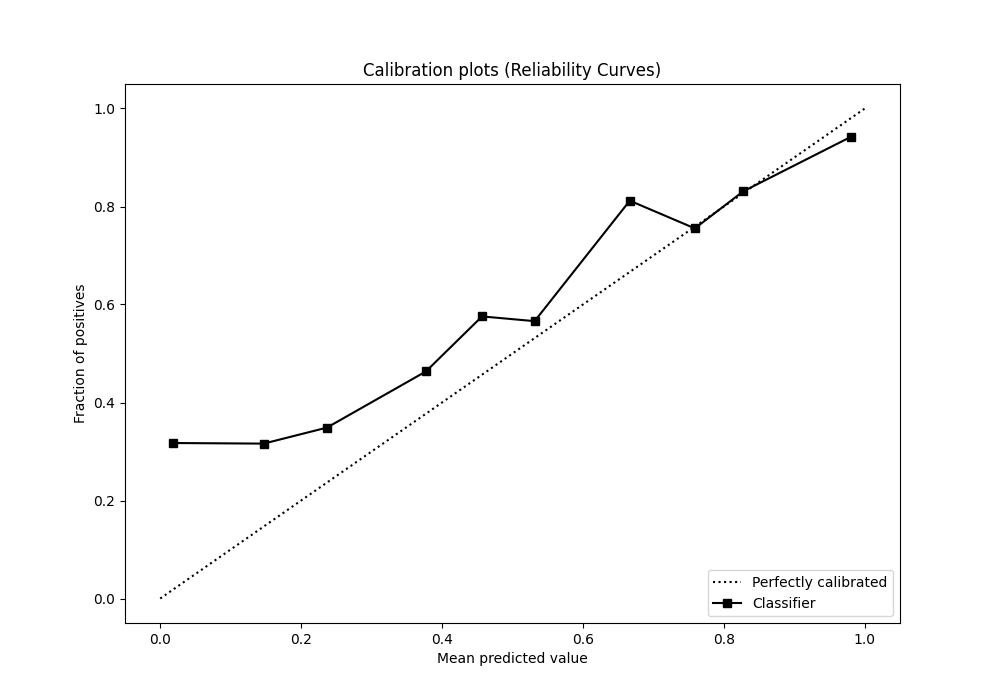
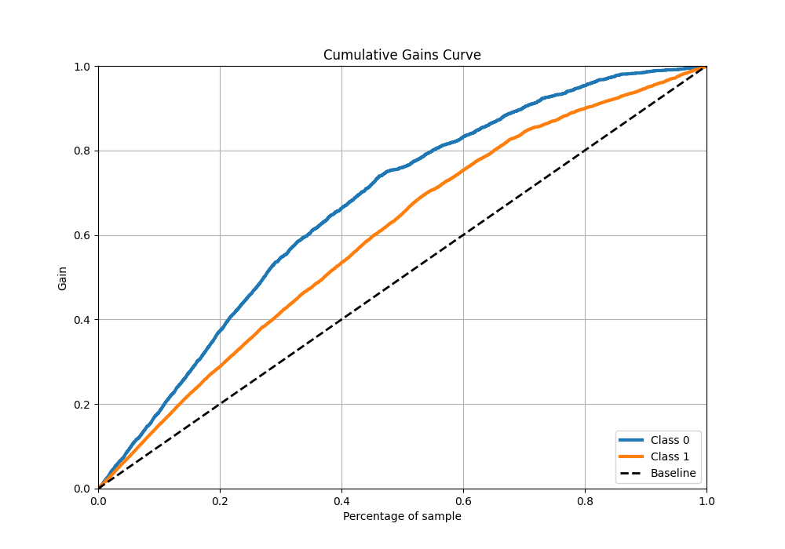
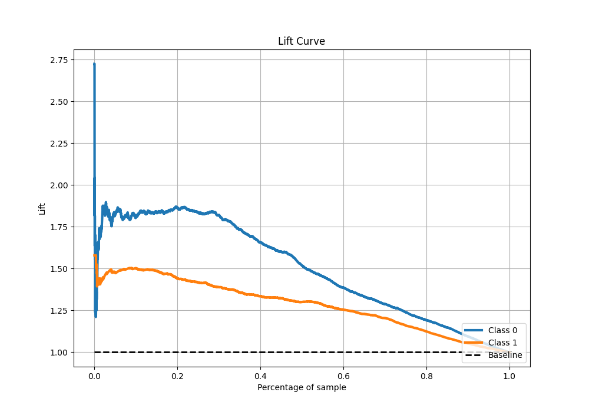

# Summary of 125_DecisionTree

[<< Go back](../README.md)

## Decision Tree
- **n_jobs**: -1
- **criterion**: entropy
- **max_depth**: 3
- **explain_level**: 1

## Validation
 - **validation_type**: kfold
 - **k_folds**: 10
 - **shuffle**: True
 - **stratify**: True
 - **random_seed**: 12

## Optimized metric
f1

## Training time

19.4 seconds

## Metric details
|           |    score |   threshold |
|:----------|---------:|------------:|
| logloss   | 0.542846 |  nan        |
| auc       | 0.770295 |  nan        |
| f1        | 0.801884 |    0.37892  |
| accuracy  | 0.734077 |    0.487552 |
| precision | 0.94824  |    0.951282 |
| recall    | 1        |    0.169529 |
| mcc       | 0.418883 |    0.59375  |

## Metric details with threshold from accuracy metric
|           |    score |   threshold |
|:----------|---------:|------------:|
| logloss   | 0.542846 |  nan        |
| auc       | 0.770295 |  nan        |
| f1        | 0.800404 |    0.487552 |
| accuracy  | 0.734077 |    0.487552 |
| precision | 0.762521 |    0.487552 |
| recall    | 0.842249 |    0.487552 |
| mcc       | 0.40958  |    0.487552 |

## Confusion matrix (at threshold=0.487552)
|              |   Predicted as 0 |   Predicted as 1 |
|:-------------|-----------------:|-----------------:|
| Labeled as 0 |             1044 |              863 |
| Labeled as 1 |              519 |             2771 |

## Learning curves

## Permutation-based Importance

## Confusion Matrix

## Normalized Confusion Matrix

## ROC Curve

## Kolmogorov-Smirnov Statistic

## Precision-Recall Curve

## Calibration Curve

## Cumulative Gains Curve

## Lift Curve

[<< Go back](../README.md)
