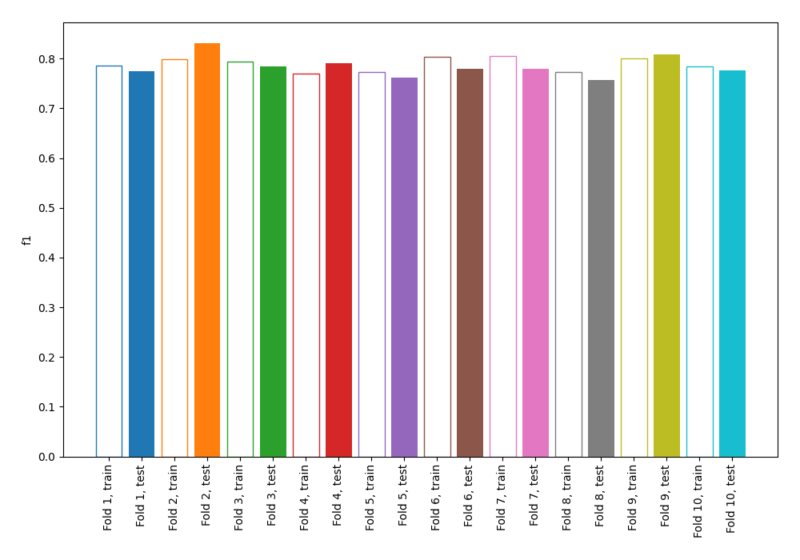
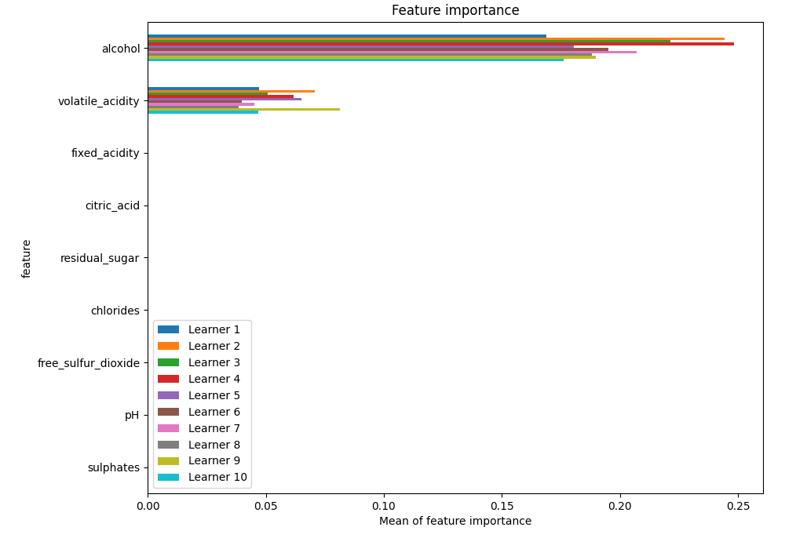
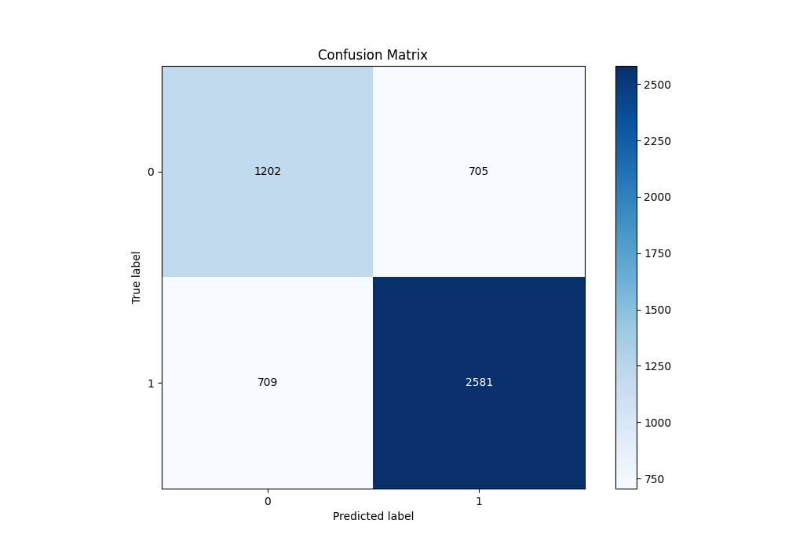
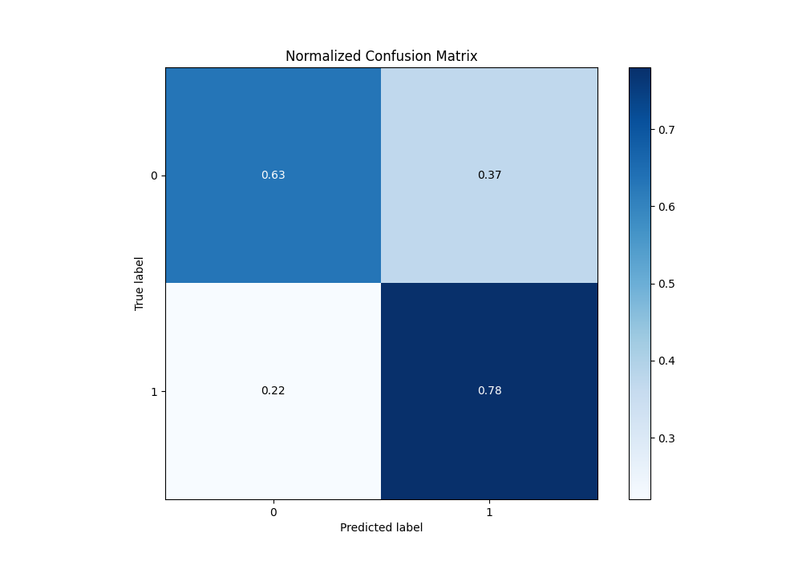
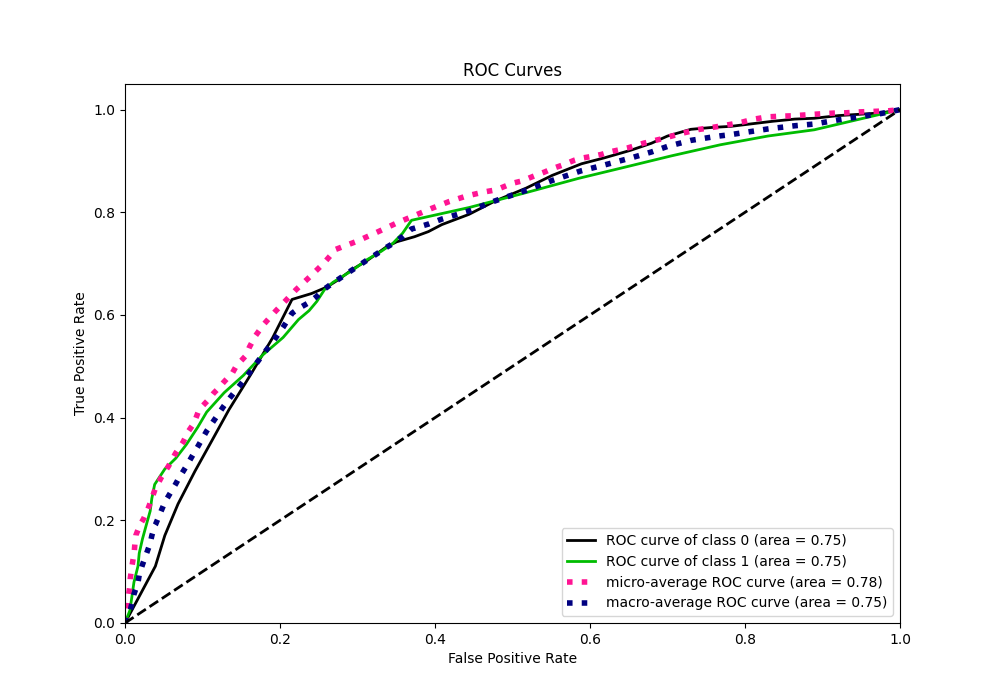
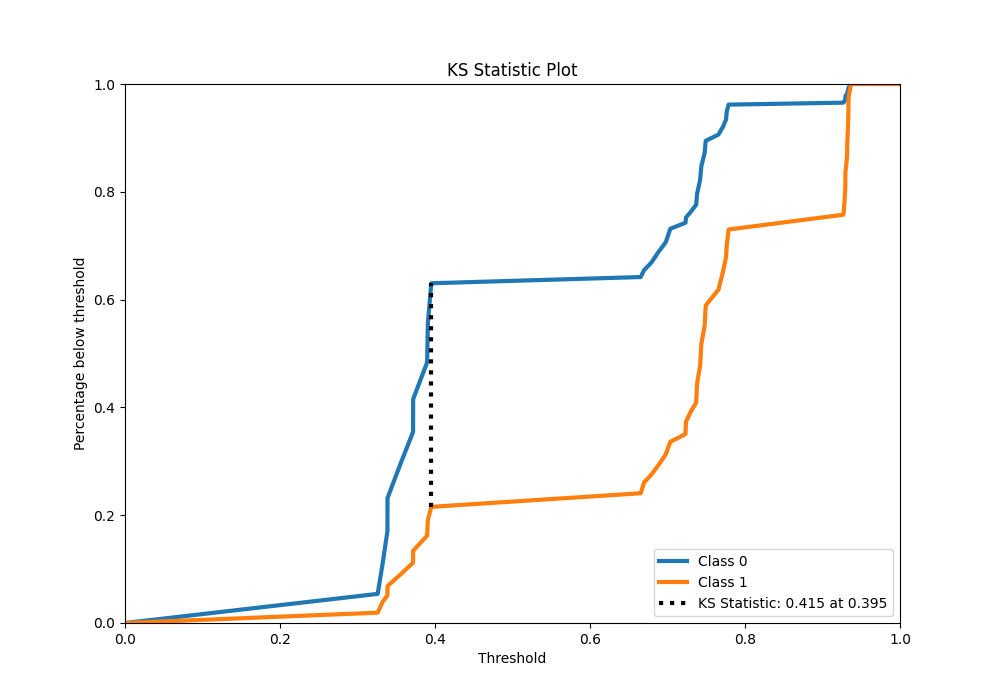
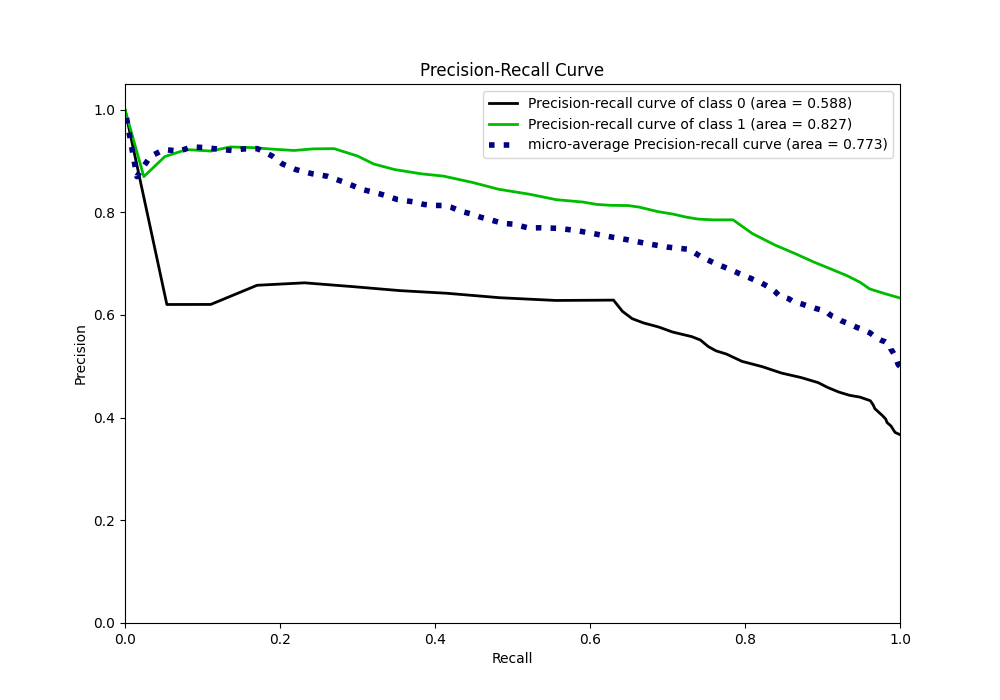
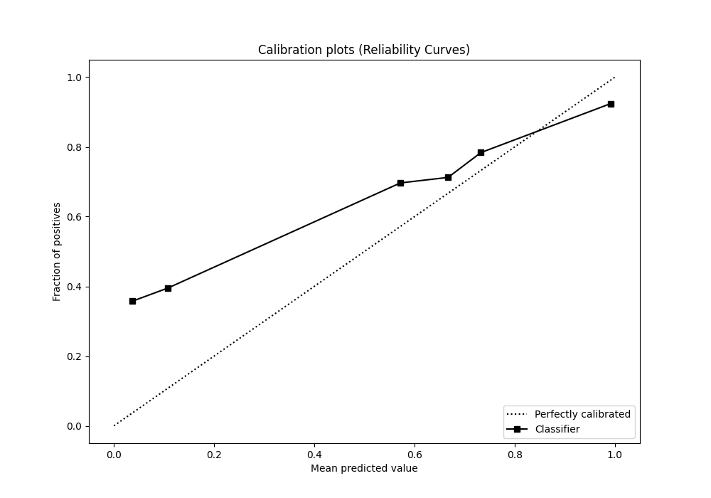
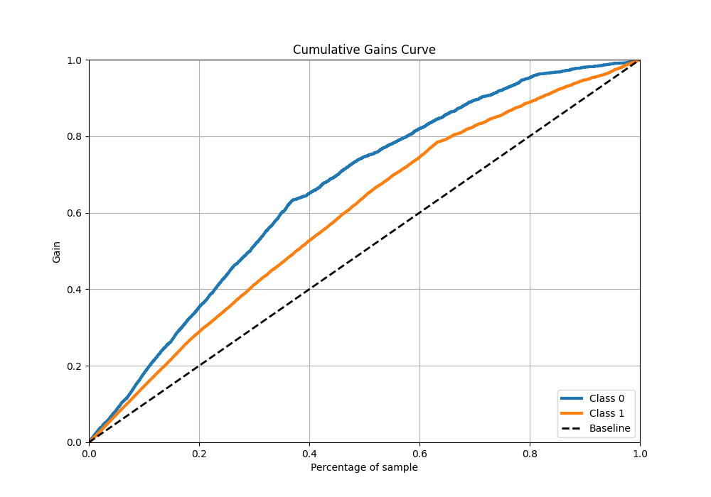
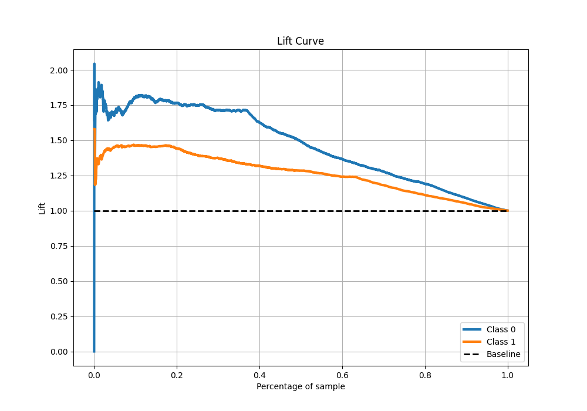

# Summary of 126_DecisionTree

[<< Go back](../README.md)

## Decision Tree
- **n_jobs**: -1
- **criterion**: entropy
- **max_depth**: 2
- **explain_level**: 1

## Validation
 - **validation_type**: kfold
 - **k_folds**: 10
 - **shuffle**: True
 - **stratify**: True
 - **random_seed**: 12

## Optimized metric
f1

## Training time

18.0 seconds

## Metric details
|           |    score |   threshold |
|:----------|---------:|------------:|
| logloss   | 0.552857 |  nan        |
| auc       | 0.7526   |  nan        |
| f1        | 0.785498 |    0.371809 |
| accuracy  | 0.72792  |    0.39521  |
| precision | 0.927386 |    0.931663 |
| recall    | 1        |    0.293413 |
| mcc       | 0.414626 |    0.39521  |

## Metric details with threshold from accuracy metric
|           |    score |   threshold |
|:----------|---------:|------------:|
| logloss   | 0.552857 |   nan       |
| auc       | 0.7526   |   nan       |
| f1        | 0.784976 |     0.39521 |
| accuracy  | 0.72792  |     0.39521 |
| precision | 0.785453 |     0.39521 |
| recall    | 0.784498 |     0.39521 |
| mcc       | 0.414626 |     0.39521 |

## Confusion matrix (at threshold=0.39521)
|              |   Predicted as 0 |   Predicted as 1 |
|:-------------|-----------------:|-----------------:|
| Labeled as 0 |             1202 |              705 |
| Labeled as 1 |              709 |             2581 |

## Learning curves

## Permutation-based Importance

## Confusion Matrix

## Normalized Confusion Matrix

## ROC Curve

## Kolmogorov-Smirnov Statistic

## Precision-Recall Curve

## Calibration Curve

## Cumulative Gains Curve

## Lift Curve

[<< Go back](../README.md)
