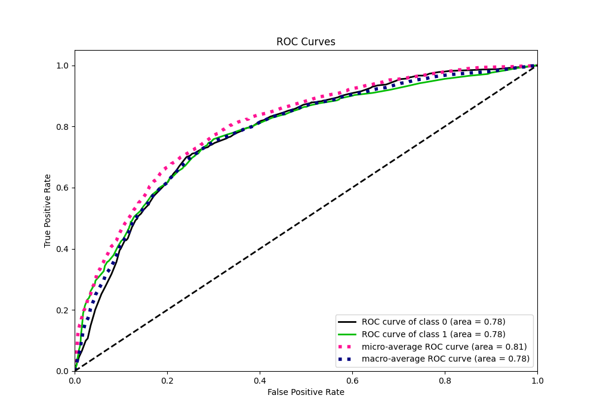

# Summary of 127_DecisionTree

[<< Go back](../README.md)

## Decision Tree
- **n_jobs**: -1
- **criterion**: entropy
- **max_depth**: 4
- **explain_level**: 1

## Validation
 - **validation_type**: kfold
 - **k_folds**: 10
 - **shuffle**: True
 - **stratify**: True
 - **random_seed**: 12

## Optimized metric
f1

## Training time

22.7 seconds

## Metric details
|           |    score |   threshold |
|:----------|---------:|------------:|
| logloss   | 0.544875 |  nan        |
| auc       | 0.781267 |  nan        |
| f1        | 0.803318 |    0.395176 |
| accuracy  | 0.736964 |    0.555556 |
| precision | 0.945946 |    0.922581 |
| recall    | 1        |    0        |
| mcc       | 0.449243 |    0.555556 |

## Metric details with threshold from accuracy metric
|           |    score |   threshold |
|:----------|---------:|------------:|
| logloss   | 0.544875 |  nan        |
| auc       | 0.781267 |  nan        |
| f1        | 0.784961 |    0.555556 |
| accuracy  | 0.736964 |    0.555556 |
| precision | 0.813499 |    0.555556 |
| recall    | 0.758359 |    0.555556 |
| mcc       | 0.449243 |    0.555556 |

## Confusion matrix (at threshold=0.555556)
|              |   Predicted as 0 |   Predicted as 1 |
|:-------------|-----------------:|-----------------:|
| Labeled as 0 |             1335 |              572 |
| Labeled as 1 |              795 |             2495 |

## Learning curves

## Permutation-based Importance

## Confusion Matrix

## Normalized Confusion Matrix

## ROC Curve

## Kolmogorov-Smirnov Statistic

## Precision-Recall Curve

## Calibration Curve

## Cumulative Gains Curve

## Lift Curve

[<< Go back](../README.md)
