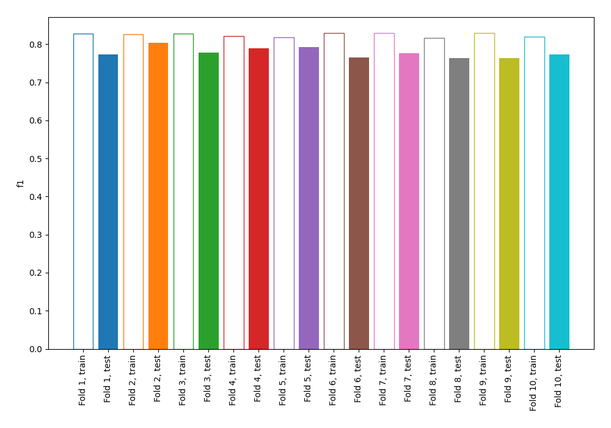
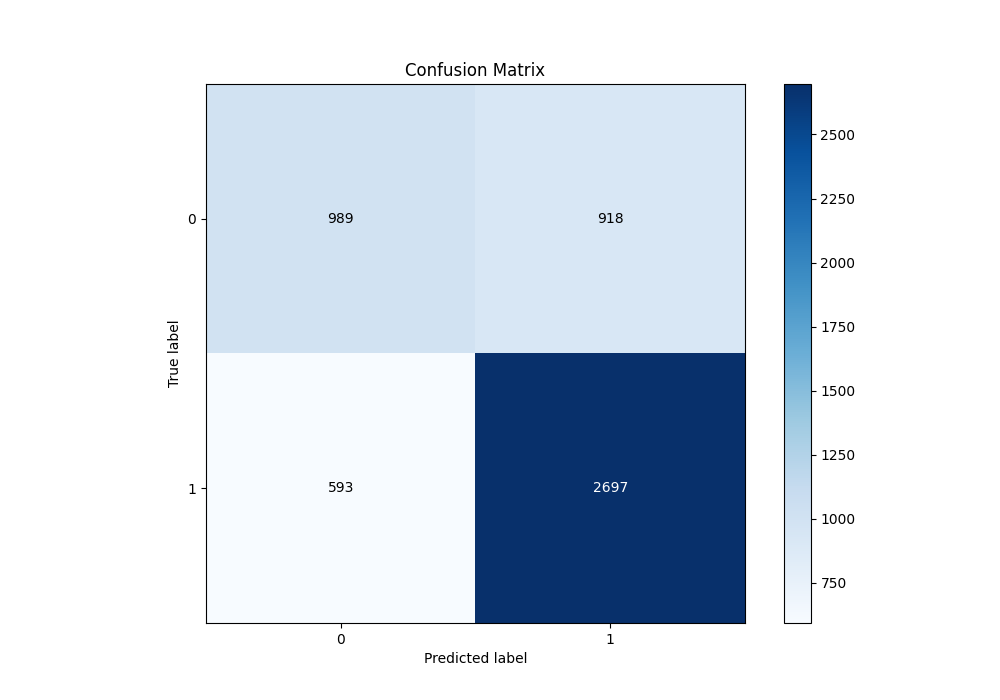
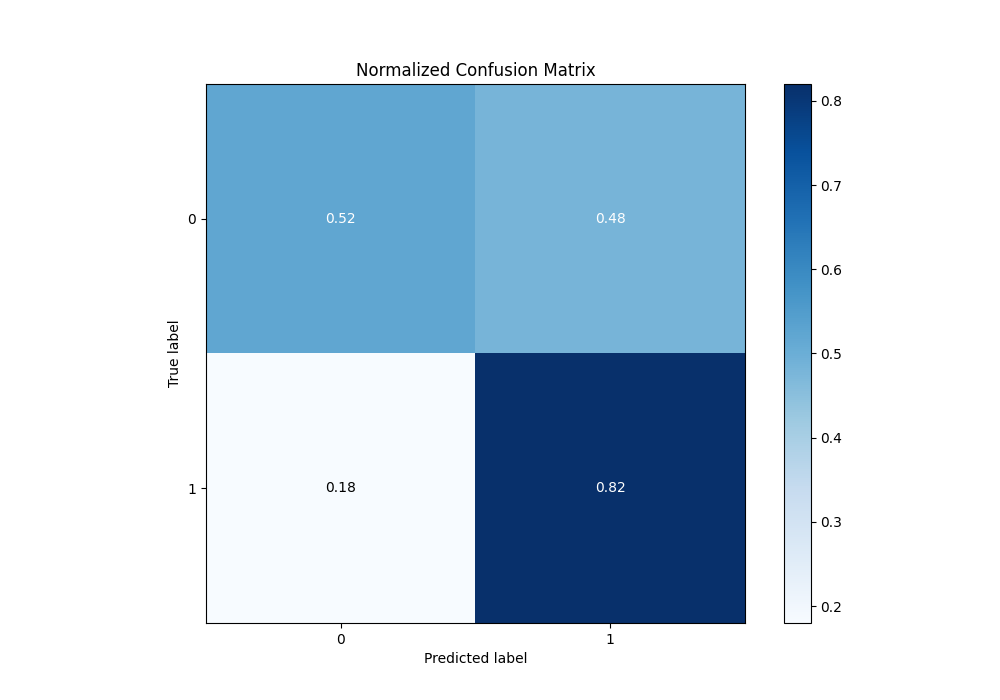
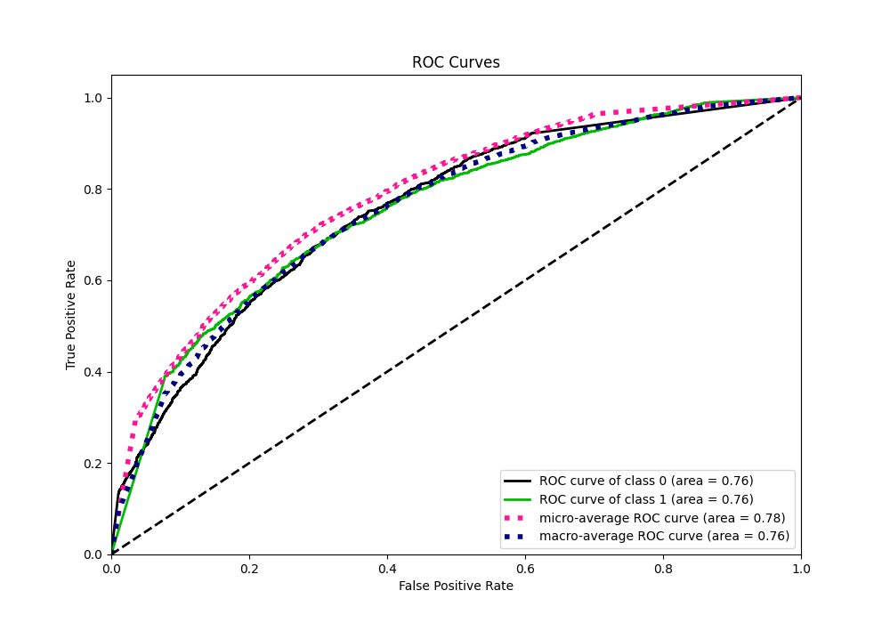
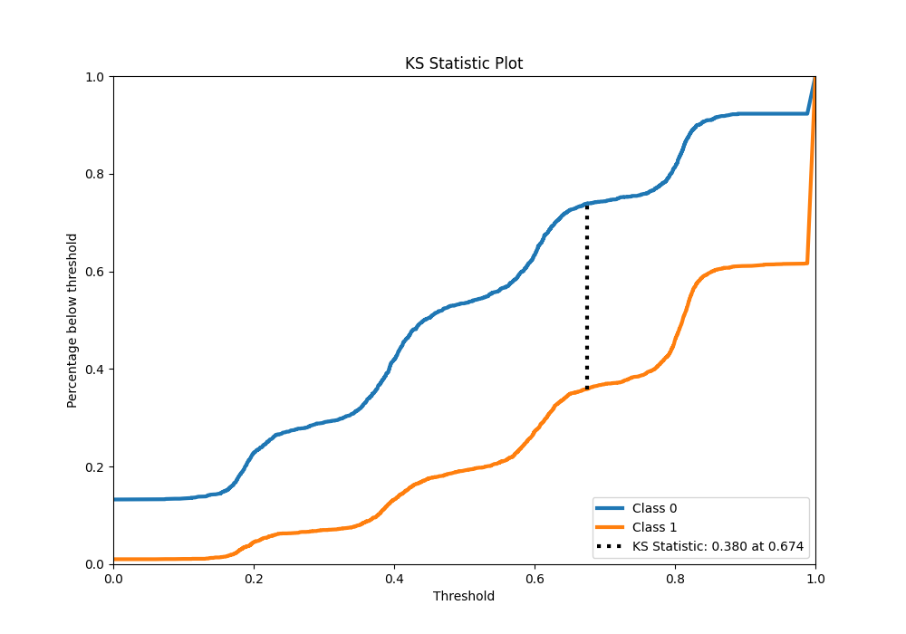
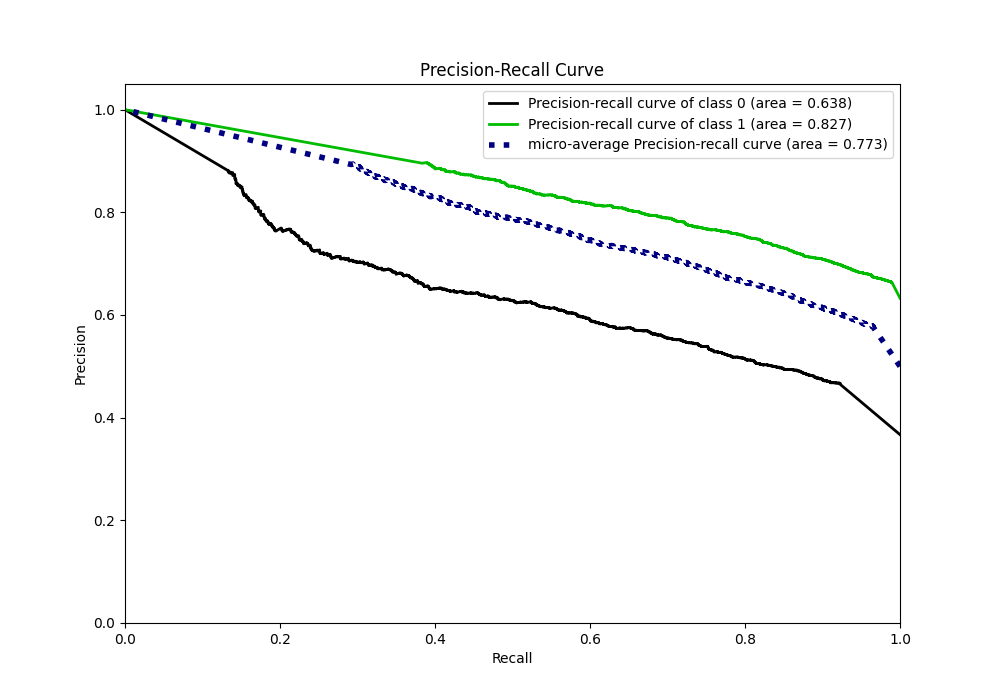
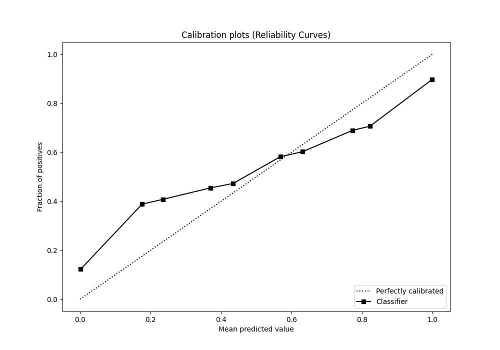
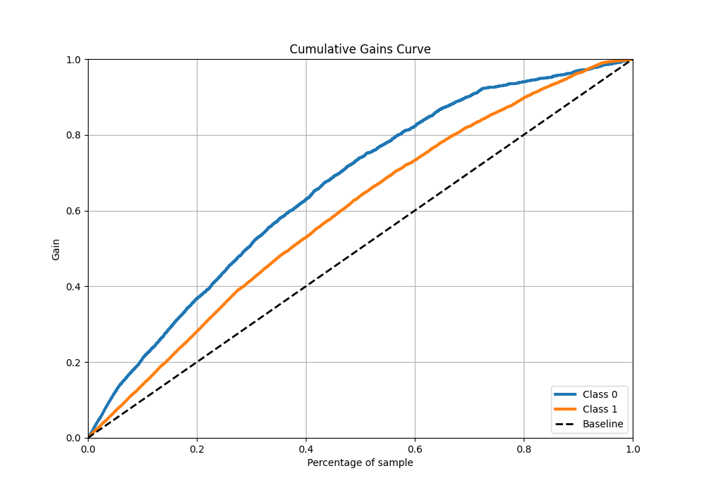
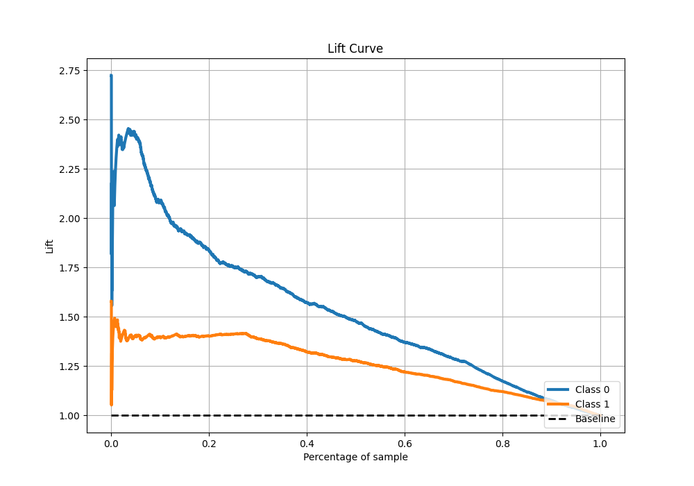

# Summary of 129_NearestNeighbors

[<< Go back](../README.md)

## k-Nearest Neighbors (Nearest Neighbors)
- **n_jobs**: -1
- **n_neighbors**: 5
- **weights**: distance
- **explain_level**: 1

## Validation
 - **validation_type**: kfold
 - **k_folds**: 10
 - **shuffle**: True
 - **stratify**: True
 - **random_seed**: 12

## Optimized metric
f1

## Training time

14.1 seconds

## Metric details
|           |    score |   threshold |
|:----------|---------:|------------:|
| logloss   | 1.01436  |  nan        |
| auc       | 0.75557  |  nan        |
| f1        | 0.795205 |    0.197233 |
| accuracy  | 0.709255 |    0.464077 |
| precision | 0.896624 |    0.921094 |
| recall    | 0.989666 |    0        |
| mcc       | 0.366078 |    0.613391 |

## Metric details with threshold from accuracy metric
|           |    score |   threshold |
|:----------|---------:|------------:|
| logloss   | 1.01436  |  nan        |
| auc       | 0.75557  |  nan        |
| f1        | 0.781173 |    0.464077 |
| accuracy  | 0.709255 |    0.464077 |
| precision | 0.746058 |    0.464077 |
| recall    | 0.819757 |    0.464077 |
| mcc       | 0.354414 |    0.464077 |

## Confusion matrix (at threshold=0.464077)
|              |   Predicted as 0 |   Predicted as 1 |
|:-------------|-----------------:|-----------------:|
| Labeled as 0 |              989 |              918 |
| Labeled as 1 |              593 |             2697 |

## Learning curves

## Confusion Matrix

## Normalized Confusion Matrix

## ROC Curve

## Kolmogorov-Smirnov Statistic

## Precision-Recall Curve

## Calibration Curve

## Cumulative Gains Curve

## Lift Curve

[<< Go back](../README.md)
